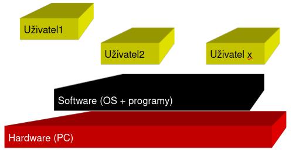
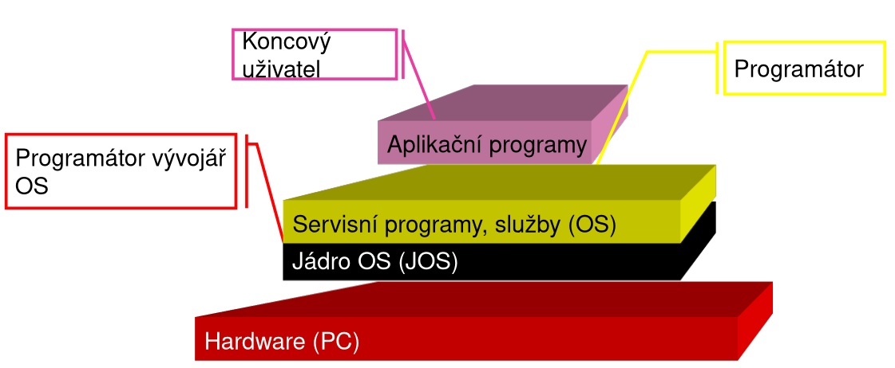

# Základní seznámení s funkcí operačních systémů
## Počítačový Systém
- Části počítačového systému:
	1. Hardware  - zdroje systému (resource) : 
	2. Software:
		1. Operační systém 
		2. Aplikační programy
	3. Uživatelé (users –> nejslabší článek Počítačových Systémů)
## Multiuživatelský počítačový systém Hardware - Software 

## Operační systém

- Základní funkce OS:
	1. ovládání PC:
		- Prostředí ke spouštění programů
		- Procesů (program běžící celou dobu)  
	2. abstrakce hardware:
		- ovládací rozhraní pro programy
		- umožní ovládání hardware
	3. správa prostředků – systémových zdrojů:
		- Přidává/odebírá programům systémové prostředky:
			1. velikost operační paměti
			2. strojový čas procesoru (CPU)
			3. prostor na disku ….
### Základní rysy současného OS
- Multiúlohové - multitasking
	- „Souběžný běh“ více programů
- Multiuživatelské
	- Více uživatelů na 1 PC
	- Každý má svůj oddělený účet – profil
		- Vlastní nastavení plochy 
		- Vymezenou část disku pro data nepřístupnou ostatním
		- Cizí přístup – pouze administrátor
--- 
- PC s jedním CPU:
	- může vykonávat pouze jednu úlohu (Task) v reálném čase.
- Multitasking: - všechny dnešní PC
	1. skutečný: PC  s více CPU 
		- CPU vykonává jednu úlohu nezávisle na druhým CPU
		- Pouze víceprocesorové počítače – dražší
	2. preemptivní - přerušovaný:
		- Rychlá přerušovaná činnost jednoho CPU 
		- Více úloh postupně střídá - po krátkých čas.úsecích (v cyklech)
## Multitasking
- Funkce multitaskingu:
	1. Odděluje činnost CPU a periferií:	
		- Periferie - vlastní procesor  (krystal – hodiny)
		- Ovládací SW – firmware
		- Periférie nezatěžují zbytečně CPU počítače
	 2. Systém přerušení:
		- žádost o pozornost CPU počítače
### Systém přerušení
- Komunikace mezi programy a CPU:
	- OS přiděluje programům strojový čas CPU:
		- Podle kmitočtu „řídících hodin“ – krystalu  ( frekvence CPU )
- Programy (procesy):
	- žádají o strojový čas CPU: 
		- k vykonání vlastního kódu – operace s daty…
	- IRQ  (Interrupt Re-Quest ) 
		- Žádost o přerušení činnosti jádra OS:
			- "… prosím, věnuj se teď mně …"
- OS vyhodnotí žádost přerušení:
	- poskytne / neposkytne programu čas CPU: 
		- nestihne-li program dokončit operaci v přiděleném čase:
			- OS rozpracovanou činnost CPU uloží a proces přeruší
		- stihne-li program vykonat operace před uplynutím:
			- požádá CPU o zrušení přerušení
- OS pokračuje ve své kontrolní činnosti
	- Načte stav přerušené operace a přidělí programu další časový úsek
	- a tak dále dokola

## Přidělení strojového času CPU procesům:
- Strojový čas CPU – časové kvantum:

