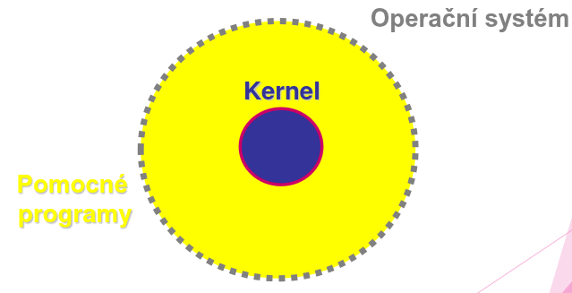
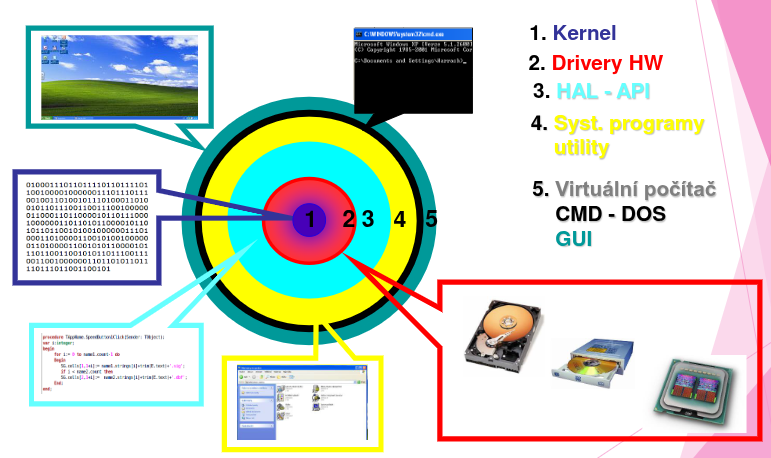

# Základní struktura operačního systému Windows
## Operační systémy
- MS Windows:
	- založeny na Windows NT (new technology)
	- WinXP, Win Vista, Win 7/8/10/11, Win Server 20XX
- Výhody:
	- nejrozšířenější OS na osobních PC (Evropa) 
		- příjemné GUI (Graphic User Interface) 
		- veliké množství aplikačního SW a multimedií
- Nevýhody:
	- Nižší bezpečnost (snadno napadnutelný viry)
### Struktura současného OS

1. Jádro OS: `kernel`
2. Pomocné programy:

#### Jádro OS `kernel`: 
- Vykonává instrukce v „nekonečném cyklu“
	- v privilegiovém režimu (chráněný režim)
- Kontroluje:
	- stav procesoru, paměti (zatížení procesoru a velikost volné a přidělené paměti)
	- stav vstupních a výstupních operací
	- stav a požadavky od IRQ (přerušení od HW a programů)
	- stav a přidělování času CPU
- Vyhodnocuje priority procesů a může je přesouvat
- Stavy procesu: 
	1. Běžící
		- pokud je mu přidělen CPU ( strojový čas )
	2. Připravený
		- připraven ale není mu přidělen CPU
	3. Čekající
		- spící nebo blokovaný 
		- čeká na určitou událost
- Proces bude spuštěn: 
	- je-li dostatek systémových prostředků: 
		- místo v paměti, 
		- malé zatížení CPU 
		- atd.
## Operační systém Windows
- Struktura OS Windows:
	1. Jádro - Kernel: 
		- Windows 7,8,10,11 – MinWin 
			- 41MB RAM a 25MB 
			- Pracuje nepřetržitě
				- rychlejší, svižnější než XP, Vista
	2. Vrstva ovladačů HW: 
		- ovladače připojených zařízení
	3. Vrstva HAL: ( Hardware Abstraction Layer ) 
		- vrstva pro programátory API 
			- Application Programming Interface 
			- Knihovny kódu pro ovládání HW
	4. Pomocné systémové programy:
		- Utility 
		- Nastavení systému 
		- Konfigurace periferií 
		- …
	5. Virtuální počítač - Vrstva ovládání PC: 
		- Příkazový interpreter – CMD 
			- Příkazový řádek 
		- GUI ( Graphic User Interface ) 
			- Správa, ovládání PC pomocí myši 
			- nastavení, spouštění aplikací… 
			- GUI: Aero, Metro

### Multiuživatelský OS - Users
- Základní skupiny: 
	- Administrátor: 
		- úplný přístup ke konfiguraci OS 
		- určen pouze k nastavení a údržbě OS 
	- Běžný uživatel: 
		- omezená práva přístupu OS 
		- zakázaný přístup ke konfiguraci OS 
	- Host: 
		- minimální práva přístupu k OS 
		- Nejbezpečnější profil
#### Users
- Základní bezpečnostní pravidlo: 
	- Pouze 1 účet z administrátorské skupiny na PC: 
		- pouze pro instalace programů 
		- nastavení, údržbě a aktualizaci OS 
	- Veškerá další činnost – v účtu Běžný uživatel: 
		- především Internet !!! 
	- Host 
		- Nejbezpečnější účet – vhodné pro veřejné PC 
	- Základní bezpečnostní pravidlo Funguje pouze při zapnuté službě UAC 
		- User Account Control 