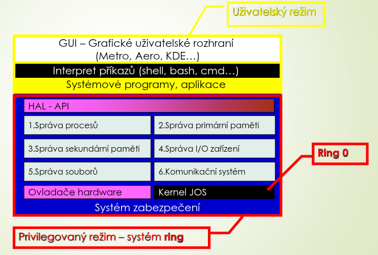

# Hardwarová ochrana operačních systémů - privilegovaný a uživatelský režim
## Činnost CPU
### Režimy 
- CPU:
	- Schopnost rozeznávat režimy:
	- Již při výrobě – veškerá pravidla a rozdělení instrukcí:
		- Do skupin
		- Aby nedošlo k narušení vyšší úrovně z nižší úrovně (tzv. Ringu)
	- Režimy procesoru
		- Omezení činnosti podle typu a úrovně operací
		- Procesy běží v různých režimech CPU
		- Umožňuje OS běžet s většími oprávněními než běžný aplikační software
### Privilegovaný režim
- Privilegované instrukce patří např:
	- Řízení CPU
	- Zákaz přerušení
	- Práce se speciálními registry
	- Práce se vstupními a výstupními zařízeními
	- Nastavení mapování paměti
- Jádro OS:
	- Obsahuje důvěryhodný kód
	- Běží v plně privilegovaném režimu nejvyšší úrovně
		- Tzv. ring 0
			- Dovoleno vše bez instrukcí
	- Ostatní procesy běží v režimech ring > 0
		- HW omezení
	- Ring security (zabezpečení ve vrstvách)
- Systém zabezpečení OS
	- Ring 0
		- Kernel JOS (Jádro operačního systému)
	- Ring > 0
		- Ovladače, HAL – API 
		- Správa procesů 
		- Správa vnitřní / vnější paměti 
		- Správa I/O zařízení 
		- Správa souborů 
		- Správa komunikací (s periferiemi / procesy: myš…. LAN….) 
### Neprivilegovaný režim
- Uživatelský SW 
	- Pokus o provedení privilegované instrukce: 
		- aktivaci operačního systému:
			- může zodpovědný proces ukončit 
			- nebo po kontrole operaci provést 
### Struktura zabezpečení OS

