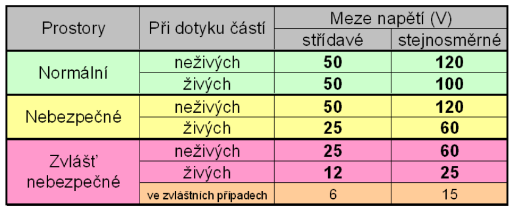
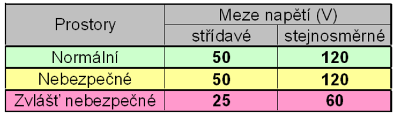
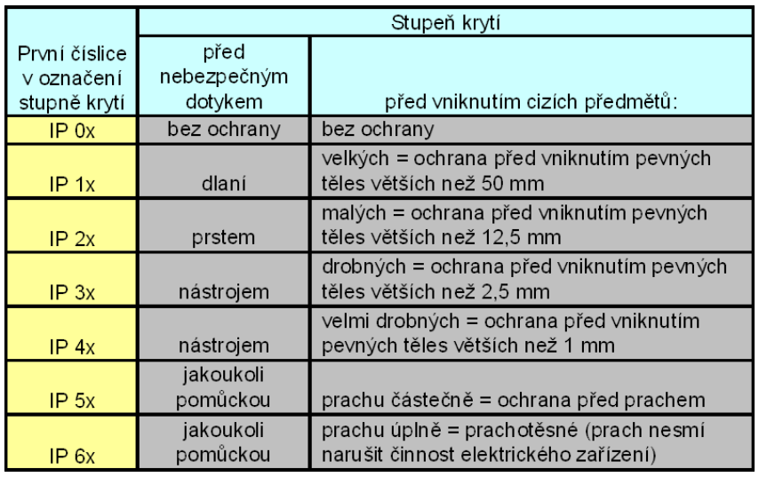
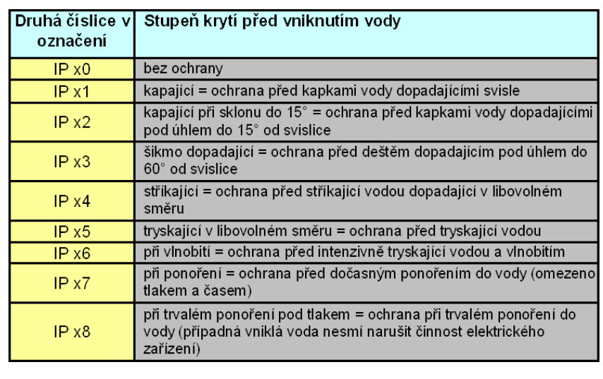
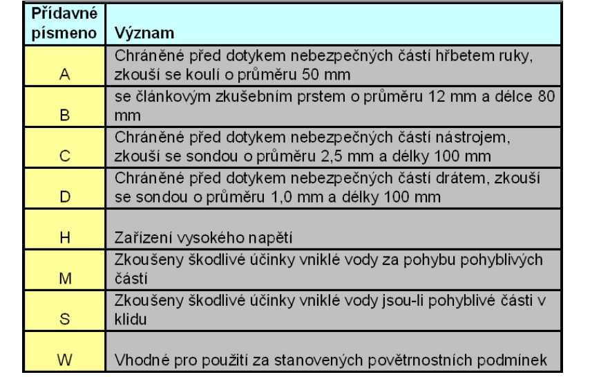
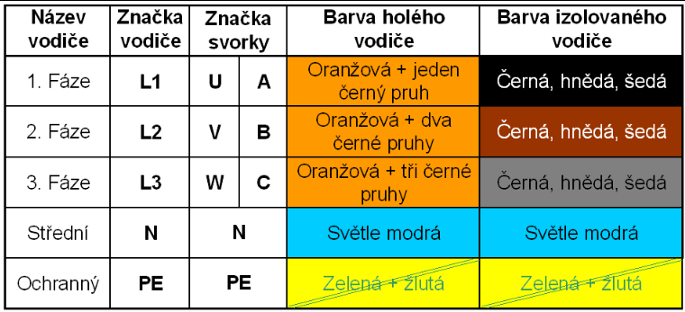
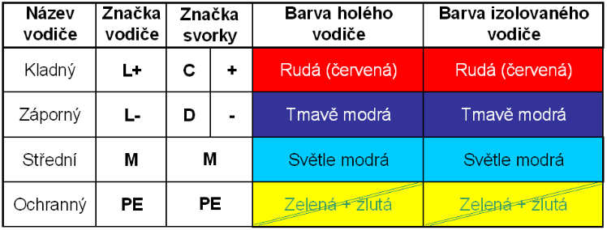

# Základní předpisy
- Pro práci v elektrotechnice jsou kromě jiných nejdůležitější tři hlavní předpisy:
	- Vyhláška 50
	- ČSN EN 50110-1 ed. 2 (34 3100)
	- ČSN 33 2000-4-41
- Pozn: v tomto textu je pouze stručný výtah z těchto předpisů
- Vyhláška 50
	- stanoví stupně odborné způsobilosti (kvalifikace) pracovníků v elektrotechnice.
- ČSN EN 50110-1 ed. 2 (34 3100)
	- stanovuje základní pravidla pro zajištění bezpečnosti při obsluze a práci na elektrických zařízeních
- ČSN 33 2000-4-41
	- stanovuje základní požadavky na ochranu osob hospodářských zvířat, majetku před úrazem elektrickým proudem.
## Kvalifikace pracovníků v elektrotechnice
- § 3 Pracovníci seznámení
	- seznámeni s předpisy o zacházení s elektrickými zařízeními
	- upozorněni na možné ohrožení těmito zařízeními
	- podepíší zápis o proškolení
		- (společně se s pracovníkem, který proškolení provedl)
- § 4 Pracovníci poučení
	- jako § 3
	- seznámeni s poskytováním první pomoci při úrazech elektrickým proudem
	- ověření znalostí (test)
- § 5 Pracovníci znalí
	- mají ukončené odborné vzdělání
	- po zaškolení složili zkoušku
- § 6 - 9 Pracovníci znalí s vyšší kvalifikací
	- a) splňují požadavky pro pracovníky uvedené v § 5
	- b) mají alespoň nejkratší požadovanou praxi
	- c) prokázali složením další zkoušky potřebné znalosti
- § 10 Pracovníci pro samostatné projektování a pracovníci pro řízení projektování
- § 11 Kvalifikace ve zvláštních případech
## ČSN EN 50110-1 ed. 2 (34 3100)
- Tato norma stanovuje základní pravidla pro zajištění bezpečnosti při obsluze a práci na elektrických zařízeních a v jejich blízkosti:
    - Základní pojmy.
    - Jak si počínat při obsluze a práci na elektrických zařízeních.
    - Jaké činnosti může vykonávat osoba s konkrétní kvalifikací dle vyhlášky 50.
## Termíny a definice
- Elektrické zařízení
    - zahrnuje všechna elektrická zařízení, která jsou určena pro výrobu, přenos, přeměnu, rozvod a užití elektrické energie
- Pracoviště
    - je prostor vymezený pro práci na elektrickém zařízení nebo v jeho blízkosti
- Pracovní pomůcky
- Ochranné pomůcky
- Vedoucí práce
    - osoba pověřená konečnou odpovědností za pracovní činnost a dodržování podmínek bezpečnosti práce
- Činnosti na elektrických zařízeních
    - obsluha a práce na zařízeních nebo v jejich blízkosti
- Obsluha
    - pracovní úkony spojené s provozem zařízení jako je spínání, ovládání z místa i dálkově, regulování, monitorování, prohlídky zařízení, odečet pevně namontovaných přístrojů.
    - při obsluze se osoby zásadně dotýkají jen těch částí zařízení, které jsou k tomu určené.
    - pokud je pro obsluhu stanoveno použití osobních ochranných prostředků a pracovních pomůcek, musí být používány.
- Práce na elektrických zařízeních nebo v jejich blízkosti
    - měření přenosnými přístroji
    - zkoušení a revize
    - údržba
    - výměna prvků
    - rekonstrukce
    - montáž
    - všechny úkony pro zajištění a odjištění pracoviště
- typy napětí:
	- nízké napětí (nn) do 1000V
	- vysoké napětí (vn): 3, 6, 10, 22 a 35 kV
	- velmi vysoké napětí (vvn): 110 a 220kV
	- zvlášť vysoké napětí (zvn): 400kV
	- Hodnoty platí pro v elektrizační soustavu ČR
## Členění prací dle způsobu zajištění bezpečnosti
- Na základě vyhodnocení elektrických rizik s přihlédnutím ke kvalifikaci osob jsou práce členěny:
    - Práce dle pokynů
    - Práce s dohledem
    - Práce pod dozorem
## Činnosti dle kvalifikace osob
- Osoby seznámené mohou:
    - samostatně obsluhovat elektrická zařízení mn a nn, která jsou provedena tak, že při jejich obsluze nemohou přijít do styku s částmi pod napětím.
    - pracovat nebo se zdržovat v blízkosti částí pod napětím při dodržování bezpečných vzdáleností.
- Osoby poučené mohou:
    - samostatně obsluhovat elektrická zařízení všech napětí s podmínkou, že se mohou dotýkat jen částí zařízení, které jsou pro obsluhu určeny.
    - pracovat na částech elektrického zařízení mn a nn bez napětí dle pokynů
    - pracovat v blízkosti nekrytých částí pod napětím nn (v zóně přiblížení ve vzdálenosti větší než 200 mm) s dohledem
- Osoby poučené mohou:
    - pracovat na vypnutých a zajištěných zařízeních nad 1kV s dohledem
    - pracovat v blízkosti živých částí nad 1kV pod dozorem
    - měřit a zkoušet (provádět funkční kontroly) dle schválených pracovních postupů
- Osoby poučené nesmějí pracovat na elektrických zařízeních pod napětím s výjimkou činnosti uvedených v bodě F
- Osoby znalé mohou:
    - samostatně obsluhovat místně nebo dálkově elektrické zařízení
    - pracovat samostatně na částech elektrického zařízení mn a nn bez napětí nebo v blízkosti napětí a na částech pod napětím
    - pracovat samostatně na vypnutých a zajištěných částech zařízení nad 1kV
    - pracovat v blízkosti živých částí nad 1kV pod napětím s dohledem nebo pod dozorem
    - pracovat na elektrických zařízeních nad 1kV pod napětím za stanovených podmínek
- Osoby znalé s vyšší kvalifikací mohou:
    - V rámci svého pověření provádět všechny činnosti (obsluhu a práci) na elektrických zařízení mimo prací zakázaných 
	- Práce zakázané jsou ty práce, které nelze provádět při spolehlivém dodržení podmínek bezpečnosti práce:
    - při nevyhovujících atmosférických podmínkách
    - ve stísněných prostorách
    - v prostorech s nevyhovujícím prostředím
## Živá a neživá část elektrického zařízení
- Živá část
    - Vodič, nebo vodivá část elektrického zařízení určená k tomu, aby při normálním provozu byla pod napětím (včetně středního vodiče)
- Neživá část
    - Vodivá část el. zařízení, které se lze dotknout
    - Obvykle není pod napětím.
    - V případě poruchy (základní izolace) na ní může být napětí.
## ČSN 33 2000-4-41
- Ochrana před úrazem elektrickým proudem
- Tato norma stanovuje základné požadavky na ochranu:
    - osob
    - hospodářských zvířat
    - majetku
    - před úrazem elektrickým proudem.
- V této normě je popsáno „jak se má co udělat“ aby nedošlo k úrazu elektrickým proudem.
## Úraz elektrickým proudem
- Úraz elektrickým proudem může způsobit proud protékající postiženým tělem nebo vzniknout jako důsledek jiných nežádoucích účinků elektrického proudu, elektrického či elektromagnetického pole.
- Proud může protékat postiženým tělem:
    - při dotyku nebezpečných živých částí proti zemi, nebo při přiblížení k nim.
    - při současném dotyku nebezpečných živých částí různé polarity nebo rozdílných potenciálů nebo při přiblížení k nim.
    - při dotyku neživých částí, na kterých mohou vzniknout při poruše nebezpečná napětí.
- Další nežádoucí účinky elektrického proudu mohou vzniknout:
    - při užití elektrického oblouku v technologických zařízeních (vysoké teploty, záření oblouku ap.)
    - při vypnutí velkých proudů (zkraty)
    - působení elektrického a elektromag. pole
- Tato norma se zabývá pouze úrazem elektrickým proudem procházejícím tělem.
## Rozdělení napětí
- Z hlediska nebezpečného dotyku se napětí dělí na:
    - nebezpečná napětí
    - bezpečná malá napětí
Bezpečná malá napětí jsou napětí menší než hodnoty uvedené v následující tabulce:
### Meze malých bezpečných napětí

## Rozdělení ochran před úrazem elektrickým proudem
- Ochrana před nebezpečným dotykem:
	- A. živých i neživých částí (ochrana při normálním provozu i v případě poruchy)
	- B. živých části (ochrana při normálním provozu)
	- C. neživých částí (ochrana v případě poruchy)
- A. Ochrana před nebezpečným dotykem živých i neživých částí
	1. Ochrana malým napětím (SELV, PELV)
		 - Spočívá v tom, že v zařízení se nemůže vyskytnout napětí vyšší než je bezpečné malé napětí.
		- SELV: neuzemněný obvod malého napětí
		- PELV: uzemněný obvod malého napětí
		- FELV: obvod s funkčním malým napětím, nesplňuje však požadavky na ochranu před nebezpečným dotykem malým napětím (ochrana se provede jiným způsobem)
		- Zdroje SELV a PELV
			- Bezpečnostní ochranný transformátor
			- Musí splňovat požadavky ČSN EN 61558-2-6.
			- Transformátor musí mít na štítku uvedenu číslo normy nebo štítek se symbolem
			- Proudový zdroj zajišťující stejný stupeň bezpečnosti jako bezpečnostní transformátor _(motor-generátor)._
			- Elektrochemický zdroj _(baterie)._
			- Jiný zdroj nezávislý na obvodech s vyšším napětím _(generátor poháněný spalovacím motorem)._
			- Uspořádání obvodů
				- Živé části obvodů SELV a PELV musí být odděleny ochranným oddělením od obvodů s vyšším napětím:
					- Bezpečnostní transformátor
					- Prostorové oddělení
					- Izolace dimenzovaná na nejvyšší napětí v zařízení
					- Vidlice a zásuvky nesmí být záměnné se sítěmi o jiném napětí
	2. Ochrana omezením ustáleného proudu a náboje
		- Spočívá v tom, že do těla (člověka) nemůže z obvodu téct větší proud než je dovolený.
		- Mezní hodnoty:
		    - Ustálený proud tekoucí odporem 2000 Ω:
			    - 10 mA stejnosměrný
			    - 3.5 mA střídavý
		    - Nahromaděný náboj: 50 μC
		- Použití: elektrické ohradníky
- B. Ochrana před nebezpečným dotykem živých částí
	1. Ochrana izolací
		- Účelem izolace je zabránit dotyku živých částí.
		- Živé části musí být úplně pokryty izolací, kterou lze odstranil pouze jejím zničením.
		- Izolace musí být schopna trvale vydržet namáháni, kterým může být během provozu vystavena, jako jsou mechanické, chemické, elektrické a tepelné vlivy.
		- Nátěry, barvy, laky a podobné prostředky samy o sobě se nepovažují za přiměřenou izolaci pro ochranu před nebezpečím úrazu elektrickým proudem.
		- Každé elektrické zařízení, u něhož je provedena ochrana izolací, musí vyhověl podmínkám stanoveným pro základní izolaci a pro přídavnou izolaci, které společně vytvářejí dvojitou izolaci.
		- Místo dvojité izolace lze použil zesílené izolace, pokud zajistí ochranu před úrazem elektrickým proudem ve stejné míře, jako zajišťuje dvojitá izolace.
		- Elektrická zařízení která mají dvojitou izolaci jsou zařízení třídy II. Tato zařízení se označují značkou.
	2. Ochrana kryty nebo přepážkami
		- Kryty nebo přepážky jsou určeny k tomu, aby zabraňovaly jakémukoliv dotyku živých částí.
		- Živé části musí být uvnitř krytů nebo za přepážkami, které zajišťují krytí aspoň IP2X, kromě případů:
		    - některé objímky žárovek, otvory zásuvek nebo pojistek, kde jsou pří výměně části nebo vysunutí větší otvory,
		    - kde jsou větší otvory nutné pro řádnou funkci zařízení
	    - V takových případech:
		    - musí byl provedena vhodná opatření proti nahodilému dotyku živých částí osobami nebo užitkovými zvířaty.
		    - musí se zajistit, aby si osoby byly vědomy toho, že se otvorem mohou dotknout živých částí a že do otvoru nemají úmyslně sahat. (poučením pracovníků).
		- Vodorovný horní povrch krytů nebo přepážek, které jsou snadno přístupné, musí zajišťovat krytí aspoň IP4X.
		- Kryty nebo přepážky musí být pevně zajištěny na místě a musí dostatečnou stabilitu a trvanlivost, aby při známých podmínkách normálního provozu zajišťovaly požadované krytí a příslušné oddělení od živých částí.
		- Tam, kde je nutné otevřít kryty, odstranit přepážky, nebo odstranit částí krytů, musí to být možno pouze:
		    - s použitím klíče nebo nástroje.
		    - po samočinném odpojení živých částí, před jejichž nebezpečným dotykem kryty nebo přepážky chrání, přičemž napájení může být obnoveno pouze po umístění přepážek a uzavření krytů.
		    - kde vnitřní přepážka, zajišťující krytí aspoň IP2X brání dotyku živých částí a taková přepážka je odstranitelná pouze pomocí klíče nebo nástroje.
	3. Ochrana zábranou
		- Zábrany jsou určeny k tomu, aby zabránily nahodilému dotyku živých části, nikoliv však úmyslnému dotyku záměrným obejitím přepážky.
		- Zábrany musí bránit:
		    - neúmyslnému přiblíženi osoby k živým částem.
		    - nahodilému dotyku živých částí během činnosti nekrytých zařízení v běžném provozu.
		- Zábrany mohou být odstraněny bez použití klíče nebo nástroje, ale musí být zajištěny tak, aby se zabránilo jejich neúmyslnému odstranění.
		- Ochranu zábranou lze provést:
		    - v prostorech přístupných laikům a pracovníkům bez odborné způsobilosti v elektrotechnice:
			    - uzamčením nebo neodnímatelným ohrazením (mříží nebo oplocením) dostatečně pevným, vysokým a vzdáleným od živých částí podle ČSN EN 50 110-1.
		    - v prostorech nepřístupných laikům a pracovníkům bez odborné způsobilosti v elektrotechnice: 
			    - uzavřením, ohrazením (provazem, tyčí, zábradlím, mříží, plotem…), které může být i odnímatelné.
	4. Ochrana polohou
		- Ochrana polohou je umístění nebezpečných živých částí mimo dosah a je určena pouze k zabránění nahodilému dotyku živých částí.
		- O dvou částech se předpokládá, že jsou současní přístupné dotyku, jestliže od sebe nejsou vzdáleny více než 2,5 m.
		- Části současné přístupné dotyku, které mají odlišný potenciál, nesmějí být v dosahu ruky.
	5. Doplňková ochrana proudovým chráničem
		- Účelem použití proudového chrániče je pouze zlepšit jiná opatření na ochranu proti úrazu elektrickým proudem při normálním provozu.
		- Princip proudového chrániče spočívá v porovnávání proudu vstupujícího do spotřebiče I a proudu vystupujícího I‘.
		- Jestliže rozdíl proudů bude vyšší než 30 mA zařízení bude odpojeno.
		- Proudový chránič je nutné použít pro:
		    - instalace koupelnách, sprchách a umývárnách
		    - zásuvky venku nebo tam kde se budou připojovat spotřebiče používané venku
		    - zásuvky kde se přepokládá časté používání ručního elektrického nářadí
		    - zásuvky v laboratořích
		- Podle poslední aktualizace normy se musí v nových elektroinstalacích proudové chrániče používat na všechny zásuvky, kde se předpokládá používání spotřebičů držených v ruce.
	6. Ochrana doplňkovou izolací
		- Ochrana doplňkovou izolací spočívá:
		    - ve vybavení elektrického zařízení izolačním stanovištěm (např. izolačním kobercem)
		    - nebo v použití ochranných pomůcek: (vypínacích tyčí, dielektrických rukavic, galoší,…).
- C. Ochrana před nebezpečným dotykem neživých částí
	1. Ochrana samočinným odpojením od zdroje
		- Ochrana samočinným odpojením od zdroje spočívá použití ochranného prvku, který zařízení odpojí v předepsaném čase, jestliže se na neživou část dostane napětí vyšší než bezpečné malé napětí:
		- 
		- Jistící prvky
			- jistič
				- jednofázový
				- třífázový
			- pojistka
				- závitová
				- nožová
			- Slouží jako nadproudová ochrana a zároveň jako ochrana proti nebezpečnému dotyku neživých částí, na kterých se v případě poruchy může vyskytnout nebezpečné napětí
		- Princip ochrany samočinného odpojení od zdroje
			- Na fázovém vodiči je musí být umístěn ochranný prvek.
			- Neživé části musí být připojeny na ochranný vodič.
			- Proud protéká pracovními vodiči (fázový a střední).
			- Ochranným vodičem proud neprotéká.
			- Nebezpečné napětí se na neživou část může dostat, jestliže fázový vodič dotkne neživé
			    - poškodí se izolace
			    - upadne vodič uvnitř zařízení
			- Neživou částí začne procházet zkratový proud, který je odváděn ochranným vodičem
			- Zkratový proud dostatečně velký, aby způsobil zapůsobení ochranného prvku a tím dosáhl samočinného odpojení zařízení od zdroje
		- Požadavky na ochranu samočinným odpojením od zdroje
			- Čas odpojení nesmí překročit 5 s.
			- Uzemnění: neživé části musí být připojeny k ochrannému vodiči při splnění požadavků na jednotlivé způsoby uzemnění: (TN, TT)
			- Pospojování
			    - Hlavní pospojování
				    - v každé budově musejí být navzájem spojeny tyto vodivé části:
					    - ochranný vodič
					    - uzemňovací přívod nebo hlavní ochranná svorka
					    - rozvod potrubí (vody, plynu,…)
					    - kovové konstrukční části budovy
					    - ústřední topení, klimatizace…
			    - Doplňující pospojování
				    - slouží ke zlepšení vlastností hlavního pospojování.
	2. Ochrana použitím zařízení třídy II
		- Elektrické zařízení je vybaveno dvojitou izolací a tudíž nemůže dojít k poruše.
		- Izolační kryt musí být způsobilý odolávat mechanickým, elektrickým, tepelným a dalším namáháním která se mohou vyskytnout.
		- Zařízení třídy II mají zpravidla plastové kryty, čili nemají žádnou neživou část.
	3. Ochrana nevodivým okolím
		- Má zabránit současnému dotyku částí, které mohou mít v důsledku porušení základní izolace živých částí různý potenciál.
		- Neživé části musí být uspořádány tak, aby se za běžných podmínek osoby nemohly dotýkat současně:
		    - dvou neživých částí,
		    - jedné neživé části a cizí vodivé části
		- V prostorech s nevodivým okolím nesmí být žádný ochranný vodič.
		- Požadavky jsou splněny, jestliže prostor má izolační podlahu a stěny a je uplatněno jedno nebo více z uvedených uspořádání:
		    - dostatečná vzdálenost neživých částí a cizích vodivých částí.
		    - vložení účinných zábran mezi neživé části a cizí vodivé části.
		    - izolování nebo izolační uspořádání cizích vodivých částí.
	4. Ochrana neuzemněným místním pospojováním
		- Účelem neuzemněného místního pospojování je zabránit výskytu nebezpečného dotykového napětí.
		- Vodiče pospojování musí vzájemně spojovat všechny neživé části a cizí vodivé části, které jsou současně přístupné dotyku. 
		- Soustava místního pospojování nesmí být v elektrickém spojení se zemí přímo přes neživé části nebo přes cizí vodivé části.
	5. Ochrana elektrickým oddělením
		- Účelem elektrického oddělení jednotlivých obvodů je zabránit při poruše základní izolace obvodu průchodu proudu mezi neživou částí a cizí vodivou částí.
		- Obvod musí být napájen přes:
		    - oddělovací ochranný transformátor.
		    - zdroj proudu, který zajišťuje stejný stupeň ochrany jako oddělovací ochranný transformátor, např. motorgenerátor.
## Bezpečnostní barvy a značky
- ČSN ISO 3864
	- Norma předepisuje bezpečnostní barvy a bezpečnostní značky k předcházení úrazům, zdravotním rizikům, požárům a případům havárií.
- Bezpečnostní značka
	- Vyjadřuje obecné bezpečnostní sdělení.
	- Je vytvořena kombinací barvy a geometrického tvaru a spolu s grafickým symbolem nebo textem zpřesňuje bezpečnostní informaci.
	- Musí být používána pouze pro pokyny vztahující se k bezpečnosti a ochraně zdraví, nebo k požární ochraně osob.
	- Účelem bezpečnostních značek je upozornit na předměty nebo situace, které mají vliv na bezpečnost nebo zdravotní stav osob.
	- Značky jsou provedeny v **bezpečnostních barvách**. Jedná se o takové barvy, kterým je přiřazen bezpečnostní význam.
	- Při tvorbě bezpečnostních značek se využívá **kontrastních barev**, které doplňují obecné bezpečnostní barvy.
	- Legislativním předpisem jsou stanoveny kombinace bezpečnostních a kontrastních barev.

| Bezpečnostní barva | Význam nebo účel            | Příklad použití                                            | Kontrastní barva |
| ------------------ | --------------------------- | ---------------------------------------------------------- | ---------------- |
| Červená            | Zákaz/Stůj                  | Značky zákazu, Požární ochrana                             | Bílá             |
| Modrá              | Příkaz                      | Příkaz k použití osobních ochranných pracovních prostředků | Bílá             |
| Žlutá              | Výstraha, riziko, nebezpečí | Vyznačení nebezpečí                                        | Černá            |
| Zelená             | Bezpečí                     | Únikové cesty, Nouzové východy                             | Bílá             |
- Geometrický význam značek
	- Kruh
		- Zákaz nebo příkaz
	- Trojuhelník
		- Výstraha
	- Čtverec/obdelník
		- Informace (včetně instrukce)
- typy bezpečnostních značek
	- Značky zákazu
	- Značky příkazu
	- Značky výstrahy
	- Značky informativní
	- Prostředky požární ochrany
	- **Bezpečnostní tabulka:** Bezpečnostní značka s doplňkovou tabulkou s textem.
## Třídy ochrany zařízení
### Zařízení třídy ochrany 0
- Elektrické zařízení, jehož ochrana před úrazem elektrickým proudem je založena na základní izolaci a nemá žádné prostředky pro připojení neživých částí.
- V ČR se nesmí používat (bez doplňujících ochranných prvků).
### Zařízení třídy ochrany I
- Elektrické zařízení, jehož ochrana před úrazem elektrickým proudem jehož ochrana zahrnuje další bezpečnostní opatření umožňující připojení neživých částí k ochrannému vodiči v pevném rozvodu.
- **Přiklad:** ohřívač vody, sporák, vařič, pračka, lednička, obráběcí stroje…
### Zařízení třídy ochrany II
- Elektrické zařízení, které nemá prostředky pro připojení ochranného vodiče a je u něj zajištěna přídavná izolace nebo zesílená izolace.
- **Přiklad:** televize, rádio, nabíječka, fén, mixér, veškeré ruční elektrické nářadí (vrtačka, bruska…), sekačka na trávu…
### Zařízení třídy ochrany III
- Elektrické zařízení, jehož ochrana před úrazem elektrickým proudem je založena na připojení ke zdroji napětí SELV.
- **Příklad:** hračky (autodráha, vláček…), vše co se napájí pomocí adaptéru (inkoustové tiskárny, routery, switche,...), mobil, notebook, přehrávač MP3, elektrická zařízení v autech (kromě zapalování), …
## Stupně krytí
- Krytí elektrických zařízení vyjadřuje jejich konstrukční zabezpečení proti vniknutí vody, nebezpečnému dotyku a vniknutí cizích předmětů.
- Stupeň zabezpečení se označuje písmeny IP (International Protection)
- Za písmeny IP je dvojčíslí, případně přídavné a doplňkové písmeno, které popisuje způsob zkoušky.
- IP-12XY
	- **1:** 
		- První číslice popisuje stupeň ochrany osob před nebezpečným dotykem a stupeň ochrany zařízení před vniknutím cizích předmětů.
		- 
	- **2:** 
		- Druhá číslice popisuje stupeň ochrany před vniknutím vody.
		- 
	- **X:** 
		- Přídavné písmeno (nepovinné).
		- Udává stupeň ochrany osob před dotykem nebezpečných částí.
		- Může nabývat hodnot A, B, C nebo D. 
	- **Y:**
		- Doplňkové písmeno (nepovinné) se používá k doplňkovým informacím
		- doposud používaná písmena jsou: H, M, S, W.
	- 
## Značení vodičů a svorek
### Střídavá soustava

### Stejnosměrná soustava
