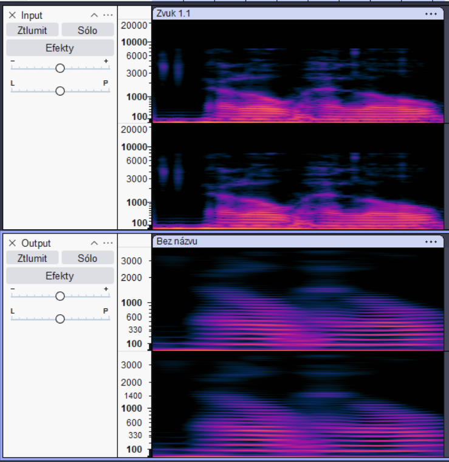

## Screenshoty ze softwaru
Obrázek obsahující spektrální analýzu (spektrogram) původního WAV a výstupního MP3 souboru obsahující lidský hlas říkající „Hello, hello“:

**Vysvětlení:**
- Horní část obrázku (Input) zobrazuje spektrum WAV souboru. Je vidět větší detail a širší rozsah frekvencí.
- Dolní část (Output) ukazuje spektrogram MP3 souboru, kde jsou patrné úseky, kde došlo ke ztrátě dat – chybí jemné detaily a vysoké frekvence jsou zjednodušeny.
## Blokové schéma MP3 komprese
PCM data WAV
		 |
		 |
		∨
Rozdělení na bloky a převod do frekvenčních oblastí
		 |
		 |
		∨
Psychoakustický model
		 |
		 |
		∨
Kvantizace + kódování
		 |
		 |
		∨
MP3 výstup
### PCM data WAV
Toto je originální nezkomprimovaný soubor .wav, který uchovává informace. S tímto se bude dále pracovat v dalších krocích.
### Rozdělení na bloky a převod do frekvenčních oblastí
- Zvukový záznam je nejdříve rozdělen na malé bloky.
- Každý blok se pak převede z "časové oblasti" (kde vidíme průběh vlny v čase) do "frekvenční oblasti" – tedy na jednotlivé tóny a frekvence. To se dělá pomocí matematické transformace zvané MDCT.
### Psychoakustický model
- Tento krok využívá toho, jak lidské ucho vnímá zvuk.
- Některé tiché zvuky jsou překryty hlasitějšími (např. v hluku ulice neslyšíme tichý šepot), nebo jsou prostě mimo rozsah slyšitelnosti. Takové části programu vyhodnotí jako "zbytečné" a odstraní je.
- Také se zde mohou odstranit frekvence, které lidské ucho již neslyší.
### **Kvantizace a kódování (Zjednodušení a zkrácení dat)****:**
- Zbývající data se zjednoduší (zaokrouhlí) na hodnoty, které se lépe ukládají.
- Potom se zakódují efektivněji – pomocí tzv. Huffmanova kódování, což znamená, že časté hodnoty zabírají méně místa.
### **Složení výsledného MP3 souboru****:**
- Nakonec se všechno spojí do jednoho MP3 souboru.
- Přidají se informace o souboru, jako je jméno interpreta, název nahrávky atd.
## Kompresní poměr
Parametry vstupního a výstupního souboru:
- input.wav = 161 kB (165 656 B)
- output.mp3 = 9,56 kB (9 792 B)
### Výpočet kompresního poměru:
Z tohoto vidíme že kompresní poměr těchto dvou souborů je 16,841 tím pádem skoro 17x menší soubor bez jakékoliv zásadní ztráty dat.