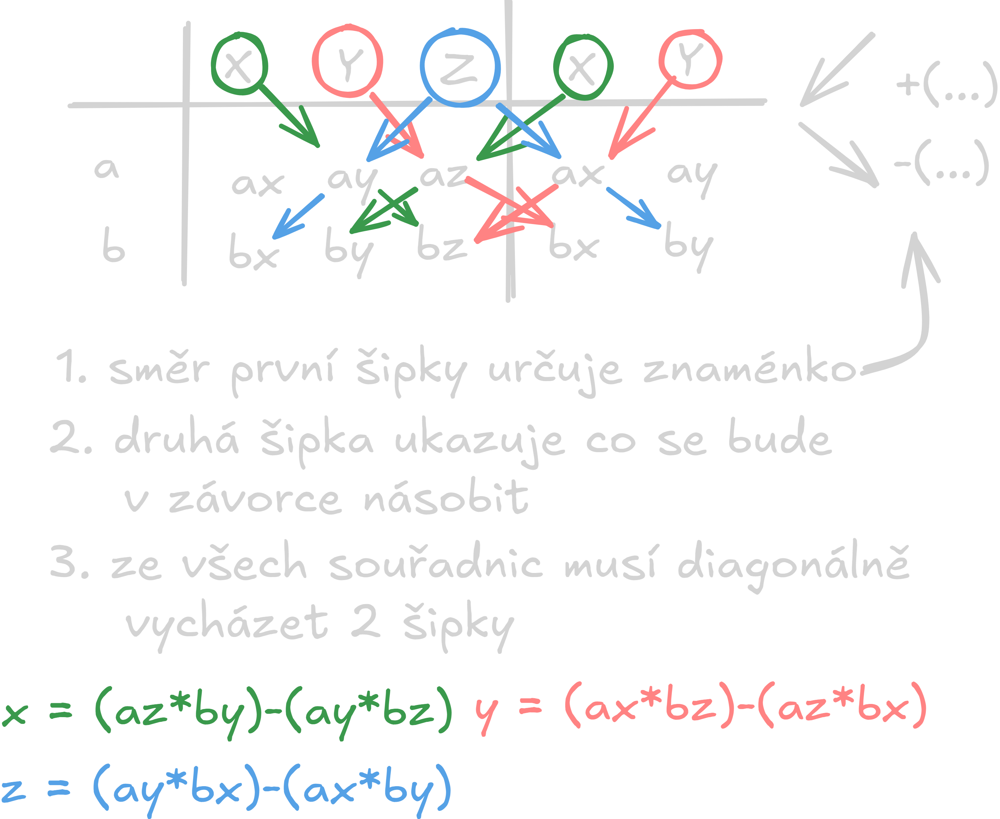

# Analytická geometrie v prostoru
## Vzdálenost bodů v prostoru
## Velikost vektorů v prostoru
## Lineárně závislé a nezávislé vektory
## Úhel vektorů
## Vektorový součin
## Rovnice přímky v prostoru
## Rovnice roviny
### Parametrická rovnice roviny
- Body: `A,B,C`
	- $p=A+t*\overrightarrow{u}+s*\overrightarrow{v}$
		- `A` = bod A
		- `t` a `s` = parametr
		- $\overrightarrow{u}=\overrightarrow{AB}=B-A$
		- $\overrightarrow{v}=\overrightarrow{AC}=C-A$
- Příklad
	- A [0; 0; 4] B [3; 2; -1] C [0; 5; 2]
	- $x=0+3t+0s$
	  $y=0+2t+5s$
	  $z=4-5t-2s$
### Obecná rovnice roviny
- Zápis: 
	- $ax+by+cz+d=0$
### Vektorový součin
- Zápis: 
	- $\overrightarrow{u}\times\overrightarrow{v}=\overrightarrow{w}$
- Vzorec: 
	- $\overrightarrow{u}\times\overrightarrow{v}=(u_y*v_z-u_z*v_y; u_z*v_x-u_x*v_z; u_x*v_y-u_y*v_x)$
- Vzorec pomocí matic
	- 
## Vzájemná poloha přímky a roviny
- Možnosti
	- Přímka leží v rovině - Nekonečně mnoho bodů
	- Přímka rovnoběžná s rovinou - Žádný společný bod
	- Různoběžná přímka s rovinou - Mají jeden společný bod
- Postup
	- Obecná rovnice roviny, vezmeme z ní normálový vektor
	- Směrový vektor přímky
	- Uděláme skalární součin těchto dvou vektorů
	- Pokud skalární součin vyjde:
		- $u_x v_x+u_y v_y+u_z v_z=0$
			- Je přímka rovnoběžná
				- Různá/leží v
					- Zjistíme pomocí dosazení bodu z přímky do roviny
		- $u_{x}v_{x}+u_{y}v_{y}+u_{z}v_{z}\ne0$
			- Je přímka různá
			- Hledáme průsečík
- Příklad
	- Zjistěte polohu této přímky `p` a roviny `q`
	- $p:$
		- $x=1+2t$
		- $y=-1+t$
		- $z=1-t$
	- $q:$
		- $x-y+z-3=0$
	- Postup:
		- Vytáhneme si bod z přímky a oba vektory (vektor z přímky a vektor z roviny)
			- A [1; -1; 1]
			- $\overrightarrow{u}=(2;1; -1)$
				- směrový vektor přímky
			- $\overrightarrow{n}=(1;-1;1)$
				- normálový vektor roviny
		- Zjistíme kolik se rovná skalární součin
			- $u_x n_x+u_y n_y+u_z n_z$
			- $(2*1)+(1*-1)+(-1*1)$
		- $2-2\Rightarrow0$
			- Jsou rovnoběžné, jelikož se skalární součin rovná `0`
		- Pomocí dosazení bodu zjistíme, zda je rovnoběžná různá nebo přímka leží v rovině
			- $x-y+z-3=0$
			- $1-(-1)+1-3=0$
			- $0=0$ => Přímka leží v rovině
- Další příklad
	- Zjistěte polohu této přímky `p` a roviny `q`
	- $p:$
		- $x=1+2t$
		- $y=-1+t$
		- $z=1-t$
	- $q:$
		- $x+y+z+1=0$
	- postup
		-  Vytáhneme si bod z přímky a oba vektory (vektor z přímky a vektor z roviny)
			- A [1; -1; 1]
			- $\overrightarrow{u}=(2;1; -1)$
				- směrový vektor přímky
			- $\overrightarrow{n}=(1;1;1)$
				- normálový vektor roviny
		- Zjistíme kolik se rovná skalární součin
			- $u_x n_x+u_y n_y+u_z n_z$
			- $(2*1)+(1*1)+(-1*1)$
		- $2\ne0$
			- Jsou různé, jelikož se skalární součin nerovná `0`
		- Musíme najít průsečík, to uděláme tak že dosadíme celou parametrickou rovnici do rovnice roviny
			- $x+y+z+1=0$
			- $(1+2t)+(-1+t)+(1-t)+1=0$
			- $1+2t-1+t+1-t+1=0$
			- $2t+2=0$
			- $t=-1$
		- Dosadíme t do parametrické rovnice a zjistíme průsečík
			- $x=1+(2*-1)$
			- $y=-1-1$
			- $z=1-(-1)$
			- $P[-1;-2;2]$
## Vzájemná poloha dvou rovin
- Typy poloh
	- Rovnoběžné - žádná společná přímka
	- Různoběžné - jedena společná přímka
	- Totožné - nekonečně mnoho společných přímek
- Příklad
	- Zjistěte vzájemnou polohu těchto dvou rovin
	- $\rho:3x+2y+4z-1=0$
	- $\tau:12x+8y+16z-4=0$
		- Všechny hodnoty v druhé rovnici jsou vynásobeny `-4` => jsou rovnoběžné totožné
- Další příklad
	- Zjistěte vzájemnou polohu těchto dvou rovin
	- $\rho:3x+2y+4z-1=0$
	- $\tau:6x+4y+8z+1=0$
		- Všechny hodnoty vektoru v druhé rovnici jsou vynásobeny `2`,ale parametr je odlišný => jsou rovnoběžné různé
- Další příklad
	- Zjistěte vzájemnou polohu těchto dvou rovin
	- $\rho:3x+2y+4z-1=0$
	- $\tau:3x+2y+z-1=0$
		- Vektor není vynásobený stejným číslem => jsou různé
	- Výpočet přímky společných bodů:
		- Zvolíme si kterou osu budeme mít jako parametr např. zde si zvolíme `x`
		- $x = t$
			- Dosadíme toto do jedné z rovnic a vybereme si jeden z dvou bodů, který si vyjádříme, např. zde to bude `Y`
		- $ρ:3t+2y+4z-1=0$
		- $y=\frac{(1-3t-4z)}{2}$
			- Tento výraz, společně s `x = t` dosadíme do druhé rovnice
		- $τ:3t+2*(\frac{(1-3t-4z)}{2})+z-1=0$
		- $τ:3t+1-3t-4z+z-1=0$
		- $τ:-3z=0$
		- $z=0$
			- Tento výraz dosadíme do výrazu `y` abychom se zbavili `z` v rovnici toho výrazu
		- $y=\frac{(1-3t-4*0)}{2}$
		- $y=\frac{1}{2}-\frac{3}{2} t$
			- Momentálně máme všechny části parametrické rovnice
		- Nyní napíšeme finální formu **Průsečnice**
		- $p:$
			- $x=t$
			- $y=\frac{1}{2}-\frac{3}{2} t$
			- $z=0$
## Úhly v prostoru
- $\gamma=\cos^{-1}\left(\frac{\left|u_{x}v_{x}+u_{y}v_{y}+u_{z}v_{z}\right|}{\sqrt{\left(u_{x}\right)^2+\left(u_{y}\right)^2+\left(u_{z}\right)^2}_{}+\sqrt{\left(v_{x}\right)^2+\left(v_{y}\right)^2+\left(v_{z}\right)^2_{}}}\right)$
- Pokud jsou vektory:
	- Rovina normálový vektor x Rovina normálový vektor -> použijeme cos
		-  $\gamma=\cos^{-1}\left(\frac{\left|u_{x}v_{x}+u_{y}v_{y}+u_{z}v_{z}\right|}{\sqrt{\left(u_{x}\right)^2+\left(u_{y}\right)^2+\left(u_{z}\right)^2}_{}+\sqrt{\left(v_{x}\right)^2+\left(v_{y}\right)^2+\left(v_{z}\right)^2_{}}}\right)$
	- Přímka směrový vektor x Rovina normálový vektor -> použijeme sin
		-  $\gamma=\sin^{-1}\left(\frac{\left|u_{x}v_{x}+u_{y}v_{y}+u_{z}v_{z}\right|}{\sqrt{\left(u_{x}\right)^2+\left(u_{y}\right)^2+\left(u_{z}\right)^2}_{}+\sqrt{\left(v_{x}\right)^2+\left(v_{y}\right)^2+\left(v_{z}\right)^2_{}}}\right)$
	- Přímka směrový vektor x Přímka směrový vektor -> použijeme cos
		-  $\gamma=\cos^{-1}\left(\frac{\left|u_{x}v_{x}+u_{y}v_{y}+u_{z}v_{z}\right|}{\sqrt{\left(u_{x}\right)^2+\left(u_{y}\right)^2+\left(u_{z}\right)^2}_{}+\sqrt{\left(v_{x}\right)^2+\left(v_{y}\right)^2+\left(v_{z}\right)^2_{}}}\right)$
## Vzdálenosti v prostoru
### Vzdálenost bodu od přímky
- Vzdálenost bodu A [x1; y1] od přímky $ax + by + c = 0$
- $d=\frac{\left|ax_1+by_1+c\right|}{\sqrt{a^2+b^2}}$
### Vzdálenost bodu od roviny
- $v=\frac{\left|ax_1+by_1+cz_1+d\right|}{\sqrt{a^2+b^2+c^2}}$
- Příklad
	- Máme bod A[2;1;5] a rovinu $\rho:x-2y+2z-3=0$ zjistěte vzdálenost bodu od roviny
	- $v=\frac{\left|2-2+10-3\right|}{\sqrt{1^2+(-2)^2+2^2}}$
	- $v=\frac73$
### Vzdálenost přímky od roviny
- Musí být rovnoběžné!
- Příklad
	- Máme přímku $p:x=-1+2t;y=1-t;z=2+3t$ a rovinu $\rho:x+5y+z-3=0$ a zjistěte jejich vzdálenost
	- postup
		- Vytáhneme si vektory z jednotlivých rovnic $p:(2;-1;3)$ a $\rho:(1;5;1)$
		- Provedeme skalární součin abychom zjistili zda jsou rovnoběžné -> 
### Vzdálenost dvou rovin
- Musí být rovnoběžné!
	- Příklad
	- 