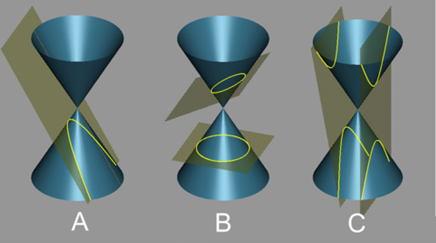
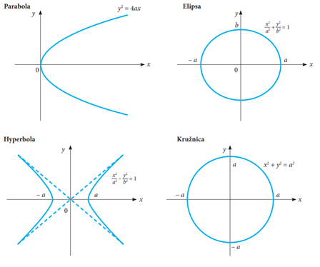
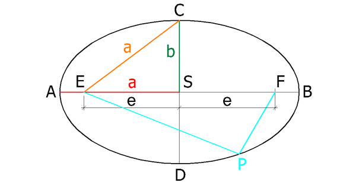
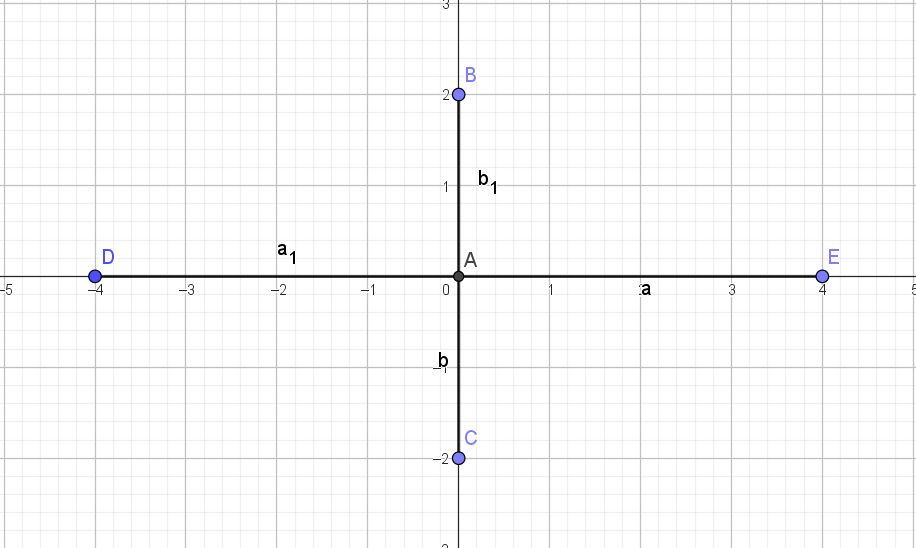
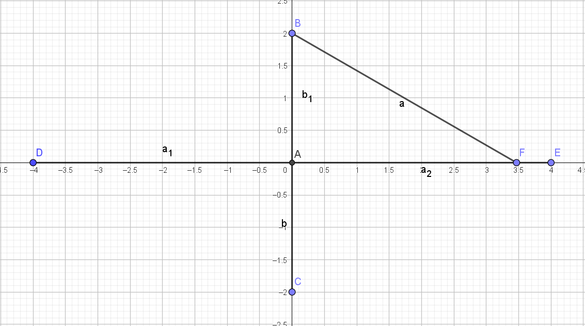
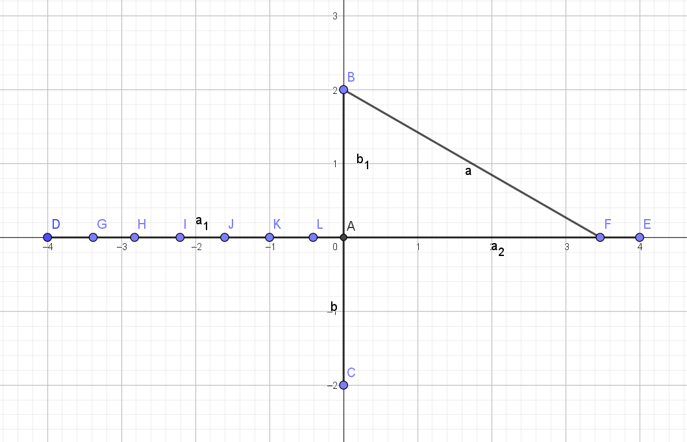
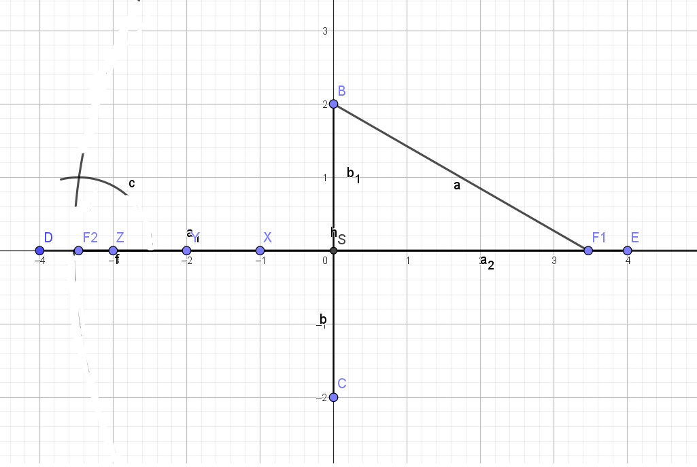
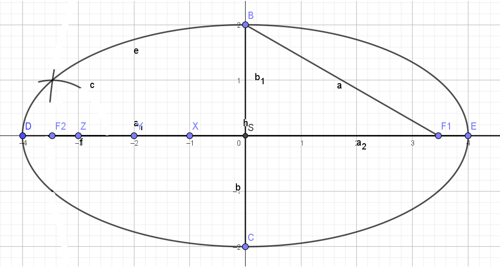
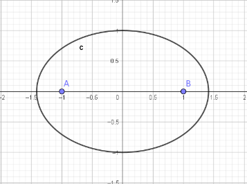

# Kuželosečky
- Průřezy kuželem
-  
	- `A` – Parabola, 
	- `B` – Kruh (níže) Elipsa (výše), 
	- `C` – Hyperbola

- 
- Možné kuželosečky:
	- Kruh
	- Elipsa
	- Parabola
	- Hyperbola
## Kružnice
-  Množina všech bodů v množině, které mají od daného bodu (střed kružnice) stejnou kladnou vzdálenost (poloměr kružnice)
### Středová rovnice kružnice
- Rovnice
	- $x^2+y^2= r^2$
	    - `X` a `Y` – souřadnice bodu
	    - `R` – poloměr
- Příklad
	- Máme střed na souřadnicích S[0;0] a bod A [-3;2] vypočítejte poloměr
	    - $r= \sqrt{x^2+y^2}$
	    - $r=\sqrt{\left(-3\right)^2+2^2}$
	    - $r= \sqrt{13}$
- Další příklad
	- Máme 3 body A[4;3] B[1;1] C[2;0] spočítejte, zda dané body leží v kružnici se středem S[0;0] a poloměrem 2
	    - Pokud $r>\sqrt{x^2+y^2}$ bod leží uvnitř
	    - Pokud $r< \sqrt{x^2+y^2}$ bod leží vně
	    - Pokud $r= \sqrt{x^2+y^2}$ bod leží na
	    - `A` = $5$ => leží vně
	    - `B` = $\sqrt2$ => leží uvnitř
	    - `C` = $2$ => leží na
- Pokud bod není S[0;0]
	- Rovnice $(x-S_{x})^2+(y-S_{y})^2=r^2$
- Příklad máme bod S[1;-2] r=3 zapište rovnici výše
    - $(x-1)^2+(y+2)^2=9$
### Obecná rovnice kružnice
- Rovnice
	- $x^2+y^2+ax+by+c=0$
- Příklad
	- Pokračujeme v předchozím příkladu $(x-1)^2+(y+2)^2=9$
	- Roznásobíme rovnici
	    - $x-12+y+22=9$
	  - $x^2-2x+1+y^2+4y+4=9$
	  - Zkrátíme zápis
	  - $x^2+y^2-2x+4y-4=0$
- Další příklad
  - Máme střed S [-3;5] a bod A [-7;8] vyrobte obecnou rovnici
  - 1. vypočítáme poloměr
    - $r=\sqrt{(x-S_x)^2+(y-S_y)^2}$
    - $r=\sqrt{(-7+3)^2+(8-5)^2}$
    - $r=\sqrt{(-4)^2+3^2}$
    - $r=5$
  - Zapíšeme r do původního stavu rovnice
    - $(x-S_x)^2+(y-S_y)^2=r^2$
    - $(x+7)^2+(y-5)^2=5^2$
    - $x^2+14x+49+y^2-10y+25=25$
    - $x^2+y^2+14x-10y+49=0$
### Převod středové rovnice na obecnou rovnici
- Příklad
	- Máme obecnou rovnici kružnice $x^2+y^2+8x-10y-75=0$
	- Postup
	    - Nejdříve převedeme parametr `c` na opačnou stranu rovnice a uspořádáme si `x` a `y` hodnoty k sobě
	    - $x^2+8x+y^2-10y=75$
	    - Nyní zápis $x^2+8x$ a $y^2-10y$ zkrátíme do podoby $(a+b)^2$ následovně:
		    - $x^2+8x$ je $(x+4)^2$ ale toto je v dlouhém zápisu $x^2+8x+16$ a my se potřebujeme zbavit té `16` navíc, proto do finální úpravy rovnice přidáme `-16` takže do rovnice zapíšeme $(x+4)^2-16$
	    - $(x+4)^2-16+ y^2-10y=75$
		    - Nyní uděláme to samé s `y`
	    - $(x+4)2-16+(y-5)^2-25=75$
	    - Nyní převedeme `16` a `25` na druhou stranu a finální řešení vypadá takto:
	    - $(x+4)^2+(y-5)^2=116$
		    - Střed je S [-4; 5]
- Příklad
	- Máme body A [1; -1] B [7;7] a C [11; -1] udělejte přepis obecné rovnice pro kružnic procházející těmito body.
	- Postup
		- Uděláme si přepis pro každý bod dosazením bodu do obecné rovnice kružnice $x^2+y^2+ax+by+c=0$
		- A: $1^2+\left(-1\right)^2+a-b+c=0\to a-b+c=-2$
		- B: $7^2+7^2+7a+7b+c=0\to7a+7b+c=-98$
		- C:$11^2+\left(-1\right)^2+11a-b+c=0\to11a-b+c=-122$
		- Nyní počítáme rovnici o 3 neznámých
		- Nejdříve si vezmeme první 2 rovnice
			- $a-b+c=-2$
			- $7a+7b+c=-98$
			- Spodní rovnici vynásobíme `-1` abychom se zbavili neznámé `c`
			- $a-b+c=-2$
			- $-7a-7b-c=98$
			- Po sečtení těchto dvou rovnic máme
			- $-6a-8b=96$
		- Nyní si vezmeme znovu první a třetí
			- $a-b+c=-2$
			- $11a-b+c=-122$
			- Spodní vynásobíme `-1`, sečteme obě rovnice a získáme `a`
			- $a=-12$
		- Momentálně jsme získali první hodnotu neznámé, kterou dosadíme do naší  upravené rovnice
			- $-6a-8b=96\to-6\cdot\left(-12\right)-8b=96\to b=-3$
		- Nyní si můžeme vzít první rovnici a dosadit do ní hodnoty `a` a `b`
			- $a-b+c=-2\to-12-\left(-3\right)+c=-2\to c=7$
		- Momentálně můžeme vytvořit rovnici kružnice procházející těmito body
			- $x^2+y^2+ax+by+c=0$
			- $x^2+y^2-12x-3y+7=0$
### Kružnice a přímka
- Možnosti polohy kružnice a přímky
	- Přímka může být
		- Tečnou (1 společný bod) diskriminant = 0
		- Sečnou (2 společný body) diskriminant > 0
		- Vnější přímkou (žádný společný bod) diskriminant < 0
- Příklad
	- Zjistěte vzájemnou polohu kružnice a přímky
		- $k:x^2+y^2-2x+4y=0$
		- $p:2x-y-8=0$
		- postup
			- Vyjádříme si s přímky neznámou a dosadíme do rovnice kružnice
			- $2x-y-8=0$ ->$y=2x-8$
			- Dosadíme do rovnice
			- $x^2+(2x-8)^2-2x+4(2x-8)=0$
			- Zjednodušíme
				- $x^2+4x^2-32x+64-2x+8x-32=0$
				- $5x^2-26x+32=0$
			- Dosadíme do diskriminantu u kvadratické rovnice $b^2-4ac$
				- $\left(-26\right)^2-4\cdot5\cdot32=36$
				- D > 0 -> dva společné body
			- Dopočítáme kvadratickou rovnici -> tím získáme dvě souřadnice `x`, které poté dosadíme libovolně do jedné z rovnic (nejlehčí řešení bude rovnice přímky)
			- $x_{1;2}=\frac{-b\pm\sqrt{b^2-4ac}}{2a}=\frac{-\left(-26\right)\pm\sqrt{36}}{2\cdot5}=$ $x_1=2;x_2=\frac{16}{5}$
			- Nyní dopočítáme souřadnice `y`
			- $P_1:2\cdot2-y-8=0$ 
				- $y_1=-4$
			- $P_2:2\cdot\frac{16}{5}-y-8=0$
				- $y_2=-\frac85$
			- $P_1\left\lbrack2;-4\right\rbrack;P_2\left\lbrack\frac{16}{5};-\frac85\right\rbrack$
- Příklad
	- Zjistěte vzájemnou polohu kružnice a přímky
	- $k:\left(x-2\right)^2+\left(y-3\right)^2=1$
	- $p:x=4+2t$ ; $y=1+t$ 
	- Postup
		- Dosadíme rovnici přímky do rovnice kružnice
		- $\left(4+2t-2\right)^2+\left(1+t-3\right)^2=1$
		- $\left(2t+2\right)^2+\left(t-2\right)^2=1$
		- $4t^2+8t+4+t^2-4t+4=1$
		- $5t^2+4t+7=0$
			- Kvadratickou rovnici dosadíme do diskriminantu
		- Dosadíme do diskriminantu $\sqrt{b^2-4ac}$
			- $\sqrt{4^2-4\cdot5\cdot7}=\sqrt{-124}\to D<0\Rightarrow$ Vnější přímka
## Elipsa
Elipsa je množina všech bodů v rovině, které mají od dvou daných bodů, stálý součet vzdáleností, která je větší než vzdálenost těchto dvou bod

- Popis
	- Body `F1` a `F2` jsou ohniska
	- Body `A` a `B` jsou hlavní vrcholy
	- Body `C` a `D` jsou vedlejší vrcholy
	- Přímka mezi body `F1` a `F2` se nazývá hlavní osa elipsy
	- Přímka `a` je hlavní poloosa
	- Přímka `b` je vedlejší poloosa
- Vzorečky
	- $a^2=b^2+e^2$
### Bodová konstrukce elipsy
- Sestrojte elipsu a = 4, b = 2 a S[0; 0]
	- Postup
		- Sestrojíme hlavní a vedlejší osy elipsy
		- 
		- Vezmeme do kružítka velikost `a` a z bodu `B` vyznačíme kružítkem bod `F`
		- 
		- Nyní si naneseme libovolný počet bodů, více znamená větší přesnost ale více práce
		- 
		- Nyní bereme vzdálenost bodu např. zde `Z` a vzdálenost bereme od bodu `D` a `E`
		- Vzdálenosti načrtneme kružítkem z ohniska `F`, které je nejblíže k hlavnímu vrcholu elipsy zde `D` a `E`
			- například pokud bereme vzdálenost z bodu `Z` a bodu `E` tak kružítkem načrtneme z ohniska blíže k bodu `E` tedy ohnisko `F1`
		- Toto opakujeme pro všechny body a pro kompletní elipsu potřebujeme udělat i druhou stranu elipsy
		- 
		- Nyní propojíme vytvořené body, na obrázku je pouze 1, ale v reálném případě jich zde bude mnohem více
		- Náčrt lze najít [ZDE](Prilohy/elipsa.ggb).
		- 
### Osové rovnice elipsy
- S [m; n]
- $\dfrac{\left(x-m\right)^2}{a^2}+\dfrac{\left(y-n\right)^2}{b^2}=1$ 
	- -> pokud je elipsa poležená na X ose

 

- $\dfrac{\left(x-m\right)^2}{b^2}+\dfrac{\left(y-n\right)^2}{a^2}=1$
	- -> pokud je elipsa poležená na Y ose

- Příklad
	- Máme elipsu S[1; 3] F[-4; 3] b = 4, která leží na ose x. Napište rovnici elipsy
	- Postup 
		- Vypočítáme `a` pomocí $a^2=b^2+e^2$ 
			- K tomu potřebujeme znát hodnotu `e` a tu zjistíme díky tomu, že hodnota `e` je vzdálenost mezi středem elipsy a ohniskem elipsy
				- $\sqrt{Sx^2+Fx^2}=\sqrt{1^2+\left(-4\right)^2}=5$
				- Nyní dosadíme hodnotu `e` do původní rovnice
				-  $a^2=4^2+5^2=41$
		- Nyní dosadíme vše do osové rovnice elipsy
		- $\dfrac{\left(x-m\right)^2}{a^2}+\dfrac{\left(y-n\right)^2}{b^2}=1$ 
		- $\dfrac{\left(x-1\right)^2}{41}+\dfrac{\left(y-3\right)^2}{16}=1$ 
- Další příklad
	- Máme body A[-2; 1] a B[5/2; 1] a obecnou osovou rovnici $3x^2 +  8y^2 = 24$
	- Zjistěte vzájemnou polohu těchto dvou bodů
		- postup
			- Dosadíme jednotlivé body do rovnice a porovnáme výsledek s pravou stranou rovnice, pokud:
				- Výsledek < 24 => Bod leží uvnitř elipsy
				- Výsledek = 24 => Bod leží na elipse
				- Výsledek > 24 => Bod leží mimo elipsu
			- A: $3\cdot\left(-2\right)^2+8\cdot1^2=20\to20<24\Rightarrow$ Bod leží v elipse
			- B: $3\cdot\left(\dfrac52\right)^2+8\cdot1^2=26,75\to26,75>24\Rightarrow$ Bod leží mimo elipsu
- příklad:
	- Máme obecnou rovnici elipsy $x^2+4y^2-6x+32y+48=0$ a chceme ji převést na osovou rovnici elipsy
		- Postup
			- Upravíme pořadí
			- $x^2-6x+4y^2+32y+48=0$
			- Vytkneme
			- $\left(x-3\right)^2-9+4y^2+32y+48=0$
				- `-9` musíme přidat, abychom se zbavili `+9`, která vznikne v závorce po tom, co se roznásobí -> `-3 * -3 = 9`
			- Vytkneme 4 před závorku
			- $\left(x-3\right)^2-9+4\left(y^2+8y\right)+48=0$
			- Nyní uděláme to samé pro hodnoty s `y`, jako jsme dělali s hodnotami s `x`
			- $\left(x-3\right)^2-9+4\left(y+4\right)^2-64+48=0$
				- `-64` musíme přidat, abychom se zbavili `+64`, která vznikne v závorce po tom, co se roznásobí a následném násobení -> $4^2=8\to8\cdot4=64$
			- Zkrátíme a převedeme obyčejné číslo bez neznámé na druhou stranu
			- $\left(x-3\right)^2+4\left(y+4\right)^2=25$
			- Vydělíme `25` aby jsme měli v pravé straně rovnice `1`
			- $\dfrac{\left(x-3\right)^2}{25}+\dfrac{4\left(y+4\right)^2}{25}=1$
			- Použijeme výraz $\dfrac{a\cdot b}{c}=\dfrac{b}{\dfrac{c}{a}}$
			- $\dfrac{\left(x-3\right)^2}{25}+\dfrac{4\left(y+4\right)^2}{\frac{25}{4}}=1$
			- Nyní z rovnice dokážeme zjistit střed, a velikosti stran `a`,`b` a `e`
			- S[3; -4]; a = 5; b = 2,5; e = $\sqrt{a^2+b^2}=\sqrt{25+\frac{25}{4}}$ = $\frac{5\sqrt5}{2}$