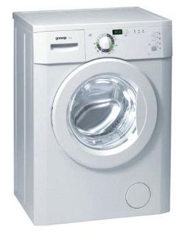
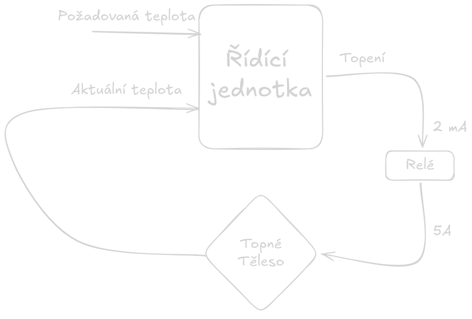

# Úvod do automatizace
- O čem je automatizace výroby/nějaké činnosti?
	- úspora času, efektivní výroba
	- musí mít nějaký přínos, nějakým požadavkům 
	- Nevýhoda
		- čistění strojů
		- spotřeba energie
	- v domácnosti: automatická pračka, robotický vysavač
	- ve firmách: robotické ruce, CNC, 3D tiskárna
	- jaké je nebezpečí?
		- Výpary
		- Porucha
- příklad: Automatická pračka

	- jaký je princip činnosti/ovládání/řízení?
		- Vstupy
			- Nastavený program
				- teplota (30/40/50/...)
				- Otáčky (např. 800 - 1200)
				- Ždímání (A/N)
			- Aktuální teplota
			- otevřená dvířka
			- voda na vstupu
			- vytéká voda
			- vážení prádla
			- otřesy pračky
		- Výstupy
			- LCD panel
			- Topná spirála
			- otáčky
			- napouštění vody
			- vypouštění vody
			- zámek dvířek
			- odložený start
	- Které signály jsou analogové / digitální?
	- Blokové schéma pračky:
