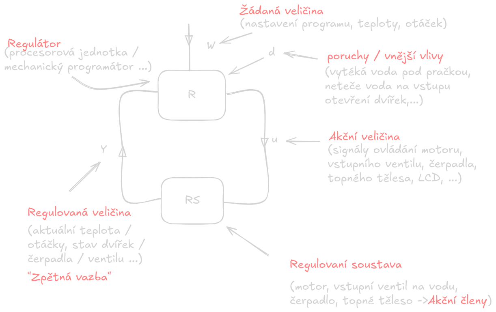
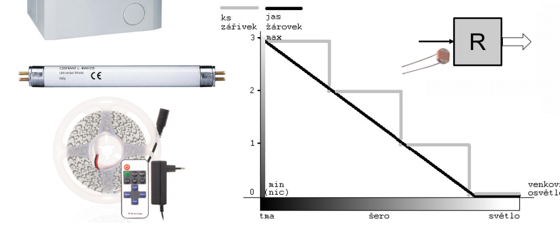
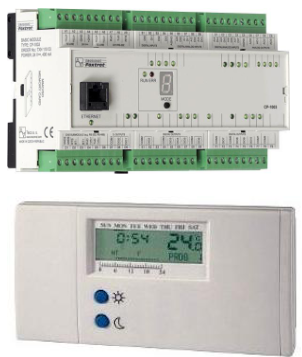

# Regulační obvody

## Regulační odchylka
- $e = |w-y|$
# Regulační pochod
- je odstraňování regulačních odchylek
## Algoritmus
- (skupiny povelů, příkazů?)
- je to jednoznačný postup
	- musí jednoznačně vědět kde skončil a co musí dělat
- Skupina povelů
	- Načtení hodnoty
	- Aritmetické operace
	- Podmíněné příkazy
	- Cykly
		- For
		- While
		- Do-While
	- Procedury
	- Zápis / výstup
# Rozdělení regulátorů / akčních členů
## Regulátor
- Je to zařízení, které **přeměňuje řídicí signál na fyzickou akci** – pohyb, sílu, teplo nebo světlo.
## Akční člen
- Je to zařízení (nebo program), které se neustále dívá na to, jaká je situace, porovnává ji s tím, jakou situaci chcete mít, a dává příkazy akčnímu členu, aby to napravil.
## Rozdělení
### Podle tvaru výstupního signálu
- Spojité (plynulé)
	- Má nekonečně mnoho poloh na výstupu
		- např. potenciometr, nebo vodovodní kohoutek
		- Analogový signál
- Nespojité (skokové)
	- Na výstupu mají omezený počet poloh
		- např. spínač, PWM řízené prvky
		- Digitální signál
- Příklad
	- Automatizovaného ovládání světel v místnosti zářivky/žárovky?
- 
	 - Máme LED pásek, kterému můžeme snižovat jas, podle toho kolik je venku světla (Spojité)
	 - Máme zářivky, které musíme vypínat po kusech, podle toho kolik je venku světla (Nespojité)
### Podle potřeby energie
 - Přímé
	 - Pro svoji činnost berou energii, z toho co regulují
	 - 
	 - 
 - Nepřímé
	 - Pro svoji činnost potřebují přivést energii
	 - 
### Podle dynamických vlastností
- P - proporcionální
- I - intengrační
- D - derivační
- sdružené -> PI, PD, PID
### Podle vnější energie
- Energie "co prochází" regulátorem

|                 | Příklad z praxe                                                                                                                                                                                             | rychlost, síla, hlučnost, opravitelnost, velikost, "péče"                                                                                      |
| --------------- | ----------------------------------------------------------------------------------------------------------------------------------------------------------------------------------------------------------- | ---------------------------------------------------------------------------------------------------------------------------------------------- |
| **mechanické**  | mechanické vězní hodiny, větrný / vodní mlýn, staré mechanické kalkulátory, zařízení používající táhla, mechanické brzdy (kolo, staré automobily), řízení auta bez posilovače, kladky, páky,... | - středně rychlé, středně až velké síly - hodně hlučný - dobrá opravitelnost - spíš středně až velké velikosti - náročné na údržbu |
| **elektrické**  | elektronické řídící systémy, digitální termostaty, PLC, dotykové ovládání "chytrych" domů, cyklocomputer, ATMEL, Arduino,...                                                                             | - nejrychlejší - bez síly - skoro žádný hluk - v dnešní době vetšinou neopravitelné - libovolná - musí být chlazené             |
| **pneumatické** | lisy ovládané vzduchem, pneumatické nářadí (utahovaky, vrtacky), pneumatické manipulatory, vakuové (podtlakové) prisavky na pfenaseni materialu,...                                                | - rychlé i pomalé - hlučnost, když vypouští vzduch - velké síly - opravitelné - střední velikost - středně náročné na údržbu    |
| **hydraulické** | těžké lisy, mechanika stavebních strojů, brzdy v autech, hydraulicky posilovací řízení v autech,...                                                                                                   | - velice pomalé - obrovská síla - hlučnější - opravitelné - středně veliké - středně náročné na údržbu                          |
| **kombinované** | automaticka pracka, automobil,...                                                                                                                                                                           | - vezmou si z každé části to nejlepší                                                                                                          |
### Příklady

| regulátor                                 | podle tvaru výstupního signálu          | podle potřeby energie | podle vnější energie                    |
| ----------------------------------------- | --------------------------------------- | --------------------- | --------------------------------------- |
| Hlavní uzávěr plynu                       | spojité                                 | nepřímé               | pneumatické                             |
| termostat v žehličce                      | spojité                                 | nepřímé               | elektrické                              |
| vodovodní kohoutek                        | spojité                                 | nepřímé               | hydraulické                             |
| "spoušť" na vrtačce                       | nespojité                               | neprímé               | elektrické                              |
| ovládání směru otáčení vrtačky            | nespojité                               | nepřímé               | elektrické                              |
| ovládání hlasitosti na rádiu              | spojité (pokud se jedná o potenciometr) | nepřímé               | elektrické                              |
| 5 polohový přepínač na ventilátoru        | nespojité                               | nepřímé               | elektrické                              |
| plynový pedál v autě                      | spojité                                 | nepřímé               | mechanické  (u některých elektrické) |
| přetlakový ventil chladící nádržky v autě | nespojité                               | přímé                 | pneumatické                             |
| servomotor na posouvání oken v autě       | nespojité                               | nepřímé               | elektrické                              |
## DI, AI, DO, AO, RO, PWM, NTC
- **DI** (digital input): tlačítko, vypínač, doraz, kontakt zavřených dveří nebo oken, termostat, ...
- **AI** (analog input): snímač polohy klapky, snímač intenzity osvětlení, snímač intenzity hluku, potenciometr, teploměr, snímače teploty, ...
	- **NTC** (negative tempeature coeficient): termistor ("negistor") 
		- *Speciální případ AI*
![[Obrazky/Pasted image 20251022160443.png]]
- **DO,RO** (digital output, relay output): ON/OFF, světlo, motor, topení, siréna
	- **PWM** (pusle width modulation): rychlost otáčení motoru, "plynulá" regulace topení, ovládání intenzity svícení
		- *Speciální případ DO (RO)*
- **AO** (analog output): ovládání polohy klapky, vodovodního ventilu, plynového ventilu 
![[Obrazky/Pasted image 20251022160343.png]]