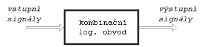
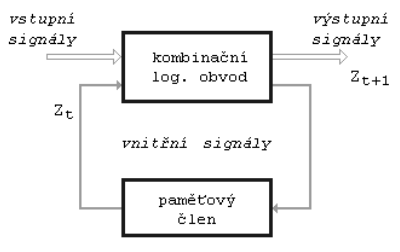
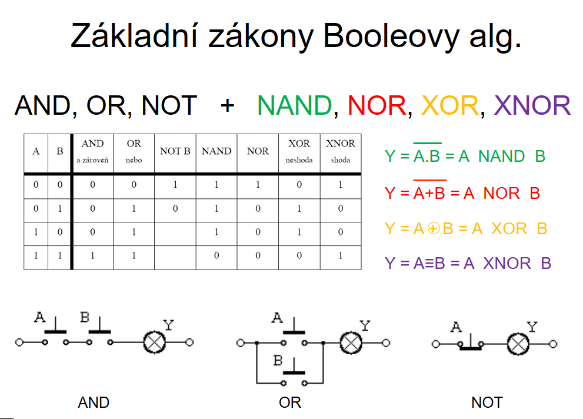

# Logické obvody
## Booleova algebra
- 1854, George Boole
- "dvouhodnotová algebra/logika"
	- ne/nepravda/false/0
	- ano/pravda/true/1
- digitální
	- di - dva
	- git - číslo
- výroková logika
	- zápis do pravdivostní tabulky
		- A, B - vstupy (zpravidla od začátku abecedy)
		- Y - výstup/výstupy (zpravidla od konce abecedy)
		- počet řádků -> $2^n$ ($n$ je počet vstupních proměnných)
		- 

| A   | B   | Y   |
| --- | --- | --- |
| 0   | 0   |     |
| 0   | 1   |     |
| 1   | 0   |     |
| 1   | 1   |     |

- Pro popis kombinačního a sekvenčního logického obvodu
	- Kombinační obvod
		- 
		- Pracuje v reálném čase
		- Používá se pro jednodušší obvody
		- Jeho výstupy závisí pouze na momentálních vstupech
		- Rychlejší než sekvenční obvody
		- Jednodušší pro návrh obvodu
		- Nemůže provádět operace, které závisí na předchozí stav
		- Žádná paměť -> nedokáže uchovat informaci
	- Sekvenční obvod
		- 
		- Získáme ho přidáním paměti do kombinačního obvodu
		- Pracuje na hodinové pulzy
		- Používá se pro složitější systémy
		- Jeho výstupy závisí na vstupech a jeho vnitřních stavech (minulém stavu)
		- Je pomalejší než kombinační obvod
		- Složitější návrh obvodu
- Výhody a nevýhody minimalizace
	- Výhody
		- 
	- Nevýhody
		- 
- Základní zákony booleovy algebry:
	- And, Or, Not + Nand, Nor, Xor, Xnor
	- 

- neurčité stavy
	- situace které:
		- nemohou nastat (teoreticky)
		- nemají význam pro správný chod
	- v pravdivostní tabulce i v karnaughově mapě se zapisuje pomocí `X`
		- lze je považovat za 0 i za 1 
	- nutno pak použít "signalizaci chybných situací"
	- 