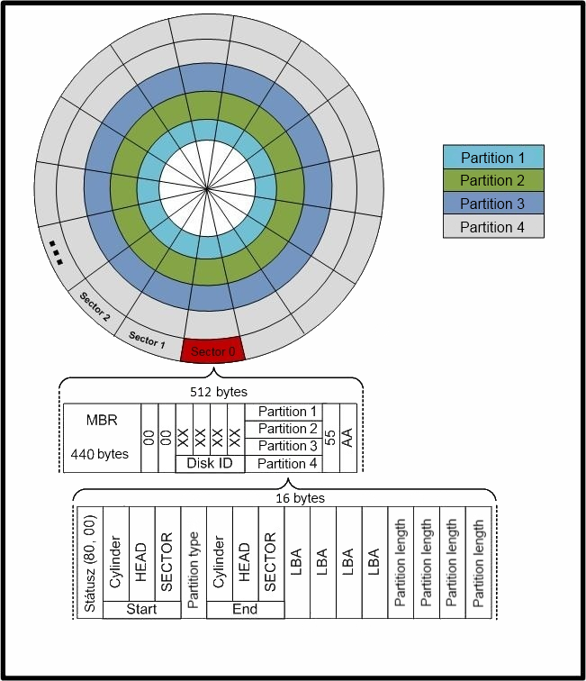
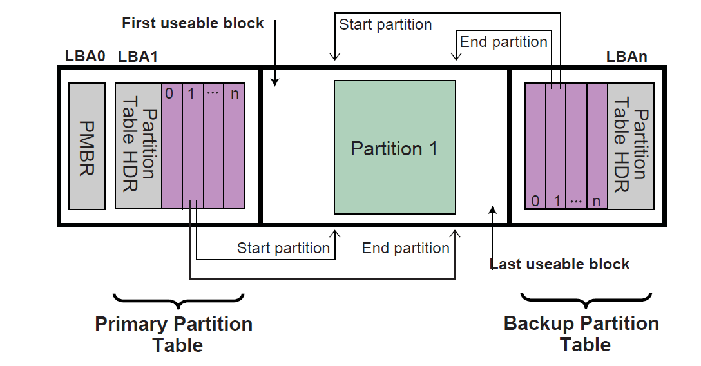

# Zavádění OS
- Softwarově vychází z architektury HDD
	- SSD - nemechanický zápis/čtení
	- Používají "mechanizmy" z HDD
		- Pracují s technologiemi MBR
		- Sektor, cluster
- O vyhledání OS se stará firmware základní desky
	- Nastavení FW - SETUP počítače
	- Starý typ -> BIOS (Basic Input/Output System)
	- Současný typ -> UEFI (Unified Extensible Firmware Interface)
- Bootování
	- Zavádění OS z "úložiště"
		- úložiště můžeme nastavit v SETUPu počítače na:
			- Externí úložiště (Flash disk, DVD, SD karta, ...)
			- Interní úložiště (SSD, HDD)
	- Režim BIOS nebo UEFI
- Adresace sektorů - součastnost:
	- LBA (Logical Block Addressing)
	- Beze stop (tracks)
	 - 
- Stará metoda - BIOS (mód msdos)
	- Basic Input/Output System
	- První stopa MBR (Master Boot Record)
	- 
- Součastnost 
	- 2 způsoby:
		- Mód: **msdos** -> **BIOS**
		- Mód: **GPT** -> **UEFI**
	- Liší se "přípravou" začátku disku
		- Tabulkou rozdělení disku
		- Zavádění BIOS - starší počítače
			- Omezené možnosti
		- Zavádění UEFI - současné počítače
			- Teoreticky bez omezení
- Partition Table
	- Mód MSDOS
		- Tabulka rozdělení disku
			- Navigace pro zavádění OS / data
			- Nultý sektor (začátek disku)
			- obsahuje kód pro vyhledání SystemBootRecord (konkrétní zavaděč OS)
			- adresy 4 oddílů ("disků")
		- Omezení BIOS:
			- 28b adresace -> max. velikost oddílu/"disku" - cca 2TB
			- Disk lze rozdělit max. na 4 **primární** oddíly - "disky"
			- Lze obejít vytvořením jednoho "logického" oddílu
				- rozšíření partition table (další sektor za MBR)
		- rozšířený (logický) oddíl
			- 1 záznam PT - obsahuje adresu sektoru kde je další popis rozdělení
				- lze použít až 128 oddílů
				- Informace o struktuře logických disků - mimo MBR
	- Mód GPT
		- Unified Extensible Firmware Interface (UEFI)
		- Používá jinou tabulku rozdělení disků: GPT
			- GUID Partition Table
			- Velikost: 16kB (BIOS - PT pouze 64B)
			- Umožňuje až 128 oddílů (OS Windows)
				- nepoužívá stopy ale čísluje sektory lineárně 0 -> N (LBA)
				- Logical Block Addressing
				- Adresuje prostor >> 256TB ($2^{70}$ zettaByte)
			- Tabulka je zálohovaná na konci disku
		- 
		- Secure Boot
			- metoda spouštění OS s ověřením
				- klíčové součásti OS - nezměněné a podepsané digitálním podpisem (Hashem)
				- znemožňuje spuštění nelegálního/cracknutého OS (malware)
			- Secure Boot - Aktivní
				- Windows při spouštění ověřují
					- Product Key
					- kontrola poškození/funkčnosti sys. souborů
				- Nespustíme Windows 7
				- Linux - kontrola: přidáme-li certifikační klíč do UEFI
- Zavádění OS
	- BIOS
		- Kód z MBR hledá zavaděč OS
			- v aktivní partition - č. sektoru
			- obsah sektoru - SBR
			- nahraje do paměti obsah SBR
			- Windows: bootmgr
			- Linux: např. GRUB
	- UEFI
		- Univerzální zavaděč OS
			- V systémovém oddílu ESP
				- EFI System Partition
			- Pracuje s FS
			- Adresář /EFI/Boot/
			- Windows/Linux
				- /EFI/Boot/Bootx64.efi
				- Dle distribucí