# Kuželosečky
### Opakování Elipsy
- zadání
	- Máme obecný tvar elipsy $x^{2}+2y^{2}-4x+4y+2=0$ převeďte ho na osový tvar
	- Postup
		- Upravíme pořadí `x` k sobě a `y` k sobě
			- $x^{2}-4x+2y^{2}+4y+2=0$
		- Vytkneme `2` u `y`
			- $x^{2}-4x+2(y^{2}+2y)+2=0$
		- Upravíme `x` a `y` hodnoty aby jsme je měli v závorkách
			- Hodnota `x`
				- $x^{2}-4x$ převedeme na $(x-2)²$, jakmile ale máme tento tvar tak se musíme  zbavit `+4` které nám vznikne po roznásobení závorky, proto za závorku vložíme `-4` a vznikne nám $(x-2)²-4$
			- Hodnota `y`
				- $y^{2}+2y$ převedeme na $(y+1)²$ a stejně jako u `x` se musíme zbavit hodnoty po roznásobení tedy nám vznikne $(y+1)²-1$
		- Nyní máme $(x-2)²-4 + 2((y+1)²-1) +2 = 0$ a toto zjednodušíme vynásobení závorky $(x-2)²-4 + 2(y+1)²-2 +2 = 0$ 
		- Převedeme hodnoty na druhou stranu $(x-2)²+ 2(y+1)² = 4$
		- Vydělíme `4` aby jsme měli v pravé straně rovnice `1`
			- $\frac{(x-2)^2}{4}+\frac{2(y+1)^2}{4}=1$
		- Použijeme výraz $\dfrac{a\cdot b}{c}=\dfrac{b}{\dfrac{c}{a}}$
			- $\frac{(x-2)^2}{4}+\frac{(y+1)^2}{\frac42}=1$ -> $\frac{(x-2)^2}{4}+\frac{(y+1)^2}{2}=1$
		- Nyní z rovnice dokážeme zjistit střed, a velikosti stran `a`,`b` a `e`
		- S [2;-1]
		  a = 2
		  b = 1,414 nebo $\sqrt2$
		  e = $\sqrt{a^2+b^2}=\sqrt{4+2}$ = $\sqrt{6}$
	- Máme obecný tvar elipsy $x^{2}+4y^{2}-6x+32y+48=0$ převeďte ho na osový tvar
	- postup
		- Upravíme pořadí `x` k sobě a `y` k sobě
			-  $x^{2}-6x+4y^{2}+32y+48=0$ 
		- Vytkneme `4`
			- $x^{2}-6x+4(y^{2}+8y)+48=0$ 
		- Upravíme `x` a `y` hodnoty aby jsme je měli v závorkách
			- $(x-3)²-9+4((y+4)²-16)+48=0$
		- Roznásobíme závorku
			- $(x-3)²-9+4(y+4)²-64+48=0$
		- Zjednodušíme a převedeme obyčejné hodnoty na druhou stranu
			- $(x-3)²+4(y+4)²=25$
		- Vydělíme `25` abychom získali `1` na pravé straně
			- $\frac{\left(x-3\right)^{2}}{25}+\frac{4\left(y+4\right)^{2}}{25}=1$
		- Použijeme výraz $\dfrac{a\cdot b}{c}=\dfrac{b}{\dfrac{c}{a}}$
			- $\frac{\left(x-3\right)^{2}}{25}+\frac{\left(y+4\right)^2}{\frac{25}{4}}=1$
		- Nyní z rovnice dokážeme zjistit střed, a velikosti stran `a`,`b` a `e`
		- S [3;-4]
		  a = 5 -> ($\sqrt25$)
		  b = 2,5 -> $\sqrt{\frac{25}{4}}$
		  e = $\sqrt{a^2+b^2}=\sqrt{25+\frac{25}{4}}$ = $\frac{5\sqrt5}{2}$
		  F1 = [3-e; -4]  
		  F2 = [3+e; -4]
### Vzájemná poloha přímky a elipsy
- Vzájemná poloha:
	-  Přímka může být
		- Tečnou (1 společný bod) diskriminant = 0
		- Sečnou (2 společný body) diskriminant > 0
		- Vnější přímkou (žádný společný bod) diskriminant < 0
- příklad
	- Zjistěte vzájemnou polohu přímky $x=5+3t;y=2t$ a elipsy $x^2+\frac{y^2}{4}=1$
	- Postup
		- Dosadíme přímku do rovnice elipsy
			- $(5+3t)^2+\frac{(2t)^2}{4}=1$
		- Zjednodušíme
			- $(5+3t)(5+3t)+\frac{4t²}{4}=1$
			- $9t²+30t+25+t²=1$
			- $10t²+30t+24=0$
			- $5t²+15t+12=0$
		- Vypočítáme diskriminant $b²-4ac$ a zjistíme polohu přímky
			- $15²-4*5*12=-15$
		- $D<0$ tím pádem se jedná o vnější přímku
- další příklad
	- Zjistěte vzájemnou polohu přímky $p:x+2y-25=0$ a elipsy $e:4x^2+9y^2=900$
	- Postup
		- Vyjádříme si z rovnice přímky hodnotu `x` nebo `y` podle toho co bude jednodušší, momentálně `x`
			- $x=-2y+25$
		- Nyní dosadíme do rovnice elipsy
			- $4(-2y+25)^2+9y^2=900$
			- Roznásobíme závorku na-druhou
			- $4(625-100y+4y²)+9y^2=900$
			- Vynásobíme závorku
			- $2500-400y+16y²+9y^2=900$
			- Zjednodušíme
			- $25y²-400y+1600=0$
			- $y²-16y+64=0$
		- Dosadíme do diskriminantu $b²-4ac$
			- $16²-4*1*64=0$
		- $D=0$ tím pádem se jedná o tečnu
		- Vypočítáme bod dotyku
			- Jelikož jsme dosazovali hodnotu `x` vypočítáme pomocí kvadratické rovnice bod dotyku pro hodnotu `y` a tu následně dosadíme do rovnice přímky abychom zjistili hodnotu `x`
			- $y=\frac{-b}{2a}=\frac{16}{2}=8$
				- nepotřebujeme dosazovat diskriminant jelikož jeho hodnota je `0`
			- Dosadíme `y` do rovnice přímky
			- $x+(2*8)-25=0$
			- $x+16-25=0$
			- $x=9$
		- Bod dotyku je $T[9;8]$
- Příklad
	- Zjistěte vzájemnou polohu přímky $p:2x-y+3=0$ a elipsy $e:\frac{\left(x-2\right)^2}{9}+\frac{\left(y-1\right)^2}{4}=1$
	- Postup
		- Vyjádříme si z rovnice přímky proměnnou `y`
			- $y=2x+3$
		- Dosadíme do rovnice elipsy
			- $\frac{\left(x-2\right)^2}{9}+\frac{\left(2x+3-1\right)^2}{4}=1$
		- Zjednodušíme
			- $\frac{\left(x-2\right)^2}{9}+\frac{\left(2x+2\right)^2}{4}=1$
			- $\frac{x^2-4x+4}{9}+\frac{4x^2+8x+4}{4}=1$
			- $\frac{x^2-4x+4}{9}+x^2+2x+1=1$    $|*9$
			- $x^2-4x+4+9x^2+18x+9=9$
			- $10x^2+14x+4=0$    $|/2$
			- $5x^2+7x+2=0$
		- Dosadíme do diskriminantu $b²-4ac$
			- $7²-4*5*2=9$
		- $D>0$ tím pádem se jedná o sečnu a počítáme 2 průsečíky
		- Vypočítáme pomocí kvadratické rovnice
			- $x_1=\frac{-b-\sqrt{D}}{2a}=\frac{-7-\sqrt{9}}{2\cdot5}=\frac{-10}{10}=-1$
			- $x_2=\frac{-b+\sqrt{D}}{2a}=\frac{-7+\sqrt{9}}{2\cdot5}=\frac{-4}{10}=-0.4$
		- Pro každé `x` dopočítáme hodnotu `y` dosazením `x` do rovnice přímky
			- $y_1=2\cdot\left(-1\right)+3=1$
			- $y_2=2\cdot\left(-0.4\right)+3=2.2$
		- Nyní máme průsečíky $P_1[-1;1]$ a $P_2[-0.4;2.2]$
## Hyperbola
- Je množina všech bodů v rovině, které mají tu vlastnost, že absolutní hodnota rozdílu jejich vzdáleností od dvou daných bodů různých bodů je rovna kladné konstantě.
### Bodové sestrojení hyperboly
- zadání:
	- Sestrojte hyperbolu, $a=2;b=2$
	- postup:
		- 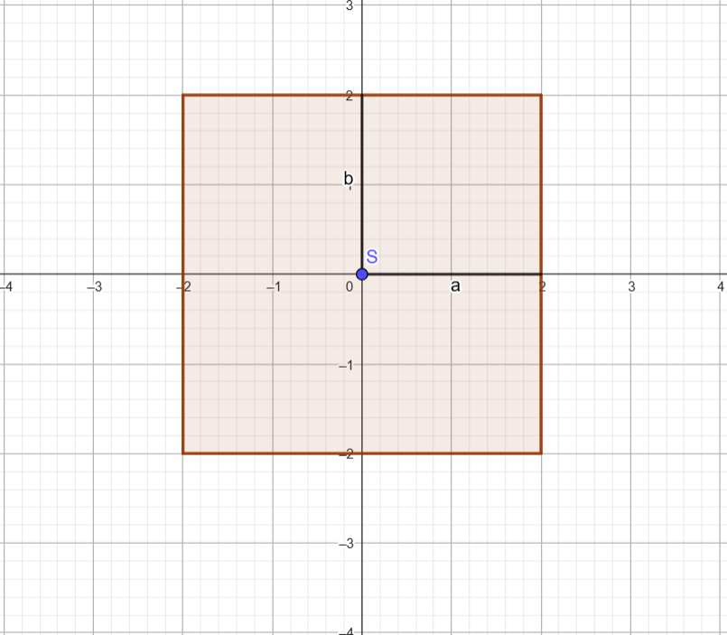
			- Sestrojíme čtverec/obdélník s délkami stran $2a$ a $2b$
				- Střed je $S[0;0]$
		- 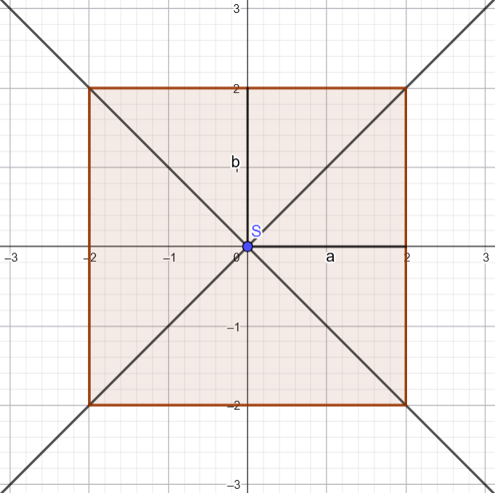
			- Nyní uděláme úhlopříčky našeho čtverce/obdélníku
		- 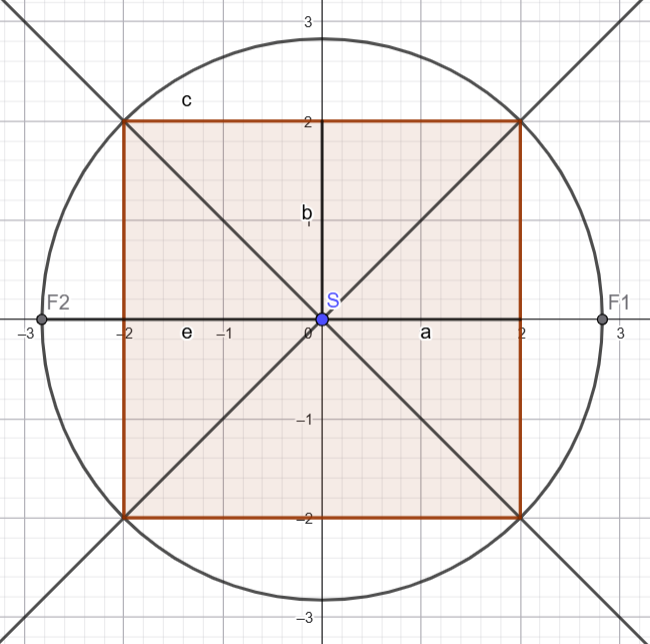
			- Nyní uděláme si vezmeme vzdálenost středu a vrcholu čtverce/obdélníku a vyznačíme si ohniska $F1$ a $F2$
		- 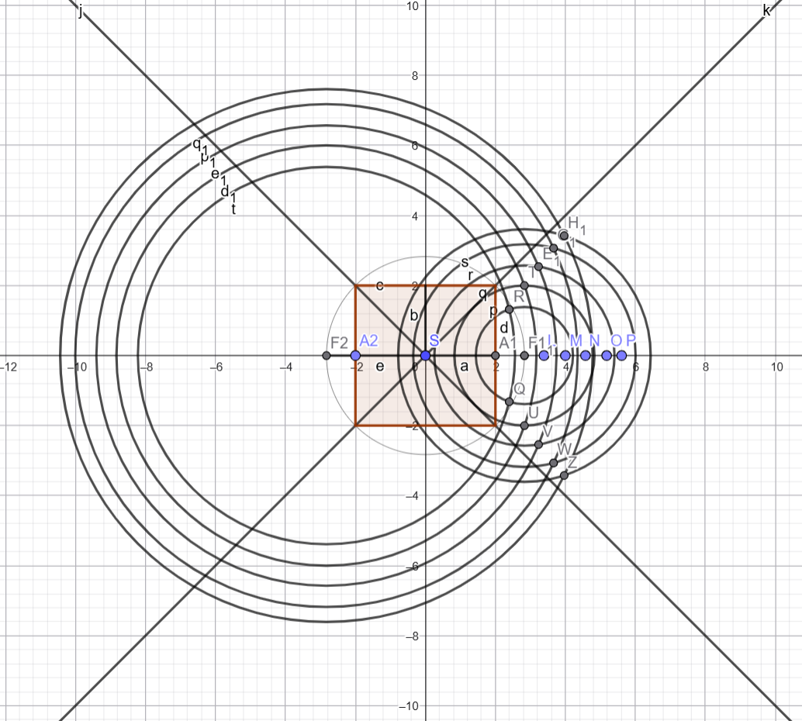
			- Vyznačíme si libovolný počet bodů na ose `x` (čím více tím přesnější bude hyperbola) 
			- Dále si postupně bereme vzdálenost bodů $A1$ a našich vytvořených bodů a kružítko zapíchneme do bodu $F1$ a vyznačíme
			- Poté uděláme to samé ale bereme vzdálenost bodů $A2$ a našich vytvořených bodů a kružítko zapíchneme do bodu $F2$ a protneme již vyznačené kružnice a vytvoříme body hyperboly  
		- 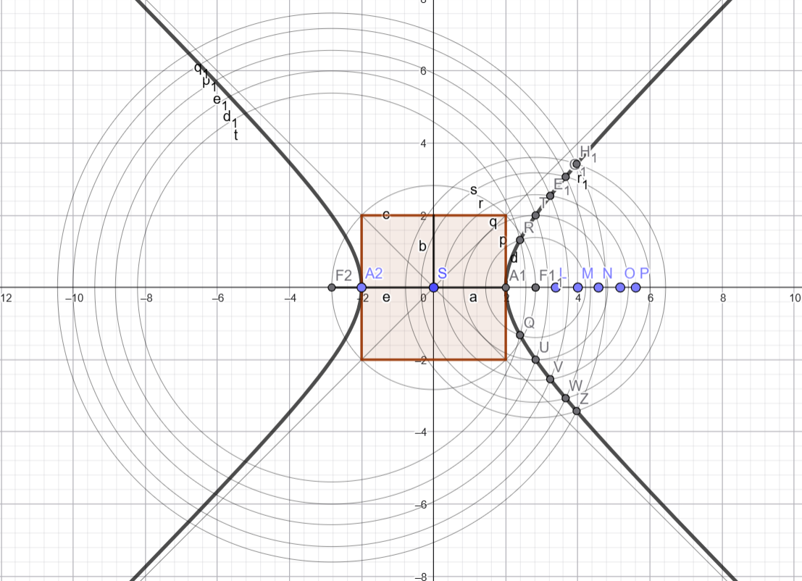
			- Následně body protneme a vznikne nám 1. polovina hyperboly, to samé musíme udělat i pro opačnou stranu abychom měli obě strany hyperboly
### Rovnice hyperboly
- Hyperbola v ose X
	- $\frac{x^2}{a^2}-\frac{y^2}{b^2}=1$
	- 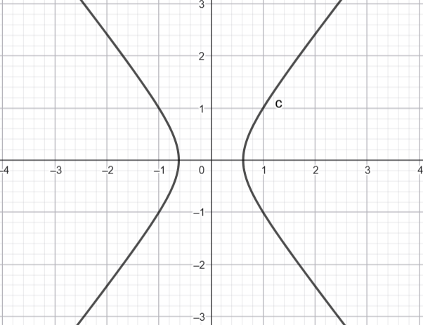
- Hyperbola v ose Y
	- $-\frac{x^2}{b^2}+\frac{y^2}{a^2}=1$
	- 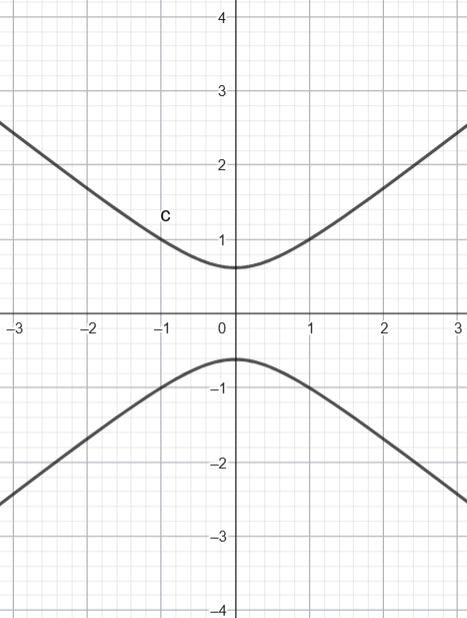
### Výpočet rovnice hyperboly
- Příklad
	- Napište rovnici hyperboly, která má velikost hlavní poloosy $6$ ($a=6$), výstřednost $9$ ($e=9$) a ohniska $F1[e;0], F2[-e,0]$
	- Postup
		- Podle ohnisek máme určeno, že hyperbola je v ose x, tím pádem použijeme vzorec $\frac{x^2}{a^2}-\frac{y^2}{b^2}=1$
		- Nejdříve ale potřebujeme zjistit velikost vedlejší poloosy `b` a to zjistíme pomocí rovnice $e^2=a^2+b^2$
			-  $e^2=a^2+b^2$ ->  $b^2=e^2-a^2$
			- $b^2=81-36=45$
		- Dosadíme do rovnice a máme výsledek $\frac{x^2}{36}-\frac{y^2}{45}=1$
### Rovnice hyperboly se středem
- rovnice se středem $S[S_x;S_y]$
	- Hyperbola v ose X
		- $\frac{(x-S_x)^2}{a^2}-\frac{(y-S_y)^2}{b^2}=1$
		- 
	- Hyperbola v ose Y
		- $-\frac{(x-S_x)^2}{b^2}+\frac{(y-S_y)^2}{a^2}=1$
		- 
- Příklad
	- Zjistěte souřadnice středu, výstřednost a velikost poloos a ohniska u hyperboly s rovnicí $9(x-5)^2-6(y+3)^2=576$
	- Postup
		- Upravíme rovnici do tvaru $\frac{(x-S_x)^2}{a^2}-\frac{(y-S_y)^2}{b^2}=1$
			- $9(x-5)^2-6(y+3)^2=576$        $|/576$
			- $\frac{9(x-5)^2}{576}-\frac{6(y+3)^2}{576}=1$
			- $\frac{(x-5)^2}{64}-\frac{(y+3)^2}{96}=1$
		- Nyní si můžeme zjistit souřadnice středu => $S[5;-3]$
		- Nyní zjistíme výstřednost pomocí vzorce $e^2=a^2+b^2$
			- $e=\sqrt{a^2+b^2}=\sqrt{64+96}=4\sqrt{10}$
		- Nyní zapíšeme velikost poloos => $a=8;b=4\sqrt{6}$
		- Nyní přejdeme na výpočet ohnisek
			- Jelikož hyperbola je položená v ose X použijeme $F1[S_x+e;S_y], F2[S_x-e,S_y]$
			- $F1[S_x+e;S_y]->[17.64;-3]$ 
			  $F2[S_x-e,S_y]->[-7,64;-3]$
- příklad
	- Zjistěte souřadnice středu, výstřednost a velikost poloos a ohniska u hyperboly s rovnicí $x^2-4y^2-6x-8y+1=0$
	- postup
		- Upravíme rovnici na tvar $\frac{x^2}{a^2}-\frac{y^2}{b^2}=1$
			- Upravíme pořadí hodnot
				- $x^2-6x-4y^2-8y+1=0$
			- Upravíme na závorky 
				- $(x-3)^2-9-4((y+1)^2-1)+1=0$
			- Zjednodušíme
				- $(x-3)^2-9-4(y+1)^2+4+1=0$
				- $(x-3)^2-4(y+1)^2=4$
			- Upravíme na tvar $\frac{x^2}{a^2}-\frac{y^2}{b^2}=1$
				- $\frac{(x-3)^2}{4}-\frac{4(y+1)^2}{4}=1$
				- $\frac{(x-3)^2}{4}-\frac{(y+1)^2}{1}=1$
		- Nyní si můžeme zjistit souřadnice středu => $S[3;-1]$
		- Nyní zjistíme výstřednost pomocí vzorce $e^2=a^2+b^2$
			- $e=\sqrt{a^2+b^2}=\sqrt{4+1}=\sqrt{5}$
		- Nyní zapíšeme velikost poloos => $a=2;b=1$
		- Nyní přejdeme na výpočet ohnisek
			- Jelikož hyperbola je položená v ose X použijeme $F1[S_x+e;S_y], F2[S_x-e,S_y]$
			- $F1[S_x+e;S_y]->[5.23;-1]$ 
			  $F2[S_x-e,S_y]->[-0.76;-1]$
### Vzájemná poloha přímky a hyperboly
- přímka může být
	- Tečna $D=0$ -> má jeden společný bod
	- Vnější přímka $D<0$ -> nemá žádný společný bod
	- Sečna s 2 průsečíky $D>0$ -> má dva společný body
	- Sečna s 1 průsečíkem (pokud je rovnoběžná s asymptotou) ->má jeden společný bod 
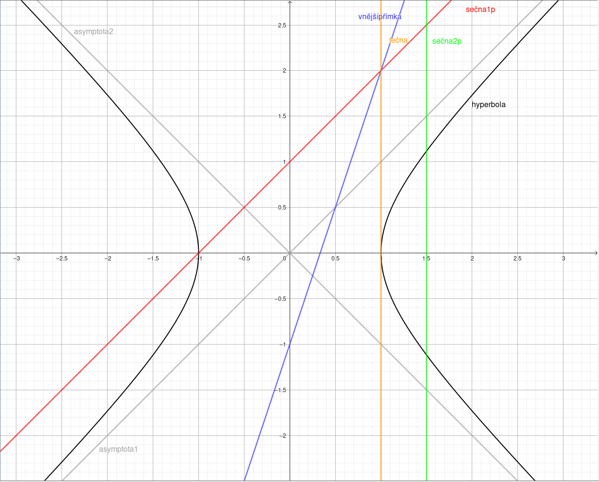
- příklad
	- Máme přímku $10x-3y-32=0$ a hyperbolu $4x²-y²=64$ zjistěte vzájemnou polohu
	- postup
		- upravíme si rovnici přímky 
			- $y=\frac{10x-32}{3}$
		- dosadíme ji do rovnice hyperboly
			- $4x²-(\frac{10x-32}{3})²=64$
		- Roznásobíme
			- $4x²-(\frac{10x-32}{3}*\frac{10x-32}{3})=64$
			- $4x²-\frac{(10x-32)(10x-32)}{3*3}=64$
			- $4x²-\frac{100x²-640x+1024}{9}=64$
		- Zbavíme se zlomku
			- $36x²-100x²+640x-1024=576$
		- Zjednodušíme
			- $-64x²+640x-1600=0$     |$/-64$
			- $x²-10x+25=0$
		- Vypočítáme diskriminant
			- $b²-4ac => (-10)²-4*1*25 = 100-100 = 0$
			- $D=0$
			- Jedná se o tečnu
		- Jelikož se jedná o tečnu vypočítáme bod dotyku
			- Dopočítáme kvadratickou rovnici pro zjištění souřadnice `x` (jelikož je diskriminant 0 můžeme kvadratickou rovnici zkrátit na $\frac{-b}{2a}$)
				- $\frac{-b}{2a}=>\frac{-(-10)}{2*1}=5$
				- $x=5$
			- Nyní dosadíme `x` do rovnice přímky
				- $y=\frac{10x-32}{3}=\frac{10*5-32}{3}\frac{18}{3}=6$
			- Bod dotyku je tedy $P[5;6]$
- Příklad
	- Máme přímku $x-y-2=0$ a hyperbolu $x²-4y²=7$ zjistěte vzájemnou polohu
	- postup
		- upravíme rovnici přímky
			- $y=x-2$
		- dosadíme do vzorce hyperboly
			- $x²-4(x-2)²=7$
		- Roznásobíme
			- $x²-4(x²-4x+4)=7$
			- $x²-4x²+16x-16=7$
		- Zjednodušíme
			- $-3x²+16x-23=0$
		- Nyní vypočítáme diskriminant
			- $b²-4ac => 16²-4*-3*-23 = 256 - 276 = -20$
			- $D<0$
			- Jedná se o vnější přímku
- Příklad
	- Máme přímku $x-2y+2=0$ a hyperbolu $x²-4y²=8$ zjistěte vzájemnou polohu
	- postup
		- upravíme rovnici přímky
			- $x=2y-2$
		- dosadíme do rovnice hyperboly
			- $(2y-2)²-4y²=8$
		- roznásobíme
			- $4y²-8y+4-4y²=8$
		- zkrátíme
			- $-8y+4=8$
			- $-8y=4$
			- $y=-\frac{1}{2}$
		- Jelikož nám nevyšla kvadratická rovnice ale rovnou výsledek, znamená to že se jedná o sečnu s jedním průsečíkem, nyní nám stačí dopočítat hodnotu `x`
			- $x=2y-2=>2(-\frac{1}{2})-2=-1-2=-3$
		- Průsečík je tedy na pozici $P[-3;-0.5]$
- Příklad
	- Máme přímku $x=3-t;y=-1+t$ a hyperbolu $9x²-4y²=36$ zjistěte vzájemnou polohu
	- postup
		- Jelikož máme přímku určenou parametrickou rovnicí můžeme ji rovnou dosadit do rovnice paraboly
			- $9(3-t)²-4(-1+t)²=36$
		- Roznásobíme
			- $9(t²-6t+9)-4(t²-2t+1)=36$
			- $9t²-54t+81-4t²+8t-4=36$
		- Zjednodušíme
			- $5t²-46t+41=0$
		- Vypočítáme diskriminant
			- $b²-4ac => (-46)²-4*5*41 = 2116 - 820 = 1296$
			- $D>0$
			- Jedná se o sečnu s dvěma průsečíky
		- Dopočítáme zbylé dva průsečíky
			- Dopočítáme kvadratickou rovnici s dvěma kořeny
				- $t_1=\frac{-b+\sqrt{D}}{2a}=\frac{-(-46)+\sqrt{1296}}{2*5}=\frac{+46+36}{10}=\frac{82}{10}=8.2$
				- $t_2=\frac{-b-\sqrt{D}}{2a}=\frac{-(-46)-\sqrt{1296}}{2*5}=\frac{+46-36}{10}=\frac{10}{10}=1$
			- Dosadíme oba kořeny do parametrické rovnice (z jednoho kořenu vyjde jeden průsečík)
				- $P_1=[3-t_1;-1+t_1]=[3-8.2;-1+8.2]=[-5.2;7.2]$
				- $P_2=[3-t_2;-1+t_2]=[3-1;-1+1]=[2;0]$
		- Jedná se tedy o sečnu s průsečíky $P_1[-5.2;7.2]$ a $P_2[2;0]$
## Parabola
- V rovině je dán bod $F$ a přímka $q$, která jim neprochází. Množina všech bodů roviny, které mají stejnou vzdálenost od bodu $F$ a od přímky $q$, se nazývá parabola. Bod $F$ se nazývá ohnisko, přímka $d$ řídící přímka paraboly
- 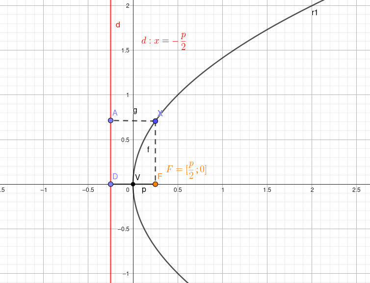
### Bodová konstrukce paraboly
- sestrojte parabolu s parametry $p = 2$ a $V[0;0]$
- postup
	- 
### Rovnice paraboly
- $y^2=2px$
	- 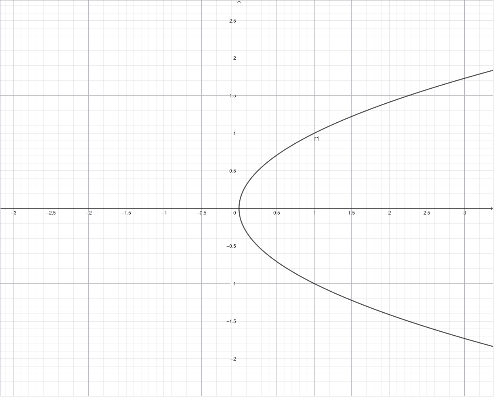
- $y^2=-2px$
	- 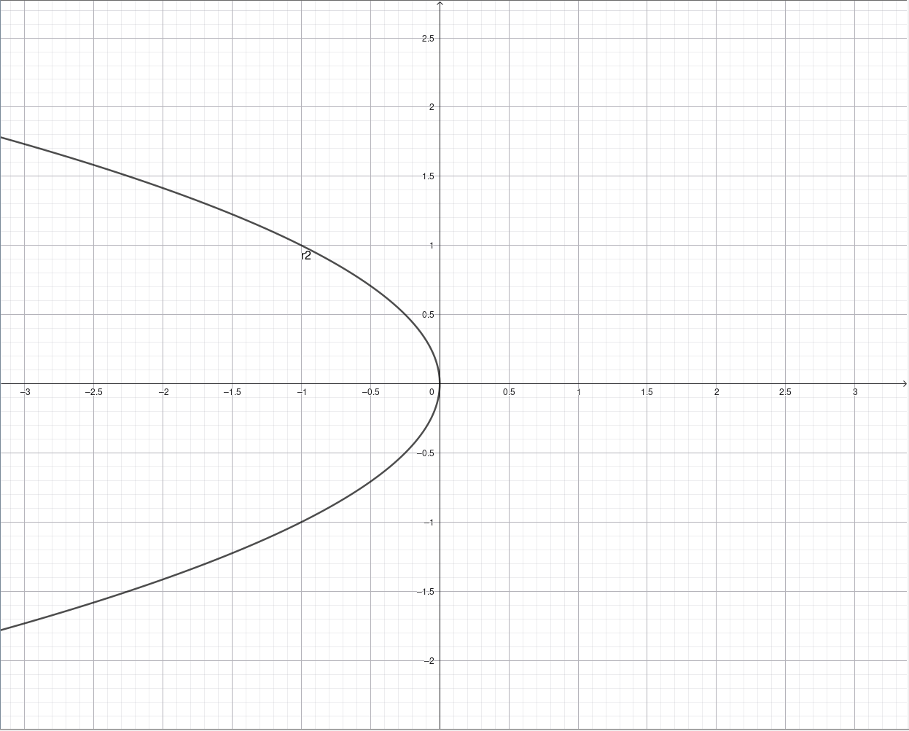
- $x^2=2py$
	- 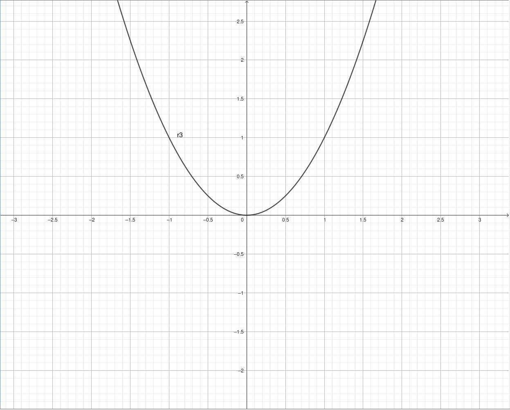
- $x^2=-2py$
	- 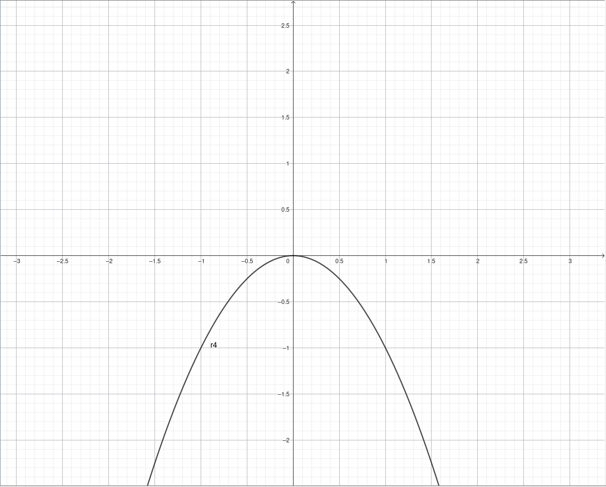
### Výpočet rovnice
- Máme rovnici paraboly $y^2=6x$, zjistěte parametr $p$, ohnisko $F$ a řídící přímku $d$
	- $p=6/2=3$
	- $F=[\frac{p}{2};0]=\left\lbrack\frac32;0\right\rbrack$
	- $d=>x=-\frac{p}{2}=>x=-\frac{3}{2}$
- Napište rovnici paraboly se zadanými hodnoty $F[0;-2]$ a $V[0;0]$
	- Dosadíme do rovnice $x^2=2py$
		- k tomu abychom mohli rovnici zapsat potřebujeme zjistit $p$, to zjistíme vynásobením dvěma, hodnoty `y` ohniska `F`
			- $p:-2*2=-4$
	- nyní pouze dosadíme do rovnice a zjednodušíme
		- $x^2=2*-4y$
		- $x^2=-8y$
### Rovnice paraboly s vrcholem
- $(y-V_y)^2=2p(x-V_x)$
	- 
- $(x-V_y)^2=-2p(x-V_x)$
	- 
- $(x-V_x)^2=2p(x-V_y)$
	- 
- $(x-V_x)^2=-2p(x-V_y)$
	- 
### Výpočet rovnice s vrcholem
- Máme zadané hodnoty vrchol $V[-2;1]$, a bod, který leží na parabole, $A[0,3]$ a osa rovnice je rovnoběžná s osou `y`, vytvořte rovnici paraboly
	- Postup
		- Použijeme rovnici $(x−V_x​)^2=2p(y−V_y​)$ jelikož parabola je rovnoběžná s osou `y` a tím zjistíme $p$
		- Dosadíme do rovnice vrchol a bod `A`
			- $(0−(-2)​)^2=2p(3−1​)$
		- Roznásobíme a zjednodušíme
			- $4=4p$
			- $p=1$
		- Máme tedy hodnotu $p$ kterou společně se středem dosadíme do rovnice $(x−V_x​)^2=2p(y−V_y​)$
			- $(x+2)^2=2(y−1​)$
### Vzájemná poloha přímky a paraboly
- přímka může být
	- Tečna $D=0$ -> má jeden společný bod
	- Vnější přímka $D<0$ -> nemá žádný společný bod
	- Sečna s 2 průsečíky $D>0$ -> má dva společný body
	- Sečna s 1 průsečíkem (pokud je rovnoběžná s asymptotou) ->má jeden společný bod 
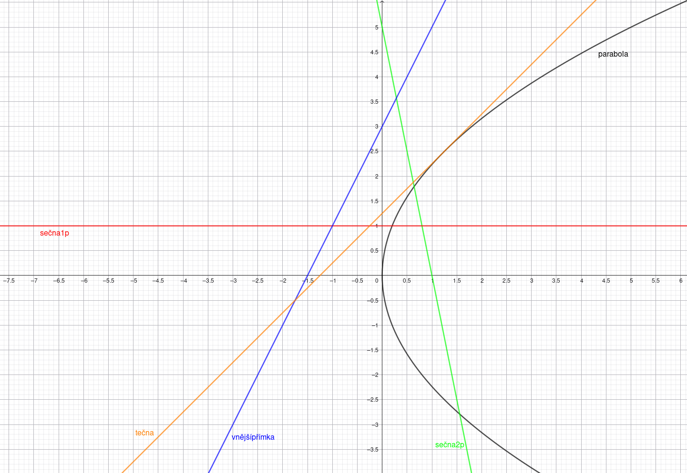

> [!NOTE] Chybějící příklady pro parabolu
> Příklady pro parabolu jsou identické jako pro hyperbolu, pouze s tím rozdílem, že používáme rovnici paraboly. Proto zde příklady nejsou ale postup lze nalézt výše.
