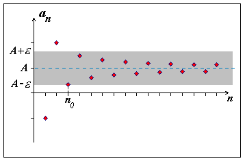

# Vlastnosti posloupností
- Posloupnosti dokážeme převést na grafy, mají také podobné vlastnosti
	- Rostoucí/klesající/Konstantní
	- Omezená shora/zdola/shora i zdola/není omezená
## Aritmetická posloupnost vlastnosti
- vzorec $a_{n+1}=a_n+d$
- Pokud je $d$ 
	- Pokud je $d > 0$, posloupnost je **rostoucí** (např. 2, 4, 6...).
	- Pokud je $d < 0$, posloupnost je **klesající** (např. 6, 4, 2...).
	- Pokud je $d = 0$, posloupnost je **konstantní** (např. 5, 5, 5...).
## Limita posloupnosti
- Říkáme, že posloupnost $(a_{n})_{n=1}^{\infty}$ je **konvergentní** (má limitu), právě když existuje číslo $a\in R$ takové, že platí: Ke každému $\epsilon>0$ existuje $n_0\in N$ tak, že pro všechna přirozená čísla $n\ge n_0$ je $|a_n - a|<\varepsilon$ 
	- neboli zapsáno
		- $\exists a\in R\forall\varepsilon>0\exists n_0\in N;\forall n\ge n_0\left|a_{n}-a\right|<\varepsilon$
	- Posloupnost co nemá limitu se nazývá **divergentní** (nemá limitu)
- Číslo $a$ se nazývá limita posloupnosti $(a_{n})_{n=1}^{\infty}$
- Limita se zapisuje jako ->  $\lim_{n\to\infty}a_{n}=a$
- Ať zvolíme jakkoliv malé $\epsilon>0$, vždy existuje $n_0\in N$ tak, že pro všechny $n\ge n_0$ patří obrazy členů posloupnosti $(a_{n})_{n=1}^{\infty}$ v soustavě souřadnic v rovině do vnitřku pásu s "hranicemi" $a+\varepsilon$ a $a-\varepsilon$ 
- 
- Limita je číslo $a$ (na obrázku znázorněné vodorovnou přímkou $A$), ke kterému se posloupnost přibližuje.  
- Kolem této hodnoty si z libovolně zvoleného $\varepsilon > 0$ vytvoříme „pás“ mezi $A - \varepsilon$ a $A + \varepsilon$ (šedivá oblast na obrázku, nazýváme to ε-okolí).
	- Slouží k **formálnímu určení, jak blízko jsou členy posloupnosti limitě**.
- Bod/index $n_0$​ je tedy první člen posloupnosti, který do pásu spadl — a od něj dál už posloupnost pás nikdy neopustí.
	- **První člen v pásu nemusí být první člen v posloupnosti**, vše záleží na tom jaké zvolíme $\varepsilon$
### Příklady
- příklad
	- Najděte limitu: $\lim_{n\to\infty}\frac{n+1}{n}$
	- Postup
		-  Nalezneme největší mocninu, která se nachází v posloupnosti, zde to je $n^1$
			- Momentálně použijeme vzorec $\frac{1}{n^x}=0$
				- Tento vzorec vychází tak, že se přibližujeme postupně v posloupnosti k 0
				- např. pokud máme $n^1$ hodnoty se postupně zmenšují -> 
				  ($1, 0.5, 0.3, 0.25, ..., 0.01, ... ,0.001, ...$) tím pádem "můžeme" toto definovat jako $0$
				- pokud budeme mít větší jak $n^1$ např. $n^2$ či víc, k nule se budeme přibližovat mnohem rychleji
				- Nezapomeňme že se jedná o posloupnost a dosazujeme celá čísla!
				- Toto můžeme použít jen u neomezených posloupností!
		- Vydělíme všechny členy nejvyšší mocninou co se nachází v $\frac{n+1}{n}$
			- $\frac{n+1}{n}$ -> $\frac{\frac{n}{n}+\frac{1}{n}}{\frac{n}{n}}$
		- Zkrátíme vše
			- $\frac{\frac{n}{n}+\frac{1}{n}}{\frac{n}{n}}$
				- $\frac{n}{n}$ -> $1$ (klasické zkrácení) 
				- $\frac{1}{n}$ -> 0 (použití vzorečku výše)
			- tím pádem nám vyjde
			- $\frac{1+0}{1}$
			- což je $1$
- příklad
	- Najděte limitu: $\lim_{n\to\infty}\frac{5n+1}{n}$
	- Postup
		-  Nalezneme největší mocninu, která se nachází v posloupnosti, zde to je $n^1$
		- Vydělíme všechny členy nejvyšší mocninou co se nachází v $\frac{5n+1}{n}$
			- $\frac{5n+1}{n}$ -> $\frac{\frac{5n}{n}+\frac{1}{n}}{\frac{n}{n}}$
		- Zkrátíme vše
			- $\frac{\frac{5n}{n}+\frac{1}{n}}{\frac{n}{n}}$
				- $\frac{n}{n}$ -> $1$ (klasické zkrácení) 
				- $\frac{1}{n}$ -> 0 (použití vzorečku výše)
			- tím pádem nám vyjde
			- $\frac{5+0}{1}$
			- což je $5$
- příklad
	- Najděte limitu: $\lim_{n\to\infty}\frac{3}{n^2}$
	- Postup
		-  Nalezneme největší mocninu, která se nachází v posloupnosti, zde to je $n^2$
		- Vydělíme všechny členy nejvyšší mocninou co se nachází v $\frac{3}{n^2}$
			- $\frac{3}{n^2}$ -> $\frac{\frac{3}{n^2}}{\frac{n^2}{n^2}}$
		- Zkrátíme vše
			- $\frac{\frac{3}{n^2}}{\frac{n^2}{n^2}}$
				- $\frac{n^2}{n^2}$ -> $1$ (klasické zkrácení) 
				- $\frac{1}{n^2}$ -> 0 (použití vzorečku výše)
			- tím pádem nám vyjde
			- $\frac{3\cdot0}{1}$
			- což je $0$
- příklad
	- Najděte limitu: $\lim_{n\to\infty}\frac{3n+1}{2n-1}$
	- Postup
		-  Nalezneme největší mocninu, která se nachází v posloupnosti, zde to je $n^1$
		- Vydělíme všechny členy nejvyšší mocninou co se nachází v $\frac{3n+1}{2n-1}$
			- $\frac{3n+1}{2n-1}$ -> $\frac{\frac{3n}{n}+\frac{1}{n}}{\frac{2n}{n}-\frac{1}{n}}$
		- Zkrátíme vše
			- $\frac{\frac{3n}{n}+\frac{1}{n}}{\frac{2n}{n}-\frac{1}{n}}$
				- $\frac{n}{n}$ -> $1$ (klasické zkrácení) 
				- $\frac{1}{n}$ -> 0 (použití vzorečku výše)
			- tím pádem nám vyjde
			- $\frac{3+0}{2-0}$
			- což je $\frac{3}{2}$
- příklad
	- Najděte limitu: $\lim_{n\to\infty}\frac{5n^2-4n+3}{3n^2+2n-1}$
	- Postup
		-  Nalezneme největší mocninu, která se nachází v posloupnosti, zde to je $n^2$
		- Vydělíme všechny členy nejvyšší mocninou co se nachází v $\frac{5n^2-4n+3}{3n^2+2n-1}$
			- $\frac{5n^2-4n+3}{3n^2+2n-1}$ -> $\frac{\frac{5n^2}{n^2}-\frac{4n}{n^2}+\frac{3}{n^2}}{\frac{3n^2}{n^2}+\frac{2n}{n^2}-\frac{1}{n^2}}$
		- Zkrátíme vše
			- $\frac{\frac{5n^2}{n^2}-\frac{4n}{n^2}+\frac{3}{n^2}}{\frac{3n^2}{n^2}+\frac{2n}{n^2}-\frac{1}{n^2}}$
				- z $\frac{5n^2}{n^2}$ nám vyjde po zkrácení $5$; z $\frac{3n^2}{n^2}$ nám vyjde po zkrácení $3$
				- z $\frac{4n}{n^2}$ můžeme vykrátit mocninu a vyjde nám případ $\frac{1}{n}=0$ což je $0$; u $\frac{3n^2}{n^2}$ uděláme to samé a vyjde také $0$
				- u $\frac{3}{n^2}$ a $\frac{1}{n^2}$ použijeme $\frac{1}{n^2}=0$ a u obou nám vyjde $0$ 
			- tím pádem nám vyjde $\frac{5}{3}$
- příklad
	- Najděte limitu: $\lim_{n\to\infty}\frac{5n^3-4}{5n^2}$
	- Postup
		- Nalezneme největší mocninu, která se nachází v posloupnosti, zde to je $n^3$
		- Vydělíme všechny členy nejvyšší mocninou
			- $\frac{5n^3-4}{5n^2}$ -> $\frac{\frac{5n^3}{n^3}-\frac{4}{n^3}}{\frac{5n^2}{n^3}}$
		- Zkrátíme vše
			- $\frac{\frac{5n^3}{n^3}-\frac{4}{n^3}}{\frac{5n^2}{n^3}}$
			- Vyjde nám dělení nulou (respektive velmi malým číslem).
            - Výsledek je $+\infty$.
            - Posloupnost je **divergentní** (má nevlastní limitu).
- příklad
	- Najděte limitu: $\lim_{n\to\infty}\frac{(n-3)(2n-1)}{(n+1)^2}$
	- Postup
		- První možnost je závorky roznásobit a následně je vypočítat klasicky
		- Druhá možnost je, pokud si všimnete z předchozích příkladů, pokaždé tam zůstanou pouze hodnoty, kde je největší mocnina a ostatní jsou $0$. Toto můžeme zde využít a roznásobit si pouze hodnoty kde je největší mocnina a druhé nahradit okamžitě $0$.
		- Takže použijeme pro urychlení druhou možnost
		- $\frac{(n-3)(2n-1)}{(n+1)^2}$ -> $\frac{2n^2}{n^2}$
		- Toto můžeme klasicky vydělit a výsledek nám vyjde $2$
## Nekonečná geometrická řada
- součet nekonečné geometrické řady: $S=\frac{a_1}{1-q}$ 
- Vzorec pro součet je $S = \frac{a_1}{1-q}$, platí pouze pokud $|q| < 1$.
- Příklad
    - Máme zadanou řadu $\Sigma_{n=1}^{\infty}\frac{1}{2^n}$
    - Postup
        - Rozepíšeme si řadu: $\frac{1}{2} + \frac{1}{4} + \frac{1}{8} + \dots$
        - Určíme $a_1 = \frac{1}{2}$
        - Určíme $q = \frac{a_2}{a_1} = \frac{1/4}{1/2} = \frac{1}{2}$
        - Dosadíme do vzorce: $S = \frac{\frac{1}{2}}{1 - \frac{1}{2}} = \frac{0.5}{0.5} = 1$
- Příklad
    - Máme zadanou řadu $\Sigma_{n=1}^{\infty}10^{-n}$
    - Postup
        - Rozepíšeme si řadu: $10^{-1} + 10^{-2} + \dots = 0,1 + 0,01 + 0,001 \dots$
        - $a_1 = 0,1$
        - $q = 0,1$ (každý další člen je 10x menší)
        - $S = \frac{0,1}{1-0,1} = \frac{0,1}{0,9} = \frac{1}{9}$
- Příklad
    - Převeďte periodické číslo $0.3\overline{25}$ na zlomek
    - Postup
        - Číslo roz dělíme na před-periodickou část a periodickou řadu: $0,3 + (0,025 + 0,00025 + ...)$
        - Opíšeme $0,3$ a řešíme jen závorku jako geometrickou řadu.
        - Pro řadu: $a_1 = 0,025$, $q = 0,01$ (perioda má 2 cifry, posouváme o 2 místa)
        - Součet řady: $S_{perioda} = \frac{0,025}{1-0,01} = \frac{0,025}{0,99} = \frac{25}{990} = \frac{5}{198}$
        - Celkový výsledek: $0,3 + S_{perioda} = \frac{3}{10} + \frac{5}{198} = \frac{297 + 25}{990} = \frac{322}{990} = \frac{161}{495}$
- Příklad
    - Převeďte periodické číslo $0.\overline{4}$ na zlomek
    - Postup
        - Je to číslo $0,4444...$, což můžeme zapsat jako řadu $0,4 + 0,04 + 0,004...$
        - $a_1 = 0,4$
        - $q = 0,1$
        - $S = \frac{0,4}{1-0,1} = \frac{0,4}{0,9} = \frac{4}{9}$
- Příklad
    - Máme zadanou řadu $\Sigma_{n=1}^{\infty}(\frac{2}{3})^n$
    - Postup
        - Rozepíšeme si řadu: $\frac{2}{3} + \frac{4}{9} + \frac{8}{27} \dots$
        - $a_1 = \frac{2}{3}$
        - $q = \frac{2}{3}$
        - Dosadíme do vzorce: $S = \frac{\frac{2}{3}}{1-\frac{2}{3}} = \frac{\frac{2}{3}}{\frac{1}{3}} = 2$
- Příklad
    - Řešte v R rovnici $1+\frac{2}{x}+\frac{4}{x^2}+\frac{8}{x^3}+...=\frac{4x-3}{3x-4}$
    - Postup
        - Levou stranu chápeme jako nekonečnou geometrickou řadu.
        - Určíme parametry: $a_1=1$ a kvocient $q=\frac{2}{x}$.
        - **Podmínka konvergence:** Aby řada měla součet, musí platit $|q| < 1$, tedy $|\frac{2}{x}| < 1 \Rightarrow |x| > 2$. (Tedy $x \in (-\infty, -2) \cup (2, \infty)$).
        - Vyjádříme součet levé strany: $S = \frac{1}{1-\frac{2}{x}} = \frac{1}{\frac{x-2}{x}} = \frac{x}{x-2}$.
        - Dosadíme součet zpět do rovnice:
            - $\frac{x}{x-2}=\frac{4x-3}{3x-4}$
        - Vynásobíme jmenovateli (křížem):
            - $x(3x-4)=(4x-3)(x-2)$
        - Roznásobíme závorky:
            - $3x^2-4x=4x^2-8x-3x+6$
            - $3x^2-4x=4x^2-11x+6$
        - Převedeme na jednu stranu:
            - $x^2-7x+6=0$
        - Rozložíme na součin (nebo přes diskriminant):
            - $(x-1)(x-6)=0$
        - Kořeny jsou $x_1=1$ a $x_2=6$.
        - **Kontrola podmínek:**
            - $x_1=1$: Neplatí podmínka $|x|>2$ (řada by divergovala). -> **Není řešením.**
            - $x_2=6$: Platí podmínka $|x|>2$. -> **Je řešením.**
        - Výsledek: $K=\{6\}$