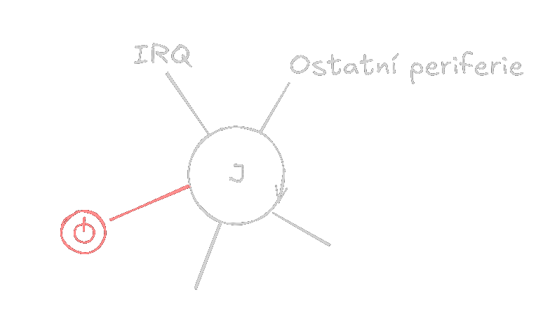

# Operační systémy
## Základní struktura operačních systémů Windows
- Zjednodušená ukázka jádra Windows:
	- 
		- Reaguje pouze na Vypnutí nebo Interupt Request -> `IRQ`
		- Jede v nekonečné smyčce
- Následující zápisky se zakládají na [těchto podkladech](../../1_Rocnik/Operacni_systemy/README.md)