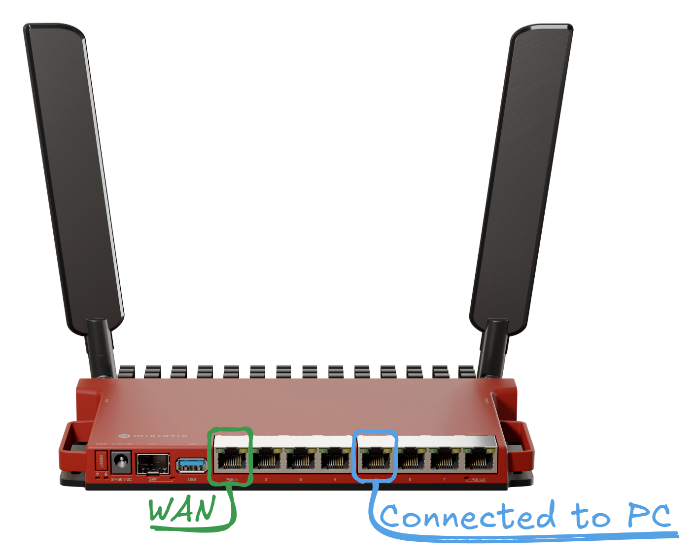
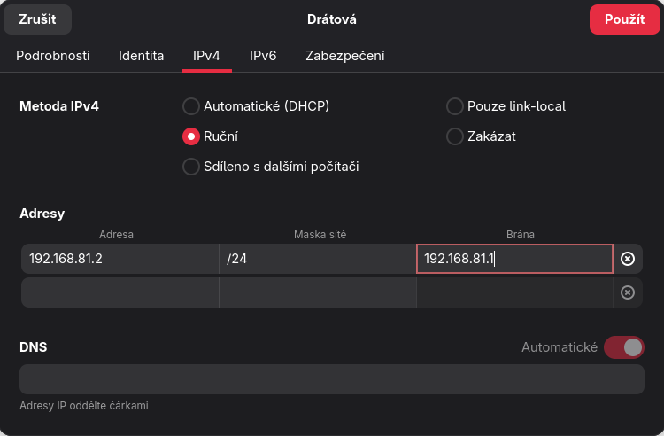
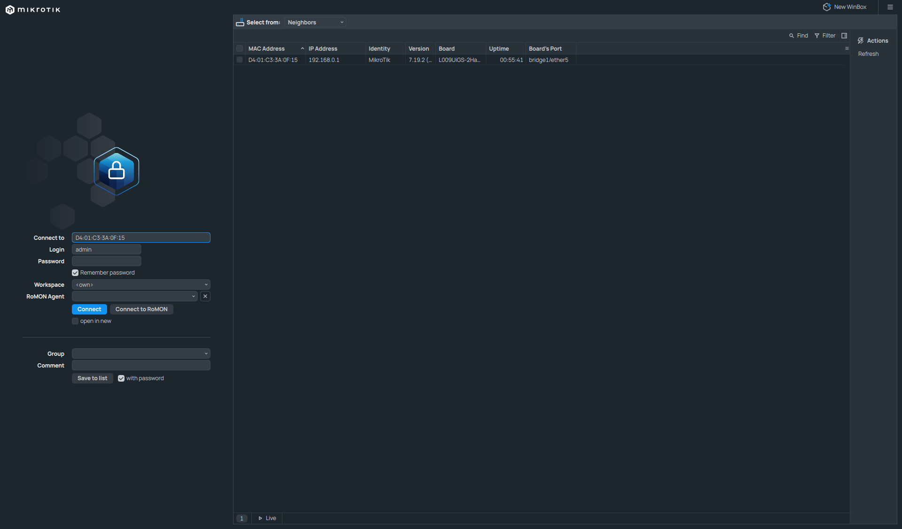
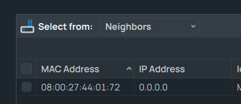
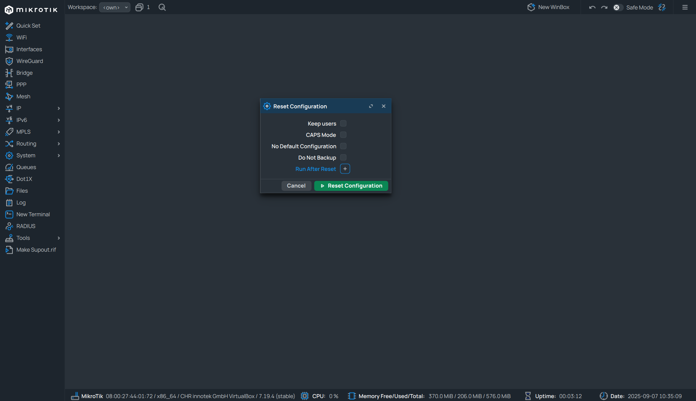

# Příprava Mikrotiku
>[!Note]
>Přípravu Mikrotiku provádíme pro každou ukázku!
## Fyzická příprava Mikrotiku
- K následujícím poznámkám a konfiguracím využíváme převážně [Mikrotik L009UiGS-2HaxD-IN](https://mikrotik.com/product/l009uigs_2haxd_in).

- Zde si ukážeme, jak budeme používat a také zapojovat router

>[!Note]
>Jakékoliv jiné zapojení bude vyznačené v ukázce. Jinak bude použité toto.

---
## Připojení k Mikrotiku
- Před připojením k mikrotiku je doporučené, nastavit si ručně IP adresu na počítači, když router není nakonfigurovaný.

- Jakmile toto máme hotové, můžeme se přesunout do Winboxu.

- Zde se ujistěte že máte vybranou záložku `Neighbors`, aby jste byli schopni vidět router.
 
 - Následně můžeme vybrat router a připojit se k němu!
 >[!Warning]
 >Je důležité kliknout na `MAC Address`, aby jsme se připojovali k routeru pomocí MAC adresy
 >Pokud toto neprovedeme a budeme konfigurovat router skrze IP adresu 0.0.0.0 či IPv6, budeme provádět takzvanou `Shadow Configuration` a změny se nepropíší do routeru!
 >Kontrolu že se připojujeme pomocí MAC adresy si můžeme zkontrolovat v poli `Connect to` v levém sloupci
 
 ---
## Resetování konfigurací na Mikrotiku
 - Resetování konfigurace provádíme, pokud chceme začít nastavovat Mikrotik od znovu
 - Resetování konfigurace můžeme najít v záložce `System > Reset Configuration`

 - Nyní je stačí zvolit, co všechno chceme při restartování konfigurací provést
	- `Keep users` - Nesmaže uživatele ani skupiny, ponechá je s původním nastavením
	- `CAPS Mode` - Spustí _caps-mode_ Skript po resetování (Controlled Access Point) [Více zde](https://help.mikrotik.com/docs/spaces/ROS/pages/1409149/AP+Controller+CAPsMAN)
	- `No Default Configuration` - Zařízení se resetuje, bez základního přednastaveného nastavení, jednotlivá nastavení lze najít [zde](https://help.mikrotik.com/docs/spaces/ROS/pages/167706788/Default+configurations)
	- `Do Not Backup` - Nevytvoří zálohu před resetováním
	- `Run After Reset` - Můžeme spouštět skripta po resetování konfigurace
- Nyní stačí resetovat a chvíli počkat. Následně se můžeme k Mikrotiku zase připojit.