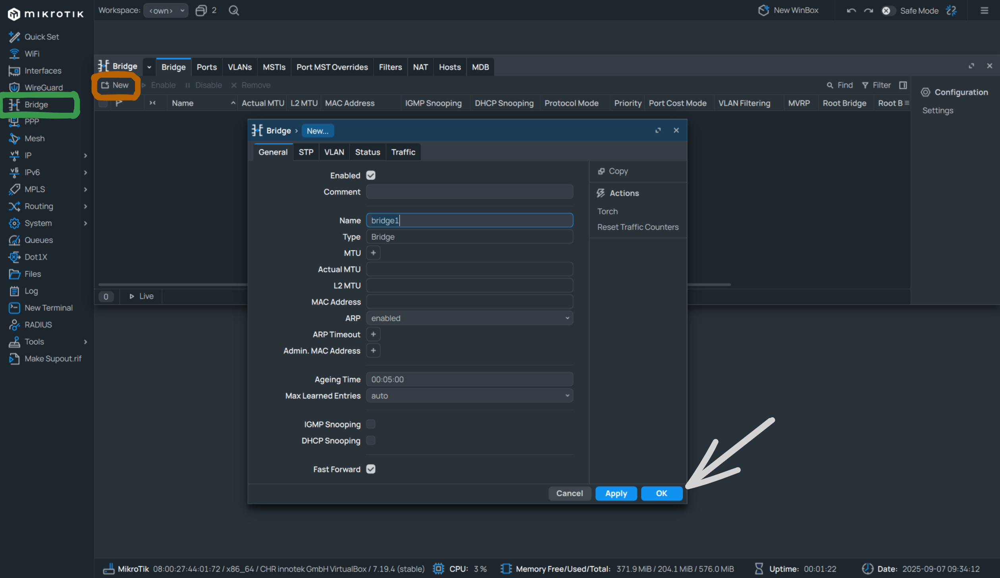
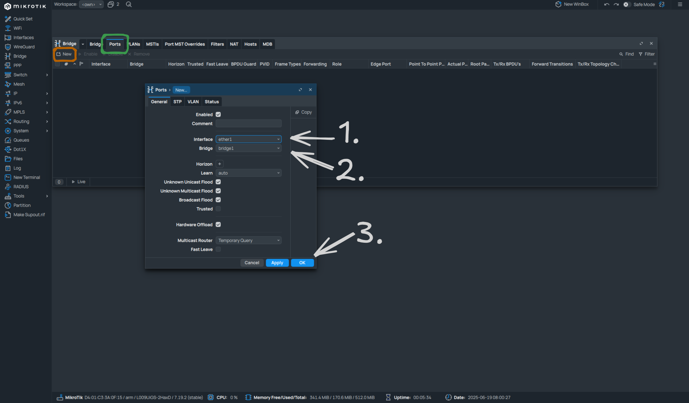
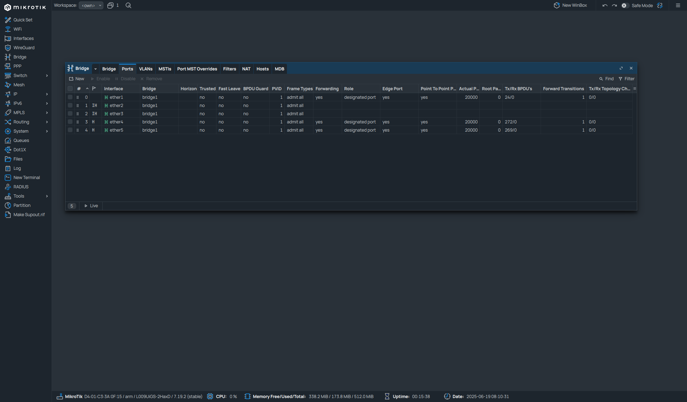
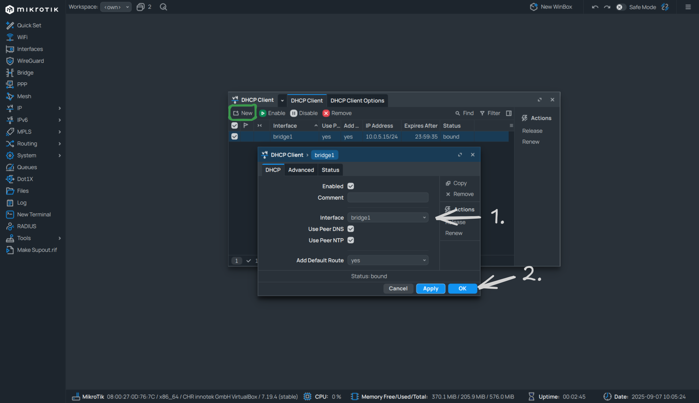
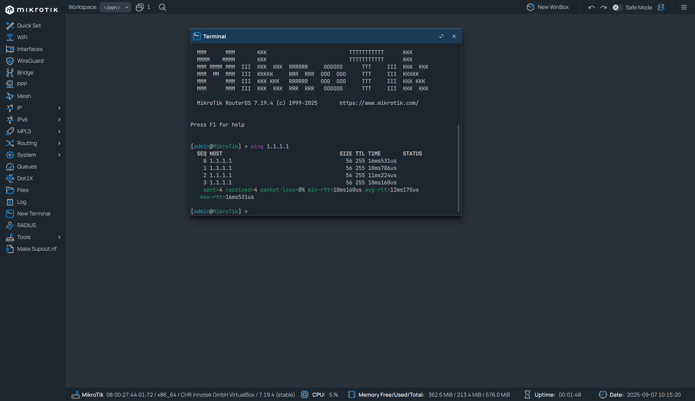

# Nastavení L2 switche
## L2 switch na MikroTiku
- **Bridge** spojuje fyzické porty dohromady a chová se jako klasický switch.
- Rozhoduje na základě **MAC adres** (L2), ne IP adres (L3).
- Ukládá si tabulku MAC adres (CAM table), aby věděl, na který port poslat rámec.
- Broadcasty (např. ARP) se posílají na všechny porty v bridge.
---
### K čemu se používá
- Propojení více zařízení v **jedné síti / broadcast domain**.
- Rozšíření počtu portů v síti (např. když router má jen 1 LAN port).
- Přidání jednoduché **správy** (MikroTik → IP adresa na bridge, monitoring, VLANy, port isolation apod.).
- Vytvoření **VLAN sítí** (pokročilejší scénář).
---
### Výhody
- Levná a univerzální možnost použít MikroTik jako switch.
- Lze využít **pokročilé funkce** – VLANy, filtrování, monitoring, traffic shaping.
- Některé modely podporují **HW offload** → switchování přes ASIC (rychlé, ne přes CPU).
- Možnost **správy přes IP** (pokud si nastavíš adresu mikrotiku).
---
### Nevýhody
- Ne všechny MikroTik modely mají **plnohodnotný HW switch čip** → někdy to jde přes CPU a může být pomalejší.
- Spotřeba energie vyšší než u obyčejného "hloupého" switchu.
- Nastavení je složitější než u plug-and-play switchů.
- Pokud něco špatně nastavíš (např. bridge, firewall), můžeš si omylem odříznout přístup.
---
## Konfigurace Mikrotiku
### Bridge
- Nejdříve začneme tím, že si vytvoříme bridge 

- Záložka `Bridge` je vyznačená **Zelenou barvou**
- Následně se nám otevře nové okno `Bridge` a zde v záložce `Bridge` klikneme na tlačítko `New` vyznačeno **Oranžovou barvou**
- Otevře se nové okno, s jednotlivými nastaveními bridge, zde nic nepotřebujeme měnit, pouze klikneme na tlačítko `Ok`
--- 
#### Přidání portů do bridge
- Nyní potřebujeme přidat jednotlivé ethernet porty do bridge  

 - V okně `Bridge` přepneme na záložku `Ports` (vyznačená  **Zelenou barvou**) a klikneme na `New` tlačítko (vyznačený **Oranžovou barvou**)
 - Nyní se otevře okno pro přidání portů, přidáme postupně všechny porty `ether1` - `ether8` do `bridge1`
 >[!Note]
 >Pro každý port musíme pokaždé kliknout na `New` a poté `Ok`. Nelze přidat všechny porty najednou. 
 
>[!Warning]
>Až přidáme do `bridge1` port, skrze který jsme k Mikrotiku připojený, na chvíli se přeruší spojení s Mikrotikem. Po chvilce by se mělo k Mikrotiku dát zase připojit. 
>

- Nyní by měl list vypadat podobně jako tento (zde máme přidaných pouze 6 portů, ale na funkčnosti to nic nemění)
- Nyní máme vytvořený funkční L2 Switch, ještě zde ale nastavíme DHCP klienta, abychom měli k Mikrotiku přístup i když k němu nejsme fyzicky připojení
	- Např. v budoucnu až budeme potřebovat upravit konfiguraci zadáme do Winboxu IP routeru, aniž bychom k němu potřebovali fyzický přístup
---
### DHCP klient
>[!Warning]
>K tomuto potřebujeme aby v síti byl dostupný DHCP server, jinak Mikrotik nedokáže najít IP adresu a toto nastavení bude zbytečné.
- Nastavení `DHCP Client` nalezneme v záložce `IP > DHCP Client` a otevře se nám nové okno

- Zde klikneme na tlačítko `New` (vyznačené **Zelenou barvou**) a otevře se nám okno s nastavením DHCP klienta, zde nastavíme pouze `Interface` a ten nastavíme na `bridge1`, dále klikneme na tlačítko `Ok`
	- `Interface` nastavujeme na `bridge1` namísto konkrétního portu (např. `ether1`) z dvou důvodů
		1. Nastavujeme vždy na `Master` pokud je port `Slave` (Pokud termíny neznáte, můžete nastudovat [zde](https://en.wikipedia.org/wiki/Master%E2%80%93slave_(technology)#:~:text=Media%20analytics%20company%20Global%20Language%20Monitor%20placed,that%20terminology%20changes%20were%20superficial%20performative%20activism.))
		2. Když máme klienta nastaveného na `bridge1` je jedno na který port zapojíme jaký kabel, dokud ten port je nastavený v `bridge1`

- Nyní funkčnost můžeme vyzkoušet pomocí ping, pokud by DHCP klient nefungoval, hodilo by nám to hlášku `No route to host` či podobnou.