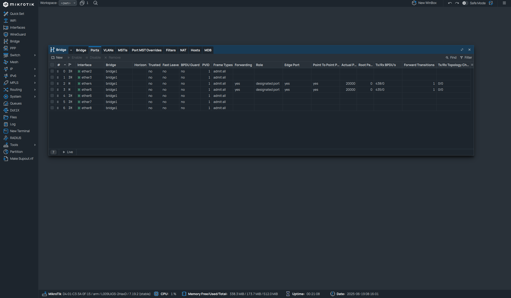
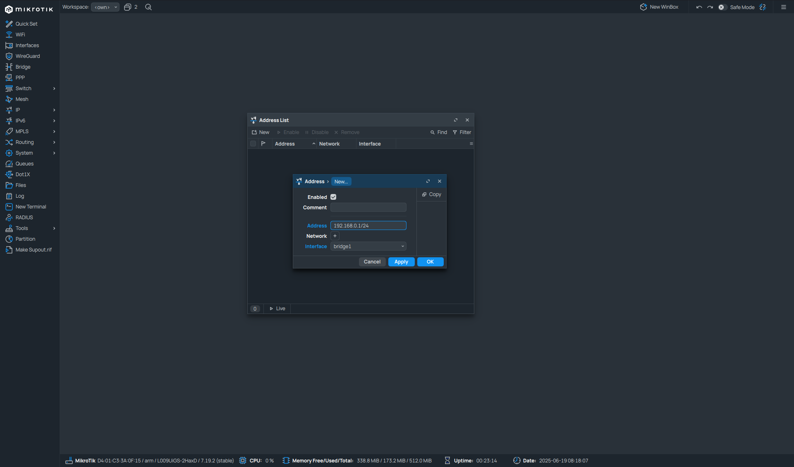

# Nastavení routeru
## Router nastavení na MikroTiku
- **Router** pracuje na síťové vrstvě (L3) – rozhoduje na základě **IP adres**.
- Propojuje různé sítě (např. WAN a LAN) a umožňuje jim mezi sebou komunikovat.
- Může zároveň poskytovat **DHCP server, DNS resolver a NAT (maškarádu)**.
- Firewall filtruje provoz mezi sítěmi.
---
### K čemu se používá
- Připojení lokální sítě k **internetu** (WAN ↔ LAN).
- Oddělení **více sítí / podsítí** a směrování mezi nimi.
- Poskytování služeb jako **DHCP, DNS, NAT, firewall**.
- Možnost vytvoření **VPN, VLAN, QoS, port forwardingu**.
---
### Výhody
- MikroTik jako router zvládne **plnou kontrolu nad sítí**.
- Flexibilní nastavení: NAT, firewall, směrování, VPN, QoS.
- Snadné škálování – můžeš přidávat další sítě a směrovací pravidla.
- Může nahradit dražší enterprise routery za zlomek ceny.
---
### Nevýhody
- Vyšší složitost konfigurace oproti běžným domácím routerům.
- Pokud něco špatně nastavíš (např. firewall nebo NAT), můžeš přijít o přístup do sítě.
- Některé pokročilé funkce vyžadují znalost RouterOS a sítí obecně.
- Výkon záleží na modelu – u slabších MikroTiků může být limitujícím faktorem CPU.
---
## Konfigurace Mikrotiku
- Potřebné informace:
	- Dostaneme/přiřadíme IP na ETH1 (WAN)
	- Budeme mít vlastní switch (ETH2-7)
	- Přiřadíme IP subnet na Bridge (192.168.0.0/24) 
		- Lokální adresa routeru -> 192.168.0.1
	- Nastavit DNS server na 1.1.1.1 a dovolit dotazování routeru na DNS
	- Vlastní DHCP Server, který poběží v LAN
	- Nastavit maškarádu
---
### Bridge a porty
- Bridge a porty nastavíme stejně jako v předchozí [ukázce](02_Nastaveni_L2_switche.md#Bridge), s jediným rozdílem, že vynecháme port `ether1`, který bude sloužit pro WAN

 - Zhruba takto by to mělo vypadat
---
### Nastavení LAN
- zde si ukážeme jednotlivá nastavení pro síť LAN, abychom měli rozdělenou lokální síť od WAN
---
#### IP subnet
- zaprvé, potřebujeme si určit, jaký lokální IP rozsah budeme používat, a jak bude velký
- 

---
#### DNS
---
#### DHCP server
---
#### Maškaráda (Masquerade)
---
### Nastavení IP routeru
---
#### DHCP klient
---
#### Manuální nastavení IP adresy
--- 