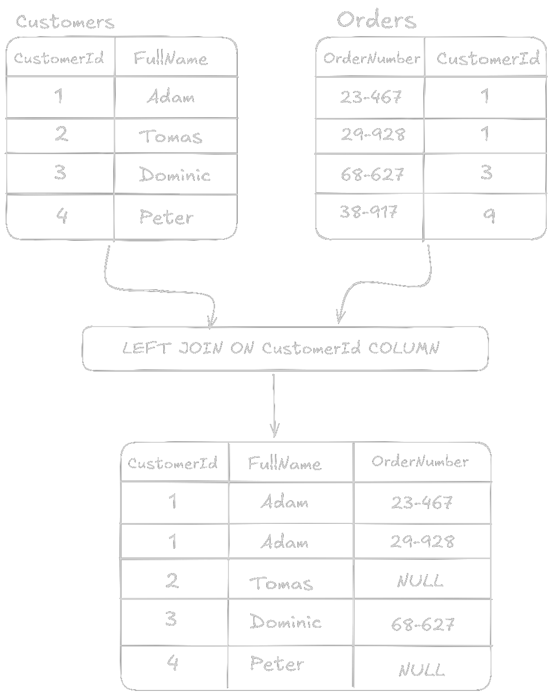
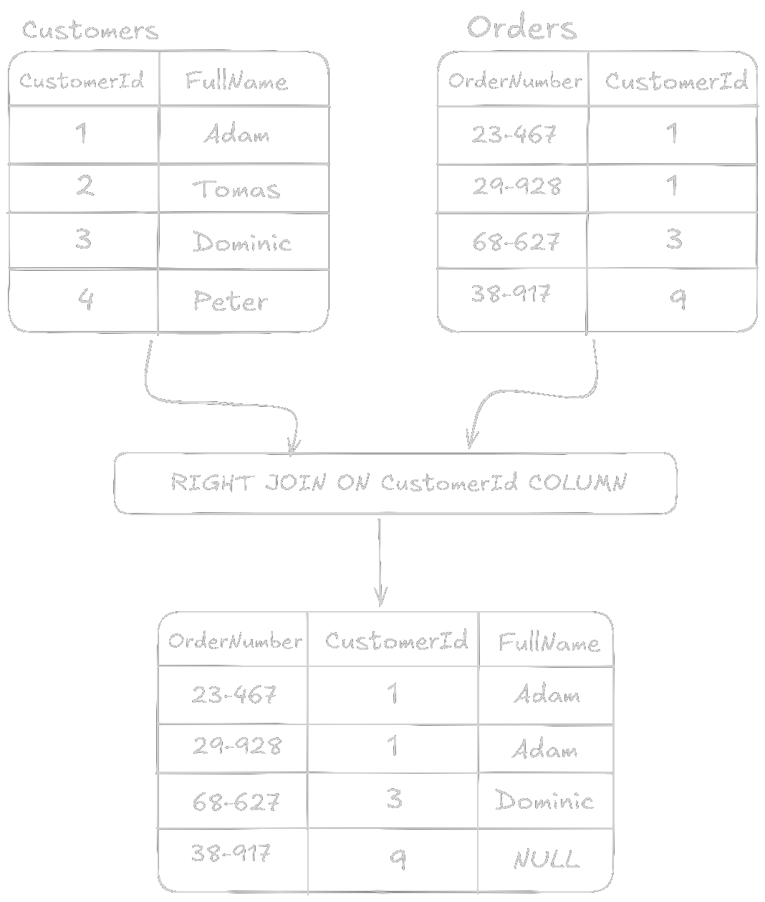
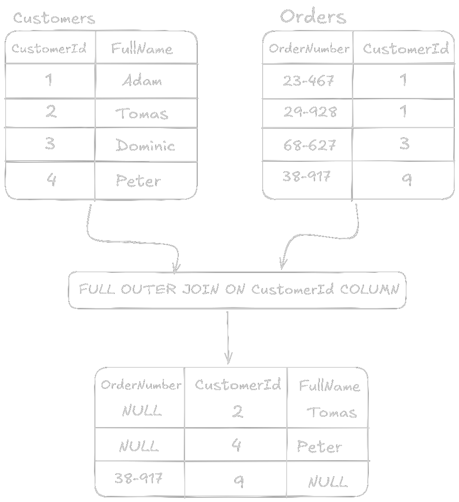
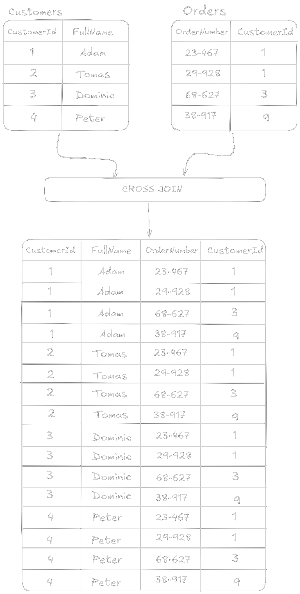

# SQL Server Management Studio
> [!NOTE]
> - Potřeba mít nainstalovaný [SQL Server](https://www.microsoft.com/cs-cz/sql-server/sql-server-downloads) a také [SQL Server Management Studio](https://learn.microsoft.com/en-us/ssms/install/install)
> 	- Pro bezplatnou edici zvolte `SQL Server Express` nebo `SQL Server Developer`
## Databáze
### Vytvoření databáze
```sql
CREATE DATABASE TestDatabase ON(
	FullName = TestDatabase,
	FILENAME = 'C:\Program Files\Microsoft SQL Server\MSSQL16.SQLEXPRESS\MSSQL\DATA\TestDatabase.mdf',
    SIZE = 10,
    MAXSIZE = 50,
    FILEGROWTH = 5
)
LOG ON(
	FullName = TestDatabase_Log,
	FILENAME = 'C:\Program Files\Microsoft SQL Server\MSSQL16.SQLEXPRESS\MSSQL\DATA\TestDatabaseLog.mdf',
    SIZE = 5 MB,
    MAXSIZE = 25 MB,
    FILEGROWTH = 5 MB
);
``` 
- `CREATE DATABASE TestDatabase` založí databázi s názvem `TestDatabase`.
- Sekce `ON` definuje hlavní datový soubor (data + metadata):
	   - `FullName = TestDatabase` je logický název datového souboru.
	    - Důvod proč potřebujeme logický název je spíše z pohledu administrativy. Pokud například potřebujeme dát větší `MAXSIZE` na ukládání dat musíme použít logický název, aby SQL Server věděl který soubor má upravit.
	   - `FILENAME = 'C:\...\TestDatabase.mdf'` je fyzická cesta, kam se uloží soubor databáze (`.mdf`).
	   - `SIZE = 10` je počáteční velikost souboru (výchozí jednotka je MB, pokud není uvedeno jinak).
	   - `MAXSIZE = 50` je maximální velikost souboru (50 MB).
	   - `FILEGROWTH = 5` je pokud dojde místo, soubor se zvětší o 5 MB.
- Sekce `LOG ON` definuje soubor pro transakční log:
    - `FullName = TestDatabase_Log` je logický název logového souboru.
    - `FILENAME = 'C:\...\TestDatabaseLog.mdf'` je fyzická cesta k souboru (obvykle se log ukládá s příponou `.ldf`, ale SQL Server dovolí i `.mdf`).
    - `SIZE = 5 MB` je počáteční velikost logu (5 MB).
    - `MAXSIZE = 25 MB` je maximální velikost logu.
    - `FILEGROWTH = 5 MB` je při zaplnění se log zvětší o 5 MB.
- Ostatní konfigurace databáze můžete najít [zde](https://learn.microsoft.com/en-us/sql/t-sql/statements/create-database-transact-sql?view=sql-server-ver15&preserve-view=true&tabs=sqlpool)
### Zobrazení databází
```sql
SELECT * FROM sys.databases;
```
- Pomocí `sys.databases` získáme seznam všech databází na serveru
- Pokud nás zajímají jen určité vlastnosti databáze, můžeme vybrat konkrétní sloupce, např.:
```sql
SELECT FullName, database_id, create_date FROM sys.databases;
```
- Všechny vlastnosti můžeme nalézt [zde](https://learn.microsoft.com/en-us/sql/relational-databases/system-catalog-views/sys-databases-transact-sql?view=sql-server-ver17) 
### Odstranění databáze
```
DROP DATABASE TestDatabase;
```
- `DROP DATABASE` smaže databázi včetně všech tabulek a dat
	- Pokud databáze běží (např. někdo ji používá), příkaz může selhat
- V případě že chceme donutit ukončení všech spojení:
```sql
ALTER DATABASE TestDatabase SET SINGLE_USER WITH ROLLBACK IMMEDIATE;
DROP DATABASE TestDatabase;
```
### Úprava databáze
```sql
ALTER DATABASE TestDatabase
MODIFY FILE (
	FullName = TestDatabase,
	MAXSIZE = 100MB
);
```
- Pomocí `ALTER DATABASE TestDatabase MODIFY FILE`  můžeme měnit vlastnosti databázových souborů
- V příkladu se zvyšuje maximální velikost datového souboru `TestDatabase` na `100MB`
- Veškeré možnosti upravování databáze jsou [zde](https://learn.microsoft.com/en-us/sql/t-sql/statements/alter-database-transact-sql?view=sql-server-ver17&tabs=sqlpool)
### Použití určité databáze v dotazu
```sql
USE TestDatabase;
```
- Určitou databázi si můžeme vybrat pomocí klíčového slova  `USE` a následně jména databáze
- V jednom dotazu můžeme použít vícero `USE`
> [!warning]
> - Pokud používáme vícero `USE` v jednom dotazu, všechny příkazy pod tímto řádkem se budou provádět na vybrané databázi dokud nebude `USE` použito znova. Toto při neopatrnosti může vést ke smazání důležitých dat. 
## Tabulky
### Vytvoření tabulky
```sql
	CREATE TABLE TestTable(
		Id INT,
		FullName NVARCHAR(100),
		Email NVARCHAR(100),
		Title VARCHAR(10),
	);
```  
- Vytvoření tabulky pomocí `CREATE TABLE` s názvem `TestTable` a sloupci `Id, FullName, Email, Title` s jednotlivými datovými typy
	- `PRIMARY KEY` je použit aby se v sloupci `Id` neobjevili dvě stejné hodnoty
	- Datové typy můžeme najít [zde](https://learn.microsoft.com/en-us/sql/t-sql/data-types/data-types-transact-sql?view=sql-server-ver17)
### Odstranění tabulky
```sql
DROP TABLE TestTable;
```
- `DROP TABLE` trvale smaže tabulku včetně všech uložených dat
- Nelze vrátit zpět, proto je vhodné být velmi opatrný
### Upravení sloupců v existující tabulce
#### Přidání sloupce do existující tabulky
```sql
ALTER TABLE TestTable ADD Phone VARCHAR(20);
```
- Pomocí `ALTER TABLE TestTable ADD` přidáme nový sloupec do tabulky
- V tomto případě nový sloupec `Phone` typu `VARCHAR`
#### Upravení existujícího sloupce v tabulce
```sql
ALTER TABLE TestTable ALTER COLUMN FullName NVARCHAR(150) NOT NULL;
```
- `ALTER COLUMN` umožňuje změnit datový typ nebo vlastnosti sloupce
- V příkladu se zvětší délka sloupce `Jmeno` na 150 znaků a nastaví se jako `NOT NULL`
#### Odstranění sloupce v existující tabulce
```sql
ALTER TABLE TestTable DROP COLUMN Titul;
```
- `DROP COLUMN` smaže sloupec z tabulky
- Pokud je sloupec součástí indexu nebo klíče, nejdříve je nutné odstranit tato omezení
### Klíče a omezení
#### Primary Key
```sql
CREATE TABLE TestTable(
		Id INT PRIMARY KEY,
		FullName NVARCHAR(100),
		Email NVARCHAR(100),
		Title VARCHAR(10),
	);
```
- `PRIMARY KEY` slouží k jednoznačné identifikaci řádku v tabulce    
- V jedné tabulce může být vždy pouze **jeden primární klíč** (může být složený i z více sloupců)
- `PRIMARY KEY` automaticky vytváří **clustered index**, pokud už v tabulce žádný není
#### Forgein Key
```sql
CREATE TABLE Orders(
	Id INT PRIMARY KEY IDENTITY(1,1),
	OrderNumber NVARCHAR(50),
	CustomerId INT FOREIGN KEY REFERENCES TestTable(Id) 
);
```
- `FOREIGN KEY` vytváří vztah mezi dvěma tabulkami
- Zajišťuje referenční integritu = do `CustomerId` lze vložit jen hodnotu, která existuje v `TestTable(Id)`
- Pokud se smaže zákazník, u kterého jsou objednávky, pokus o smazání skončí chybou (lze nastavit i chování ON DELETE / ON UPDATE – např. `CASCADE`)
#### Unique
```sql
CREATE TABLE TestTable(
	Id INT PRIMARY KEY IDENTITY(1,1),
	FullName NVARCHAR(100),
	Email NVARCHAR(100) UNIQUE,
	Title VARCHAR(10),
);
```
- `UNIQUE` zajišťuje, že v daném sloupci nebude duplicitní hodnota
- Na rozdíl od `PRIMARY KEY` lze v tabulce mít více `UNIQUE` omezení
- `UNIQUE` umožňuje i `NULL` hodnoty (ale jen jednu `NULL` u každého sloupce)
#### Check
```sql
CREATE TABLE TestTable(
	Id INT PRIMARY KEY IDENTITY(1,1),
	FullName NVARCHAR(100),
	Age INT CHECK (Age >= 18),
	Email NVARCHAR(100),
	Title VARCHAR(10),
);
```
- `CHECK` omezuje možné hodnoty, které lze do sloupce vložit
- V příkladu lze vložit jen věk větší nebo rovný 18 let
- Podmínka se zapisuje podobně jako ve `WHERE` klauzuli
#### Default
```sql
CREATE TABLE TestTable(
	Id INT PRIMARY KEY IDENTITY(1,1),
	FullName NVARCHAR(100),
	Email NVARCHAR(100),
	IsActive BIT DEFAULT 1,
	CreatedAt DATETIME DEFAULT GETDATE()
);
```
- `DEFAULT` nastaví výchozí hodnotu, pokud není při vkládání specifikována
- V příkladu:
    - `IsActive` má výchozí hodnotu `1` (TRUE)
    - `CreatedAt` se automaticky nastaví na aktuální datum a čas (`GETDATE()`)
#### Auto-Increment
```sql
CREATE TABLE TestTable(
		Id INT PRIMARY KEY IDENTITY(1,1),
		FullName NVARCHAR(100),
		Email NVARCHAR(100),
		Title VARCHAR(10),
	);
```
- - Automatické inkrementování pomocí `IDENTITY`
    - První hodnota = počáteční hodnota (např. `1`)
    - Druhá hodnota = o kolik se hodnota zvětšuje při každém novém záznamu (např. `1`)
- V příkladu se `Id` začne od 1 a pro každý další řádek se navýší o 1
#### Null hodnoty
```sql
CREATE TABLE TestTable(
		Id INT PRIMARY KEY IDENTITY(1,1),
		FullName NVARCHAR(100) NOT NULL,
		Email NVARCHAR(100) NOT NULL,
		Title VARCHAR(10) NULL,
	);
``` 
- Pomocí `NULL` a boolean operátoru `NOT` dokážeme specifikovat, kde hodnoty při vkládání být musí a kde hodnota může být `NULL`
	- Pokud se pokusíme vložit `NULL` hodnotu do `NOT NULL` sloupce hodí nám to chybu podobné této 
```bash 
Cannot insert the value NULL into column 'Email', table 'master.dbo.TestTable'; column does not allow nulls. INSERT fails.
```
## Indexy
### Rychlost vyhledávání s indexem
- Bez indexu → SQL Server musí udělat **full table scan** (prohlédnout všechny řádky v tabulce).
    - Časová složitost je zhruba **O(n)** (lineárně k počtu řádků).
    - Na tabulce o 1 000 000 řádcích může `SELECT` s podmínkou trvat stovky ms až sekundy, podle HW a velikosti záznamů.
- S indexem → SQL Server používá **B-tree index** (vyvážený strom).
    - Časová složitost vyhledání je přibližně **O(log n)**.
    - Na 1 000 000 řádcích to znamená jen cca 20 kroků (log₂(1 000 000) ≈ 20).
    - Výsledkem je, že `SELECT` se stejnou podmínkou může být **řádově 10× až 100× rychlejší**.
- příklad:
	- Bez indexu: SELECT s `WHERE Email = '...'` na 10M záznamech → třeba **2–3 sekundy**.
	- S indexem: stejný dotaz → **< 100 ms**.
### Rychlost zápisu (INSERT/UPDATE/DELETE) s indexem
- Každý index je potřeba **udržovat aktuální**.
- To znamená, že při vložení nebo změně řádku musí SQL Server:
    1. zapsat data do tabulky,
    2. a navíc aktualizovat všechny příslušné indexy.
- Pokud má tabulka **1–2 indexy**, zpomalení zápisu je malé (jednotky %).
- Pokud má tabulka **10+ indexů**, zpomalení zápisu už může být znatelné (klidně 30–50 %).
- příklad:
	- `INSERT` 1M řádků do tabulky bez indexů → **5 sekund**.
	- `INSERT` 1M řádků do tabulky se 3 indexy → **7–8 sekund**.
	- `INSERT` 1M řádků do tabulky s 10 indexy → **12–15 sekund**.
### Vytvoření indexu
```sql
CREATE INDEX IX_TestTable_Email ON TestTable(Email);
CREATE UNIQUE INDEX IX_TestTable_FullName ON TestTable(FullName);
```
- `CREATE INDEX` vytvoří index nad sloupcem (nebo více sloupci), který urychluje vyhledávání dat.
- `IX_TestTable_Email` vytvoří klasický index nad sloupcem `Email`.
- `CREATE UNIQUE INDEX` zajistí, že se ve sloupci nebudou opakovat stejné hodnoty.
- Indexy zrychlují `SELECT`, ale zpomalují `INSERT`, `UPDATE` a `DELETE`, protože se musí index udržovat.
- Další detaily najdete [zde](https://learn.microsoft.com/en-us/sql/t-sql/statements/create-index-transact-sql?view=sql-server-ver17).
### Odstranění indexu
```sql
DROP INDEX IX_TestTable_Email ON TestTable;
```
- `DROP INDEX` smaže index z tabulky.
## Záznamy
### Vložení nového řádku do tabulky
```sql
	INSERT INTO TestTable(FullName, Email, Title) VALUES 
	('Jan Novak','jannovak@email.com','Mgr.'),
	('Pepa Novak','jannovak@email.com','Bc.'),
	('Josef Holý','jannovak@email.com', null);
```  
- Vložení nového řádku pomocí `INSERT INTO` do tabulky `TestTable` s vyplněnými sloupci a jejich hodnotami `VALUES`
### Zobrazení obsahu
```sql
SELECT * FROM TestTable;
SELECT TestTable.FullName, TestTable.Title FROM TestTable WHERE TestTable.Id = 1;
``` 
- Získání `SELECT`, všech záznamů `*`, z tabulky `FROM TestTable`
- Získání `SELECT`, jména `TestTable.FullName` a třídy `TestTable.Title`, z tabulky `FROM TestTable`, kde `WHERE` je id 1 `TestTable.Id = 1`
### Update záznamu
```sql
UPDATE TestTable SET Title = 'Ing.' WHERE FullName = 'Pepa';
UPDATE TestTable SET Title = 'Bc.', FullName  = 'Josef Krásný' WHERE Id = 3;
```
- Update vlastnosti  záznamů `Title` na hodnotu `Ing.`, kde  `FullName` záznamu v tabulce `TestTable` je `Pepa`
	- Toto vede k tomu, že každý záznam kde je `FullName` Pepa bude `Title` nastaveno na `Ing.`
- Update dvou vlastností  záznamu `Title` a `FullName` na hodnoty `Bc.` a `Josef Krásný`, kde  `Id` záznamu v tabulce `TestTable` je rovno `3`
### Odstranění záznamu
```sql
DELETE * FROM TestTable;
DELETE FROM TestTable WHERE Id > 3;
```
- `DELETE FROM TestTable;` smaže všechny záznamy z tabulky (tabulka zůstane prázdná)
- `DELETE FROM TestTable WHERE Id > 3;` smaže jen vybrané záznamy podle podmínky `WHERE`
## Join a vztahy mezi tabulky

### Inner join

- Struktura dotazu:
```sql
SELECT * FROM Customers INNER JOIN Orders 
ON Customers.CustomerId = Orders.CustomerId;
```
- 
### Left join / Right join
#### Left join


Struktura dotazu:
```sql
SELECT * 
FROM Customers 
LEFT JOIN Orders 
    ON Customers.CustomerId = Orders.CustomerId;
```
- Vrátí všechny záznamy z tabulky `Customers` (levá tabulka).
- Pokud existuje odpovídající záznam, odpovídající podmínce, v tabulce `Orders`, spáruje ho.
- Pokud neexistuje, do sloupců z tabulky `Orders` se vloží `NULL`.
#### Left outer join

Struktura dotazu:
```sql
SELECT * 
FROM Customers 
LEFT OUTER JOIN Orders 
    ON Customers.CustomerId = Orders.CustomerId
    WHERE Orders.CustomerId IS NULL;
```
Nebo
```sql
SELECT * 
FROM Customers 
LEFT JOIN Orders 
    ON Customers.CustomerId = Orders.CustomerId
    WHERE Orders.CustomerId IS NULL;
```
- `LEFT OUTER JOIN` je v pouhém jednoduchém zápisu totéž co `LEFT JOIN`.
- Klíčové slovo `OUTER` je volitelné a nemá žádný vliv na výsledek – používá se jen pro čitelnost.
- Proto pro logiku `LEFT OUTER JOIN` potřebujeme přidat podmínku `WHERE Orders.CustomerId IS NULL` pro vyfiltrování hodnot co se nenachází v druhé tabulce
#### Right join

#### Right outer join

### Full join
#### Full join

#### Full Outer join

### Cross join

### Algorithmy vykonávání join
#### Nested loops join
#### Merge join
#### Hash join
#### Adaptive join
## Agregace
## Transakce
## Views
## Funkce a Stored Procedury
## Triggery
## Uživatelé a oprávnění