# Datové struktury 
## 1 Základy datových struktur
### 1.1 Co to je?
- **Datové struktury** jsou způsoby, jak **organizovat a ukládat data v paměti**, aby s nimi program dokázal efektivně pracovat. (**volba správné struktury často rozhoduje o rychlosti programu**)
- Pomáhají řešit:
	- jak rychle data **najít**,
	- jak je **ukládat**,
	- jak je **mazat**,
	- jak k nim **přistupovat**,
	- jak je **organizovat** do složitějších celků.
>[!Warning]
>- DATOVÉ STRUKTURY NEJSOU DATOVÉ TYPY!!!
>- Rozdíl mezi datovým typem a datovou strukturou: 
>	- **Datový typ**: určuje, jaký druh hodnoty proměnná nese (int, bool, string…).
>	- **Datová struktura**: určuje, **jak jsou data organizována** (pole, seznam, strom…).  
>- Datové struktury tedy _využívají datové typy_, ale nejsou totéž.

---
### 1.2 Proč jsou důležité?
- Správná datová struktura umožňuje rychlejší a efektivnější práci s daty.  
- Zlepšuje výkon programu, snižuje paměťovou náročnost a umožňuje psát přehlednější kód.
- Datové struktury a algoritmy (DSA) se používají prakticky ve všech softwarových systémech, od operačních systémů po webové aplikace: 
	- Pro správu velkého množství dat, například v sociálních sítích nebo vyhledávačích. 
	- Pro plánování úkolů, aby se rozhodlo, který úkol má počítač provést jako první. 
	- Pro plánování tras, například v systému GPS, aby se našla nejkratší cesta z bodu A do bodu B. 
	- Pro optimalizaci procesů, například pro uspořádání úkolů tak, aby mohly být dokončeny co nejrychleji. 
	- Pro řešení složitých problémů: od nalezení nejlepšího způsobu naložení nákladního vozu po to, aby se počítač „učil“ z dat. 
- DSA je zásadní téměř ve všech oblastech softwarového světa: 
	- Operační systémy 
	- Databázové systémy 
	- Webové aplikace 
	- Strojové učení 
	- Videohry 
	- Kryptografické systémy 
	- Analýza dat 
	- Vyhledávače
---
### 1.3 Jak souvisí s algoritmy?
- Datové struktury a algoritmy (DSA) jdou ruku v ruce a navzájem se doplňují. 
- Datová struktura nemá velkou hodnotu, pokud ji nelze prohledávat nebo s ní efektivně manipulovat pomocí algoritmů, a algoritmy nemají velkou hodnotu bez datové struktury, na které mohou pracovat. 
- DSA se zabývá hledáním efektivních způsobů ukládání a načítání dat, prováděním operací s daty a řešením konkrétních problémů. 
- Porozuměním DSA můžete: 
	- Rozhodnout, která datová struktura nebo algoritmus je pro danou situaci nejvhodnější. 
	- Vytvářet programy, které běží rychleji nebo používají méně paměti. 
	- Porozumět tomu, jak přistupovat ke složitým problémům a řešit je systematickým způsobem.
---
### 1.4 Vysvětlivky jednotlivých pojmů

| Termín                                 | Popis                                                                                                                                                                                             |
| -------------------------------------- | ------------------------------------------------------------------------------------------------------------------------------------------------------------------------------------------------- |
| Algoritmus                             | Soubor podrobných pokynů k řešení konkrétního problému.                                                                                                                                           |
| Datová struktura                       | Způsob organizace dat tak, aby je bylo možné efektivně využívat. Mezi běžné datové struktury patří pole, spojené seznamy a binární stromy.                                                        |
| Časová složitost                       | Míra času, který algoritmus potřebuje k provedení, v závislosti na množství dat, se kterými algoritmus pracuje.                                                                                   |
| Paměťová složitost                     | Míra množství paměti, kterou algoritmus používá, v závislosti na množství dat, se kterými algoritmus pracuje.                                                                                     |
| Notace Big O                           | Matematická notace, která popisuje mezní chování funkce, když se argument blíží určité hodnotě nebo nekonečnu. Používá se k popisu časové složitosti algoritmu.                                   |
| Rekurze                                | Programovací technika, při které funkce volá sama sebe.                                                                                                                                           |
| Rozděl a panuj<br>(Divide and Conquer) | Metoda řešení složitých problémů jejich rozdělením na menší, lépe zvládnutelné dílčí problémy, jejich vyřešením a kombinací řešení. Při použití této metody v algoritmu se často používá rekurze. |
| Brute Force                            | Jednoduchý a přímý způsob, jakým může algoritmus fungovat, a to tak, že jednoduše vyzkouší všechna možná řešení a poté vybere to nejlepší.                                                        |

---
### 1.5 Rozdělení datových struktur
- Může být dělení podle více hledisek, ale nejčastěji je:
	- **Lineární datové struktury**
		- Pole (Array)
		- Propojený seznam (Linked list)
		- Zásobník (Stack)
		- Fronta (Queue)
	- **Nelineární datové struktury**
		- Stromy (Trees, Binary trees)
		- Grafy (Graphs)
	- **Hashové struktury**
		- Hash tabulka / mapa
---
## 2 Popis jednotlivých struktur
### 2.1 Pole (Array)
#### 2.1.1 Popis
- Pole je datová struktura používaná k ukládání více prvků stejného typu.
	- Za pole bereme i **seznam (List), který nepoužívá ukazatele na další prvek** (na rozdíl od propojeného seznamu – Linked List). List je ve většině jazyků označení pro **dynamické pole**.
- Pole jsou indexovaná, což znamená, že každý prvek má číslo (index), podle kterého lze k prvku přistupovat.
- Většina programovacích jazyků (Python, Java, C, C#) používá **indexování od nuly**, tedy první prvek má index 0.
- Tradiční pole mají **pevnou velikost**, kterou je nutné určit při vytvoření.
- Některé jazyky poskytují **dynamické varianty polí** (např. C# `List<T>`, Java `ArrayList` nebo Python `list`), které se automaticky zvětšují podle potřeby.
	- **Jak funguje dynamické pole „pod kapotou“:**
		- Interně je dynamické pole **běžné pole** v paměti. 
		- Když přidáš nový prvek a pole je plné:
		    1. Vytvoří se **nové větší pole** (typicky dvojnásobné velikosti).
		    2. **Staré prvky se překopírují** do nového pole.
			    - zde je slovo "překopírují" ne vždy pravdivé, z důvodu optimalizace se nejdříve systém pokusí **rozšířit pole na místě**, pokud je v paměti dostupný dostatečně velký prostor
			    - teprve až když v paměti nebude dostatek prostoru, se pole překopíruje na nové místo v paměti kde je dostatek místa
		    3. Staré pole se uvolní a nový prvek se přidá.
		- Toto zajišťuje, že průměrná složitost přidání je **amortizovaně O(1)**.
		- Pro uživatele je toto proces **transparentní**, volá se jen `Add()` a indexování funguje stále O(1).
---
#### 2.1.2 Výhody
- Rychlý přístup O(1)
- Jednoduchá implementace
---
#### 2.1.3 Nevýhody
- Pevná velikost (u tradičních polí)
- Pomalé vkládání/mazání uprostřed
---
#### 2.1.4 Použití  
- Matice, databáze, seznamy známé dopředu
---
#### 2.1.5 Příklad
```csharp
// Tradiční pole v C#
int[] pole = {1, 2, 3, 4};
Console.WriteLine(pole[2]); // 3

// Dynamické pole v C#
List<int> list = new List<int>();
list.Add(1);
list.Add(2);
list.Add(3); // pole se automaticky zvětší, pokud je plné
Console.WriteLine(list[1]); // 2

// Interní mechanismus dynamického pole (jednoduchá ilustrace)
void Add(T item)
{
    if(_count == _items.Length) // pole je plné
    {
        T[] newArray = new T[_items.Length * 2]; // vytvoří se větší pole
        Array.Copy(_items, newArray, _items.Length); // překopírují se prvky
        _items = newArray; // nové pole nahradí staré
    }
    _items[_count] = item;
    _count++;
}
```
---
### 2.2 Propojený seznam (Linked List)
#### 2.2.1 Popis
- Propojený seznam je, jak již název napovídá, seznam, ve kterém jsou uzly propojeny. Každý uzel obsahuje data a ukazatel. 
- Propojení je realizováno tak, že každý uzel ukazuje na místo v paměti, kde je umístěn další uzel.
- 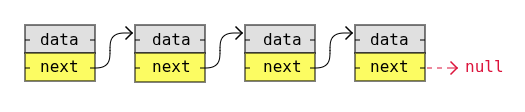
- Velkou výhodou používání propojených seznamů je to, že uzly jsou ukládány kdekoli, kde je v paměti volné místo, a nemusí být ukládány souvisle za sebou, jako je tomu u prvků v polích. 
- Další výhodou propojených seznamů je to, že při přidávání nebo odebírání uzlů nemusí být ostatní uzly v seznamu posunovány.
---
##### 2.2.1.1 Rozdíl mezi polem a propojeným seznamem
- Nejjednodušší způsob, jak porozumět propojeným seznamům, je možná jejich porovnání s poli.
- Propojené seznamy se skládají z uzlů a jsou lineární datovou strukturou, kterou si vytváříme sami, na rozdíl od polí, která jsou existující datovou strukturou v programovacím jazyce, kterou můžeme použít.
- Uzly v propojeném seznamu ukládají odkazy na jiné uzly, ale prvky pole nemusí ukládat odkazy na jiné prvky.
- Níže uvedená tabulka porovnává spojené seznamy s poli, aby bylo lépe pochopitelné, co spojené seznamy jsou.

| Vlastnost                                                                                | Pole       | Propojený seznam |
| ---------------------------------------------------------------------------------------- | ---------- | ---------------- |
| Existující datová struktura v programovacím jazyce                                       | Ano        | Ne               |
| Pevná velikost v paměti                                                                  | Ano (i ne) | Ne               |
| Prvky nebo uzly jsou uloženy v paměti hned za sebou (kontinuálně)                        | Ano        | Ne               |
| Nízká spotřeba paměti<br>(každý uzel obsahuje pouze data, žádné odkazy na jiné uzly)     | Ano        | Ne               |
| Prvky nebo uzly jsou uloženy v paměti hned za sebou (kontinuálně)                        | Ano        | Ne               |
| K prvkům nebo uzlům lze přistupovat přímo (náhodný přístup)                              | Ano        | Ne               |
| Prvky nebo uzly lze vkládat nebo mazat v konstantním čase, bez nutnosti posunů v paměti. | Ne         | Ano              |
- Abychom tyto rozdíly vysvětlili podrobněji, zaměříme se na to, jak jsou spojené seznamy a pole uloženy v paměti.
---
##### 2.2.1.2 Ukládání v paměti
###### Proměnné v paměti
- Představme si, že chceme uložit celé číslo „17“ do proměnné `myNumber`. 
- Pro zjednodušení předpokládejme, že celé číslo je uloženo jako dva bajty (16 bitů) a adresa v paměti pro `myNumber` je `0x7F25`. 
- `0x7F25` je ve skutečnosti adresa prvního ze dvou bajtů paměti, kde je uložena celočíselná hodnota `myNumber`. 
- Když počítač přejde na adresu `0x7F25`, aby přečetl celočíselnou hodnotu, ví, že musí přečíst první i druhý bajt, protože celá čísla jsou na tomto konkrétním počítači dvoubajtová. 
- Níže uvedený obrázek ukazuje, jak je proměnná `myNumber = 17` uložena v paměti.
- 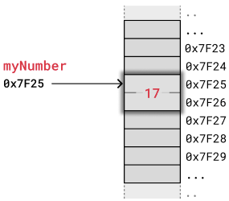
- Výše uvedený příklad ukazuje, jak je celočíselná hodnota uložena na jednoduchém, ale populárním, mikrokontroléru Arduino Uno. 
- Tento mikrokontrolér má 8 bitovou architekturu s 16 bitovou adresovou sběrnicí a používá dva bajty pro celá čísla a dva bajty pro adresy paměti. 
- Pro srovnání, osobní počítače a chytré telefony používají 32 nebo 64 bitů pro celá čísla a adresy, ale paměť funguje v zásadě stejným způsobem.
---
###### Pole v paměti
- Pro pochopení propojených seznamů je užitečné nejprve vědět, jak jsou pole uložena v paměti.
- Prvky v poli jsou uloženy souvisle v paměti. To znamená, že každý prvek je uložen hned za předchozím prvkem.
- Níže uvedený obrázek ukazuje, jak je pole celých čísel `myArray = [3,5,13,2]` uloženo v paměti. 
- Pro lepší představu používáme jednoduchý typ paměti s dvěma bajty pro každé celé číslo, stejně jako v předchozím příkladu.
- 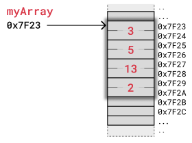
- Počítač má pouze adresu prvního bajtu `myArray`, takže pro přístup k třetímu prvku pomocí kódu `myArray[2]` počítač začíná na adrese `0x7F23` a přeskočí první dvě celá čísla. 
- Počítač ví, že celé číslo je uloženo ve dvou bajtech, takže od adresy `0x7F23` přeskočí 2x2 bajty dopředu a přečte hodnotu 13 začínající na adrese `0x7F27`.
- Při odstraňování nebo vkládání prvků do pole musí být každý následující prvek buď posunut nahoru, aby se vytvořilo místo pro nový prvek, nebo posunut dolů, aby zaujal místo odstraněného prvku. 
- Takové posunovací operace jsou časově náročné a mohou způsobit problémy například v reálných systémech.
- Níže uvedený obrázek ukazuje, jak se prvky posouvají, když je odstraněn prvek pole.
- 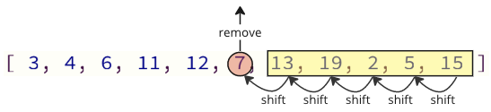
- Manipulace s poli je také něco, na co musíte myslet, pokud programujete v jazyce C, kde musíte při vkládání nebo odstraňování prvku explicitně přesouvat ostatní prvky. V jazyce C se to neděje na pozadí.
- V jazyce C musíte také zajistit, abyste pro pole přidělili dostatek místa, abyste mohli později přidávat další prvky.
---
###### Propojený seznam v paměti
- Místo ukládání souboru dat jako pole můžeme vytvořit propojený seznam.
- Propojené seznamy se používají v mnoha scénářích, například pro dynamické ukládání dat, implementaci zásobníku a fronty nebo grafické znázornění, abychom jmenovali alespoň některé.
- Propojený seznam se skládá z uzlů s určitým druhem dat a alespoň jednoho ukazatele nebo odkazu na jiné uzly.
- Velkou výhodou používání propojených seznamů je to, že uzly jsou uloženy kdekoli, kde je volné místo v paměti, a nemusí být uloženy souvisle za sebou, jako jsou prvky uložené v polích. 
- Další výhodou propojených seznamů je to, že při přidávání nebo odebírání uzlů nemusí být ostatní uzly v seznamu posunuty.
- Níže uvedený obrázek ukazuje, jak může být propojený seznam uložen v paměti.
- Propojený seznam má čtyři uzly s hodnotami 3, 5, 13 a 2 a každý uzel má ukazatel na další uzel v seznamu.
- 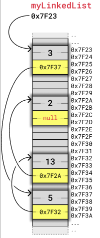
- Každý uzel zabírá čtyři bajty. 
	- Dva bajty se používají k uložení celé číslo a dva bajty se používají k uložení adresy dalšího uzlu v seznamu. 
- Jak již bylo zmíněno, počet bajtů potřebných k uložení celých čísel a adres závisí na architektuře počítače. 
- Tento příklad, stejně jako předchozí příklad s polem, odpovídá jednoduché 8 bitové architektuře mikrokontroléru.
- Abychom lépe pochopili, jak jsou uzly vzájemně propojeny, zobrazíme uzly v propojeném seznamu jednodušším způsobem, který méně souvisí s jejich umístěním v paměti, jak je znázorněno na obrázku níže:
- 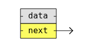
- Pokud spojíme stejné čtyři uzly z předchozího příkladu pomocí této nové vizualizace, vypadá to takto:
- 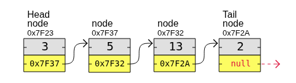
- Jak vidíte, první uzel v propojeném seznamu se nazývá „Head“ a poslední uzel se nazývá „Tail“.
- Na rozdíl od polí nejsou uzly v propojeném seznamu v paměti umístěny přímo za sebou. To znamená, že při vkládání nebo odebírání uzlu není nutné posouvat ostatní uzly, což je výhodné.
- Nevýhodou spojovaných seznamů je, že k uzlu nemůžeme přistupovat přímo, jako je tomu u pole, kde stačí například napsat `myArray[5]`. 
- Abychom se dostali k uzlu číslo 5 ve spojovaném seznamu, musíme začít u prvního uzlu zvaného „hlava“, použít ukazatel tohoto uzlu k přechodu na další uzel a přitom sledovat počet uzlů, které jsme navštívili, až se dostaneme k uzlu číslo 5.
- Studium propojených seznamů nám pomáhá lépe porozumět pojmům, jako je alokace paměti a ukazatele.
- Propojené seznamy je také důležité pochopit předtím, než se začneme učit složitější datové struktury, jako jsou stromy a grafy, které lze implementovat pomocí propojených seznamů.
---
#### 2.2.2 Typy propojených seznamů
- Existují tři základní formy propojených seznamů:
	1. Jednoduše propojené seznamy
	2. Dvojitě propojené seznamy
	3. Kruhové propojené seznamy
---
- Jednoduše propojený seznam je nejjednodušší typ propojených seznamů. Zabírá méně místa v paměti, protože každý uzel má pouze jednu adresu k dalšímu uzlu, jak je znázorněno na obrázku níže.
- 
---
- Dvojitě propojený seznam má uzly s adresami jak předchozího, tak následujícího uzlu, jak je znázorněno na obrázku níže, a proto zabírá více paměti. 
- Dvojitě propojené seznamy jsou však vhodné, pokud chcete mít možnost pohybovat se v seznamu nahoru i dolů.
- 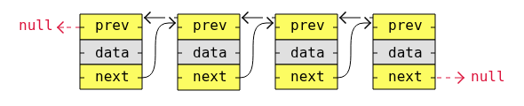
---
- Kruhový spojovaný seznam je podobný jednoduchému nebo dvojitému spojovanému seznamu, kde je první uzel, „hlava“, a poslední uzel, „ocas“, propojeny.
- V jednoduchých nebo dvojitých spojovaných seznamech můžeme najít začátek a konec seznamu pouhým zkontrolováním, zda jsou odkazy nulové. 
- U kruhových spojovaných seznamů je však v určitých aplikacích zapotřebí složitější kód, aby bylo možné explicitně zkontrolovat počáteční a koncové uzly.
- Kruhové spojené seznamy jsou vhodné pro seznamy, které je třeba průběžně procházet.
- Níže uvedený obrázek je příkladem jednoduchého kruhového spojené seznamu:
- 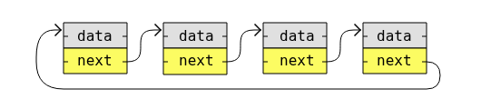
- Níže uvedený obrázek je příkladem dvojitého kruhového spojené seznamu:
- 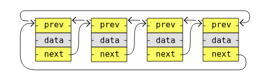
---
#### 2.2.3 Výhody
- dynamická velikost
- rychlé vkládání a mazání
---
#### 2.2.4 Nevýhody
- pomalý přístup podle indexu
- víc paměti kvůli ukazatelům
---
#### 2.2.5 Použití
- fronty, zásobníky, implementace některých algoritmů
---
#### 2.2.6 Příklad
```csharp
// Použití LinkedList v C#
LinkedList<int> linkedList = new LinkedList<int>();
linkedList.AddLast(1); // 1
linkedList.AddLast(2); // přidání nakonec 1 -> 2
linkedList.AddAfter(linkedList.First, 9); // rychlé vložení uprostřed 1 -> 9 -> 2
```

```csharp
// Příklad jednoduše propojeného seznamu
public class Node
{
    public int Value;
    public Node Next;

    public Node(int value)
    {
        Value = value;
        Next = null;
    }
}

// Vytvoření uzlů
Node node1 = new Node(3);
Node node2 = new Node(5);
Node node3 = new Node(13);
Node node4 = new Node(2);

// Jednoduché propojení uzlů seznamu
node1.Next = node2;
node2.Next = node3;
node3.Next = node4;

// Procházení seznamu
Node current = node1;
while(current != null)
{
    Console.Write(current.Value + " -> ");
    current = current.Next;
}
Console.WriteLine("null");

// Output: [3] -> [5] -> [13] -> [2] -> null
```

```csharp
// Příklad dvojitě propojeného seznamu
public class Node
{
    public int Value;
    public Node Next;

    public Node(int value)
    {
        Value = value;
        Next = null;
    }
}

// Vytvoření uzlů
Node node1 = new Node(3);
Node node2 = new Node(5);
Node node3 = new Node(13);
Node node4 = new Node(2);

// Propojení uzlů dvojitě propojeného seznamu
node1.Next = node2;

node2.Prev = node1;
node2.Next = node3;

node3.Prev = node2;
node3.Next = node4;

node4.Prev = node3;

// Traversing forward
Node current = node1;
while(current != null)
{
    Console.Write(current.Value + " -> ");
    current = current.Next;
}
Console.WriteLine("null");

// Traversing backward
current = node4;
while(current != null)
{
    Console.Write(current.Value + " -> ");
    current = current.Prev;
}
Console.WriteLine("null");

// Output1: [3] -> [5] -> [13] -> [2] -> null
// Output2: [2] -> [13] -> [5] -> [3] -> null
```

```csharp
// Příklad cyklicky jednoduše propojeného seznamu
public class Node
{
    public int Value;
    public Node Next;

    public Node(int value)
    {
        Value = value;
        Next = null;
    }
}

// Vytvoření uzlů
Node node1 = new Node(3);
Node node2 = new Node(5);
Node node3 = new Node(13);
Node node4 = new Node(2);

// Jednoduché cyklické propojení uzlů seznamu
node1.Next = node2;
node2.Next = node3;
node3.Next = node4;
node4.Next = node1;

// Procházení seznamu
Node current = node1;
while(current != null)
{
    Console.Write(current.Value + " -> ");
    current = current.Next;
}
Console.WriteLine("null");

// Output: [3] -> [5] -> [13] -> [2] -> ...(cyklicky se opakuje)
```

```csharp
// Příklad cyklicky dvojitě propojeného seznamu
public class Node
{
    public int Value;
    public Node Next;

    public Node(int value)
    {
        Value = value;
        Next = null;
    }
}

// Vytvoření uzlů
Node node1 = new Node(3);
Node node2 = new Node(5);
Node node3 = new Node(13);
Node node4 = new Node(2);

// Propojení uzlů jednosměrného seznamu
node1.Prev = node4;
node1.Next = node2;

node2.Prev = node1;
node2.Next = node3;

node3.Prev = node2;
node3.Next = node4;

node4.Prev = node3;
node4.Next = node1;

// Traversing forward
Node current = node1;
while(current != null)
{
    Console.Write(current.Value + " -> ");
    current = current.Next;
}
Console.WriteLine("null");

// Traversing backward
current = node4;
while(current != null)
{
    Console.Write(current.Value + " -> ");
    current = current.Prev;
}
Console.WriteLine("null");

// Output1: [3] -> [5] -> [13] -> [2] -> ... (Cyklicky se opakuje)
// Output2: [2] -> [13] -> [5] -> [3] -> ... (Cyklicky se opakuje)
```
---
### 2.3 Zásobník (Stack)
#### 2.3.1 Popis
- Zásobník je datová struktura, která může obsahovat mnoho prvků.
- Zásobník si můžete představit jako hromadu palačinek.
	- V hromadě palačinek se palačinky přidávají i odebírají z vrchu. 
	- Když tedy odeberete palačinku, bude to vždy ta poslední, kterou jste přidali. 
- Tento způsob uspořádání prvků se nazývá LIFO: Last In First Out (poslední dovnitř, první ven).
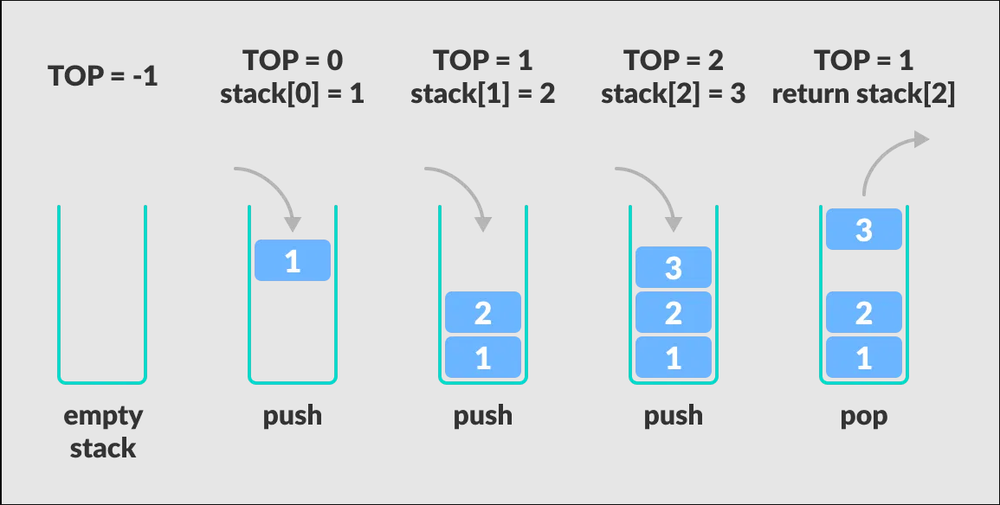
- Základní operace, které můžeme na zásobníku provádět, jsou:
	- `Push`: Přidá nový prvek do zásobníku.
	- `Pop`: Odebere a vrátí prvek nahoře ze zásobníku.
	- `Peek`: Vrátí prvek nahoře ze zásobníku.
	- `isEmpty`: Zkontroluje, zda je zásobník prázdný.
	- `Size`: Zjistí počet prvků ve stacku.
- Stacky lze implementovat pomocí polí nebo propojených seznamů.
- Stacky lze použít k implementaci mechanismů zpětného kroku, k návratu do předchozích stavů, k vytvoření algoritmů pro hloubkové prohledávání grafů nebo pro zpětné sledování.
- Stacky se často zmiňují společně s frontami, což je podobná datová struktura, která následuje po této.
---
##### 2.3.1.1 Zásobník vytvořeným polem
- Takto to vypadá, když použijeme pole jako zásobník:
	- `[ 2,3,3,2 ]`
	- `Push 4`
	- `[ 2,3,3,2,4 ]`
	- `Pop()`
	- `[ 2,3,3,2 ]`
- Důvody pro implementaci zásobníků pomocí polí:
	- **Účinné využití paměti:** Prvky pole neuchovávají adresu následujícího prvku, jako je tomu u uzlů spojovaných seznamů.
	- **Snadnější implementace a pochopení:** Implementace zásobníků pomocí polí vyžaduje méně kódu než použití spojovaných seznamů, a proto je obvykle také snazší ji pochopit.
- Důvod, proč nepoužívat pole k implementaci zásobníků:
	- **Pevná velikost**: Pole zabírá pevnou část paměti. To znamená, že může zabírat více paměti, než je potřeba, nebo pokud se pole zaplní, nemůže pojmout další prvky.
---
##### 2.3.1.2 Zásobník vytvořený propojeným seznamem
- Důvod pro použití propojených seznamů k implementaci zásobníků:
	- **Dynamická velikost**: Zásobník se může dynamicky zvětšovat a zmenšovat, na rozdíl od polí.
- Důvody pro nepoužívání propojených seznamů k implementaci zásobníků:
	- **Extra paměť**: Každý prvek zásobníku musí obsahovat adresu dalšího prvku (dalšího uzlu propojeného seznamu).
	- **Čitelnost**: Kód může být pro některé obtížnější číst a psát, protože je delší a složitější.
---
#### 2.3.2 Použití
- návrat v programech (call stack)
- undo/redo
- parsování výrazů
---
#### 2.3.3 Příklad
```csharp
// Použití zásobníku v C#
Stack<int> stack = new Stack<int>();
// Přidání prvků
stack.Push(10);
stack.Push(20);
stack.Push(30);

// Vrchol zásobníku
Console.WriteLine("Peek: " + stack.Peek()); // 30

// Odstranění prvků
Console.WriteLine("Pop: " + stack.Pop()); // 30
Console.WriteLine("Pop: " + stack.Pop()); // 20

// Zbývající prvek
Console.WriteLine("Peek: " + stack.Peek()); // 10
```

```csharp
// Implementace zásobníku pomocí pole v C#
using System;

class ArrayStack
{
    private int maxSize;
    private string[] stackArray;
    private int top;

    public ArrayStack(int size)
    {
        maxSize = size;
        stackArray = new string[maxSize];
        top = -1; // prázdný stack
    }

    public void Push(string value)
    {
        if(top >= maxSize - 1)
        {
            Console.WriteLine("Stack overflow");
            return;
        }
        stackArray[++top] = value;
    }

    public string Pop()
    {
        if(top == -1)
        {
            return "Stack is empty";
        }
        return stackArray[top--];
    }

    public string Peek()
    {
        if(top == -1)
        {
            return "Stack is empty";
        }
        return stackArray[top];
    }

    public bool IsEmpty()
    {
        return top == -1;
    }

    public int Size()
    {
        return top + 1;
    }
}

// Použití
var stack = new ArrayStack(10);
stack.Push("A");
stack.Push("B");
stack.Push("C");

Console.WriteLine("Pop: " + stack.Pop());
Console.WriteLine("Peek: " + stack.Peek());
Console.WriteLine("IsEmpty: " + stack.IsEmpty());
Console.WriteLine("Size: " + stack.Size());
```

```csharp
// Implementace zásobníku pomocí propojeného seznamu
using System;

class Node
{
    public string Value;
    public Node Next;

    public Node(string value)
    {
        Value = value;
        Next = null;
    }
}

class LinkedListStack
{
    private Node head;
    private int size;

    public LinkedListStack()
    {
        head = null;
        size = 0;
    }

    public void Push(string value)
    {
        Node newNode = new Node(value);
        newNode.Next = head;
        head = newNode;
        size++;
    }

    public string Pop()
    {
        if(IsEmpty())
        {
            return "Stack is empty";
        }
        string value = head.Value;
        head = head.Next;
        size--;
        return value;
    }

    public string Peek()
    {
        if(IsEmpty())
        {
            return "Stack is empty";
        }
        return head.Value;
    }

    public bool IsEmpty()
    {
        return size == 0;
    }

    public int StackSize()
    {
        return size;
    }
}

// Použití
var stack = new LinkedListStack();
stack.Push("A");
stack.Push("B");
stack.Push("C");

Console.WriteLine("Pop: " + stack.Pop());
Console.WriteLine("Peek: " + stack.Peek());
Console.WriteLine("IsEmpty: " + stack.IsEmpty());
Console.WriteLine("Size: " + stack.StackSize());
```
---
### 2.4 Fronta (Queue)
#### 2.4.1 Popis
- Fronta je datová struktura, která může obsahovat mnoho prvků.
- Představte si frontu jako lidi stojící v řadě v supermarketu.
	- První osoba, která se postaví do fronty, je také první, která může zaplatit a opustit supermarket. 
- Tento způsob uspořádání prvků se nazývá FIFO: First In First Out (první dovnitř, první ven).
- Základní operace, které můžeme na frontě provádět, jsou:
	- `Enqueue`: Přidá nový prvek do fronty.
	- `Dequeue`: Odebere a vrátí první (přední) prvek z fronty.
	- `Peek`: Vrátí první prvek ve frontě.
	- `isEmpty`: Zkontroluje, zda je fronta prázdná.
	- `Size`: Zjistí počet prvků ve frontě.
- 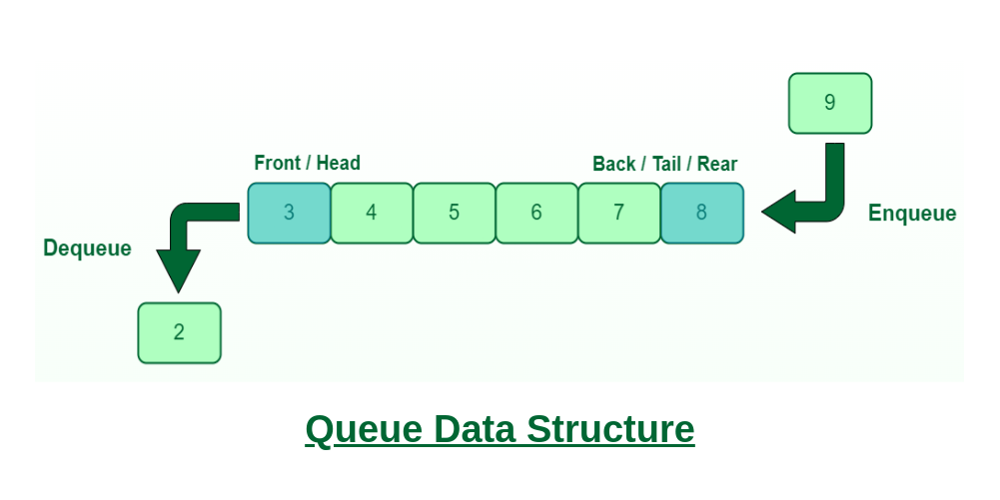
- Fronty lze implementovat pomocí polí nebo propojených seznamů.
- Fronty lze použít k implementaci plánování úloh pro kancelářskou tiskárnu, zpracování objednávek elektronických letenek nebo k vytvoření algoritmů pro prohledávání grafů metodou šířky.
- Fronty jsou často zmiňovány společně se zásobníky.
---
##### 2.4.1.1 Fronty vytvořený polem
- Abyste lépe pochopili výhody použití polí nebo propojených seznamů k implementaci front, podívejte se na tuto stránku, která vysvětluje, jak jsou pole a propojené seznamy uloženy v paměti.
- Takto to vypadá, když použijeme pole jako frontu:
	- `[ 1,3,1,3 ]`
	- `enqueue(4)`
	- `[ 1,3,1,3,4 ]`
	- `dequeue()`
	- `[ 3,1,3,4 ]`
	- `peek() // 3`
- Důvody pro implementaci front pomocí polí:
	- **Účinné využití paměti**: Prvky pole neuchovávají adresu následujícího prvku, jako je tomu u uzlů spojovaných seznamů.
	- **Snadnější implementace a pochopení**: Použití polí k implementaci front vyžaduje méně kódu než použití spojovaných seznamů, a z tohoto důvodu je také obvykle snazší je pochopit.
- Důvody, proč nepoužívat pole k implementaci front:
	- **Pevná velikost**: Pole zabírá pevnou část paměti. To znamená, že může zabírat více paměti, než je potřeba, nebo pokud se pole zaplní, nemůže pojmout další prvky. A změna velikosti pole může být nákladná.
	- **Náklady na posun**: Odstranění prvku z fronty způsobí, že první prvek ve frontě bude odstraněn a ostatní prvky se musí posunout, aby zaujaly místo odstraněného prvku. To je neefektivní a může způsobit problémy, zejména pokud je fronta dlouhá.
	- **Alternativy**: Některé programovací jazyky mají vestavěné datové struktury optimalizované pro operace s frontami, které jsou lepší než použití polí.
--- 
##### 2.4.1.2 Fronty vytvořený propojeným seznamem
- Důvody pro použití propojených seznamů k implementaci front:
	- **Dynamická velikost**: Fronta se může dynamicky zvětšovat a zmenšovat, na rozdíl od polí.
	- **Žádné posouvání**: Přední prvek fronty lze odstranit (dequeue) bez nutnosti posouvat ostatní prvky v paměti.
- Důvody pro nepoužívání propojených seznamů k implementaci front:
	- **Extra paměť**: Každý prvek fronty musí obsahovat adresu dalšího prvku (dalšího uzlu propojeného seznamu).
	- **Čitelnost**: Kód může být pro některé obtížnější číst a psát, protože je delší a složitější.
---
#### 2.4.2 Použití
- plánování úloh
- simulace front
- síťařina (pakety)
---
#### 2.4.3 Příklad
```csharp
// Použití queue v c#
Queue<string> queue = new Queue<string>();

// Enqueue
queue.Enqueue("A"); // A
queue.Enqueue("B"); // A B
queue.Enqueue("C"); // A B C

Console.WriteLine("Queue: " + string.Join(", ", queue)); // Queue: A, B, C

// Dequeue
Console.WriteLine("Dequeue: " + queue.Dequeue()); // Dequeue: A

// Peek
Console.WriteLine("Peek: " + queue.Peek()); // Peek: B

// isEmpty
Console.WriteLine("IsEmpty: " + (queue.Count == 0)); // IsEmpty: false

// Size
Console.WriteLine("Size: " + queue.Count); // Size: 2
```
---
### 2.5 Hash Table (Hash mapa / Hash set)
#### 2.5.1 Popis
- Hash tabulka je datová struktura navržená pro rychlou práci.
- Důvodem, proč jsou hash tabulky někdy upřednostňovány před poli nebo propojenými seznamy, je to, že vyhledávání, přidávání a mazání dat lze provádět velmi rychle, a to i u velkého množství dat.
- V propojeném seznamu trvá vyhledání osoby „Bob“ delší dobu, protože musíme procházet jeden uzel za druhým a kontrolovat každý uzel, dokud nenajdeme uzel s „Bobem“.
- A vyhledání „Boba“ v poli by mohlo být rychlé, pokud bychom znali index, ale když známe pouze jméno „Bob“, musíme porovnat každý prvek (stejně jako u propojených seznamů), a to zabere čas.
- S hash tabulkou je však vyhledání „Boba“ opravdu rychlé, protože existuje způsob, jak se dostat přímo k místu, kde je „Bob“ uložen, a to pomocí takzvané hash funkce.
---
#### 2.5.2 Vytvoření hash tabulky od základů
- Abychom si udělali představu o tom, co je to hash tabulka, zkusme si ji vytvořit od základu a uložit do ní jedinečná křestní jména.
- Hash sadu vytvoříme v 5 krocích:
	1. Začneme s polem.
	2. Uložíme jména pomocí hash funkce.
	3. Vyhledáme prvek pomocí hash funkce.
	4. Vyřešíme kolize.
	5. Základní příklad kódu hash sady a simulace.
---
##### 2.5.2.1 Začneme s polem
- Pomocí pole můžeme ukládat jména takto:
	- `my_array = ["Pete", "Jones", "Lisa", "Bob", "Siri"]`
- Chceme-li v tomto poli najít jméno „Bob“, musíme porovnávat jednotlivá jména, prvek po prvku, dokud nenajdeme „Bob“.
- Pokud by bylo pole seřazeno abecedně, mohli bychom k rychlému vyhledání jména použít binární vyhledávání, ale vkládání nebo mazání jmen v poli by znamenalo velkou operaci přesouvání prvků v paměti.
- Aby byla interakce se seznamem jmen opravdu rychlá, použijeme místo toho hašovací tabulku nebo hašovací sadu, která je zjednodušenou verzí hašovací tabulky.
- Abychom to zjednodušili, předpokládejme, že v seznamu je maximálně 10 jmen, takže pole musí mít pevnou velikost 10 prvků. Když mluvíme o hash tabulkách, každý z těchto prvků se nazývá bucket.
	- `my_hash_set = [null, null, null, null, null, null, null, null, null, null];`
---
##### 2.5.2.2 Uložíme jména pomocí hash funkce
- Nyní přichází na řadu speciální způsob, jakým pracujeme s vytvářenou hašovací sadou.
- Chceme uložit jméno přímo na správné místo v poli, a zde přichází na řadu hašovací funkce.
- Hash funkce může být vytvořena mnoha způsoby, záleží na tvůrci hash tabulky. 
- Běžným způsobem je najít způsob, jak převést hodnotu na číslo, které se rovná jednomu z indexových čísel hash sady, v tomto případě číslu od 0 do 9. 
- V našem příkladu použijeme Unicode číslo každého znaku, sečteme je a provedeme operaci modulo 10, abychom získali indexová čísla 0-9.
```csharp
static int HashFunction(string value)
{
	int sumOfChars = 0;
    foreach (char c in value)
    {
	    sumOfChars += c;
    }
	return sumOfChars % 10;
}
static void Main()
{
	Console.WriteLine("'Bob' has hash code: " + HashFunction("Bob"));
}
```
- Znak „B“ má kód Unicode `66`, „o“ má `111` a „b“ má `98`. Po sečtení těchto hodnot dostaneme `275`. `Modulo 10 z 275` je `5`, takže „Bob“ by měl být uložen jako prvek pole na indexu `5`.
	- Číslo Unicode: Vše v našich počítačích je uloženo jako čísla a kód Unicode je jedinečné číslo, které existuje pro každý znak. Například znak `A` má číslo Unicode (také nazývané kód Unicode) `65`. Vyzkoušejte si to v simulaci níže. Více informací o tom, jak jsou znaky reprezentovány jako čísla, najdete na této stránce.
	- Modulo: Matematická operace, ve většině programovacích jazyků zapsaná jako `%` (nebo mod v matematice). Operace modulo dělí jedno číslo druhým číslem a dává nám výsledný zbytek. Například `7 % 3` nám dá zbytek `1`. (Rozdělení 7 jablek mezi 3 osoby znamená, že každá osoba dostane 2 jablka a 1 jablko zbude.)
- Číslo vrácené hash funkcí se nazývá hash kód.
- Po uložení „Bob“ na místo, které nám udává hash kód (index 5), vypadá naše pole nyní takto:
	- `my_hash_set = [null, null, null, null, null, 'Bob', null, null, null, null];`
- Pomocí hash funkce můžeme zjistit, kam uložit i ostatní jména „Pete“, „Jones“, „Lisa“ a „Siri“.
- Po použití hash funkce k uložení těchto jmen na správná místa vypadá naše pole takto:
	- `my_hash_set = [null, "Jones", null, "Lisa", null, "Bob", null, "Siri", "Pete", null];`
---
##### 2.5.2.3 Vyhledáme prvek pomocí hash funkce
- Nyní jsme vytvořili velmi jednoduchou hašovací sadu, protože již nemusíme prohledávat pole prvek po prvku, abychom zjistili, zda se v něm nachází „Pete“. 
- Stačí použít hašovací funkci a přejít přímo na správný prvek!
- Abychom zjistili, zda je „Pete“ uložen v poli, zadáme do naší hash funkce jméno „Pete“, dostaneme zpět hash kód 8, přejdeme přímo k prvku na indexu 8 a tam ho najdeme.
- Našli jsme „Pete“ bez kontroly ostatních prvků.
```csharp
static string[] my_hash_set =  
[null, "Jones", null, "Lisa", null, "Bob", null, "Siri", "Pete", null];  
  
static int HashFunction(string value)  
{  
    int sumOfChars = 0;  
    foreach (char c in value)  
    {  
        sumOfChars += c;  
    }  
    return sumOfChars % 10;  
}  
  
static bool Contains(string name)  
{  
    int index = HashFunction(name);  
    return my_hash_set[index] == name;  
}  
  
static void Main()  
{  
    Console.WriteLine("'Bob' has hash code: " + HashFunction("Bob")); // 5
    Console.WriteLine("'Pete' is in the Hash Set: " + Contains("Pete")); // true
}
```
 - Při mazání jména z naší hash sady můžeme také použít hash funkci, abychom se dostali přímo k místu, kde se jméno nachází, a nastavit hodnotu tohoto prvku na `null`.
 ---
##### 2.5.2.4 Vyřešíme kolize
- Přidejme také „Stuart“ do naší hashové množiny.
- Zadáme „Stuart“ do naší hashové funkce a dostaneme hash kód 3, což znamená, že „Stuart“ by měl být uložen na indexu 3.
- Pokus o uložení „Stuart“ vytvoří takzvanou kolizi, protože „Lisa“ je již uložena na indexu 3.
- Abychom kolizi vyřešili, můžeme vytvořit prostor pro více prvků ve stejném bucketu. 
- Řešení kolize tímto způsobem se nazývá řetězení. 
- Prostor pro více prvků ve stejném bucketu můžeme vytvořit implementací každého bucketu jako propojeného seznamu nebo pole.
- Po implementaci každého bucketu jako pole, aby bylo v každém bucketu místo pro potenciálně více než jedno jméno, lze „Stuart“ uložit také na index 3 a naše hash sada nyní vypadá takto:
```csharp
static string[] my_hash_set =  
[
	[null], 
	["Jones"], 
	[null], 
	["Lisa", "Stuart"], 
	[null], 
	["Bob"], 
	[null], 
	["Siri"], 
	["Pete"], 
	[null]
]; 
```
- Hledání „Stuart“ v našem hash setu nyní znamená, že pomocí hash funkce se dostaneme přímo do bucketu 3, ale pak musíme nejprve zkontrolovat „Lisa“ v tomto bucketu, než najdeme „Stuart“ jako druhý prvek v bucketu 3.
---
##### 2.5.2.5 Základní příklad kódu hash sady a simulace
- Abychom dokončili náš velmi základní kód Hash Set, vytvořme funkce pro přidávání a vyhledávání jmen v Hash Set, který je nyní dvourozměrným polem.
- Spusťte níže uvedený příklad kódu a vyzkoušejte jej s různými hodnotami, abyste lépe pochopili, jak Hash Set funguje.
```csharp
using System;
using System.Collections.Generic;

class Program
{
	// Použijeme dynamická pole pro zjednodušení implementace, při zvětšování polí
    static List<List<string>> my_hash_set = new List<List<string>>
    {
        new List<string>(),          // Prázdný seznam
        new List<string> { "Jones" },
        new List<string>(),
        new List<string> { "Lisa" },
        new List<string>(),
        new List<string> { "Bob" },
        new List<string>(),
        new List<string> { "Siri" },
        new List<string> { "Pete" },
        new List<string>()
    };
    
    static int HashFunction(string value)
    {
        int sum = 0; // Pomocná proměnná pro vypočítání hash
        foreach (char c in value) // Pro každé písmeno v hodnotě
        {
	        sum += c; // Přičti jeho Unicode hodnotu do proměnné sum
        }
        return sum % 10; // Nakonec vrať zbytek po dělení "sum / 10" jako index, na kterém má být hodnota uložena 
    }
    
    static void Add(string value)
    {
        int index = HashFunction(value); // Zjisti na jakým indexu v poli má prvek být uložen
        var bucket = my_hash_set[index]; // Načti si bucket do proměnné pro následné porovnání
        if (!bucket.Contains(value)) // Pokud bucket již neobsahuje prvek
            bucket.Add(value); // tak ho přidej
    }
    
    static bool Contains(string value)
    {
        int index = HashFunction(value); // Zjisti na jakým indexu v poli má prvek být uložen
        var bucket = my_hash_set[index]; // Načti si bucket do proměnné
        return bucket.Contains(value); // Vrať ano/ne pokud bucket obsahuje námi hledanou hodnotu
    }
    
    static void Remove(string value)
    {
        int index = HashFunction(value); // Zjisti na jakým indexu v poli má prvek být uložen
        var bucket = my_hash_set[index]; // Načti si bucket do proměnné pro následné porovnání
        if (bucket.Contains(value)) // Pokud bucket obsahuje prvek
            bucket.Remove(value); // tak ho odeber
    }
    
    static void Main()
    {
        Add("Stuart"); // Přidej Stuart do hash tabulky
        // Výpis celého hash setu
        for (int i = 0; i < my_hash_set.Count; i++)
        {
            Console.WriteLine($"[{i}]: [{string.Join(", ", my_hash_set[i])}]");
        }
        Console.WriteLine("Contains Stuart: " + Contains("Stuart")); // Contains Stuart: true
    }
}
```

- Hash tabulky jsou skvělé pro:
	- Kontrolu, zda se něco nachází v kolekci (například vyhledání knihy v knihovně).
	- Ukládání jedinečných položek a jejich rychlé vyhledávání (například ukládání telefonních čísel).
	- Propojení hodnot s klíči (například propojení jmen s telefonními čísly).
- Nejdůležitějším důvodem, proč jsou hash tabulky skvělé pro tyto účely, je to, že jsou ve srovnání s poli a propojenými seznamy velmi rychlé, zejména u velkých sad. 
	- Pole a propojené seznamy mají časovou složitost O(n) (musí se prohledat celé pole) pro vyhledávání a mazání, zatímco hash tabulky mají v průměru pouze O(1)! (po výpočtu indexu přesně víme, kde se hodnota nachází) 
---
#### 2.5.3 Výhody
- extrémně rychlé vyhledávání O(1)
---
#### 2.5.4 Nevýhody
- kolize
- potřeba dobré hash funkce
---
#### 2.5.5 Typy hash tabulek
- Hash tabulka může být hash set nebo hash mapa.
- Zde jsou rozdíly a podobnosti mezi hash množinami a hash mapami:

|                                                                                                         | Hash set                                                                          | Hash mapa                                                                                        |
| ------------------------------------------------------------------------------------------------------- | --------------------------------------------------------------------------------- | ------------------------------------------------------------------------------------------------ |
| Jedinečnost a ukládání                                                                                  | Každý prvek je jedinečný klíč.                                                    | Každý prvek je dvojice klíč-hodnota, kde klíč je jedinečný a hodnota je s ním spojena.           |
| Použití                                                                                                 | Kontrola, zda je prvek v sadě, například kontrola, zda je jméno na seznamu hostů. | Vyhledávání informací na základě klíče, například vyhledání majitele určitého telefonního čísla. |
| Je vyhledávání, přidávání a mazání prvků rychlé?                                                        | Ano, průměrně O(1)                                                                | Ano, průměrně O(1)                                                                               |
| Existuje hash funkce, která vezme klíč, vygeneruje hash kód a ten je pak bucketem, kde je prvek uložen? | Ano                                                                               | Ano                                                                                              |

---
##### 2.5.5.1 Hash set
- Hash Set je forma datové struktury Hash Table, která obvykle obsahuje velké množství prvků.
- Pomocí Hash Setu můžeme velmi rychle vyhledávat, přidávat a odstraňovat prvky.
- Hash Sety se používají pro vyhledávání, aby se zkontrolovalo, zda je prvek součástí sady.
- Hash Set ukládá jedinečné prvky do košů podle hash kódu prvku.
	- **Hash kód**: Číslo generované z jedinečné hodnoty prvku (klíče), které určuje, do kterého koše patří prvek Hash Set.
	- **Jedinečné prvky**: Hash Set nemůže obsahovat více než jeden prvek se stejnou hodnotou.
	- **Bucket**: Hash Set se skládá z mnoha takových bucketů, neboli kontejnerů, které slouží k ukládání prvků. Pokud mají dva prvky stejný hash kód, patří do stejného bucketu. Buckety jsou proto často implementovány jako pole nebo propojené seznamy, protože bucket musí být schopen pojmout více než jeden prvek.
---
###### Hledání hash kódu
- Hash kód je generován hash funkcí.
- Hash funkce, v ukázce vytvoření hash tabulky výše, vezme jméno zadané ve vstupu a sečte Unicode kódové body pro každý znak v tomto jméně.
- Poté hash funkce provede operaci modulo 10 (% 10) na součtu znaků, aby získala hash kód jako číslo od 0 do 9.
- To znamená, že jméno je vloženo do jednoho z deseti možných košů v hash sadě podle hash kódu tohoto jména. Stejný hash kód je generován a použit, když chceme vyhledat nebo odstranit jméno z hash sady.
- Hash kód nám poskytuje okamžitý přístup, pokud je v odpovídajícím koši pouze jedno jméno.
---
###### Přímý přístup v hash sadách
- Hledání "Jones" v výše uvedené hash sadě znamená, že se vygeneruje hash kód 1 (511 % 10), který nás nasměruje přímo do bucketu, ve kterém se Peter nachází. Pokud je to jediné jméno v tomto bucketu, najdeme "Jones" okamžitě.
- V takových případech říkáme, že hash sada má konstantní čas O(1)  pro vyhledávání, přidávání a odstraňování prvků, což je opravdu rychlé.
- Pokud však hledáme jméno "Stuart", musíme prohledat ostatní jména v tomto segmentu, než najdeme jméno "Stuart". 
- V nejhorším případě se všechna jména ocitnou ve stejném segmentu a jméno, které hledáme, je poslední. 
- V takovém nejhorším případě má hashová množina časovou složitost O(n), což je stejná časová složitost jako u polí a propojených seznamů.
- Aby byly hash sady rychlé, je proto důležité mít hash funkci, která rovnoměrně rozdělí prvky mezi buckety, a mít přibližně tolik bucketů, kolik je prvků v hash sadě.
- Mít mnohem více bucketů než prvků v hash sadě je plýtvání pamětí a mít mnohem méně bucketů než prvků v hash sadě je plýtvání časem.
---
###### Implementace Hash setu
```csharp
// Použití již zabudovaného Hash setu v c#
var set = new HashSet<string>();

// Přidání hodnot
set.Add("Bob");
set.Add("Lisa");
set.Add("Pete");
set.Add("Stuart");

// Opakovaný prvek se neuloží
set.Add("Bob");

// Odstranění hodnoty
set.Remove("Pete")

// vypsání hodnot
Console.WriteLine("Obsah HashSetu:");
foreach (var item in set)
{
    Console.WriteLine(item);
}

// Vypsání zda hash set obsahuje "Stuart"
Console.WriteLine("Contains 'Stuart': " + set.Contains("Stuart"));
```

```csharp
// Vytvoření vlastního Hash Setu
public class HashSet
{
	private readonly List<string>[] buckets; // Pole bucketů
    private readonly int size;
    
    // Konstruktor – vytvoří pole bucketů o dané velikosti
    public MyHashSet(int size)
    {
        this.size = size;
        buckets = new List<string>[size];
        // Inicializace prázdných bucketů
        for (int i = 0; i < size; i++)
            buckets[i] = new List<string>();
    }
    
    public int HashFunction(string value)
    {
        int sum = 0; // Pomocná proměnná pro vypočítání hash
        foreach (char c in value) // Pro každé písmeno v hodnotě
        {
	        sum += c; // Přičti jeho Unicode hodnotu do proměnné sum
        }
        return sum % 10; // Nakonec vrať zbytek po dělení "sum / 10" jako index, na kterém má být hodnota uložena 
    }
    
    public void Add(string value)
    {
        int index = HashFunction(value); // Zjisti na jakým indexu v poli má prvek být uložen
        var bucket = buckets[index]; // Načti si bucket do proměnné pro následné porovnání
        if (!bucket.Contains(value)) // Pokud bucket již neobsahuje prvek
            bucket.Add(value); // tak ho přidej
    }
    
    public bool Contains(string value)
    {
        int index = HashFunction(value); // Zjisti na jakým indexu v poli má prvek být uložen
        var bucket = buckets[index]; // Načti si bucket do proměnné
        return bucket.Contains(value); // Vrať ano/ne pokud bucket obsahuje námi hledanou hodnotu
    }
    
    public void Remove(string value)
    {
        int index = HashFunction(value); // Zjisti na jakým indexu v poli má prvek být uložen
        var bucket = buckets[index]; // Načti si bucket do proměnné pro následné porovnání
        if (bucket.Contains(value)) // Pokud bucket obsahuje prvek
            bucket.Remove(value); // tak ho odeber
    }
    
    public void Print()
    {
        Add("Stuart"); // Přidej Stuart do hash tabulky
        // Výpis celého hash setu
        for (int i = 0; i < buckets.Count; i++)
        {
            Console.WriteLine($"[{i}]: [{string.Join(", ", my_hash_set[i])}]");
        }
    }
}
```
---
##### 2.5.5.2 Hash mapa
- Hash mapa je forma datové struktury hash tabulky, která obvykle obsahuje velké množství záznamů.
- Pomocí hash mapy můžeme velmi rychle vyhledávat, přidávat, upravovat a odstraňovat záznamy.
- Hash mapy se používají k vyhledávání podrobných informací o něčem.
- V níže uvedené simulaci jsou lidé uloženi v hash mapě. Osobu lze vyhledat pomocí jejího jedinečného čísla sociálního zabezpečení (klíč hash mapy) a poté můžeme vidět jméno této osoby (hodnota hash mapy).
```csharp
List<KeyValuePair<string, string>>[] hashMap =  
{  
    // 0:  
    new() {new ("123-4569", "Jens")}, // Máme pár unikátního klíče + hodnotu  
    // 1:    new(),  
    // 2:  
    new() {new ("123-4570", "Peter")},  
    // 3:  
    new() { new("123-4571", "Lisa") },  
    // 4:  
    new(),  
    // 5:  
    new() { new("123-4672", "Adele"), new("123-4573", "Michaela")},  
    // 6:  
    new(),  
    // 7:  
    new(),  
    // 8:  
    new() { new("123-4567", "Charlotte"), new("123-6574", "Bob")},  
    // 9:  
    new() { new("123-4568", "Thomas") },  
};
```
- Hash mapa by byla užitečnější, kdyby k příslušnému číslu sociálního zabezpečení byly připojeny další informace o každé osobě, jako je příjmení, datum narození, adresa a případně i další údaje. Výše uvedená simulace hash mapy je však co nejjednodušší.
- Fungování hash map je snazší pochopit, pokud si nejprve prohlédnete předchozí  hash tabulky a hash sady. Je také důležité pochopit význam níže uvedených pojmů.
	- **Záznam**: Skládá se z klíče a hodnoty, které tvoří pár klíč-hodnota.
	- **Klíč**: Jedinečný pro každý záznam v hash mapě. Používá se k generování hash kódu, který určuje umístění záznamu v hash mapě. Tím je zajištěno, že každý záznam lze efektivně vyhledat.
	- **Hash kód**: Číslo generované z klíče záznamu, které určuje, do kterého bucketu hash mapy záznam patří.
	- **Bucket**: Hash mapa se skládá z mnoha takových bucketů nebo kontejnerů, které slouží k ukládání záznamů.
	- **Hodnota**: Může se jednat o téměř jakýkoli druh informace, jako je jméno, datum narození a adresa osoby. Hodnota může být kombinací mnoha různých druhů informací.
---
###### Hledání hash kódu
- Hash kód je generován hash funkcí.
- Hash funkce v výše uvedené simulaci vezme čísla v čísle sociálního zabezpečení (bez pomlčky), sečte je a provede operaci modulo 10 (`% 10`) na součtu znaků, aby získala hash kód jako číslo od 0 do 9.
- To znamená, že osoba je uložena v jednom z deseti možných segmentů v hash mapě podle hash kódu jejího čísla sociálního zabezpečení. Stejný hash kód se generuje a používá, když chceme vyhledat nebo odstranit osobu z hash mapy.
- Hash kód nám poskytuje okamžitý přístup, pokud je v odpovídajícím bucketu pouze jedna osoba.
- Ve výše uvedené simulaci má `Charlotte` číslo sociálního zabezpečení `123-4567`. Sečtením čísel získáme součet `28` a modulo 10 z toho je `8`. Proto patří do bucketu `8`.
---
###### Přímý přístup v hash mapách
- Při hledání `Charlotte` v hash mapě musíme použít číslo sociálního zabezpečení `123-4567` (klíč hash mapy), které generuje hash kód `8`, jak bylo vysvětleno výše.
- To znamená, že můžeme přejít přímo do buclíku `8` a získat její jméno (hodnotu hash mapy), aniž bychom museli prohledávat ostatní položky v hash mapě.
- V takových případech říkáme, že hash mapa má konstantní čas O(1) pro vyhledávání, přidávání a odstraňování záznamů, což je ve srovnání s použitím pole nebo propojeného seznamu opravdu rychlé.
- V nejhorším případě jsou však všechny osoby uloženy ve stejném bucketu a pokud je osoba, kterou hledáme, poslední osobou v tomto bucketu, musíme porovnat všechna ostatní čísla sociálního zabezpečení v tomto bucketu, než najdeme osobu, kterou hledáme.
- V takovém nejhorším případě má hash mapa časovou složitost O(n), což je stejná časová složitost jako u polí a spojovaných seznamů.
- Aby hash mapy zůstaly rychlé, je proto důležité mít hash funkci, která rovnoměrně rozdělí položky mezi buckety, a mít přibližně tolik bucketů, kolik je položek v hash mapě.
- Mít mnohem více bucketů než záznamů v hash mapě je plýtvání pamětí a mít mnohem méně bucketů než záznamů v hash mapě je plýtvání časem.
---
#### 2.5.6 Shrnutí
- Prvky hašovací tabulky jsou uloženy v úložných kontejnerech nazývaných buckety.
- Každý prvek hašovací tabulky má jedinečnou část, která se nazývá klíč.
	- Klíč musí být unikátní
	- Klíč může být i samotná hodnota
- Hašovací funkce vezme klíč prvku a vygeneruje hašovací kód.
- Hash kód udává, do kterého bucketu prvek patří, takže nyní můžeme přejít přímo k tomuto prvku hash tabulky: abychom jej upravili, smazali nebo jen zkontrolovali, zda existuje. 
- Ke kolizi dochází, když mají dva prvky hash tabulky stejný hash kód, protože to znamená, že patří do stejného bucketu. Kolizi lze vyřešit dvěma způsoby.
- Kolize se řeší řetězením, pomocí polí nebo propojených seznamů, které umožňují více než jeden prvek ve stejném segmentu.
	- Dalším způsobem řešení kolizí je otevřené adresování. 
	- Při otevřeném adresování, pokud chceme uložit prvek, ale v daném segmentu již nějaký prvek existuje, je prvek uložen v dalším dostupném segmentu. 
	- To lze provést mnoha různými způsoby.
#### 2.5.7 Použití
- databázové indexy
- cache
- mapování hodnot
---
### 2.6 Stromy (Trees)
#### 2.6.1 Popis
- Datová struktura stromu je podobná propojeným seznamům (linked list) v tom, že každý uzel obsahuje data a může být propojen s jinými uzly.
- Ve stromu může mít jeden prvek více „dalších“ prvků, což umožňuje datové struktuře rozvětvovat se v různých směrech.
	- Tím se liší od lineárních datových struktur jako pole, propojený seznam, zásobník, fronta. (každý prvek mohl pouze jednu následující hodnotu) 
- Datová struktura se nazývá „strom“, protože vypadá jako strom, jen obrácený vzhůru nohama, jak je vidět na obrázku níže.
- 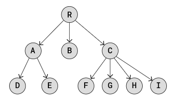
- Datová struktura stromu může být užitečná v mnoha případech:
	- Hierarchická data: souborové systémy, organizační modely atd.
	- Databáze: používají se pro rychlé vyhledávání dat.
	- Směrovací tabulky: Používá se pro směrování dat v síťových algoritmech.
	- Třídění/vyhledávání: Používá se pro třídění dat a vyhledávání dat.
	- Prioritní fronty: Datové struktury prioritních front se běžně implementují pomocí stromů, jako jsou binární haldy.
---
#### 2.6.2 Terminologie stromů a pravidla
- První uzel ve stromu se nazývá **kořenový uzel (root node)**. (v obrázku se je to uzel "R")
- Spojení mezi dvěma uzly se nazývá **hrana (edge)**. (v obrázku je to šipka mezi uzly)
- **Rodičovský uzel (parent node)** má spojení se svými **potomkovými uzly (child nodes)**. Jiným názvem pro rodičovský uzel je **vnitřní uzel (internal node)**.
	- Např. rodičovský uzel v obrázku jsou uzly `R`, `A`, `B`, `C`
	- Zároveň uzly `A`, `B`, `C` jsou přímými potomky uzlu `R`
		- dále ostatní uzly níže jsou také potomky uzlu `R` pouze už nejsou přímí potomci a řiká se jim **descendant** namísto **child**
	- Dále např. uzly `D` a `E` jsou přímí potomci rodičovského uzlu `A`
	- a tak dále...
- Uzel může mít nulový, jeden nebo více potomkových uzlů.
- Uzel může mít pouze jeden nadřazený uzel.
- Uzly bez odkazů na jiné podřízené uzly se nazývají **listy (leaves)** nebo **listové uzly (leaf nodes)**.
- **Výška stromu** je maximální počet hran od kořenového uzlu k listovému uzlu. Výška výše uvedeného stromu je 2.
- **Výška uzlu** je maximální počet hran mezi uzlem a listovým uzlem.
- **Velikost stromu** je počet uzlů ve stromu.
---
#### 2.6.3 Typy stromů
- Stromy jsou základní datovou strukturou v informatice, která se používá k reprezentaci hierarchických vztahů. Tento tutoriál se zabývá několika klíčovými typy stromů.
- **Binární stromy**: Každý uzel má až dva potomky, levý potomek a pravý potomek. Tato struktura je základem pro složitější typy stromů, jako jsou binární vyhledávací stromy a AVL stromy.
- **Binární vyhledávací stromy (BST)**: Typ binárního stromu, kde pro každý uzel má levý podřízený uzel nižší hodnotu a pravý podřízený uzel má vyšší hodnotu.
- **AVL stromy**: Typ binárního vyhledávacího stromu, který se sám vyvažuje tak, že pro každý uzel je rozdíl ve výšce mezi levým a pravým podstromem maximálně jeden. Tato rovnováha je udržována pomocí rotací při vkládání nebo mazání uzlů.
---
##### 2.6.3.1 Binární strom
- Binární strom je typ stromové datové struktury, kde každý uzel může mít maximálně dva podřízené uzly, levý podřízený uzel a pravý podřízený uzel.
- Toto omezení, že uzel může mít maximálně dva podřízené uzly, nám přináší mnoho výhod:
	- Algoritmy jako procházení, vyhledávání, vkládání a mazání jsou snáze pochopitelné, implementovatelné a rychlejší.
	- Udržování dat seřazených v binárním vyhledávacím stromu (BST) činí vyhledávání velmi efektivním.
	- Vyvažování stromů je snazší s omezeným počtem podřízených uzlů, například pomocí binárního stromu AVL.
	- Binární stromy lze reprezentovat jako pole, což činí strom paměťově efektivnějším.
- 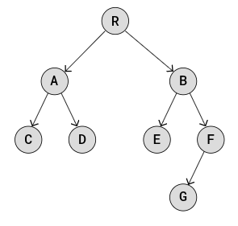
- **Rodičovský uzel (root node)** nebo **vnitřní uzel (internal node)** v binárním stromu je uzel s jedním nebo dvěma **potomkovými uzly (child nodes)**.
- **Levý podřízený uzel** je podřízený uzel vlevo.
- **Pravý podřízený uzel** je podřízený uzel vpravo.
- **Výška stromu** je maximální počet hran od kořenového uzlu k listovému uzlu.
---
###### Binární stromy vs. pole a propojené seznamy
- Výhody binárních stromů oproti polím a propojeným seznamům:
	- **Pole** jsou rychlá, pokud chcete přímo přistupovat k určitému prvku, například k prvku číslo 700 v poli o 1000 prvcích. Vkládání a mazání prvků však vyžaduje posun ostatních prvků v paměti, aby se uvolnilo místo pro nový prvek nebo aby se uvolnilo místo pro smazaný prvek, což je časově náročné.
	- **Propojené seznamy** jsou rychlé při vkládání nebo mazání uzlů, není třeba přesouvat paměť, ale pro přístup k prvku uvnitř seznamu je třeba seznam projít, což zabere čas.
	- **Binární stromy**, jako jsou binární vyhledávací stromy a AVL stromy, jsou skvělé ve srovnání s poli a spojenými seznamy, protože jsou rychlé jak při přístupu k uzlu, tak při mazání nebo vkládání uzlu, aniž by bylo třeba přesouvat paměť.
---
###### Typy binárních stromů
- Existují různé varianty nebo typy binárních stromů, které stojí za to probrat, abychom lépe pochopili, jak mohou být binární stromy strukturovány.
- **Vyvážený binární strom** má maximálně 1 rozdíl mezi výškou levého a pravého podstromu pro každý uzel ve stromu.
	- 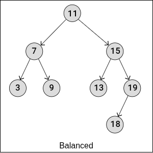
- **Kompletní binární strom** má všechny úrovně plné uzlů, s výjimkou poslední úrovně, která může být také plná nebo vyplněna zleva doprava. Vlastnosti kompletního binárního stromu znamenají, že je také vyvážený.
	- 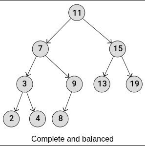
- **Plný binární strom** je druh stromu, kde každý uzel má buď 0, nebo 2 podřízené uzly.
	- 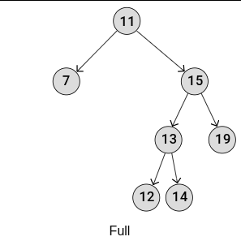
- **Dokonalý binární strom** má všechny listové uzly na stejné úrovni, což znamená, že všechny úrovně jsou plné uzlů a všechny vnitřní uzly mají dva podřízené uzly. Vlastnosti dokonalého binárního stromu znamenají, že je také plný, vyvážený a úplný.
	- 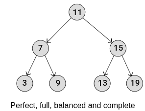
---
###### Implementace binárního stromu
- 
- Výše uvedený binární strom lze implementovat podobně jako jednoduchý spojovaný seznam, s tím rozdílem, že namísto propojení každého uzlu s jedním následujícím uzlem vytvoříme strukturu, ve které může být každý uzel propojen jak s levým, tak s pravým podřízeným uzlem.
- Takto lze implementovat binární strom:
```csharp
class TreeNode
{
    public string Data;
    public TreeNode Left;
    public TreeNode Right;

    public TreeNode(string data)
    {
        Data = data;
        Left = null;
        Right = null;
    }
}

class Program
{
    static void Main()
    {
        // Vytvoření uzlů
        TreeNode root = new TreeNode("R");
        TreeNode nodeA = new TreeNode("A");
        TreeNode nodeB = new TreeNode("B");
        TreeNode nodeC = new TreeNode("C");
        TreeNode nodeD = new TreeNode("D");
        TreeNode nodeE = new TreeNode("E");
        TreeNode nodeF = new TreeNode("F");
        TreeNode nodeG = new TreeNode("G");

        // Propojení uzlů
        root.Left = nodeA;
        root.Right = nodeB;

        nodeA.Left = nodeC;
        nodeA.Right = nodeD;

        nodeB.Left = nodeE;
        nodeB.Right = nodeF;

        nodeF.Left = nodeG;

        // Test
        Console.WriteLine("root.Right.Left.Data: " + root.Right.Left.Data); // E
    }
}
```
---
###### Procházení binárního stromu
- Procházení stromu tak, že navštívíte každý uzel, jeden po druhém, se nazývá procházení.
- Jelikož pole a spojené seznamy jsou lineární datové struktury, existuje pouze jeden zřejmý způsob, jak je procházet: začněte u prvního prvku nebo uzlu a pokračujte k dalšímu, dokud nenavštívíte všechny.
- Ale jelikož se strom může rozvětvovat v různých směrech (nelineárně), existují různé způsoby procházení stromů.
- Existují dvě hlavní kategorie metod procházení stromu:
- **Prohledávání do šířky** **(Breadth First Search - BFS)** znamená, že uzly na stejné úrovni jsou navštíveny před přechodem na další úroveň stromu. To znamená, že strom je prozkoumáván spíše do stran.
- **Prohledávání do hloubky (DFS)** znamená, že procházení se pohybuje po stromu dolů až k listovým uzlům a prozkoumává strom větev po větvi směrem dolů.
	- Existují tři různé typy procházení DFS:
		- pre-order
		- in-order
		- post-order
---
###### Pre-order procházení
- Pre-order procházení je typ hloubkového prohledávání, při kterém jsou jednotlivé uzly procházeny v určitém pořadí. 
- Pre-order procházení binárního stromu vypadá takto:
- 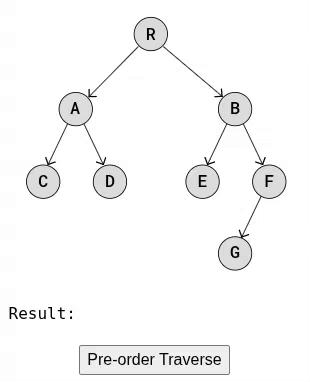
- Předběžné procházení se provádí tak, že se nejprve navštíví kořenový uzel, poté se rekurzivně provede předběžné procházení levého podstromu a následně rekurzivní předběžné procházení pravého podstromu. Používá se k vytvoření kopie stromu, prefixové notace výrazového stromu atd.
- Tento průchod je „pre“-order, protože uzel je navštíven „před“ rekurzivním předřazeným průchodem levého a pravého podstromu.
- Takto vypadá kód pro pre-order procházení:
```csharp
public void PreOrderTraversal(TreeNode node)
{
    // Pokud je uzel prázdný, není co zpracovat
    if (node == null)
        return;
    // 1) Zpracujeme aktuální uzel (ROOT)
    Console.Write(node.Data + ", ");
    // 2) Projdeme levý podstrom (LEFT)
    PreOrderTraversal(node.Left);
    // 3) Projdeme pravý podstrom (RIGHT)
    PreOrderTraversal(node.Right);
}
```
- První uzlem, který se vytiskne, je uzel R, protože předběžné procházení funguje tak, že nejprve navštíví nebo vytiskne aktuální uzel a poté rekurzivně volá levý a pravý podřízený uzel.
- Funkce `PreOrderTraversal()` pokračuje v rekurzivním procházení levého podstromu (řádek 5), než přejde k procházení pravého podstromu. Dalšími uzly, které se vytisknou, jsou tedy „A“ a poté „C“.
- Poprvé je argument `node` `null`, když je jako argument zadán levý potomek uzlu C (C nemá levého potomka).
- Poté, co je při prvním volání levého potomka C vráceno `null`, vrátí i pravý potomek C `null` a rekurzivní volání pokračují zpět, takže jako další se vytiskne pravý potomek A, D.
- Kód pokračuje zpět, takže se vytisknou i zbývající uzly v pravém podstromu R.
---
###### In-order procházení
- Procházení in-order je typ hloubkového prohledávání, při kterém je každý uzel navštíven v určitém pořadí.
- Spusťte níže uvedenou animaci a podívejte se, jak probíhá procházení binárního stromu v pořadí.
- 
- In-order procházení provádí rekurzivní In-order procházení levého podstromu, navštíví kořenový uzel a nakonec provede rekurzivní In-order procházení pravého podstromu. Tento traversal se používá hlavně pro binární vyhledávací stromy, kde vrací hodnoty v vzestupném pořadí.
- To, co činí tento průchod „v pořadí“, je to, že uzel je navštíven mezi rekurzivními voláními funkce. Uzel je navštíven po průchodu levého podstromu v pořadí a před průchodem pravého podstromu v pořadí.
- Takto vypadá kód pro průchod v pořadí:
```csharp
public void InOrderTraversal(TreeNode node)
{
    // Pokud je uzel prázdný, není co zpracovat
    if (node == null)
        return;
    // 1) Projdeme levý podstrom
    InOrderTraversal(node.Left);
    // 2) Zpracujeme aktuální uzel
    Console.Write(node.Data + ", ");
    // 3) Projdeme pravý podstrom
    InOrderTraversal(node.Right);
}
```
- Funkce `InOrderTraversal()` se neustále volá sama sebe s aktuálním levým podřízeným uzlem jako argumentem, dokud tento argument není `null` a funkce se nevrátí.
- Poprvé je argument `node` `null`, když je jako argument zadán levý podřízený uzel uzlu C (C nemá žádný levý podřízený uzel).
- Poté se vytiskne `datová část` uzlu C, což znamená, že jako první se vytiskne „C“.
- Poté je jako argument zadán pravý podřízený uzel uzlu C, který je `null`, takže volání funkce se vrátí, aniž by provedlo cokoli dalšího.
- Po vytištění 'C' pokračují předchozí volání funkce `InOrderTraversal()`, takže se vytiskne 'A', pak 'D', pak 'R' a tak dále.
---
###### Post-order procházení
- Post-order procházení je typ hloubkového prohledávání, při kterém jsou jednotlivé uzly procházeny v určitém pořadí.
- Post-order procházení v binárním stromu lze vizualizovat takto:
- 
- Post-order procházení funguje tak, že rekurzivně provádí Post-order procházení levého podstromu a pravého podstromu, následované návštěvou kořenového uzlu. Používá se pro mazání stromu, postfixovou notaci výrazového stromu atd.
- To, co činí toto procházení „post“, je to, že návštěva uzlu se provádí „po“ rekurzivním volání levého a pravého podřízeného uzlu.
- Takto vypadá kód pro post-order procházení:
```csharp
public void PostOrderTraversal(TreeNode node)
{
    // Pokud je uzel prázdný, není co zpracovat
    if (node == null)
        return;
    // 1) Projdeme levý podstrom
    InOrderTraversal(node.Left);
    // 2) Projdeme pravý podstrom
    InOrderTraversal(node.Right);
    // 3) Zpracujeme aktuální uzel
    Console.Write(node.Data + ", ");
}
```
- Funkce `PostOrderTraversal()` pokračuje v rekurzivním procházení levého podstromu, dokud není vrácena hodnota `null`, když je levý podřízený uzel C volán jako argument uzlu.
- Poté, co levý podřízený uzel C vrátí hodnotu `null`, spustí se řádek 5 a pravý podřízený uzel C vrátí hodnotu `null`, a poté se vytiskne písmeno „C“.
- To znamená, že C je navštíveno nebo vytištěno „po“ procházení jeho levého a pravého podřízeného uzlu, proto se tomuto postupu říká „post“-order procházení.
- Funkce `PostOrderTraversal()` pokračuje v šíření zpět k předchozím rekurzivním voláním funkce, takže dalším uzlem, který se vytiskne, je „D“ a poté „A“.
- Funkce pokračuje v šíření zpět a tisku uzlů, dokud nejsou všechny uzly vytištěny nebo navštíveny.
---
###### Implementace binárního stromu pomocí pole
- Abychom se vyhnuli nákladům na všechny změny v paměti, které vznikají při používání polí, je užitečné implementovat binární stromy s ukazateli z jednoho prvku na další, stejně jako byly binární stromy implementovány před tímto bodem, zejména pokud je binární strom často upravován.
- Pokud však z binárního stromu čteme mnohem více, než jej modifikujeme, může mít implementace binárního stromu v poli smysl, protože vyžaduje méně paměti, může být snazší ji implementovat a díky lokalitě cache může být pro určité operace rychlejší.
	- Lokálnost cache nastává, když rychlá cache paměť v počítači ukládá části paměti, ke kterým byl nedávno přistupováno, nebo když cache ukládá části paměti, které jsou blízko adrese, ke které je právě přistupováno. K tomu dochází, protože je pravděpodobné, že CPU v dalším cyklu potřebuje něco, co je blízko tomu, co použilo v předchozím cyklu, ať už časově nebo prostorově.
	- Vzhledem k tomu, že prvky pole jsou uloženy souvisle v paměti, jeden prvek hned za druhým, jsou počítače někdy rychlejší při čtení z polí, protože další prvek je již uložen v mezipaměti a je k dispozici pro rychlý přístup v případě, že jej CPU potřebuje v dalším cyklu.
- Zvažte tento binární strom:
- 
- Tento binární strom lze uložit do pole začínajícího kořenovým uzlem R na indexu 0. Zbytek stromu lze sestavit tak, že se vezme uzel uložený na indexu i a jeho levý podřízený uzel se uloží na index `2⋅i+1` a jeho pravý podřízený uzel na indexu `2⋅i+2`.
- Níže je uvedena implementace binárního stromu v poli.
```csharp
class Program
{
    // Reprezentace binárního stromu pomocí pole.
    // Indexy určují pozici uzlu podle pravidla:
    // left = 2*i + 1, right = 2*i + 2
    static List<string> binary_tree_array = new List<string>
    {
        "R", "A", "B", "C", "D", "E", "F", null, null, null, null, null, null, "G"
    };
    // Vrací index levého potomka podle vzorce 2*i + 1
    static int LeftChildIndex(int index)
    {
        return 2 * index + 1;
    }
    // Vrací index pravého potomka podle vzorce 2*i + 2
    static int RightChildIndex(int index)
    {
        return 2 * index + 2;
    }
    // Vrací hodnotu uzlu na zadaném indexu.
    // Pokud index není v rozsahu, vrací null.
    static string GetData(int index)
    {
        if (index >= 0 && index < binary_tree_array.Count)
            return binary_tree_array[index];
        return null;
    }
    static void Main()
    {
        // Najdeme index pravého potomka kořene.
        // Kořen je na indexu 0 → right_child = 2*0 + 2 = 2
        int right_child = RightChildIndex(0);
        // Najdeme index levého potomka pravého potomka.
        // right_child = 2 → left = 2*2 + 1 = 5
        int left_child_of_right_child = LeftChildIndex(right_child);
        // Získáme hodnotu uzlu na vypočítaném indexu.
        // binary_tree_array[5] = "E"
        string data = GetData(left_child_of_right_child);
        // Výpis výsledku
        Console.WriteLine("root.right.left.data: " + data);
    }
}
```
- V této implementaci pole, protože uzly binárního stromu jsou umístěny v poli, se velká část kódu týká přístupu k uzlům pomocí indexů a toho, jak najít správné indexy.
- Řekněme, že chceme najít levý a pravý podřízený uzel uzlu B. Protože B je na indexu 2, levý podřízený uzel B je na indexu `2⋅2+1=5`, což je uzel E, že? A pravý potomek uzlu B je na indexu `2⋅2+2=6`, což je uzel F, a to také odpovídá výše uvedenému nákresu, že?
- Jak můžete vidět, tato implementace vyžaduje prázdné prvky pole, kde uzly nemají žádné podřízené uzly. Aby se zabránilo plýtvání místem na prázdné prvky pole, měly by binární stromy uložené pomocí implementace pole být „dokonalým“ binárním stromem nebo téměř dokonalým.
- Dokonalý binární strom je takový, kdy každý vnitřní uzel má přesně dva podřízené uzly a všechny listové uzly jsou na stejné úrovni.
- Pokud odstraníme uzel G v binárním stromu výše, vypadá to takto:
- 
- A první řádek v kódu výše lze napsat bez plýtvání místem na prázdné prvky pole:
	- `binary_tree_array = ['R', 'A', 'B', 'C', 'D', 'E', 'F']`
- Takto lze provést tři různé průchody DFS na implementaci binárního stromu v poli.
```csharp
class Program
{
    static List<string> binaryTreeArray = new List<string>
    {
        "R", "A", "B", "C", "D", "E", "F", null, null, null, null, null, null, "G"
    };
    // Vrací index levého potomka
    static int LeftChildIndex(int index) => 2 * index + 1;
    // Vrací index pravého potomka
    static int RightChildIndex(int index) => 2 * index + 2;
    // Pre-order (root → left → right)
    static List<string> PreOrder(int index)
    {
        // Pokud je index mimo rozsah nebo je na dané pozici null → neexistuje uzel
        if (index >= binaryTreeArray.Count || binaryTreeArray[index] == null)
            return new List<string>();
        // Složit výsledky:
        // root, levý podstrom, pravý podstrom
        var result = new List<string> { binaryTreeArray[index] };
        result.AddRange(PreOrder(LeftChildIndex(index)));
        result.AddRange(PreOrder(RightChildIndex(index)));
        return result;
    }
    // In-order (left → root → right)
    static List<string> InOrder(int index)
    {
        if (index >= binaryTreeArray.Count || binaryTreeArray[index] == null)
            return new List<string>();
        var result = new List<string>();
        result.AddRange(InOrder(LeftChildIndex(index)));
        result.Add(binaryTreeArray[index]);
        result.AddRange(InOrder(RightChildIndex(index)));
        return result;
    }
    // Post-order (left → right → root)
    static List<string> PostOrder(int index)
    {
        if (index >= binaryTreeArray.Count || binaryTreeArray[index] == null)
            return new List<string>();
        var result = new List<string>();
        result.AddRange(PostOrder(LeftChildIndex(index)));
        result.AddRange(PostOrder(RightChildIndex(index)));
        result.Add(binaryTreeArray[index]);
        return result;
    }
    static void Main(string[] args)
    {
        Console.WriteLine("Pre-order Traversal:  " + string.Join(", ", PreOrder(0)));
        Console.WriteLine("In-order Traversal:   " + string.Join(", ", InOrder(0)));
        Console.WriteLine("Post-order Traversal: " + string.Join(", ", PostOrder(0)));
    }
}

```
- Porovnáním způsobu, jakým se tyto procházení provádějí v implementaci pole, s tím, jak se provádělo procházení v implementaci ukazatele, můžete vidět, že procházení v předřazeném, v pořadí a v postřazeném pořadí funguje stejným rekurzivním způsobem.
---
##### 2.6.3.2 Binární vyhledávací strom (BST)
- Binární vyhledávací strom je binární strom, ve kterém má levý potomek každého uzlu nižší hodnotu a pravý potomek každého uzlu má vyšší hodnotu.
- Binární vyhledávací strom (BST) je typ datové struktury binárního stromu, kde pro každý uzel „X“ ve stromu musí platit následující vlastnosti:
	- Levý potomek uzlu X a všichni jeho potomci (potomci, potomci potomků atd.) mají nižší hodnoty než hodnota X.
	- Pravý potomek a všichni jeho potomci mají vyšší hodnoty než hodnota X.
	- Levý a pravý podstrom musí být také binárními vyhledávacími stromy.
- Díky těmto vlastnostem je vyhledávání, přidávání a mazání hodnot rychlejší než u běžného binárního stromu.
- Abychom to co nejvíce zjednodušili a usnadnili implementaci, předpokládejme také, že všechny hodnoty v binárním vyhledávacím stromu jsou jedinečné.
- Pro lepší pochopení těchto pojmů a příslušné terminologie použijte níže uvedený binární vyhledávací strom.
- 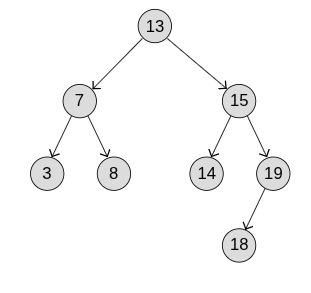
- **Velikost stromu** je počet uzlů v něm (n).
- **Podstrom** začíná jedním z uzlů ve stromu jako lokálním kořenem a skládá se z tohoto uzlu a všech jeho potomků.
- **Potomky (descendants)** uzlu jsou všechny dceřiné uzly tohoto uzlu a všechny jejich dceřiné uzly atd. Stačí začít s uzlem a potomky budou všechny uzly, které jsou připojeny pod tímto uzlem.
- **Výška uzlu** je maximální počet hran mezi tímto uzlem a listovým uzlem.
- **Nástupcem uzlu v pořadí** je uzel, který následuje po něm, pokud bychom prováděli průchod v pořadí. Průchod v pořadí výše uvedeného BST by vedl k tomu, že uzel 13 by byl před uzlem 14, a proto je nástupcem uzlu 13 uzel 14.
---
###### Procházení binárního vyhledávacího stromu
- Abychom se ujistili, že máme před sebou skutečně datovou strukturu binárního vyhledávacího stromu, můžeme zkontrolovat, zda jsou vlastnosti uvedené v horní části této stránky pravdivé. U každého uzlu na obrázku výše tedy zkontrolujte, zda jsou všechny hodnoty vlevo od uzlu nižší a všechny hodnoty vpravo vyšší.
- Dalším způsobem, jak zkontrolovat, zda je binární strom BST, je provést průchod v pořadí (jak jsme to udělali na předchozí stránce) a zkontrolovat, zda je výsledný seznam hodnot v vzestupném pořadí.
- Níže uvedený kód je implementací binárního vyhledávacího stromu na obrázku výše s průchodem.
```csharp
class TreeNode
{
    public int Data;
    public TreeNode Left;
    public TreeNode Right;
    public TreeNode(int data)
    {
        Data = data;
        Left = null;
        Right = null;
    }
}

class Program
{
    static void InOrderTraversal(TreeNode node)
    {
        if (node == null)
            return;
        InOrderTraversal(node.Left);
        Console.Write(node.Data + ", ");
        InOrderTraversal(node.Right);
    }
    static void Main()
    {
        // Vytvoření uzlů
        TreeNode root = new TreeNode(13);
        TreeNode node7 = new TreeNode(7);
        TreeNode node15 = new TreeNode(15);
        TreeNode node3 = new TreeNode(3);
        TreeNode node8 = new TreeNode(8);
        TreeNode node14 = new TreeNode(14);
        TreeNode node19 = new TreeNode(19);
        TreeNode node18 = new TreeNode(18);
        // Propojení uzlů
        root.Left = node7;
        root.Right = node15;
        
        node7.Left = node3;
        node7.Right = node8;
        
        node15.Left = node14;
        node15.Right = node19;
        
        node19.Left = node18;
        // Traversal
        InOrderTraversal(root); // Výstup: 3, 7, 8, 13, 14, 15, 18, 19,
    }
}
```
- Jak můžeme vidět po spuštění výše uvedeného příkladu kódu, průchod v pořadí vytváří seznam čísel v rostoucím (vzestupném) pořadí, což znamená, že tento binární strom je binární vyhledávací strom.
---
###### Hledání hodnoty v BST
- Hledání hodnoty v BST je velmi podobné tomu, jak jsme hledali hodnotu pomocí binárního vyhledávání v poli.
- Aby binární vyhledávání fungovalo, musí být pole již seřazeno, a pak lze hledání hodnoty v poli provést opravdu rychle.
- Podobně lze i hledání hodnoty v BST provést opravdu rychle díky tomu, jak jsou uzly umístěny.
- Jak to funguje:
	1. Začněte u kořenového uzlu.
	2. Pokud je to hodnota, kterou hledáme, vraťte se.
	3. Pokud je hodnota, kterou hledáme, vyšší, pokračujte v hledání v pravém podstromu.
	4. Pokud je hodnota, kterou hledáme, nižší, pokračujte v hledání v levém podstromu.
	5. Pokud podstrom, ve kterém chceme hledat, neexistuje, v závislosti na programovacím jazyku vraťte `None`, `NULL` nebo něco podobného, abyste označili, že hodnota není uvnitř BST.
- Pomocí níže uvedené animace si můžete prohlédnout, jak hledáme hodnotu v binárním vyhledávacím stromu.
- 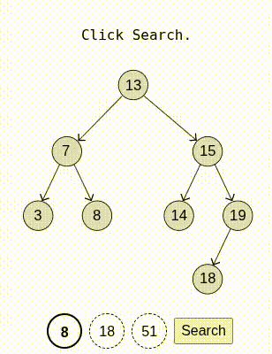
- Výše uvedený algoritmus lze implementovat takto:
```csharp
// používáme class TreeNode z předchozího příkladu
static TreeNode Search(TreeNode node, int target)
{
    if (node == null) // Pokud je konec stromu, vrať null, indikující že se hodnota ve stromě nenachází
        return null;
    else if (node.Data == target) // nebo pokud jsme našli to co hledáme vrať node, kde se hodnota nachází 
        return node;
    else if (target < node.Data) // nebo pokud je hodnota co hledáme menší, než je momentální node, pokračuj vlevo
        return Search(node.Left, target);
    else // jinak pokračuj vpravo, jelikož hodnota může být pouze větší
        return Search(node.Right, target); 
}
```
- Časová složitost vyhledávání hodnoty v BST je O(h), kde h je výška stromu.
- Například u BST, kde je většina uzlů na pravé straně, je výška stromu větší, než je nutné, a vyhledávání v nejhorším případě bude trvat déle. Takové stromy se nazývají nevyvážené.
- 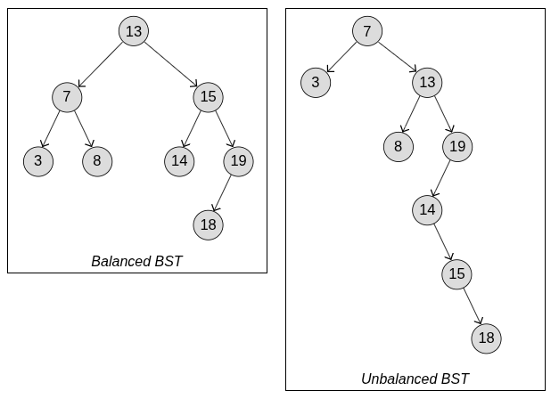
- Oba výše uvedené binární vyhledávací stromy mají stejné uzly a postupné procházení obou stromů nám dává stejný výsledek, ale výška je velmi odlišná. Vyhledávání v nevyváženém stromu výše trvá déle, protože je vyšší.
- Zde pak přichází hlavní výhoda AVL stromů. AVL stromy jsou samovyvažující, což znamená, že výška stromu je udržována na minimu, aby operace jako vyhledávání, vkládání a mazání trvaly méně času.
--- 
###### Vložení uzlu do BST
- Vložení uzlu do BST je podobné jako vyhledávání hodnoty.
- Jak to funguje:
	1. Začněte u kořenového uzlu.
	2. Porovnejte každý uzel:
	3. Je hodnota nižší? Jděte doleva.
	4. Je hodnota vyšší? Jděte doprava.
	5. Pokračujte v porovnávání uzlů s novou hodnotou, dokud není co porovnávat vpravo nebo vlevo. Tam se vloží nový uzel.
- Vkládání uzlů popsaným způsobem znamená, že vložený uzel se vždy stane novým listovým uzlem.
- Pomocí níže uvedené simulace si můžete prohlédnout, jak se vkládají nové uzly.
- 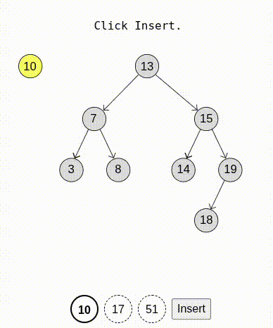
- Všechny uzly v BST jsou jedinečné, takže pokud najdeme stejnou hodnotu jako tu, kterou chceme vložit, neprovedeme žádnou akci.
- Takto lze implementovat vkládání uzlů do BST:
```csharp
// Používáme TreeNode třídu z minulé ukázky
static TreeNode Insert(TreeNode node, int data)
{
    if (node == null) // Pokud jsme narazili na "prázdné místo", vytvoříme nový uzel 
    {
        return new TreeNode(data);
    }
    else
    {
        if (data < node.Data) // Pokud je nová hodnota menší než hodnota uzlu, jdeme do levého podstromu
            node.Left = Insert(node.Left, data);
        else if (data > node.Data) // Pokud je nová hodnota větší než hodnota uzlu, jdeme do pravého podstromu
            node.Right = Insert(node.Right, data);
        // Pokud je hodnota rovna, BST typicky ignoruje duplikát (žádná akce)
    }
    // Vracíme aktuální uzel zpět, aby rodič věděl, kde je jeho levý/pravý potomek
    return node;
}

// Použití insert
static void Main()
{
    TreeNode root = null; // Na začátku je strom prázdný
    // Vkládání hodnot do BST
    root = Insert(root, 13);
    root = Insert(root, 7);
    root = Insert(root, 15);
    root = Insert(root, 3);
    root = Insert(root, 8);
    root = Insert(root, 14);
    root = Insert(root, 19);
    root = Insert(root, 18);
    Console.WriteLine("BST created successfully!");
}
```
---
###### Najít nejnižší hodnotu v podstromu BST
- V další části vysvětlíme, jak můžeme odstranit uzel v BST, ale k tomu potřebujeme funkci, která najde nejnižší hodnotu v podstromu uzlu.
- Jak to funguje:
	1. Začněte u kořenového uzlu podstromu.
	2. Jděte co nejvíce doleva.
	3. Uzel, ve kterém skončíte, je uzel s nejnižší hodnotou v daném podstromu BST.
- Na obrázku níže, pokud začneme u uzlu 13 a budeme pokračovat doleva, skončíme v uzlu 3, který má nejnižší hodnotu, že?
- A pokud začneme u uzlu 15 a budeme pokračovat doleva, skončíme v uzlu 14, který má nejnižší hodnotu v podstromu uzlu 15.
- 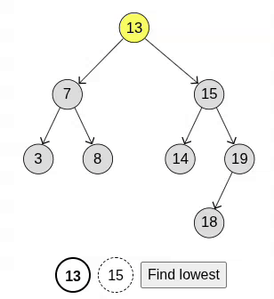
- Takto vypadá funkce pro nalezení nejnižší hodnoty v podstromu uzlu BST:

```csharp
static TreeNode FindMinValueNode(TreeNode node)
{
	TreeNode current = node; // Začneme u daného uzlu
    // Procházíme strom doleva, protože nejmenší hodnota v BST je vždy uzel nejvíce nalevo
    while (current.Left != null) // Dokud uzel má levého potomka, nastavte jeho potomka jako momentální uzel 
    {
	    current = current.Left;
    }
    return current; // Vracíme uzel s minimální hodnotou
} 
```
- Tuto funkci `FindMinValueNode()` použijeme v následující části k nalezení následníka uzlu v pořadí a k odstranění uzlu.
---
###### Odstranění uzlů v BST
- Chcete-li odstranit uzel, musí naše funkce nejprve prohledat BST, aby jej našla.
- Po nalezení uzlu existují tři různé případy, kdy musí být odstranění uzlu provedeno odlišným způsobem.
- Jak to funguje:
	1. Pokud je uzel listovým uzlem, odstraňte jej odstraněním odkazu na něj.
	2. Pokud má uzel pouze jeden podřízený uzel, připojte nadřazený uzel uzlu, který chcete odstranit, k tomuto podřízenému uzlu.
	3. Pokud má uzel pravý i levý podřízený uzel: Najděte následovníka uzlu v pořadí, změňte hodnoty s tímto uzlem a poté jej odstraňte.
- V kroku 3 výše bude následovník, který najdeme, vždy listovým uzlem, a protože se jedná o uzel, který následuje hned za uzlem, který chceme odstranit, můžeme s ním zaměnit hodnoty a odstranit jej.
- Pomocí níže uvedené animace si můžete prohlédnout, jak se odstraňují různé uzly.
- 
- **Uzel 8** je listový uzel (případ 1), takže jakmile jej najdeme, můžeme jej jednoduše smazat.
- **Uzel 19** má pouze jeden podřízený uzel (případ 2). Chceme-li smazat uzel 19, je třeba nejprve propojit nadřazený uzel 15 přímo s uzlem 18 a poté lze uzel 19 odstranit.
- **Uzel 13** má dva podřízené uzly (případ 3). Nalezneme nástupce, uzel, který následuje hned po něm během průchodu v pořadí, tak, že najdeme nejnižší uzel v pravém podstromu uzlu 13, kterým je uzel 14. Hodnota 14 se vloží do uzlu 13 a poté můžeme uzel 14 smazat.
- Takto lze implementovat BST s funkcí pro mazání uzlu:
```csharp
// Odstraní uzel se zadanou hodnotou z BST
    public static TreeNode Delete(TreeNode node, int data)
    {
        if (node == null)
            return null; // Pokud strom je prázdný, nic nevracíme
        // Pokud hledaná hodnota je menší než hodnota uzlu, jdi do levého podstromu
        if (data < node.Data)
        {
            node.Left = Delete(node.Left, data);
        }
        // Pokud hledaná hodnota je větší než hodnota uzlu, jdi do pravého podstromu
        else if (data > node.Data)
        {
            node.Right = Delete(node.Right, data);
        }
        else
        {
            // Nalezen uzel k odstranění
            // Uzel má maximálně jedno dítě nebo žádné
            if (node.Left == null)
            {
                TreeNode temp = node.Right;
                node = null; // Uvolnění aktuálního uzlu
                return temp; // Vracíme dítě (nebo null)
            }
            else if (node.Right == null)
            {
                TreeNode temp = node.Left;
                node = null;
                return temp;
            }
            // Uzel má dvě děti
            // Najdeme in-order successor (minimální hodnotu v pravém podstromu)
            node.Data = MinValueNode(node.Right).Data;
            // Odstraníme in-order successor z pravého podstromu
            node.Right = Delete(node.Right, node.Data);
        }
        return node;
    }
```
---
###### BST ve srovnání s jinými datovými strukturami
- Binární vyhledávací stromy využívají to nejlepší ze dvou jiných datových struktur: polí a propojených seznamů.

| Datová struktura          | Časová náročnost hledání hodnoty | Odstranění / vložení vede k posunu v paměti<br> |
| ------------------------- | -------------------------------- | ----------------------------------------------- |
| Srovnané pole             | **O(log n)**                     | Ano                                             |
| Propojený list            | O(n)                             | **Ne**                                          |
| Binární vyhledávací strom | **O(log n)**                     | **Ne**                                          |
- Vyhledávání v BST je stejně rychlé jako binární vyhledávání v poli, se stejnou časovou složitostí O(log n).
- A mazání a vkládání nových hodnot lze provádět bez posunu prvků v paměti, stejně jako u propojených seznamů.
---
###### BST rovnováha a časová složitost
- V binárním vyhledávacím stromu jsou operace jako vkládání nového uzlu, mazání uzlu nebo vyhledávání uzlu ve skutečnosti O(h). To znamená, že čím vyšší je strom (h), tím déle bude operace trvat.
- Důvod, proč jsme v tabulce výše uvedli, že vyhledávání hodnoty je O(log n), je ten, že to platí, pokud je strom „vyvážený“, jako na obrázku níže.
- 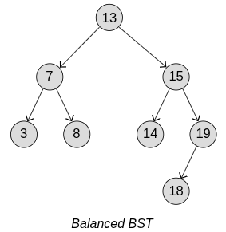
- Tento strom nazýváme vyváženým, protože na levé a pravé straně stromu je přibližně stejný počet uzlů.
- Přesný způsob, jak zjistit, zda je binární strom vyvážený, spočívá v tom, že výška levého a pravého podstromu každého uzlu se liší pouze o jednu jednotku. Na obrázku výše má levý podstrom kořenového uzlu výšku `h = 2` a pravý podstrom má výšku `h = 3`.
- Pro vyvážený BST s velkým počtem uzlů (velké n) dostaneme výšku `h≈log2(n)`, a proto lze časovou složitost pro vyhledávání, mazání nebo vkládání uzlu zapsat jako `O(h)=O(log n)`.
- Pokud je však BST zcela nevyvážený, jako na obrázku níže, výška stromu je přibližně stejná jako počet uzlů, `h ≈ n`, a dostaneme časovou složitost `O(h)=O(n)` pro vyhledávání, mazání nebo vkládání uzlu.
- 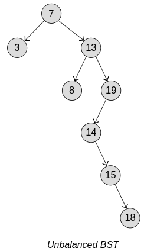
- Pro optimalizaci operací na BST je tedy nutné minimalizovat výšku, a k tomu je třeba strom vyvážit.
---
##### 2.6.3.3 AVL stromy
- AVL strom je typ binárního vyhledávacího stromu pojmenovaný po dvou sovětských vynálezcích Georgiji **A**delsonovi-**V**elském a Evgeniji **L**andisovi, kteří AVL strom vynalezli v roce 1962.
- AVL stromy jsou samovyvažující, což znamená, že výška stromu je udržována na minimu, aby byla zaručena velmi rychlá doba běhu pro vyhledávání, vkládání a mazání uzlů, s časovou složitostí O(log n).
- Jediný rozdíl mezi běžným binárním vyhledávacím stromem a stromem AVL spočívá v tom, že stromy AVL navíc provádějí rotační operace, aby udržely rovnováhu stromu.
- Binární vyhledávací strom je v rovnováze, když je rozdíl ve výšce mezi levým a pravým podstromem menší než 2.
- Udržováním rovnováhy zajišťuje strom AVL minimální výšku stromu, což znamená, že operace vyhledávání, vkládání a mazání lze provádět opravdu rychle.
- 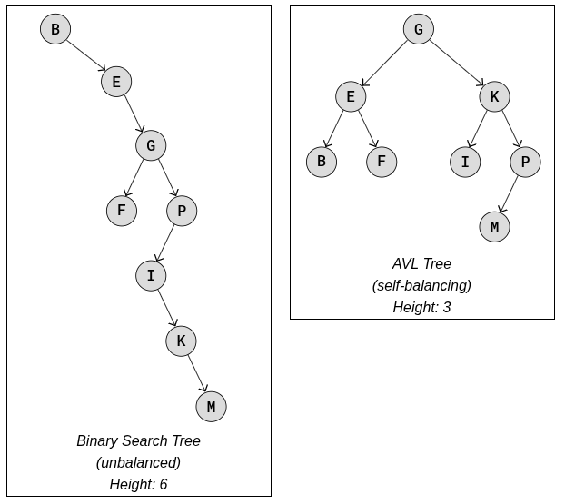
- Oba výše uvedené stromy jsou binární vyhledávací stromy, mají stejné uzly a stejné pořadí procházení (abecední), ale jejich výška se velmi liší, protože AVL strom se sám vyvážil.
- Projděte si v animaci níže postup sestavení AVL stromu a podívejte se, jak se aktualizují vyvažovací faktory a jak se provádějí rotační operace, když je třeba obnovit vyvážení.
- 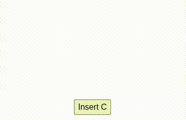
---
###### Levé a pravé rotace
- K obnovení rovnováhy v AVL stromu se provádějí levé nebo pravé rotace, případně kombinace levých a pravých rotací.
- Předchozí animace ukazuje jednu konkrétní levou rotaci a jednu konkrétní pravou rotaci.
- Obecně se však levé a pravé rotace provádějí tak, jak je znázorněno v animaci níže.
- 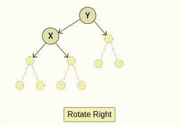
- Všimněte si, jak podstrom mění svého rodiče. Podstromy mění rodiče tímto způsobem během rotace, aby zachovaly správné pořadí procházení a vlastnost BST, že levý potomek je menší než pravý potomek, pro všechny uzly ve stromu.
- Mějte také na paměti, že to není vždy kořenový uzel, který se stane nevyváženým a vyžaduje rotaci.
---
###### Faktor rovnováhy
- Faktor vyváženosti uzlu je rozdíl ve výškách podstromů.
- Výšky podstromů jsou uloženy v každém uzlu pro všechny uzly v AVL stromu a faktor vyváženosti se počítá na základě výšek podstromů, aby se zkontrolovalo, zda strom není nevyvážený.
- Výška podstromu je počet hran mezi kořenovým uzlem podstromu a nejnižším listovým uzlem v tomto podstromu.
- **Faktor vyváženosti** (BF) pro uzel (X) je rozdíl ve výšce mezi jeho pravým a levým podstromem.
	- `BF(X)=height(rightSubtree(X))−height(leftSubtree(X))`
- Hodnoty vyvažovacího faktoru
	- `0`: Uzel je vyvážený.
	- `Více než 0`: Uzel je „těžký na pravé straně”.
	- `Méně než 0`: Uzel je „těžký na levé straně”.
- Pokud je vyvažovací faktor menší než -1 nebo větší než 1 pro jeden nebo více uzlů ve stromu, strom se považuje za nevyvážený a k obnovení vyváženosti je nutná rotační operace.
---
###### Čtyři případy „nerovnováhy“
- Pokud je faktor rovnováhy pouze jednoho uzlu menší než -1 nebo větší než 1, strom je považován za nevyvážený a k obnovení rovnováhy je nutná rotace.
- Existují čtyři různé způsoby, jak může být strom AVL nevyvážený, a každý z těchto případů vyžaduje jinou rotační operaci.

| Případ           | Popis                                                                        | Rotace k obnovení rovnováhy<br>                                                                          |
| ---------------- | ---------------------------------------------------------------------------- | -------------------------------------------------------------------------------------------------------- |
| Left-Left (LL)   | Nevyvážený uzel a jeho levý podřízený uzel jsou oba levostranně těžké.       | Jedna pravá rotace.                                                                                      |
| Right-Right (RR) | Nevyvážený uzel a jeho pravý podřízený uzel jsou oba pravostranně těžké.     | Jedna levá rotace.                                                                                       |
| Left-Right (LR)  | Nerovnovážný uzel je těžký vlevo a jeho levý podřízený uzel je těžký vpravo. | Nejprve proveďte levou rotaci na levém podřízeném uzlu, poté proveďte pravou rotaci na nevyváženém uzlu. |
| Right-Left (RL)  | Nevyvážený uzel je těžký vpravo a jeho pravý podřízený uzel je těžký vlevo.  | Nejprve proveďte pravou rotaci na levém podřízeném uzlu, poté proveďte levou rotaci na nevyváženém uzlu. |

---
###### Případ Left-Left (LL)
- Uzel, ve kterém je zjištěna nerovnováha, která je levá, a levý poduzel tohoto uzlu je taky v levé nerovnováze.
- Když dojde k tomuto případu LL, stačí k obnovení rovnováhy jediná pravá rotace na nevyváženém uzlu.
- Projděte si níže uvedenou animaci, abyste viděli případ LL a jak je rovnováha obnovena jedinou pravou rotací.
- 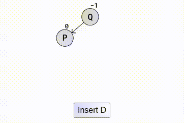
- Při procházení animací výše dojde ke dvěma případům LL:
	- Po přidání `D` se faktor rovnováhy `Q` změní na `-2`, což znamená, že strom je nevyvážený. Jedná se o případ LL, protože jak nevyvážený uzel `Q`, tak jeho levý podřízený uzel `P` jsou nevyvážené vlevo (záporné faktory rovnováhy). Jedna pravá rotace na uzlu `Q` obnoví rovnováhu stromu.
	- Po přidání uzlů `L`, `C` a `B` je vyvažovací faktor `P` `-2`, což znamená, že strom je nevyvážený. Jedná se také o případ LL, protože jak nevyvážený uzel `P`, tak jeho levý podřízený uzel `D` jsou nevyvážené vlevo. Jedna pravá rotace obnoví rovnováhu.
- Když se případ LL vyskytne podruhé v animaci výše, provede se pravá rotace a `L` se změní z pravého potomka `D` na levého potomka `P`. 
- Rotace se provádějí tímto způsobem, aby se zachovalo správné pořadí procházení (v animaci výše „`B`, `C`, `D`, `L`, `P`, `Q`“). Dalším důvodem pro změnu rodiče při provedení rotace je zachování vlastnosti BST, že levý potomek je vždy nižší než uzel a pravý potomek je vždy vyšší.
---
###### Případ Right-Right (RR)
- Případ Right-Right nastává, když je uzel nevyvážený vpravo, a pravý podřízený uzel je také nevyvážený vpravo.
- K obnovení rovnováhy v případě RR stačí jediná levá rotace u nevyváženého uzlu.
- 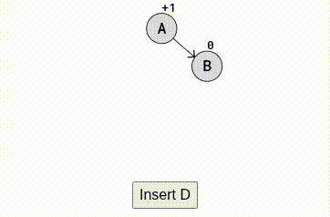
- Případ RR se v animace výše vyskytuje dvakrát:
	- Po vložení uzlu `D` dojde k nerovnováze uzlu `A` a uzly `A` i `B` jsou nevyvážené na pravé straně. Levá rotace uzlu `A` obnoví rovnováhu stromu.
	- Po vložení uzlů `E`, `C` a `F` dojde k nerovnováze uzlu `B`. Jedná se o případ RR, protože uzel `B` i jeho pravý podřízený uzel `D` je nevyvážený na pravé straně. Levá rotace obnoví rovnováhu stromu.
---
###### Případ Left-Right (LR)
- Případ levá-pravá nastává, když je nevyvážený uzel nevyvážený na levé straně, ale jeho levý podřízený uzel je nevyvážený na pravé straně.
- V tomto případě LR se nejprve provede levá rotace levého podřízeného uzlu a poté pravá rotace původního nevyváženého uzlu.
- Projděte si níže uvedenou animaci a podívejte se, jak může nastat případ Left-Right a jak se provádějí rotační operace k obnovení rovnováhy.
- 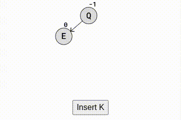
- Při vytváření stromu AVL v animace výše dochází dvakrát k případu levá-pravá a k obnovení rovnováhy jsou nutné a provedeny rotační operace:
	- Po vložení K se uzel Q dostane do nerovnováhy s rovnovážným faktorem -2, takže je těžký na levé straně, a jeho levý potomek E je těžký na pravé straně, takže se jedná o případ levá-pravá.
	- Po vložení uzlů C, F a G se uzel K stane nevyváženým a těžším na levé straně, přičemž jeho levý podřízený uzel E je těžší na pravé straně, takže se jedná o případ levá-pravá.
---
###### Případ Right-Left (RL)
- Případ vpravo-vlevo nastává, když je nevyvážený uzel nevyvážený vpravo a jeho pravý podřízený uzel je nevyvážený vlevo.
- V tomto případě nejprve provedeme pravou rotaci pravého podřízeného uzlu nevyváženého uzlu a poté provedeme levou rotaci samotného nevyváženého uzlu.
- Projděte si níže uvedenou animaci a podívejte se, jak může nastat případ vpravo-vlevo a jak se provádějí rotace k obnovení rovnováhy.
- 
- Po vložení uzlu `B` dostaneme případ Right-Left, protože uzel `A` se stane nevyváženým vpravo a jeho pravý potomek je nevyvážený vlevo. Pro obnovení rovnováhy se nejprve provede pravá rotace uzlu `F` a poté levá rotace uzlu `A`.
- Další případ Right-Left nastane po přidání uzlů `G`, `E` a `D`. Jedná se o případ Right-Left, protože `B` je nevyvážený vpravo a jeho pravý potomek `F` je nevyvážený vlevo. Pro obnovení rovnováhy se nejprve provede pravá rotace na uzlu `F` a poté levá rotace na uzlu `B`.
---
###### Zpětné sledování v AVL stromech
- Po vložení nebo odstranění uzlu v AVL stromu může dojít k jeho nevyváženosti.
- Abychom zjistili, zda je strom nevyvážený, musíme aktualizovat výšky a přepočítat vyvažovací faktory všech předků uzlů.
- Tento proces, známý jako zpětné sledování, se provádí pomocí rekurze. 
- Jak se rekurzivní volání po vložení nebo odstranění šíří zpět ke kořenu, aktualizuje se výška každého předka uzlu a přepočítává se faktor vyváženosti. 
- Pokud se zjistí, že některý předek uzlu má faktor vyváženosti mimo rozsah -1 až 1, provede se u tohoto uzlu rotace, aby se obnovila vyváženost stromu.
- V níže uvedené simulaci jsou po vložení uzlu `F` uzly `C`, `E` a `H` všechny nevyvážené, ale protože zpětné sledování funguje prostřednictvím rekurze, je nejprve zjištěna a opravena nevyváženost v uzlu `H`, což v tomto případě opraví také nevyváženost v uzlech `E` a `C`.
- 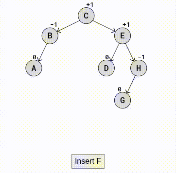
- Po vložení uzlu `F` se kód vrátí zpět a vypočítá vyvažovací faktory při šíření zpět směrem k kořenovému uzlu. Po dosažení uzlu `H` a výpočtu vyvažovacího faktoru `-2` se provede pravá rotace. Teprve po provedení této rotace bude kód pokračovat ve zpětném sledování a vypočítá vyvažovací faktory dále nahoru na předcích uzlech `E` a `C`.
- Kvůli rotaci zůstanou vyvažovací faktory pro uzly `E` a `C` stejné jako před vložením uzlu `F`.
---
###### Vložení uzlu do AVL stromu
- Tento kód je založen na implementaci BST pro vkládání uzlů.
- Ve srovnání s BST má každý uzel v AVL stromu pouze jeden nový atribut, a to výšku, ale kvůli způsobu, jakým se AVL strom sám vyvažuje, je pro implementaci AVL stromu zapotřebí mnoho nových funkcí a dalších řádků kódu.
- Níže uvedená implementace vytváří strom AVL na základě seznamu znaků, aby vytvořila strom AVL v simulaci výše. Poslední vkládaný uzel `F` také spouští pravou rotaci, stejně jako v simulaci výše.
```csharp
using System;

class TreeNode
{
    public string Data;     // Hodnota uzlu
    public TreeNode Left;   // Levý potomek
    public TreeNode Right;  // Pravý potomek
    public int Height;      // Výška uzlu v AVL stromu

    public TreeNode(string data)
    {
        Data = data;
        Left = null;
        Right = null;
        Height = 1; // Nově vložený uzel má výšku 1
    }
}

class AVLTree
{
    // Vrátí výšku uzlu, pokud je null → výška 0
    public static int GetHeight(TreeNode node)
    {
        return node == null ? 0 : node.Height;
    }
    // Rovnováha = výška levého podstromu - výška pravého podstromu
    public static int GetBalance(TreeNode node)
    {
        return node == null ? 0 : GetHeight(node.Left) - GetHeight(node.Right);
    }
    // Pravotočivá rotace (Right Rotate)
    public static TreeNode RightRotate(TreeNode y)
    {
        Console.WriteLine("Rotate right on node " + y.Data);
        
        TreeNode x = y.Left;
        TreeNode T2 = x.Right;
        // Provedení rotace
        x.Right = y;
        y.Left = T2;
        // Aktualizace výšek
        y.Height = 1 + Math.Max(GetHeight(y.Left), GetHeight(y.Right));
        x.Height = 1 + Math.Max(GetHeight(x.Left), GetHeight(x.Right));
        // Vrací nový kořen podstromu
        return x;
    }
    // Levotočivá rotace (Left Rotate)
    public static TreeNode LeftRotate(TreeNode x)
    {
        Console.WriteLine("Rotate left on node " + x.Data);
        TreeNode y = x.Right;
        TreeNode T2 = y.Left;
        // Rotace
        y.Left = x;
        x.Right = T2;
        // Aktualizace výšek
        x.Height = 1 + Math.Max(GetHeight(x.Left), GetHeight(x.Right));
        y.Height = 1 + Math.Max(GetHeight(y.Left), GetHeight(y.Right));
        // Vrací nový kořen podstromu
        return y;
    }
    // Vložení do AVL stromu
    public static TreeNode Insert(TreeNode node, string data)
    {
        // Normální BST vložení
        if (node == null)
            return new TreeNode(data);
            
        if (string.Compare(data, node.Data) < 0)
            node.Left = Insert(node.Left, data);
        else if (string.Compare(data, node.Data) > 0)
            node.Right = Insert(node.Right, data);
        // Aktualizace výšky po vložení
        node.Height = 1 + Math.Max(GetHeight(node.Left), GetHeight(node.Right));
        // Zjištění, zda není podstrom nevyvážený
        int balance = GetBalance(node);
        // --- 4 případy vyvažování ---
        // 1) Left-Left
        if (balance > 1 && GetBalance(node.Left) >= 0)
            return RightRotate(node);
        // 2) Left-Right
        if (balance > 1 && GetBalance(node.Left) < 0)
        {
            node.Left = LeftRotate(node.Left);
            return RightRotate(node);
        }
        // 3) Right-Right
        if (balance < -1 && GetBalance(node.Right) <= 0)
            return LeftRotate(node);
        // 4) Right-Left
        if (balance < -1 && GetBalance(node.Right) > 0)
        {
            node.Right = RightRotate(node.Right);
            return LeftRotate(node);
        }
        // Pokud je vše v pořádku, vrací nezměněný uzel
        return node;
    }
    // In-order průchod (vzestupné pořadí)
    public static void InOrderTraversal(TreeNode node)
    {
        if (node == null)
            return;
        InOrderTraversal(node.Left);
        Console.Write(node.Data + ", ");
        InOrderTraversal(node.Right);
    }
    // Test
    static void Main()
    {
        TreeNode root = null;
        string[] letters = { "C", "B", "E", "A", "D", "H", "G", "F" };
        foreach (string letter in letters)
        {
            root = Insert(root, letter);
        }
        Console.WriteLine("\nIn-order traversal:");
        InOrderTraversal(root);
    }
}

```
---
###### Odstranění uzlu do AVL stromu
- Při mazání uzlu, který není listovým uzlem, vyžaduje AVL strom funkci `minValueNode()`, aby našla další uzel v pořadí procházení. Je to stejné jako při mazání uzlu v binárním vyhledávacím stromu, jak bylo vysvětleno na předchozí stránce.
- K mazání uzlu v AVL stromu je zapotřebí stejný kód pro obnovení rovnováhy jako pro vložení uzlu.
```csharp
public static TreeNode MinValueNode(TreeNode node)
{
    // Nejmenší hodnota v BST je vždy úplně vlevo
    TreeNode current = node;
    while (current.Left != null)
        current = current.Left;
    return current;
}

public static TreeNode Delete(TreeNode node, string data)
{
    // Normální BST mazání
    if (node == null)
        return node;
    // Vyhledání uzlu k odstranění
    if (string.Compare(data, node.Data) < 0)
    {
        node.Left = Delete(node.Left, data);
    }
    else if (string.Compare(data, node.Data) > 0)
    {
        node.Right = Delete(node.Right, data);
    }
    else
    {
        // --- Uzel nalezen ---
        // 1) Uzel má pouze pravého potomka nebo žádného
        if (node.Left == null)
        {
            TreeNode temp = node.Right;
            node = null; // Uvolnění
            return temp;
        }
        // 2) Uzel má pouze levého potomka
        else if (node.Right == null)
        {
            TreeNode temp = node.Left;
            node = null;
            return temp;
        }
        // 3) Uzel má dva potomky:
        // najdeme in-order successor (nejmenší z pravého podstromu)
        TreeNode temp = MinValueNode(node.Right);
        // Nahradíme hodnotu uzlu
        node.Data = temp.Data;
        // Odstraníme successor z pravého podstromu
        node.Right = Delete(node.Right, temp.Data);
    }
    // Pokud bylo node odstraněno, nemá smysl dále vyvažovat
    if (node == null)
        return node;
    // --- Aktualizace výšky po smazání ---
    node.Height = 1 + Math.Max(GetHeight(node.Left), GetHeight(node.Right));
    // Spočítání balancujícího faktoru
    int balance = GetBalance(node);
    // --- 4 případy vyvažování AVL stromu ---
    // 1) Left-Left
    if (balance > 1 && GetBalance(node.Left) >= 0)
        return RightRotate(node);
    // 2) Left-Right
    if (balance > 1 && GetBalance(node.Left) < 0)
    {
        node.Left = LeftRotate(node.Left);
        return RightRotate(node);
    }
    // 3) Right-Right
    if (balance < -1 && GetBalance(node.Right) <= 0)
        return LeftRotate(node);
    // 4) Right-Left
    if (balance < -1 && GetBalance(node.Right) > 0)
    {
        node.Right = RightRotate(node.Right);
        return LeftRotate(node);
    }
    // Jinak strom je vyvážený → vracíme uzel
    return node;
}
```
---
###### Časová složitost pro AVL stromy
- Podívejte se na nevyvážený binární vyhledávací strom níže. Vyhledávání písmene „M“ znamená, že je nutné porovnat všechny uzly kromě jednoho. Vyhledávání písmene „M“ v AVL stromu níže však vyžaduje pouze návštěvu čtyř uzlů.
- V nejhorším případě tedy algoritmy jako vyhledávání, vkládání a mazání musí projít celou výškou stromu. To znamená, že udržení nízké výšky (h) stromu, jako tomu je u stromů AVL, nám poskytuje nižší dobu běhu.
- 
- Podívejte se na srovnání časové složitosti binárních vyhledávacích stromů a AVL stromů níže a na to, jak časová složitost souvisí s výškou (h) stromu a počtem uzlů (n) ve stromu.
- **BST** není samovyvažující. To znamená, že BST může být velmi nevyvážený, téměř jako dlouhý řetězec, kde výška je téměř stejná jako počet uzlů. To zpomaluje operace jako vyhledávání, mazání a vkládání uzlů, s časovou složitostí `O(h)=O(n)`.
- **AVL** strom je však samovyvažující. To znamená, že výška stromu je udržována na minimu, takže operace jako vyhledávání, mazání a vkládání uzlů jsou mnohem rychlejší, s časovou složitostí `O(h)=O(log n)`.
---
###### Vysvětlení O(log n)
- Skutečnost, že časová složitost je `O(h)=O(log n)` pro vyhledávání, vkládání a mazání v AVL stromu s výškou h a uzly n lze vysvětlit takto:
	- Představte si dokonalý binární strom, kde všechny uzly mají dva podřízené uzly kromě nejnižší úrovně, jako je AVL strom níže.
	- 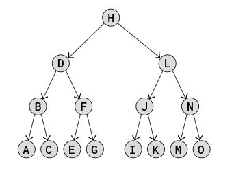
	- Počet uzlů na každé úrovni v takovém AVL stromu je:
		- $1,2,4,8,16,32,..$
	- Což je totéž jako:
		- $2^0,2^1,2^2,2^3,2^4,2^5,..$
	- Chceme-li zjistit počet uzlů n v dokonalém binárním stromu s výškou `h=3`, můžeme sečíst počet uzlů na každé úrovni:
		- $n_3=2^0+2^1+2^2+2^3=15$
	- Což je vlastně totéž jako:
		- $n_3=2^4-1=15$
	- A to platí i pro větší stromy! Pokud chceme zjistit počet uzlů n ve stromu s výškou `h=5`, vypočítáme počet uzlů takto:
		- $n_5=2^6-1=63$
	- Obecně lze tedy vztah mezi výškou h dokonalého binárního stromu a počtem uzlů v něm n vyjádřit takto:
		- $n_h=2^{h+1}-1$
 - Víme, že časová složitost pro vyhledávání, mazání nebo vkládání uzlu v AVL stromu je O(h), ale chceme argumentovat, že časová složitost je ve skutečnosti O(log(n)), takže musíme najít výšku h popsanou počtem uzlů n:
	 - $n_h=2^{h+1}-1$
	 - $n_h+1=2^{h+1}$
	 - $log_2(n_h+1)=log_2(2^{h+1})$
	 - $h=log_2(n+1)-1$
	 - $O(h)=O(log(n))$
- Jak je odvozen poslední řádek výše, nemusí být zřejmé, ale pro binární strom s velkým počtem uzlů (velké n) nejsou členy „+1“ a „-1“ důležité, pokud uvažujeme časovou složitost. 
- Výše uvedený matematický výpočet ukazuje, že časová složitost operací vyhledávání, mazání a vkládání v AVL stromu O(h), může být ve skutečnosti vyjádřena jako O(log n), což je rychlé, mnohem rychlejší než časová složitost pro BST, která je O(n).
---
#### 2.6.4 Výhody
- rychlé vyhledávání
#### 2.6.5 Nevýhody
- může se zvrhnout na seznam, pokud se nevyvažuje
#### 2.6.6 Použití
- databáze (B-stromy)
- souborové systémy
---
### 2.7 Grafy (Graphs)
#### 2.7.1 Popis
- Graf je nelineární datová struktura, která se skládá z vrcholů (uzlů) a hran.
- 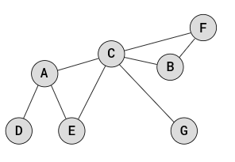
- Vrchol, také nazývaný uzel, je bod nebo objekt v grafu a hrana se používá k propojení dvou vrcholů.
- Grafy jsou nelineární, protože datová struktura nám umožňuje mít různé cesty, jak se dostat z jednoho vrcholu do druhého, na rozdíl od lineárních datových struktur, jako jsou pole nebo propojené seznamy.
- Grafy se používají k reprezentaci a řešení problémů, kde data sestávají z objektů a vztahů mezi nimi, například:
	- Sociální sítě: Každá osoba je vrchol a vztahy (například přátelství) jsou hrany. Algoritmy mohou navrhovat potenciální přátele.
	- Mapy a navigace: Místa, jako města nebo autobusové zastávky, jsou uložena jako vrcholy a silnice jsou uloženy jako hrany. Algoritmy mohou najít nejkratší trasu mezi dvěma místy, pokud jsou uložena jako graf.
	- Internet: Lze znázornit jako graf, kde webové stránky jsou vrcholy a hypertextové odkazy jsou hrany.
	- Biologie: Grafy mohou modelovat systémy, jako jsou neuronové sítě nebo šíření nemocí.
---
#### 2.7.2 Vlastnosti grafů
- Pomocí níže uvedené animace se seznámíte s různými vlastnostmi grafu a s tím, jak lze tyto vlastnosti kombinovat.
- 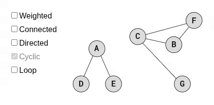
- **Vážený graf** je graf, ve kterém mají hrany hodnoty. Hodnota váhy hrany může představovat například vzdálenost, kapacitu, čas nebo pravděpodobnost.
- **Propojený graf** je graf, ve kterém jsou všechny vrcholy nějakým způsobem propojeny hranami. Graf, který není propojený, je graf s izolovanými (disjunktními) podgrafy nebo s jednotlivými izolovanými vrcholy.
- **Směrový graf**, známý také jako digraf, je graf, ve kterém mají hrany mezi páry vrcholů směr. Směr hrany může představovat například hierarchii nebo tok.
- **Cyklický graf** se definuje odlišně v závislosti na tom, zda je směrový nebo ne:
	- **Směrový** cyklický graf je graf, ve kterém můžete sledovat cestu po směrových hranách, která vede v kruhu. Odstranění směrové hrany z F do G v animaci výše způsobí, že směrový graf již není cyklický.
	- **Neorientovaný** cyklický graf je graf, ve kterém se můžete vrátit ke stejnému vrcholu, ze kterého jste vyrazili, aniž byste použili stejnou hranu více než jednou. Neorientovaný graf výše je cyklický, protože můžeme začít a skončit ve vrcholech C, aniž bychom použili stejnou hranu dvakrát.
- **Smyčka**, také nazývaná vlastní smyčka, je hrana, která začíná a končí ve stejném vrcholu. Smyčka je cyklus, který se skládá pouze z jedné hrany. Přidáním smyčky na vrchol A v animaci výše se graf stává cyklickým.
---
#### 2.7.3 Reprezentace grafu
- Grafické znázornění nám říká, jak je graf uložen v paměti.
- Různá grafická znázornění mohou:
	- zabírat více nebo méně místa.
	- být rychlejší nebo pomalejší při vyhledávání nebo manipulaci.
	- být vhodnější v závislosti na tom, jaký typ grafu máme (vážený, orientovaný atd.) a co s grafem chceme dělat.
	- být snáze srozumitelná a implementovatelná než jiná.
- Níže jsou uvedeny stručné úvody k různým grafickým reprezentacím, ale v tomto tutoriálu budeme pro grafy používat reprezentaci sousední matice, protože je snadno srozumitelná a implementovatelná a funguje ve všech případech relevantních pro tento tutoriál.
- Reprezentace grafů ukládají informace o tom, které vrcholy jsou sousední a jaké jsou hrany mezi vrcholy. Reprezentace grafů se mírně liší, pokud jsou hrany orientované nebo vážené.
- Dva vrcholy jsou sousední, pokud mezi nimi existuje hrana.
---
##### 2.7.3.1 Znázornění grafu pomocí sousední matice (Adjacency Matrix Graph Representation)
- Jak implementovat znázornění grafu pomocí sousední matice je ukázáno níže.
- Sousední matice je 2D pole (matice), kde každá buňka na indexu `(i,j)` ukládá informace o hraně z vrcholu `i` do vrcholu `j`.
- Níže je graf se znázorněním vedle něj.
- 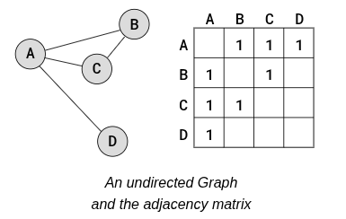
- Výše uvedená sousední matice představuje neorientovaný graf, takže hodnoty „1“ nám pouze udávají, kde se nacházejí hrany. Hodnoty v sousední matici jsou také symetrické, protože hrany směřují oběma směry (neorientovaný graf).
- Chceme-li vytvořit orientovaný graf s maticí sousednosti, musíme rozhodnout, ze kterých vrcholů hrany vycházejí a do kterých směřují, a to vložením hodnoty na správné indexy `(i,j)`. Chceme-li znázornit vážený graf, můžeme do matice sousednosti vložit jiné hodnoty než „1“.
- Níže je uveden orientovaný a vážený graf s maticí sousednosti vedle něj.
- 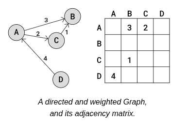
- V výše uvedené sousední matici nám hodnota `3` na indexu `(0,1)` říká, že existuje hrana z vrcholu A do vrcholu B a váha této hrany je `3`.
- Jak vidíte, váhy jsou umístěny přímo do sousední matice pro správnou hranu a u orientovaného grafu nemusí být sousední matice symetrická.
---
##### 2.7.3.2 Zobrazení grafu pomocí seznamů sousedství
- V případě, že máme „řídký“ graf s mnoha vrcholy, můžeme ušetřit místo použitím seznamu sousedství namísto sousední matice, protože sousední matice by rezervovala velké množství paměti na prázdné prvky pole pro hrany, které neexistují.
- „Řídký“ graf je graf, ve kterém má každý vrchol hrany pouze k malé části ostatních vrcholů v grafu.
- Seznam sousedství má pole, které obsahuje všechny vrcholy v grafu, a každý vrchol má propojený seznam (nebo pole) s hranami vrcholu.
- 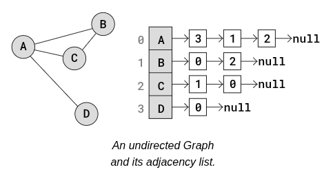
- Ve výše uvedeném seznamu sousedství jsou vrcholy A až D umístěny v poli a každý vrchol v poli má svůj index napsaný hned vedle něj.
- Každý vrchol v poli má ukazatel na propojený seznam, který představuje hrany tohoto vrcholu. Přesněji řečeno, propojený seznam obsahuje indexy sousedních (sousedních) vrcholů.
- Například vrchol A má odkaz na spojovaný seznam s hodnotami 3, 1 a 2. Tyto hodnoty jsou indexy sousedních vrcholů A, D, B a C.
- Seznam sousedství může také představovat orientovaný a vážený graf, jako například tento:
- 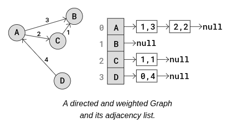
- Ve výše uvedeném seznamu sousedství jsou vrcholy uloženy v poli. Každý vrchol má ukazatel na propojený seznam s hranami uloženými jako `i,w`, kde `i` je index vrcholu, ke kterému hrana směřuje, a `w` je váha této hrany.
- Například uzel D má ukazatel na spojovaný seznam s hranou vedoucí k vrcholu A. Hodnoty `0,4` znamenají, že vrchol D má hranu vedoucí k vrcholu s indexem `0` (vrchol A) a váha této hrany je `4`.
---
#### 2.7.4 Implementace grafů
- Než budeme moci spustit algoritmy na grafu, musíme jej nejprve nějak implementovat.
- K implementaci grafu použijeme sousední matici, jako je ta níže.
- 
- Pro uložení dat pro každý vrchol, v tomto případě písmena A, B, C a D, se data umístí do samostatného pole, které odpovídá indexům v matici sousednosti, takto:
- `vertexData = [ 'A', 'B', 'C', 'D']`
- U neorientovaného a neváženého grafu, jako na obrázku výše, je hrana mezi vrcholy `i` a `j` uložena s hodnotou `1`. Je uložena jako `1` na obou místech `(j,i)` a `(i,j)`, protože hrana vede v obou směrech. Jak vidíte, matice se u takových ne-směrových grafů stává diagonálně symetrickou.
- Podívejme se na něco konkrétnějšího. Ve výše uvedené sousední matici je vrchol A na indexu `0` a vrchol D na indexu `3`, takže hranu mezi A a D uložíme jako hodnotu `1` na pozici `(0,3)` a `(3,0)`, protože hrana vede v obou směrech.
- Níže je uvedena základní implementace neorientovaného grafu z obrázku výše.
```csharp
class Program
{
    static void Main()
    {
        // Data vrcholů grafu
        string[] vertexData = { "A", "B", "C", "D" };
        // Adjacency matrix (maticová reprezentace grafu)
        int[,] adjacencyMatrix = {
            { 0, 1, 1, 1 }, // Hrany pro A
            { 1, 0, 1, 0 }, // Hrany pro B
            { 1, 1, 0, 0 }, // Hrany pro C
            { 1, 0, 0, 0 }  // Hrany pro D
        };
        // Výpis vertex dat
        Console.WriteLine("vertexData: " + string.Join(", ", vertexData));
        // Výpis adjacency matrix
        PrintAdjacencyMatrix(adjacencyMatrix);
    }
    // Funkce pro vypsání adjacency matrix
    static void PrintAdjacencyMatrix(int[,] matrix)
    {
        Console.WriteLine("\nAdjacency Matrix:");
        int rows = matrix.GetLength(0);
        int cols = matrix.GetLength(1);
        for (int r = 0; r < rows; r++)
        {
            Console.Write("[ ");
            for (int c = 0; c < cols; c++)
            {
                Console.Write(matrix[r, c] + " ");
            }
            Console.WriteLine("]");
        }
    }
}
```
- Tato implementace je v podstatě jen dvourozměrné pole, ale abychom lépe pochopili, jak jsou vrcholy propojeny hranami v grafu, který jsme právě implementovali, můžeme spustit tuto funkci:
```csharp
// Funkce pro vypsání všech spojení pro každý vrchol
static void PrintConnections(int[,] matrix, string[] vertices)
{
    Console.WriteLine("\nConnections for each vertex:");

    int count = vertices.Length;

    for (int i = 0; i < count; i++)
    {
        Console.Write(vertices[i] + ": ");

        for (int j = 0; j < count; j++)
        {
            // Pokud je v matici hodnota 1, znamená to existenci hrany
            if (matrix[i, j] == 1)
            {
                Console.Write(vertices[j] + " ");
            }
        }

        Console.WriteLine(); // nový řádek
    }
}
```
---
#### 2.7.5 Implementace grafů za pomocí tříd
- Vhodnějším způsobem ukládání grafu je přidání abstrakční vrstvy pomocí tříd, aby vrcholy, hrany a relevantní metody grafu, jako jsou algoritmy, které implementujeme později, byly obsaženy na jednom místě.
- Programovací jazyky s vestavěnou objektově orientovanou funkcionalitou, jako jsou Python a Java, usnadňují implementaci grafů pomocí tříd mnohem více než jazyky jako C, které tuto vestavěnou funkcionalitu nemají.
- 
- Zde je ukázáno, jak lze výše uvedený neorientovaný graf implementovat pomocí tříd.
```csharp
using System;

class Graph
{
    private int[,] adjMatrix;   // Adjacency matrix
    private string[] vertexData; // Data pro jednotlivé vrcholy
    private int size;
    // Konstruktor
    public Graph(int size)
    {
        this.size = size;
        adjMatrix = new int[size, size];
        vertexData = new string[size];
        // Inicializace vertexData prázdnými stringy
        for (int i = 0; i < size; i++)
        {
            vertexData[i] = "";
        }
    }
    // Přidání hrany mezi vrcholy u a v
    public void AddEdge(int u, int v)
    {
        if (u >= 0 && u < size && v >= 0 && v < size)
        {
            adjMatrix[u, v] = 1;
            //adjMatrix[v, u] = 1; // neorientovaný graf
        }
    }
    // Přiřazení dat vrcholu
    public void AddVertexData(int vertex, string data)
    {
        if (vertex >= 0 && vertex < size)
        {
            vertexData[vertex] = data;
        }
    }
    // Vypsání grafu
    public void PrintGraph()
    {
        Console.WriteLine("Adjacency Matrix:");
        for (int i = 0; i < size; i++)
        {
            for (int j = 0; j < size; j++)
            {
                Console.Write(adjMatrix[i, j] + " ");
            }
            Console.WriteLine();
        }
        Console.WriteLine("\nVertex Data:");
        for (int i = 0; i < size; i++)
        {
            Console.WriteLine($"Vertex {i}: {vertexData[i]}");
        }
    }
}
// Použití
class Program
{
    static void Main()
    {
        Graph g = new Graph(4);
        g.AddVertexData(0, "A");
        g.AddVertexData(1, "B");
        g.AddVertexData(2, "C");
        g.AddVertexData(3, "D");
        
        g.AddEdge(0, 1); // A - B
        g.AddEdge(0, 2); // A - C
        g.AddEdge(0, 3); // A - D
        g.AddEdge(1, 2); // B - C
        
        g.PrintGraph();
    }
}
```
---
#### 2.7.6 Implementace směrových a vážených grafů
- K implementaci orientovaného a váženého grafu stačí provést několik změn v předchozí implementaci neorientovaného grafu.
- K vytvoření orientovaného grafu stačí odstranit řádek 10 v předchozím příkladu kódu, aby matice již nebyla automaticky symetrická.
- Druhou změnou, kterou musíme provést, je přidání argumentu `weight` do metody `add_edge()`, aby místo hodnoty `1`, která označuje, že mezi dvěma vrcholy existuje hrana, použili jsme k definování hrany skutečnou hodnotu váhy.
- 
- Níže je uvedena implementace výše uvedeného orientovaného a váženého grafu.
```csharp
class Graph
{
    private int?[,] adjMatrix; // Adjacency matrix s možností null (žádná hrana)
    private string[] vertexData; // Data pro vrcholy
    private int size;
    // Konstruktor
    public Graph(int size)
    {
        this.size = size;
        adjMatrix = new int?[size, size]; // null znamená žádnou hranu
        vertexData = new string[size];
        // Inicializace vertexData prázdnými stringy
        for (int i = 0; i < size; i++)
        {
            vertexData[i] = "";
        }
    }
    // Přidání hrany s váhou
    public void AddEdge(int u, int v, int weight)
    {
        if (u >= 0 && u < size && v >= 0 && v < size)
        {
            adjMatrix[u, v] = weight;
            adjMatrix[v, u] = weight; // neorientovaný graf
        }
    }
    // Přiřazení dat vrcholu
    public void AddVertexData(int vertex, string data)
    {
        if (vertex >= 0 && vertex < size)
        {
            vertexData[vertex] = data;
        }
    }
    // Vypsání grafu
    public void PrintGraph()
    {
        Console.WriteLine("Adjacency Matrix:");
        for (int i = 0; i < size; i++)
        {
            for (int j = 0; j < size; j++)
            {
                // pokud není hrana, vypíše 0
                Console.Write((adjMatrix[i, j] != null ? adjMatrix[i, j].ToString() : "0") + " ");
            }
            Console.WriteLine();
        }
        Console.WriteLine("\nVertex Data:");
        for (int i = 0; i < size; i++)
        {
            Console.WriteLine($"Vertex {i}: {vertexData[i]}");
        }
    }
}
// Použití
class Program
{
    static void Main()
    {
        Graph g = new Graph(4);
        g.AddVertexData(0, "A");
        g.AddVertexData(1, "B");
        g.AddVertexData(2, "C");
        g.AddVertexData(3, "D");
        
        g.AddEdge(0, 1, 3); // A - B váha 3
        g.AddEdge(0, 2, 2); // A - C váha 2
        g.AddEdge(3, 0, 4); // D - A váha 4
        g.AddEdge(2, 1, 1); // C - B váha 1
        
        g.PrintGraph();
    }
}
```
---
#### 2.7.7 Procházení grafů
- Procházet graf znamená začít v jednom vrcholu a postupovat po hranách k dalším vrcholům, dokud nejsou navštíveny všechny vrcholy nebo co nejvíce z nich.
- 
- Porozumění tomu, jak lze procházet graf, je důležité pro pochopení fungování algoritmů, které běží na grafech.
- Dva nejběžnější způsoby procházení grafu jsou:
	- Hloubkové prohledávání (DFS)
	- Šířkové prohledávání (BFS)
- DFS se obvykle implementuje pomocí zásobníku nebo rekurze (která využívá zásobník volání), zatímco BFS se obvykle implementuje pomocí fronty.
	- Zásobník volání udržuje funkce v správném pořadí.
	- Pokud například funkce A volá funkci B, funkce B se umístí na vrchol zásobníku volání a začne se provádět. Jakmile je funkce B dokončena, je ze zásobníku odstraněna a funkce A pokračuje ve své práci.
---
##### 2.7.7.1 Procházení metodou prohledávání do hloubky
- Hloubkové prohledávání se nazývá „hlubokým“, protože navštíví vrchol, poté sousední vrchol, poté sousední vrchol tohoto vrcholu a tak dále, a tímto způsobem se vzdálenost od počátečního vrcholu zvyšuje s každou rekurzivní iterací.
- Jak to funguje:
	- Spusťte prohledávání DFS na vrcholu.
	- Proveďte rekurzivní prohledávání DFS na každém sousedním vrcholu, pokud ještě nebyl navštíven.
- Spusťte animaci níže a podívejte se, jak průchod hloubkovým prohledáváním (DFS) probíhá na konkrétním grafu, počínaje vrcholem D (stejně jako v předchozí animaci).
- 
- Procházení DFS začíná ve vrcholu D a označí vrchol D jako navštívený. Poté se pro každý nový navštívený vrchol rekurzivně volá metoda procházení na všech sousedních vrcholech, které ještě nebyly navštíveny. Když je tedy v animaci výše navštíven vrchol A, vrchol C nebo vrchol E (v závislosti na implementaci) je dalším vrcholem, kde procházení pokračuje.
```csharp
class Graph
{
    private int[,] adjMatrix; // Adjacency matrix (0 = žádná hrana, 1 = hrana existuje)
    private string[] vertexData; // Data pro vrcholy
    private int size;
    // Konstruktor
    public Graph(int size)
    {
        this.size = size;
        adjMatrix = new int[size, size];
        vertexData = new string[size];

        for (int i = 0; i < size; i++)
            vertexData[i] = "";
    }
    // Přidání hrany (neorientovaný graf)
    public void AddEdge(int u, int v)
    {
        if (u >= 0 && u < size && v >= 0 && v < size)
        {
            adjMatrix[u, v] = 1;
            adjMatrix[v, u] = 1;
        }
    }
    // Přiřazení dat vrcholu
    public void AddVertexData(int vertex, string data)
    {
        if (vertex >= 0 && vertex < size)
            vertexData[vertex] = data;
    }
    // Vypsání grafu
    public void PrintGraph()
    {
        Console.WriteLine("Adjacency Matrix:");
        for (int i = 0; i < size; i++)
        {
            for (int j = 0; j < size; j++)
                Console.Write(adjMatrix[i, j] + " ");
            Console.WriteLine();
        }
        Console.WriteLine("\nVertex Data:");
        for (int i = 0; i < size; i++)
            Console.WriteLine($"Vertex {i}: {vertexData[i]}");
    }
    // DFS util (rekurzivní průchod)
    private void DFSUtil(int v, bool[] visited)
    {
        visited[v] = true;
        Console.Write(vertexData[v] + " ");
        for (int i = 0; i < size; i++)
        {
            if (adjMatrix[v, i] == 1 && !visited[i])
                DFSUtil(i, visited);
        }
    }
    // Spuštění DFS od vrcholu podle dat
    public void DFS(string startVertexData)
    {
        bool[] visited = new bool[size];
        int startVertex = Array.IndexOf(vertexData, startVertexData);
        if (startVertex == -1)
        {
            Console.WriteLine($"Vertex '{startVertexData}' not found!");
            return;
        }
        DFSUtil(startVertex, visited);
        Console.WriteLine();
    }
}
// Použití
class Program
{
    static void Main()
    {
        Graph g = new Graph(7);
        
        g.AddVertexData(0, "A");
        g.AddVertexData(1, "B");
        g.AddVertexData(2, "C");
        g.AddVertexData(3, "D");
        g.AddVertexData(4, "E");
        g.AddVertexData(5, "F");
        g.AddVertexData(6, "G");
        
        g.AddEdge(3, 0); // D - A
        g.AddEdge(0, 2); // A - C
        g.AddEdge(0, 3); // A - D
        g.AddEdge(0, 4); // A - E
        g.AddEdge(4, 2); // E - C
        g.AddEdge(2, 5); // C - F
        g.AddEdge(2, 1); // C - B
        g.AddEdge(2, 6); // C - G
        g.AddEdge(1, 5); // B - F
        
        g.PrintGraph();
        
        Console.WriteLine("\nDepth First Search starting from vertex D:");
        g.DFS("D");
    }
}
```
---
##### 2.7.7.2 Procházení metodou prohledávání do šířky
- Prohledávání do šířky navštíví všechny sousední vrcholy vrcholu předtím, než navštíví sousední vrcholy sousedních vrcholů. To znamená, že vrcholy ve stejné vzdálenosti od počátečního vrcholu jsou navštíveny před vrcholy, které jsou od počátečního vrcholu vzdálenější.
- Jak to funguje:
	- Vložte počáteční vrchol do fronty.
	- Pro každý vrchol odebraný z fronty navštivte vrchol a poté vložte všechny nenavštívené sousední vrcholy do fronty.
	- Pokračujte, dokud jsou ve frontě vrcholy.
- Spusťte animaci níže a podívejte se, jak průchod šířkou (BFS) probíhá na konkrétním grafu, počínaje vrcholem D.
- 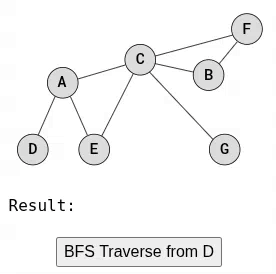
- Jak můžete vidět v animaci výše, při procházení BFS se nejprve navštíví vrcholy ve stejné vzdálenosti od počátečního vrcholu a teprve poté vrcholy vzdálenější. Například po návštěvě vrcholu A se navštíví vrcholy E a C před vrcholy B, F a G, protože tyto vrcholy jsou vzdálenější.
- Procházení metodou Breadth First Search funguje tak, že všechny sousední vrcholy (pokud ještě nebyly navštíveny) se zařadí do fronty a poté se pomocí fronty navštíví další vrchol.
- Tento příklad kódu pro procházení metodou Breadth First Search je stejný jako výše uvedený příklad kódu pro Depth First Search, s výjimkou metody `bfs()`:
```csharp
// BFS průchod grafem od vrcholu podle dat
public void BFS(string startVertexData)
{
    int startVertex = Array.IndexOf(vertexData, startVertexData);
    if (startVertex == -1)
    {
        Console.WriteLine($"Vertex '{startVertexData}' not found!");
        return;
    }
    bool[] visited = new bool[size];
    Queue<int> queue = new Queue<int>();
    // Začínáme od startovního vrcholu
    visited[startVertex] = true;
    queue.Enqueue(startVertex);
    while (queue.Count > 0)
    {
        int currentVertex = queue.Dequeue();
        Console.Write(vertexData[currentVertex] + " ");
        // Projdeme všechny sousedy aktuálního vrcholu
        for (int i = 0; i < size; i++)
        {
            if (adjMatrix[currentVertex, i] == 1 && !visited[i])
            {
                queue.Enqueue(i);     // přidáme souseda do fronty
                visited[i] = true;    // označíme jako navštíveného
            }
        }
    }
    Console.WriteLine();
}
```
---
##### 2.7.7.3 Procházení orientovaného grafu metodami DFS a BFS
- Procházení do hloubky a do šířky lze ve skutečnosti implementovat tak, aby fungovaly na směrových grafech (namísto ne-směrových) s pouze velmi malými změnami.
- Spusťte níže uvedenou animaci a podívejte se, jak lze orientovaný graf procházet pomocí DFS nebo BFS.
- 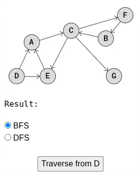
- Abychom mohli procházet orientovaný graf namísto neorientovaného grafu, stačí odstranit poslední řádek v metodě `add_edge()`:
```csharp
public void AddEdge(int u, int v)
    {
        if (u >= 0 && u < size && v >= 0 && v < size)
        {
            adjMatrix[u, v] = 1;
            //adjMatrix[v, u] = 1; remove this
        }
    }
```
- Při vytváření grafu musíme být také opatrní, protože hrany jsou nyní orientované.
- Níže uvedený příklad kódu obsahuje procházení orientovaného grafu metodami BFS i DFS z výše uvedené animace:
```csharp
class Graph
{
    private int[,] adjMatrix;     // Adjacency matrix: 1 = edge exists, 0 = none
    private string[] vertexData;  // Labels (A, B, C…)
    private int size;
    
    public Graph(int size)
    {
        this.size = size;
        adjMatrix = new int[size, size];
        vertexData = new string[size];
        
        for (int i = 0; i < size; i++)
            vertexData[i] = "";
    }
    // Přidání hrany — SMĚROVANÝ GRAF
    public void AddEdge(int u, int v)
    {
        if (u >= 0 && u < size && v >= 0 && v < size)
        {
            adjMatrix[u, v] = 1;  // pouze jeden směr
        }
    }
    // Nastavení dat vrcholu
    public void AddVertexData(int vertex, string data)
    {
        if (vertex >= 0 && vertex < size)
            vertexData[vertex] = data;
    }
    // Tisk matice
    public void PrintGraph()
    {
        Console.WriteLine("Adjacency Matrix:");
        for (int i = 0; i < size; i++)
        {
            for (int j = 0; j < size; j++)
                Console.Write(adjMatrix[i, j] + " ");
            Console.WriteLine();
        }
        Console.WriteLine("\nVertex Data:");
        for (int i = 0; i < size; i++)
            Console.WriteLine($"Vertex {i}: {vertexData[i]}");
    }
    // DFS rekurzivně
    private void DFSUtil(int v, bool[] visited)
    {
        visited[v] = true;
        Console.Write(vertexData[v] + " ");
        for (int i = 0; i < size; i++)
        {
            if (adjMatrix[v, i] == 1 && !visited[i])
                DFSUtil(i, visited);
        }
    }
    // DFS podle názvu vrcholu
    public void DFS(string startVertexData)
    {
        bool[] visited = new bool[size];
        int startVertex = Array.IndexOf(vertexData, startVertexData);
        if (startVertex == -1)
        {
            Console.WriteLine("Invalid start vertex!");
            return;
        }
        DFSUtil(startVertex, visited);
        Console.WriteLine();
    }
    // BFS podle názvu vrcholu
    public void BFS(string startVertexData)
    {
        int startVertex = Array.IndexOf(vertexData, startVertexData);
        if (startVertex == -1)
        {
            Console.WriteLine("Invalid start vertex!");
            return;
        }
        
        bool[] visited = new bool[size];
        Queue<int> queue = new Queue<int>();
        
        visited[startVertex] = true;
        queue.Enqueue(startVertex);
        
        while (queue.Count > 0)
        {
            int current = queue.Dequeue();
            Console.Write(vertexData[current] + " ");
            for (int i = 0; i < size; i++)
            {
                if (adjMatrix[current, i] == 1 && !visited[i])
                {
                    visited[i] = true;
                    queue.Enqueue(i);
                }
            }
        }
        Console.WriteLine();
    }
}
// usage
class Program
{
    static void Main()
    {
        Graph g = new Graph(7);
        
        g.AddVertexData(0, "A");
        g.AddVertexData(1, "B");
        g.AddVertexData(2, "C");
        g.AddVertexData(3, "D");
        g.AddVertexData(4, "E");
        g.AddVertexData(5, "F");
        g.AddVertexData(6, "G");
        
        g.AddEdge(3, 0); // D -> A
        g.AddEdge(3, 4); // D -> E
        g.AddEdge(4, 0); // E -> A
        g.AddEdge(0, 2); // A -> C
        g.AddEdge(2, 5); // C -> F
        g.AddEdge(2, 6); // C -> G
        g.AddEdge(5, 1); // F -> B
        g.AddEdge(1, 2); // B -> C
        
        g.PrintGraph();
        
        Console.WriteLine("\nDepth First Search starting from vertex D:");
        g.DFS("D");
        
        Console.WriteLine("\nBreadth First Search starting from vertex D:");
        g.BFS("D");
    }
}
```
---
#### 2.7.8 Detekce zacyklení 
##### 2.7.8.1 Cykly v grafu
- Cyklus v grafu je cesta, která začíná a končí ve stejném vrcholu, kde se žádné hrany neopakují. Je to podobné jako procházení bludištěm a skončení přesně tam, kde jste začali.
- 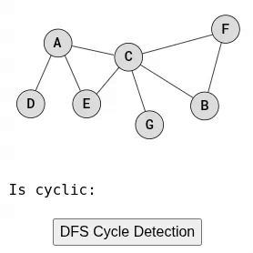
- Cyklus lze definovat mírně odlišně v závislosti na situaci. Například vlastní smyčka, kde hrana vede ze stejného vrcholu a do stejného vrcholu, může být nebo nemusí být považována za cyklus, v závislosti na problému, který se snažíte vyřešit.
---
##### 2.7.8.2 Detekce zacyklení
- Je důležité umět detekovat cykly v grafech, protože cykly mohou naznačovat problémy nebo zvláštní podmínky v mnoha aplikacích, jako jsou sítě, plánování a návrh obvodů.
- Dva nejběžnější způsoby detekce cyklů jsou:
	- **Hloubkové prohledávání (DFS)**: Prohledávání DFS prozkoumá graf a označí vrcholy jako navštívené. Cyklus je detekován, když má aktuální vrchol sousední vrchol, který již byl navštíven.
	- **Union-Find**: Tento způsob funguje tak, že nejprve definuje každý vrchol jako skupinu nebo podmnožinu. Poté se tyto skupiny spojí pro každou hranu. Kdykoli je prozkoumána nová hrana, je detekován cyklus, pokud dva vrcholy již patří do stejné skupiny.
- Jak funguje detekce cyklů pomocí DFS a Union-Find a jak jsou implementovány, je podrobněji vysvětleno níže.
---
###### DFS detekce zacyklení pro ne-směrové grafy
- K detekci cyklů v neorientovaném grafu pomocí hloubkového prohledávání (DFS) používáme kód velmi podobný kódu pro procházení DFS, s několika málo změnami.
- Jak to funguje:
	- Spusťte procházení DFS na každém nenavštíveném vrcholu (v případě, že graf není propojený).
	- Během DFS označte vrcholy jako navštívené a spusťte DFS na sousedních vrcholech (rekurzivně).
	- Pokud je sousední vrchol již navštívený a není rodičem aktuálního vrcholu, je detekován cyklus a je vrácena hodnota `true`.
	- Pokud je průchod DFS proveden na všech vrcholech a nejsou detekovány žádné cykly, je vrácena hodnota `false`.
- Spusťte animaci níže a podívejte se, jak detekce cyklů DFS funguje na konkrétním grafu, počínaje vrcholem A (stejně jako v předchozí animaci).
- 
- Procházení DFS začíná ve vrcholu A, protože to je první vrchol v matici sousednosti. Poté se pro každý nový navštívený vrchol rekurzivně volá metoda procházení na všech sousedních vrcholech, které ještě nebyly navštíveny. Cyklus je detekován při návštěvě vrcholu F, kdy se zjistí, že sousední vrchol C již byl navštíven.
```csharp
public class Graph
{
    private int[,] adjMatrix; // Matice sousednosti (0 = žádná hrana, 1 = hrana)
    private string[] vertexData; // Pole dat uložených ve vrcholech (např. A, B, C...)
    private int size; // Počet vrcholů grafu
    
    public Graph(int size)
    {
        this.size = size; // Nastavení velikosti grafu
        adjMatrix = new int[size, size]; // Inicializace matice sousednosti
        vertexData = new string[size]; // Inicializace pole dat vrcholů
    }
    // Přidá neorientovanou hranu mezi vrcholy u a v
    public void AddEdge(int u, int v)
    {
        if (u >= 0 && u < size && v >= 0 && v < size) // Ověření rozsahu indexů
        {
            adjMatrix[u, v] = 1; // Hrana u -> v
            adjMatrix[v, u] = 1; // Hrana v -> u (neorientovaný graf)
        }
    }
    // Uloží textovou hodnotu pro daný vrchol
    public void AddVertexData(int vertex, string data)
    {
        if (vertex >= 0 && vertex < size) // Ověření, že vrchol je platný
        {
            vertexData[vertex] = data; // Uložení dat
        }
    }
    // Vypíše celou matici sousednosti a data vrcholů
    public void PrintGraph()
    {
        Console.WriteLine("Adjacency Matrix:");

        for (int i = 0; i < size; i++) // Pro každý řádek matice
        {
            for (int j = 0; j < size; j++) // Pro každý sloupec matice
            {
                Console.Write(adjMatrix[i, j] + " "); // Výpis hodnoty
            }
            Console.WriteLine(); // Nový řádek
        }
        Console.WriteLine("\nVertex Data:");
        for (int i = 0; i < size; i++) // Výpis dat jednotlivých vrcholů
        {
            Console.WriteLine($"Vertex {i}: {vertexData[i]}");
        }
    }
    // Rekurzivní DFS pro detekci cyklu
    private bool DfsUtil(int v, bool[] visited, int parent)
    {
        visited[v] = true; // Označí aktuální vrchol jako navštívený
        for (int i = 0; i < size; i++) // Pro všechny možné sousedy vrcholu v
        {
            if (adjMatrix[v, i] == 1) // Pokud existuje hrana v -> i
            {
                if (!visited[i]) // Pokud soused ještě nebyl navštíven
                {
                    if (DfsUtil(i, visited, v)) // Rekurze — pokračujeme dál
                        return true; // Pokud byla nalezena smyčka, vracíme true
                }
                else if (i != parent) // Pokud byl navštíven a není to rodič
                {
                    return true; // Našli jsme cyklus
                }
            }
        }
        return false; // Není zde žádný cyklus
    }
    // Spouští DFS z každého neprozkoumaného vrcholu
    public bool IsCyclic()
    {
        bool[] visited = new bool[size]; // Pole označující navštívené vrcholy
        for (int i = 0; i < size; i++) // Projdi všechny vrcholy (kvůli více komponentám)
        {
            if (!visited[i]) // Pokud vrchol ještě nebyl navštíven
            {
                if (DfsUtil(i, visited, -1)) // Spustíme DFS (rodič -1 = žádný)
                    return true; // Cyklus existuje
            }
        }
        return false; // Žádný cyklus nebyl nalezen
    }
}
// Použití grafu
public class Program
{
    public static void Main()
    {
        Graph g = new Graph(7); // Vytvoření grafu o 7 vrcholech
        
        g.AddVertexData(0, "A"); // Přiřazení písmen vrcholům
        g.AddVertexData(1, "B");
        g.AddVertexData(2, "C");
        g.AddVertexData(3, "D");
        g.AddVertexData(4, "E");
        g.AddVertexData(5, "F");
        g.AddVertexData(6, "G");
        
        g.AddEdge(3, 0);  // D - A
        g.AddEdge(0, 2);  // A - C
        g.AddEdge(0, 3);  // A - D
        g.AddEdge(0, 4);  // A - E
        g.AddEdge(4, 2);  // E - C
        g.AddEdge(2, 5);  // C - F
        g.AddEdge(2, 1);  // C - B
        g.AddEdge(2, 6);  // C - G
        g.AddEdge(1, 5);  // B - F
        
        g.PrintGraph(); // Výpis grafu
        
        Console.WriteLine("\nGraph has cycle: " + g.IsCyclic()); // Detekce cyklu
    }
}
```
---
######  DFS detekce zacyklení pro směrové grafy
- Pro detekci cyklů ve směrových grafech je algoritmus velmi podobný jako u ne-směrových grafů, ale kód musí být mírně upraven, protože ve směrovém grafu nemusí návštěva sousedního uzlu, který již byl navštíven, nutně znamenat, že existuje cyklus.
- Podívejme se na následující graf, ve kterém jsou prozkoumány dvě cesty s cílem detekovat cyklus:
- 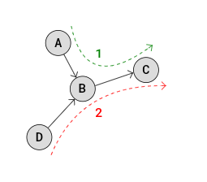
- V cestě 1, první prozkoumané cestě, jsou navštíveny vrcholy A->B->C, nejsou detekovány žádné cykly.
- Ve druhé prozkoumané cestě (cesta 2) jsou navštíveny vrcholy D->B->C a cesta nemá žádné cykly, že? Ale bez změn v našem programu by byl při přechodu z D do sousedního vrcholu B detekován falešný cyklus, protože B již byl navštíven v cestě 1. Aby se předešlo takovým falešným detekcím, je kód upraven tak, aby detekoval cykly pouze v případě, že uzel již byl navštíven ve stejné cestě.
- 
- Abychom mohli implementovat detekci cyklů DFS na směrovém grafu, jako v animaci výše, musíme odstranit symetrii, kterou máme v sousední matici pro neorientované grafy. Musíme také použít pole recStack, abychom mohli sledovat navštívené vrcholy v aktuální rekurzivní cestě.
```csharp
public class Graph
{
    private int[,] adjMatrix; // Matice sousednosti (1 = orientovaná hrana)
    private string[] vertexData; // Data vrcholů (A, B, C...)
    private int size; // Počet vrcholů
    
    public Graph(int size)
    {
        this.size = size;                         
        adjMatrix = new int[size, size]; // Inicializace matice sousednosti
        vertexData = new string[size]; // Inicializace dat vrcholů
    }
    // Přidá ORIENTOVANOU hranu u -> v
    public void AddEdge(int u, int v)
    {
        if (u >= 0 && u < size && v >= 0 && v < size) // Kontrola rozsahu
        {
            adjMatrix[u, v] = 1; // Jednosměrná hrana
        }
    }
    // Uloží textová data vrcholu
    public void AddVertexData(int vertex, string data)
    {
        if (vertex >= 0 && vertex < size)
        {
            vertexData[vertex] = data; // Uloží jméno vrcholu
        }
    }
    // Vypíše celou matici + data vrcholů
    public void PrintGraph()
    {
        Console.WriteLine("Adjacency Matrix:");
        for (int i = 0; i < size; i++)                  
        {
            for (int j = 0; j < size; j++)             
            {
                Console.Write(adjMatrix[i, j] + " "); // Výpis matice
            }
            Console.WriteLine();
        }
        Console.WriteLine("\nVertex Data:");
        for (int i = 0; i < size; i++)
        {
            Console.WriteLine($"Vertex {i}: {vertexData[i]}");
        }
    }
    
    // DFS pomocná funkce – hledání cyklu v ORIENTOVANÉM grafu
    private bool DfsUtil(int v, bool[] visited, bool[] recStack)
    {
        visited[v] = true; // Vrchol byl navštíven
        recStack[v] = true; // Vrchol je v aktuální rekurzivní cestě
        
        Console.WriteLine("Current vertex: " + vertexData[v]);
        
        for (int i = 0; i < size; i++) // Pro všechny sousedy vrcholu v
        {
            if (adjMatrix[v, i] == 1) // Existuje hrana v -> i
            {
                if (!visited[i]) // Ještě nebyl navštíven
                {
                    if (DfsUtil(i, visited, recStack))
                        return true; // Nalezen cyklus
                }
                else if (recStack[i]) // Vrchol je v rekurzivní zásobníku
                {
                    return true; // Cyklus detekován
                }
            }
        }
        recStack[v] = false; // Vrchol opouštíme → již není v cestě
        return false; // Cyklus z této větve neexistuje
    }
    // Hlavní funkce — detekce cyklu v grafu
    public bool IsCyclic()
    {
        bool[] visited = new bool[size]; // Pole navštívených vrcholů
        bool[] recStack = new bool[size]; // Vrcholy v aktuální DFS cestě
        
        for (int i = 0; i < size; i++)       
        {
            if (!visited[i]) // Pro každý neprozkoumaný vrchol
            {
                Console.WriteLine(); // Nový řádek pro přehlednost
                if (DfsUtil(i, visited, recStack))
                    return true; // Cyklus existuje
            }
        }
        return false; // Žádný cyklus nenalezen
    }
}
// Použití
public class Program
{
    public static void Main()
    {
        Graph g = new Graph(7);
        
        g.AddVertexData(0, "A");
        g.AddVertexData(1, "B");
        g.AddVertexData(2, "C");
        g.AddVertexData(3, "D");
        g.AddVertexData(4, "E");
        g.AddVertexData(5, "F");
        g.AddVertexData(6, "G");
        
        g.AddEdge(3, 0);  // D -> A
        g.AddEdge(0, 2);  // A -> C
        g.AddEdge(2, 1);  // C -> B
        g.AddEdge(2, 4);  // C -> E
        g.AddEdge(1, 5);  // B -> F
        g.AddEdge(4, 0);  // E -> A
        g.AddEdge(2, 6);  // C -> G
        
        g.PrintGraph();
        
        Console.WriteLine("\nGraph has cycle: " + g.IsCyclic());
    }
}
```
---
###### Union-find detekce zacyklení
- Detekce cyklů pomocí Union-Find se velmi liší od použití Depth First Search.
- Detekce cyklů pomocí Union-Find funguje tak, že nejprve umístí každý uzel do své vlastní podmnožiny (jako do tašky nebo kontejneru). Poté se pro každou hranu sloučí podmnožiny patřící ke každému vrcholu. Pokud vrcholy hrany již patří do stejné podmnožiny, znamená to, že jsme našli cyklus.
- 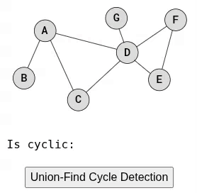
- V animace výše detekce cyklů pomocí algoritmu Union-Find prozkoumává hrany v grafu. Jak jsou hrany prozkoumávány, podmnožina vrcholu A se rozšiřuje tak, aby zahrnovala také vrcholy B, C a D. Cyklus je detekován, když je prozkoumána hrana mezi A a D a je zjištěno, že A i D již patří do stejné podmnožiny.
- Hrany mezi D, E a F také tvoří kruh, ale tento kruh není detekován, protože algoritmus se zastaví (vrátí hodnotu True), když je detekován první kruh.
- Detekce cyklů pomocí Union-Find je použitelná pouze pro ne-směrové grafy.
- Detekce cyklů pomocí Union-Find je implementována pomocí reprezentace sousední matice, takže nastavení struktury grafu s vrcholy a hranami je v zásadě stejné jako v předchozích příkladech.
```csharp
public class Graph
{
    private int[,] adjMatrix; // Matice sousednosti (neorientovaný graf)
    private string[] vertexData; // Data vrcholů (A, B, C...)
    private int[] parent; // Union-Find parent pole
    private int size; // Počet vrcholů
    
    public Graph(int size)
    {
        this.size = size; // uloží velikost grafu
        adjMatrix = new int[size, size]; // vytvoří matici sousednosti
        vertexData = new string[size]; // pole dat vrcholů
        parent = new int[size]; // pole pro Union-Find
        for (int i = 0; i < size; i++)
            parent[i] = i; // každý vrchol je zpočátku vlastním rodičem
    }
    public void AddEdge(int u, int v)
    {
        if (u >= 0 && v >= 0 && u < size && v < size)
        {
            adjMatrix[u, v] = 1; // nastaví hranu u→v
            adjMatrix[v, u] = 1; // nastaví hranu v→u (neorientovaný graf)
        }
    }
    public void AddVertexData(int vertex, string data)
    {
        if (vertex >= 0 && vertex < size)
            vertexData[vertex] = data; // uloží textovou hodnotu vrcholu
    }
    private int Find(int i)
    {
        if (parent[i] == i)
            return i; // pokud je rodičem sám sebe, je to kořen
        return Find(parent[i]); // rekurzivně najde kořen
    }
    private void Union(int x, int y)
    {
        int rootX = Find(x); // najde kořen prvního vrcholu
        int rootY = Find(y); // najde kořen druhého vrcholu
        
        Console.WriteLine($"Union: {vertexData[x]} + {vertexData[y]}"); // vypíše prováděné sjednocení
        
        parent[rootX] = rootY; // nastaví rodiče rootX na rootY
        
        Console.WriteLine(string.Join(",", parent)); // vypíše stav pole parent
        Console.WriteLine(); // prázdný řádek
    }
    public bool IsCyclic()
    {
        for (int i = 0; i < size; i++)
        {
            for (int j = i + 1; j < size; j++)
            {
                if (adjMatrix[i, j] == 1)
                {
                    int x = Find(i); // najde kořen vrcholu i
                    int y = Find(j); // najde kořen vrcholu j
                    if (x == y)
                        return true; // pokud mají stejný kořen, vznikl cyklus
                    Union(x, y); // sjednotí množiny
                }
            }
        }
        return false; // žádný cyklus nebyl nalezen
    }
}
// Použití
public class Program
{
    public static void Main()
    {
        Graph g = new Graph(7);

        g.AddVertexData(0, "A");
        g.AddVertexData(1, "B");
        g.AddVertexData(2, "C");
        g.AddVertexData(3, "D");
        g.AddVertexData(4, "E");
        g.AddVertexData(5, "F");
        g.AddVertexData(6, "G");

        g.AddEdge(1, 0);  // B - A
        g.AddEdge(0, 3);  // A - D
        g.AddEdge(0, 2);  // A - C
        g.AddEdge(2, 3);  // C - D
        g.AddEdge(3, 4);  // D - E
        g.AddEdge(3, 5);  // D - F
        g.AddEdge(3, 6);  // D - G
        g.AddEdge(4, 5);  // E - F

        Console.WriteLine("Graph has cycle: " + g.IsCyclic());
    }
}
```
---
#### 2.7.9 Použití
- sociální sítě
- navigace, mapy
- topologické třídění
---
## 3 Tabulka časových složitostí (Big O)

| struktura                 | vložení prvku | odstranění | obsahuje prvek | nalezení minima |
| ------------------------- | ------------- | ---------- | -------------- | --------------- |
| pole                      | O(1)          | O(n)       | O(n)           | O(n)            |
| uspořádané pole           | O(n)          | O(n)       | O(log n)       | O(1)            |
| binární vyhledávací strom | Θ(log n)      | Θ(log n)   | Θ(log n)       | Θ(log n)        |
| zásobník                  | O(1)          | O(n)       | O(n)           | O(n)            |

---
## 4 Shrnutí
- Datové struktury jsou základem efektivního programování. Umožňují ukládat data tak, aby s nimi algoritmy pracovaly co nejrychleji. Každá struktura má své výhody a nevýhody, a proto je důležité vybrat tu správnou podle konkrétního problému. Porozumění datovým strukturám je klíčové pro psaní optimalizovaného a kvalitního kódu.
---
## 5 Zdroje
- W3Schools. (n.d.). _DSA Tutorial_. Retrieved November 20, 2025, from [https://www.w3schools.com/dsa/index.php](https://www.w3schools.com/dsa/index.php?utm_source=chatgpt.com)